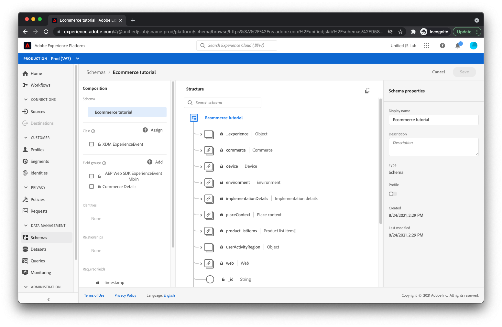

# Creare uno schema

Come discusso in [Strutturazione dei dati](../structuring-your-data.md), i dati inviati a Adobe Experience Platform devono essere in XDM. In particolare, i dati devono corrispondere a un _schema_. Uno schema è fondamentalmente una descrizione dell’aspetto dei dati. Descrive i nomi dei campi e la loro posizione all’interno dei dati. Descrive anche il tipo di valore che ogni campo deve avere (ad esempio, un valore booleano, una stringa di 12 caratteri e una matrice di numeri).

Adobe Experience Platform fornisce alcuni elementi di base predefiniti noti come gruppi di campi, comuni all’interno del settore. Per il settore dei servizi finanziari, ad esempio, esistono gruppi di campi per i trasferimenti di saldi e le richieste di prestiti. Per il settore viaggi e ospitalità, ci sono gruppi di campo per prenotazioni di voli e alloggi.

È consigliabile utilizzare i gruppi di campi incorporati, ove possibile, durante la creazione dello schema. Sappiamo anche che potresti aver bisogno di campi specifici per la tua azienda. Per questo motivo, puoi creare gruppi di campi personalizzati da utilizzare all’interno degli schemi creati.

Passiamo ora alla creazione di uno schema per un tipico sito web di e-commerce.

Innanzitutto, passa a [!UICONTROL Schemi] in Adobe Experience Platform.

Seleziona [!UICONTROL Crea schema] in alto a destra. Viene visualizzato un menu. Seleziona [!UICONTROL XDM ExperienceEvent].

A questo punto, viene visualizzata una finestra di dialogo in cui viene richiesto quali gruppi di campi si desidera aggiungere allo schema. Il primo gruppo di campi da selezionare è quello denominato [!UICONTROL ExperienceEvent di AEP Web SDK]. Questo gruppo di campi aggiunge un set di campi che gestisce i dati raccolti automaticamente da Adobe Experience Platform Web SDK.

Poiché il sito Web per questa esercitazione è un sito Web di e-commerce, è necessario selezionare anche [!UICONTROL Dettagli Commerce] gruppo di campi. Questo gruppo ti consente di inviare dati di e-commerce tipici, ad esempio quali prodotti vengono visualizzati, aggiunti al carrello e acquistati.

Fai clic su [!UICONTROL Aggiungi gruppi di campi] in alto a destra nella finestra di dialogo. A questo punto, dovresti visualizzare la struttura dello schema.

I gruppi di campi aggiunti sono elencati a sinistra. Selezionando un gruppo di campi vengono evidenziati i campi a destra forniti da tale gruppo. Esplora i campi disponibili.

Infine, seleziona [!UICONTROL Schema senza titolo] verso sinistra, specifica un nome e una descrizione a destra dello schermo, quindi fai clic su [!UICONTROL Salva].

Lo schema è stato creato. Ora, scopri come creare un set di dati per contenere i tuoi dati.

Per ulteriori informazioni sulla creazione di schemi, consulta [Creare uno schema (interfaccia utente)](https://experienceleague.adobe.com/docs/experience-platform/xdm/tutorials/create-schema-ui.html?lang=it).
