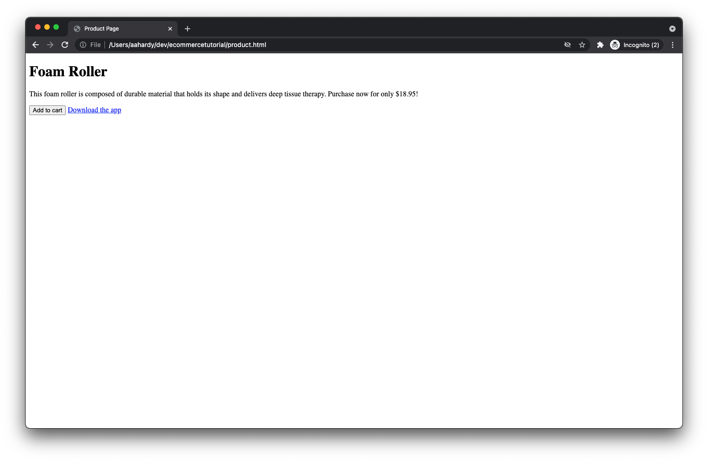

# Verificare l’implementazione

Ora che la pagina web è configurata e la libreria di tag Adobe Experience Platform è implementata, è il momento di testare l’implementazione.

Apri la pagina del prodotto nel browser. Per eseguire questa operazione, fai clic su _File_ then _Apri file..._ nel browser o puoi ospitare la pagina su un server web e immettere l’URL appropriato.

Dopo il caricamento della pagina, dovresti vedere qualcosa di simile a questo:

Non è carino, però farà il lavoro.

## Inspect: eventi di visualizzazione della pagina e del prodotto

Apri gli strumenti per sviluppatori nel browser e fai clic sul pannello di rete. Aggiorna la pagina.

A questo punto, dovresti vedere quattro richieste:

1. product.html - La tua pagina web.
2. launch-############-development.js - La libreria Launch.
3. interact: evento di visualizzazione della pagina inviato al server.
4. interact: evento di visualizzazione del prodotto inviato al server.

Puoi controllare i payload di ogni richiesta. Per il primo `interact` puoi visualizzare il payload inviato con un `eventType` di `web.webpagedetails.pageViews`.

Per il secondo `interact` puoi visualizzare il payload inviato con un `eventType` di `commerce.productViews`.

Puoi circondare il resto dei dati inviati, incluse le informazioni sul prodotto.

## Inspect il carrello aperto e aggiungi agli eventi del carrello

Ora fai clic su _Aggiungi al carrello_ pulsante .

Dovresti visualizzare due richieste aggiuntive, la prima con un `eventType` di `commerce.productListOpens` (per l&#39;apertura di un nuovo carrello) e la seconda con un `eventType` di `commerce.productListAdds` (per aggiungere il prodotto al carrello).

## Inspect evento clic collegamento app download

A seconda del browser, è possibile che il pannello di rete venga cancellato facendo clic su un collegamento che ti allontana dalla pagina corrente. Poiché desideri controllare la richiesta di rete per l’evento di clic del collegamento che si verifica immediatamente prima di allontanarti dalla pagina, dovrai configurare il browser per mantenere i registri di rete tra le pagine. A tale scopo, controlla un _Conserva registro_ nel pannello di rete (Chrome, Safari, Edge) o fai clic su un’icona a forma di ingranaggio e seleziona un _Registri persistenti_ nel menu visualizzato (Firefox).

Ora fai clic su _Scaricare l’app_ link.

Dovresti vederne un altro `interact` richiesta visualizzata nel pannello di rete. Se analizzi la richiesta, dovresti trovare un `eventType` di `web.webinteraction.linkClicks` nonché dettagli sul collegamento su cui è stato fatto clic.

## Verifica che i dati arrivino nel set di dati Adobe Experience Platform

Ora che le richieste vengono inviate, dovrai anche verificare se i dati arrivano in modo sicuro nel set di dati Adobe Experience Platform che hai creato. Per iniziare, vai alla pagina [!UICONTROL Set di dati] visualizzazione in Adobe Experience Platform.

Seleziona il set di dati creato in precedenza.

Potrebbe essere necessario attendere alcuni minuti, ma presto dovresti vedere le indicazioni dei dati in fase di elaborazione e inserimento nel set di dati. È inoltre necessario verificare se l&#39;elaborazione è riuscita o non è riuscita. Se non è riuscito, potrai vedere perché ha fallito. In genere si verificano errori perché i dati inviati non corrispondono allo schema e sarà necessario regolare di conseguenza i dati o lo schema.

## Utilizzare l’estensione Adobe Experience Platform Debugger

Per ulteriori informazioni sul comportamento dell’implementazione sia sul browser che sui server di Adobe, consulta l’estensione del browser Adobe Experience Platform Debugger .

[Estensione Adobe Experience Platform Debugger per Chrome](https://chrome.google.com/webstore/detail/adobe-experience-platform/bfnnokhpnncpkdmbokanobigaccjkpob)

[Estensione Adobe Experience Platform Debugger per Firefox](https://addons.mozilla.org/it/firefox/addon/adobe-experience-platform-dbg/)
