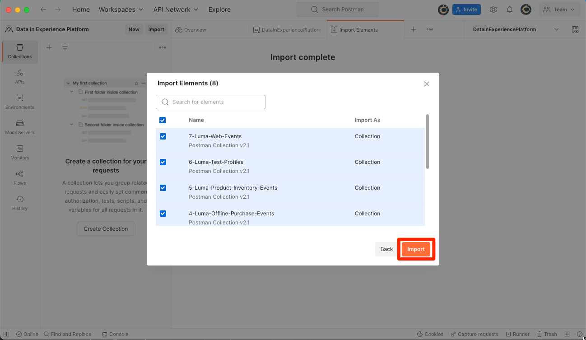

# Importazione dei dati di esempio in Adobe Experience Platform

Scopri come configurare un ambiente sandbox di Experience Platform con dati di esempio. Utilizzando una raccolta Postman, puoi creare gruppi di campi, schemi, set di dati e quindi importare dati di esempio in Experience Platform.

## Caso di utilizzo di dati di esempio

Gli utenti aziendali di Experience Platform devono spesso seguire una serie di passaggi che includono l’identificazione dei gruppi di campi, la creazione di schemi, la preparazione dei dati, la creazione di set di dati e l’acquisizione dei dati prima di poter esplorare le funzionalità di marketing offerte da Experience Platform. Questa esercitazione automatizza alcuni dei passaggi necessari per inserire i dati in una sandbox di Platform il più rapidamente possibile.

Questa esercitazione si concentra su un brand fittizio al dettaglio denominato Luma. Investono in Adobe Experience Platform per combinare fidelizzazione, CRM, dati di catalogo dei prodotti e dati di acquisto offline in profili cliente in tempo reale e attivare questi profili per portare il loro marketing al livello successivo. Abbiamo generato dati di esempio per Luma e nel resto dell’esercitazione, importerai tali dati in uno dei tuoi ambienti sandbox di Experience Platform.

>[!NOTE]
>
>Il risultato finale di questa esercitazione è una sandbox contenente gli stessi dati di esempio della [Esercitazione introduttiva di Adobe Experience Platform per architetti di dati e data engineer](https://experienceleague.adobe.com/docs/platform-learn/getting-started-for-data-architects-and-data-engineers/overview.html).

## Prerequisiti

* Hai accesso alle API di Experience Platform e sai come eseguire l’autenticazione. In caso contrario, consulta la sezione [tutorial](https://experienceleague.adobe.com/docs/platform-learn/tutorials/platform-api-authentication.html?lang=it).
* Accesso a una sandbox di sviluppo di Experience Platform.
* Conosci il tuo ID tenant Experience Platform. Puoi ottenerlo creando un [richiesta API](https://experienceleague.adobe.com/docs/experience-platform/xdm/api/getting-started.html?lang=en#know-your-tenant_id)
oppure estraendolo dall’URL quando accedi al tuo account Platform. Ad esempio, nell’URL seguente, il tenant è &quot;
`techmarketingdemos`&quot; `https://experience.adobe.com/#/@techmarketingdemos/sname:prod/platform/home`.

## Utilizzo di Postman {#postman}

### Impostare le variabili di ambiente

Prima di seguire i passaggi, assicurati di aver scaricato il [Postman](https://www.postman.com/downloads/) applicazione.  Cominciamo.

1. Scarica la [platform-utils-main.zip](../assets/data-generator/platform-utils-main.zip) , che contiene tutti i file richiesti per questa esercitazione.

   >[!NOTE]
   >
   >Dati utente contenuti nel [platform-utils-main.zip](../assets/data-generator/platform-utils-main.zip) Il file è fittizio e deve essere utilizzato solo a scopo dimostrativo.

1. Dalla cartella dei download, sposta il `platform-utils-main.zip` e decomprimere il file nella posizione desiderata sul computer.
1. In `luma-data` cartella, apri tutte le `json` file in un editor di testo e sostituisci tutte le istanze di `_techmarketingdemos` con il tuo ID tenant, preceduto da un carattere di sottolineatura.
1. Nota il percorso della cartella decompressa, come necessario in seguito durante la configurazione della `FILE_PATH` Variabile di ambiente Postman:

   >[!NOTE]
   > Per ottenere il percorso del file sul Mac, passa alla `platform-utils-main` , fai clic con il pulsante destro del mouse sulla cartella e seleziona **Ottieni informazioni** opzione .
   >
   > 

   >[!NOTE]
   > Per ottenere il percorso del file nelle finestre, fare clic per aprire la posizione della cartella desiderata, quindi fare clic con il pulsante destro del mouse sulla destra del percorso nella barra degli indirizzi. Copiare l&#39;indirizzo per ottenere il percorso del file.
   > 
   > 

1. Apri Postman e crea una nuova area di lavoro da **Aree di lavoro** menu a discesa:\
   
1. Inserisci un **Nome** e opzionale **Riepilogo** per l&#39;area di lavoro e fai clic su **Creare un’area di lavoro**. Al momento della creazione, Postman passa alla nuova area di lavoro.
   
1. Ora regola alcune impostazioni per eseguire le raccolte Postman in questa area di lavoro. Nell’intestazione di Postman, fai clic sull’icona a forma di ingranaggio e seleziona **Impostazioni** per aprire la finestra modale delle impostazioni. È inoltre possibile utilizzare la scelta rapida da tastiera (CMD/CTRL + ,) per aprire il modale.
1. Sotto la `General` scheda , aggiorna il timeout della richiesta in ms a `5000 ms` e `allow reading file outside this directory`
   

   >[!NOTE]
   > Se i file vengono caricati dall&#39;interno della directory di lavoro, questi verranno eseguiti senza problemi tra i dispositivi se gli stessi file vengono memorizzati sugli altri dispositivi. Tuttavia, se si desidera eseguire i file dall&#39;esterno della directory di lavoro, è necessario attivare un&#39;impostazione per indicare lo stesso intento. Se `FILE_PATH` non è uguale al percorso della directory di lavoro di Postman, quindi questa opzione deve essere abilitata.

1. Chiudi **Impostazioni** pannello.
1. Seleziona la **Ambienti** quindi seleziona **Importa**:
   
1. Importa il file di ambiente json scaricato, `DataInExperiencePlatform.postman_environment`
1. In Postman, seleziona l’ambiente nel menu a discesa in alto a destra e fai clic sull’icona occhio per visualizzare le variabili di ambiente:
   

1. Assicurati che le seguenti variabili di ambiente siano popolate. Per scoprire come ottenere il valore delle variabili di ambiente, consulta la sezione [Autenticazione nelle API di Experience Platform](/help/platform/authentication/platform-api-authentication.md) esercitazione per istruzioni dettagliate.

   * `CLIENT_SECRET`
   * `API_KEY`—`Client ID` nella console Adobe Developer
   * `TECHNICAL_ACCOUNT_ID`
   * `META_SCOPE`
   * `IMS`
   * `IMS_ORG`—`Organization ID` nella console Adobe Developer
   * `PRIVATE_KEY`
   * `SANDBOX_NAME`
   * `CONTAINER_ID`
   * `TENANT_ID`- assicurati di guidare con un carattere di sottolineatura, ad esempio `_techmarketingdemos`
   * `platform_end_point`
   * `FILE_PATH`- utilizzare il percorso della cartella locale in cui è stata decompressa la `platform-utils-main.zip` file. Accertati che includa il nome della cartella, ad esempio `/Users/dwright/Desktop/platform-utils-main`

1. **Salva** l’ambiente aggiornato

### Importare raccolte Postman

Successivamente è necessario importare le raccolte in Postman.

1. Seleziona **Raccolte** quindi scegli l’opzione di importazione:

   

1. Importa le seguenti raccolte:

   * `0-Authentication.postman_collection.json`
   * `1-Luma-Loyalty-Data.postman_collection.json`
   * `2-Luma-CRM-Data.postman_collection.json`
   * `3-Luma-Product-Catalog.postman_collection.json`
   * `4-Luma-Offline-Purchase-Events.postman_collection.json`

   

### Autentica

Quindi devi autenticare e generare un token utente. I metodi di generazione dei token utilizzati in questa esercitazione sono adatti solo per uso non di produzione. La firma locale carica una libreria JavaScript da un host di terze parti e la firma remota invia la chiave privata a un servizio Web di proprietà e gestito da Adobe. Sebbene Adobe non memorizzi questa chiave privata, le chiavi di produzione non devono mai essere condivise con nessuno.

1. Apri `Authentication` raccolta, selezionare la `IMS: JWT Generate + Auth via User Token` richiesta POST e fai clic su `SEND` per eseguire l’autenticazione e ottenere il token di accesso.

   

1. Esamina le variabili di ambiente e osserva che la `JWT_TOKEN` e `ACCESS_TOKEN` sono ora popolate.

### Importare i dati

Ora puoi preparare e importare i dati nella sandbox di Platform. Le collezioni Postman che hai importato faranno tutto il sollevamento pesante!

1. Apri `1-Luma-Loyalty-Data` raccolta e fai clic su **Esegui** nella scheda panoramica per avviare Collection Runner.

   

1. Nella finestra del runner della raccolta, assicurati di selezionare l’ambiente dal menu a discesa, aggiorna il **Ritardo** a `4000ms`, controlla **Salvare le risposte** e assicurati che l&#39;ordine di esecuzione sia corretto. Fai clic sul pulsante **Esegui dati fedeltà Luma** pulsante

   

   >[!NOTE]
   >
   >**1-Luma-Fedeltà-Dati** crea uno schema per i dati fedeltà dei clienti. Lo schema si basa sulla classe Profilo individuale XDM, sul gruppo di campi standard e su un gruppo di campi e un tipo di dati personalizzati. La raccolta crea un set di dati utilizzando lo schema e carica dati di esempio sulla fidelizzazione dei clienti in Adobe Experience Platform.

   >[!NOTE]
   >
   >Se una richiesta di raccolta non riesce durante il runner della raccolta Postman, interrompi l’esecuzione ed esegui le richieste di raccolta una per una.

1. Se tutto va bene, tutte le richieste nel `Luma-Loyalty-Data` la raccolta deve passare.

   

1. Ora accediamo a [Interfaccia Adobe Experience Platform](https://platform.adobe.com/) e passa ai set di dati.
1. Apri `Luma Loyalty Dataset` set di dati e nella finestra attività set di dati puoi visualizzare un’esecuzione batch riuscita che ha acquisito 1000 record. Puoi anche fare clic sull’opzione di anteprima del set di dati per verificare i record acquisiti. Potrebbe essere necessario attendere alcuni minuti per confermare che 1000 [!UICONTROL Nuovi frammenti di profilo] sono stati creati.
   
1. Ripeti i passaggi 1-3 per eseguire le altre raccolte:
   * `2-Luma-CRM-Data.postman_collection.json` crea uno schema e un set di dati popolati per i dati CRM dei clienti. Lo schema si basa sulla classe Profilo individuale XDM che comprende Dettagli demografici, Dettagli contatto personale, Dettagli preferenza e un gruppo di campi di identità personalizzati.
   * `3-Luma-Product-Catalog.postman_collection.json` crea uno schema e un set di dati popolati per le informazioni sul catalogo dei prodotti. Lo schema si basa su una classe di catalogo prodotti personalizzata e utilizza un gruppo di campi di catalogo prodotti personalizzato.
   * `4-Luma-Offline-Purchase-Events.postman_collection.json` crea uno schema e un set di dati popolati per i dati degli eventi di acquisto offline dei clienti. Lo schema è basato sulla classe ExperienceEvent XDM e comprende gruppi di campi di identità e dettagli di commercio personalizzati.

## Convalida

I dati di esempio sono stati progettati in modo che, quando le raccolte sono state eseguite, vengano creati profili cliente in tempo reale che combinano i dati provenienti da più sistemi. Un buon esempio è il primo record dei set di dati di acquisto fedeltà, CRM e offline. Cerca quel profilo per confermare che i dati sono stati acquisiti. In [Interfaccia Adobe Experience Platform](https://platform.adobe.com/):

1. Vai a **[!UICONTROL Profili]** > **[!UICONTROL Sfoglia]**
1. Seleziona `Luma Loyalty Id` come **[!UICONTROL Spazio dei nomi identità]**
1. Cerca `5625458` come **[!UICONTROL Valore identità]**
1. Apri `Danny Wright` profilo

Esplorando i dati nella **[!UICONTROL Attributi]** e **[!UICONTROL Eventi]** schede, dovresti vedere che il profilo contiene dati dei vari file di dati:

## Passaggi successivi

Per informazioni sui criteri di unione, la governance dei dati, il servizio di query e il generatore di segmenti, passa a [lezione 11 nel tutorial Guida introduttiva per architetti di dati e data engineer](https://experienceleague.adobe.com/docs/platform-learn/getting-started-for-data-architects-and-data-engineers/create-merge-policies.html?lang=en). Le lezioni precedenti di quest&#39;altra esercitazione ti hanno permesso di creare manualmente tutto ciò che era appena stato popolato da queste raccolte Postman: scopri come iniziare!

Se desideri creare un’implementazione di esempio dell’SDK per web per eseguire un collegamento a questa sandbox, passa attraverso
[Esercitazione sull’implementazione di Adobe Experience Cloud con SDK per web](https://experienceleague.adobe.com/docs/platform-learn/implement-web-sdk/overview.html?lang=it). Dopo aver configurato le lezioni di &quot;Configurazione iniziale&quot;, &quot;Configurazione tag&quot; e &quot;Configurazione Experience Platform&quot; dell’esercitazione SDK per web, accedi al sito web Luma utilizzando i primi dieci indirizzi e-mail nella sezione `luma-crm.json` file utilizzando la password `test` per visualizzare l’unione dei frammenti di profilo con i dati caricati in questa esercitazione.

Per generare un esempio di implementazione dell’SDK Mobile da collegare a questa sandbox, passa attraverso
[Esercitazione sull’implementazione di Adobe Experience Cloud nelle app per dispositivi mobili](https://experienceleague.adobe.com/docs/platform-learn/implement-mobile-sdk/overview.html?lang=it). Dopo aver configurato le lezioni di &quot;configurazione iniziale&quot;, &quot;implementazione app&quot; e &quot;Experience Platform&quot; dell’esercitazione SDK per web, accedi al sito web Luma utilizzando i primi indirizzi e-mail nella `luma-crm.json` per visualizzare un frammento di profilo unito ai dati caricati in questa esercitazione.

## Ripristina ambiente Sandbox {#reset-sandbox}

Se si reimposta una sandbox non di produzione, vengono eliminate tutte le risorse associate a tale sandbox (schemi, set di dati e così via), mantenendo il nome della sandbox e le relative autorizzazioni. Questa sandbox &quot;pulita&quot; continua a essere disponibile con lo stesso nome per gli utenti che vi hanno accesso.

Segui i passaggi [qui](https://experienceleague.adobe.com/docs/experience-platform/sandbox/ui/user-guide.html?lang=en#reset-a-sandbox) per ripristinare un ambiente sandbox.
