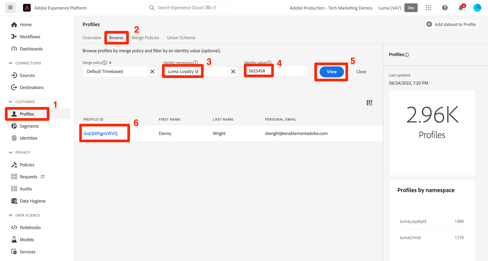

# Importare dati di esempio in Adobe Experience Platform

Scopri come configurare un ambiente sandbox di Experience Platform con dati di esempio. Utilizzando una raccolta Postman, puoi creare gruppi di campi, schemi, set di dati e quindi importare dati di esempio in Experience Platform.

## Caso di utilizzo dei dati di esempio

Gli utenti aziendali di Experience Platform spesso devono seguire una serie di passaggi che includono l’identificazione dei gruppi di campi, la creazione di schemi, la preparazione dei dati, la creazione di set di dati e quindi l’acquisizione dei dati prima di poter esplorare le funzionalità di marketing offerte da Experience Platform. Questa esercitazione automatizza alcuni dei passaggi per poter inserire i dati in una sandbox di Platform il più rapidamente possibile.

Questa esercitazione si concentra su un brand fittizio e al dettaglio chiamato Luma. Investono in Adobe Experience Platform per combinare dati su fidelizzazione, gestione delle relazioni con i clienti, catalogo dei prodotti e acquisti offline in profili cliente in tempo reale e attivare questi profili per portare il marketing al livello successivo. Abbiamo generato dati di esempio per Luma e nel resto di questa esercitazione, questi dati verranno importati in uno degli ambienti sandbox di Experience Platform.

>[!NOTE]
>
>Il risultato finale di questa esercitazione è una sandbox contenente dati simili all&#39;esercitazione [Guida introduttiva a Adobe Experience Platform per architetti di dati e ingegneri di dati](https://experienceleague.adobe.com/docs/platform-learn/getting-started-for-data-architects-and-data-engineers/overview.html?lang=it). È stato aggiornato ad aprile 2023 per supportare le [sfide Journey Optimizer](https://experienceleague.adobe.com/docs/journey-optimizer-learn/challenges/introduction-and-prerequisites.html?lang=it). È stato aggiornato a giugno 2023 per passare al metodo di autenticazione OAuth.

## Prerequisiti

* Hai accesso alle API di Experience Platform e sai come eseguire l’autenticazione. In caso contrario, consulta questa [esercitazione](https://experienceleague.adobe.com/docs/platform-learn/tutorials/platform-api-authentication.html?lang=it).
* Hai accesso a una sandbox di sviluppo Experience Platform.
* Conosci il tuo ID tenant di Experience Platform. Puoi ottenerla effettuando una [richiesta API](https://experienceleague.adobe.com/docs/experience-platform/xdm/api/getting-started.html?lang=en#know-your-tenant_id) autenticata
o estraendolo dall’URL al momento dell’accesso all’account Platform. Nell&#39;URL seguente, ad esempio, il tenant è &quot;`techmarketingdemos`&quot; `https://experience.adobe.com/#/@techmarketingdemos/sname:prod/platform/home`.

## Utilizzo di [!DNL Postman] {#postman}

### Configurare le variabili di ambiente

Prima di seguire la procedura, verificare di aver scaricato l&#39;applicazione [Postman](https://www.postman.com/downloads/). Cominciamo.

1. Scarica il file [platform-utils-main.zip](../assets/data-generator/platform-utils-main.zip), che contiene tutti i file necessari per questa esercitazione.

   >[!NOTE]
   >
   >I dati utente contenuti nel file [platform-utils-main.zip](../assets/data-generator/platform-utils-main.zip) sono fittizi e devono essere utilizzati solo a scopo dimostrativo.

1. Dalla cartella dei download, sposta il file `platform-utils-main.zip` nella posizione desiderata nel tuo computer e decomprimilo.
1. Nella cartella `luma-data`, apri tutti i file `json` in un editor di testo e sostituisci tutte le istanze di `_yourTenantId` con il tuo ID tenant, preceduto da un carattere di sottolineatura.
1. Apri `luma-offline-purchases.json`, `luma-inventory-events.json` e `luma-web-events.json` in un editor di testo e aggiorna tutti i timestamp in modo che gli eventi si verifichino nell&#39;ultimo mese (ad esempio, cerca `"timestamp":"2022-11` e sostituisci l&#39;anno e il mese)
1. Prendere nota del percorso della cartella decompressa, come sarà necessario in seguito durante la configurazione della variabile di ambiente `FILE_PATH` [!DNL Postman]:

   >[!NOTE]
   > Per ottenere il percorso del file sul Mac, passare alla cartella `platform-utils-main`, fare clic con il pulsante destro del mouse sulla cartella e selezionare l&#39;opzione **Ottieni informazioni**.
   >
   > 

   >[!NOTE]
   > Per ottenere il percorso del file nelle finestre, fare clic per aprire la posizione della cartella desiderata, quindi fare clic con il pulsante destro del mouse a destra del percorso nella barra degli indirizzi. Copiare l&#39;indirizzo per ottenere il percorso del file.
   > 
   > 

1. Apri [!DNL Postman] e crea un&#39;area di lavoro dal menu a discesa **Aree di lavoro**:\
   
1. Immetti un **Nome** e un **Riepilogo** facoltativi per l&#39;area di lavoro e fai clic su **Crea Workspace**. [!DNL Postman] passerà alla nuova area di lavoro quando la creerai.
   
1. Modificare alcune impostazioni per eseguire le raccolte [!DNL Postman] in questa area di lavoro. Nell&#39;intestazione di [!DNL Postman], fai clic sull&#39;icona a forma di ingranaggio e seleziona **Impostazioni** per aprire le impostazioni modali. Puoi anche utilizzare la scelta rapida da tastiera (CMD/CTRL + ,) per aprire il modale.
1. Nella scheda `General`, aggiorna il timeout della richiesta in ms a `5000 ms` e abilita `allow reading file outside this directory`
   

   >[!NOTE]
   > Se i file vengono caricati dalla directory di lavoro, l&#39;esecuzione su più dispositivi risulterà fluida se gli stessi file vengono archiviati su altri dispositivi. Tuttavia, se si desidera eseguire i file dall&#39;esterno della directory di lavoro, è necessario attivare un&#39;impostazione per indicare lo stesso intento. Se `FILE_PATH` non corrisponde al percorso della directory di lavoro di [!DNL Postman], questa opzione deve essere abilitata.

1. Chiudi il pannello **Impostazioni**.
1. Seleziona **Ambienti**, quindi seleziona **Importa**:
   
1. Importa il file di ambiente json scaricato, `DataInExperiencePlatform.postman_environment`
1. In Postman, seleziona l’ambiente nel menu a discesa in alto a destra e fai clic sull’icona a forma di occhio per visualizzare le variabili di ambiente:
   

1. Assicurati che siano compilate le seguenti variabili di ambiente. Per informazioni su come ottenere il valore delle variabili di ambiente, consulta l&#39;esercitazione [Autentica nelle API di Experience Platform](/help/platform/api/platform-api-authentication.md) per istruzioni dettagliate.

   * `CLIENT_SECRET`
   * `API_KEY`—`Client ID` in Adobe Developer Console
   * `SCOPES`
   * `TECHNICAL_ACCOUNT_ID`
   * `IMS`
   * `IMS_ORG`—`Organization ID` in Adobe Developer Console
   * `SANDBOX_NAME`
   * `TENANT_ID`—assicurati di usare un trattino basso, ad esempio `_techmarketingdemos`
   * `CONTAINER_ID`
   * `platform_end_point`
   * `FILE_PATH` - Utilizzare il percorso della cartella locale in cui è stato decompresso il file `platform-utils-main.zip`. Assicurarsi che includa il nome della cartella, ad esempio `/Users/dwright/Desktop/platform-utils-main`

1. **Salva** l&#39;ambiente aggiornato

### Importare raccolte Postman

Ora devi importare le raccolte in Postman.

1. Seleziona **Raccolte**, quindi scegli l&#39;opzione di importazione:

   

1. Importa le seguenti raccolte:

   * `0-Authentication.postman_collection.json`
   * `1-Luma-Loyalty-Data.postman_collection.json`
   * `2-Luma-CRM-Data.postman_collection.json`
   * `3-Luma-Product-Catalog.postman_collection.json`
   * `4-Luma-Offline-Purchase-Events.postman_collection.json`
   * `5-Luma-Product-Inventory-Events.postman_collection.json`
   * `6-Luma-Test-Profiles.postman_collection.json`
   * `7-Luma-Web-Events.postman_collection.json`

   

### Autentica

Successivamente, devi autenticare e generare un token utente. I metodi di generazione dei token utilizzati in questa esercitazione sono adatti solo per l’uso non di produzione. La firma locale carica una libreria JavaScript da un host di terze parti e la firma remota invia la chiave privata a un servizio web di proprietà e gestito da Adobe. Anche se Adobe non memorizza questa chiave privata, le chiavi di produzione non devono mai essere condivise con nessuno.

1. Apri la raccolta `0-Authentication`, seleziona la richiesta `OAuth: Request Access Token` e fai clic su `SEND` per autenticare e ottenere il token di accesso.

   

1. Esaminare le variabili di ambiente e notare che `ACCESS_TOKEN` è ora popolato.

### Importare i dati

Ora puoi preparare e importare i dati nella sandbox di Platform. Le collezioni Postman che hai importato faranno tutto il sollevamento pesante!

1. Apri la raccolta `1-Luma-Loyalty-Data` e fai clic su **Esegui** nella scheda Panoramica per avviare un&#39;esecuzione della raccolta.

   

1. Nella finestra dell&#39;esecuzione della raccolta, assicurarsi di selezionare l&#39;ambiente dal menu a discesa, aggiornare **Delay** in `4000ms`, selezionare l&#39;opzione **Salva risposte** e verificare che l&#39;ordine di esecuzione sia corretto. Fai clic sul pulsante **Esegui dati fedeltà Luma**

   

   >[!NOTE]
   >
   >**1-Luma-Loyalty-Data** crea uno schema per i dati fedeltà dei clienti. Lo schema è basato sulla classe Profilo individuale XDM, sul gruppo di campi standard e su un gruppo di campi personalizzato e un tipo di data. La raccolta crea un set di dati utilizzando lo schema e carica dati di esempio sulla fedeltà dei clienti in Adobe Experience Platform.

   >[!NOTE]
   >
   >Se una richiesta di raccolta non riesce durante l’esecuzione della raccolta di Postman, interrompi l’esecuzione ed esegui una alla volta le richieste di raccolta.

1. Se tutto va bene, tutte le richieste nell&#39;insieme `Luma-Loyalty-Data` devono passare.

   

1. Accediamo ora all&#39;[interfaccia Adobe Experience Platform](https://platform.adobe.com/) e navighiamo fino ai set di dati.
1. Apri il set di dati `Luma Loyalty Dataset` e nella finestra dell&#39;attività del set di dati puoi visualizzare un&#39;esecuzione batch riuscita che ha acquisito 1000 record. Puoi anche fare clic sull’opzione di anteprima del set di dati per verificare i record acquisiti. Potrebbe essere necessario attendere alcuni minuti per confermare la creazione di 1000 [!UICONTROL nuovi frammenti di profilo].
   
1. Ripeti i passaggi 1-3 per eseguire le altre raccolte:
   * `2-Luma-CRM-Data.postman_collection.json` crea uno schema e un set di dati compilato per i dati CRM dei clienti. Lo schema si basa sulla classe Profilo individuale XDM che include dettagli demografici, dettagli di contatto personali, dettagli delle preferenze e un gruppo di campi di identità personalizzato.
   * `3-Luma-Product-Catalog.postman_collection.json` crea uno schema e un set di dati popolato per le informazioni sul catalogo prodotti. Lo schema si basa su una classe di catalogo prodotti personalizzata e utilizza un gruppo di campi catalogo prodotti personalizzato.
   * `4-Luma-Offline-Purchase-Events.postman_collection.json` crea uno schema e un set di dati popolato per i dati evento di acquisto offline dei clienti. Lo schema è basato sulla classe ExperienceEvent XDM e comprende un’identità personalizzata e gruppi di campi Dettagli Commerce.
   * `5-Luma-Product-Inventory-Events.postman_collection.json` crea uno schema e un set di dati popolato per gli eventi relativi ai prodotti in entrata e in uscita. Lo schema si basa su una classe di evento business personalizzata e un gruppo di campi personalizzato.
   * `6-Luma-Test-Profiles.postman_collection.json` crea uno schema e un set di dati popolato con profili di test da utilizzare in Adobe Journey Optimizer
   * `7-Luma-Web-Events.postman_collection.json` crea uno schema e popola un set di dati con semplici dati web cronologici.

## Convalida

I dati di esempio sono stati progettati in modo che, una volta eseguite le raccolte, vengano creati Real-Time Customer Profile che combinano dati provenienti da più sistemi. Un buon esempio è il primo record dei set di dati di fedeltà, gestione delle relazioni con i clienti e acquisto offline. Cerca quel profilo per confermare che i dati sono stati acquisiti. Nell&#39;interfaccia [Adobe Experience Platform](https://experience.adobe.com/platform/):

1. Vai a **[!UICONTROL Profili]** > **[!UICONTROL Sfoglia]**
1. Seleziona `Luma Loyalty Id` come **[!UICONTROL Spazio dei nomi identità]**
1. Cerca `5625458` come **[!UICONTROL Valore identità]**
1. Apri il profilo `Daniel Wright`

>[!TIP]
>
>Se il profilo non viene visualizzato, controlla la pagina [!UICONTROL Set di dati] per verificare che tutti i set di dati siano stati creati e acquisiti correttamente. Se l’aspetto è buono, attendi quindici minuti e verifica se il profilo è disponibile nel visualizzatore.  In caso di problemi con l’acquisizione dei dati, controlla i messaggi di errore per provare a individuare il problema. Puoi anche provare ad abilitare la diagnostica degli errori nella pagina [!UICONTROL Set di dati] e trascinare e rilasciare il file di dati JSON per acquisire nuovamente i dati.

Sfogliando i dati nelle schede **[!UICONTROL Attributi]** e **[!UICONTROL Eventi]**, dovresti notare che il profilo contiene dati provenienti dai vari file di dati:

## Passaggi successivi

Se desideri scoprire di più su Adobe Journey Optimizer, questa sandbox contiene tutto il necessario per affrontare le [sfide Journey Optimizer](https://experienceleague.adobe.com/docs/journey-optimizer-learn/challenges/introduction-and-prerequisites.html?lang=it)

Per informazioni sui criteri di unione, sulla governance dei dati, sul servizio query e sul generatore di segmenti, passa alla [lezione 11 nell&#39;esercitazione Guida introduttiva per architetti di dati e ingegneri di dati](https://experienceleague.adobe.com/docs/platform-learn/getting-started-for-data-architects-and-data-engineers/create-merge-policies.html?lang=en). Le lezioni precedenti di questo altro tutorial ti consentono di creare manualmente tutto ciò che è stato appena popolato da queste raccolte di Postman: buon inizio!

Se desideri creare un esempio di implementazione di Web SDK per collegarti a questa sandbox, passa attraverso
[Esercitazione sull&#39;implementazione di Adobe Experience Cloud con Web SDK](https://experienceleague.adobe.com/docs/platform-learn/implement-web-sdk/overview.html?lang=it). Dopo aver impostato le lezioni &quot;Configurazione iniziale&quot;, &quot;Configurazione tag&quot; e &quot;Configurazione Experience Platform&quot; dell’esercitazione di Web SDK, accedi al sito web Luma utilizzando i primi dieci indirizzi e-mail nel file `luma-crm.json` e utilizzando la password `test` per visualizzare l’unione dei frammenti di profilo con i dati caricati in questa esercitazione.

Se desideri creare un esempio di implementazione di Mobile SDK da collegare a questa sandbox, passa attraverso
[Esercitazione sull&#39;implementazione di Adobe Experience Cloud nelle app per dispositivi mobili](https://experienceleague.adobe.com/docs/platform-learn/implement-mobile-sdk/overview.html?lang=it). Dopo aver impostato le lezioni &quot;Configurazione iniziale&quot;, &quot;Implementazione app&quot; e &quot;Experience Platform&quot; dell’esercitazione di Web SDK, accedi al sito web Luma utilizzando i primi indirizzi e-mail nel file `luma-crm.json` per visualizzare un’unione di frammenti di profilo con i dati caricati in questa esercitazione.

## Ripristina ambiente sandbox {#reset-sandbox}

Se si ripristina una sandbox non di produzione, vengono eliminate anche tutte le risorse associate a essa (schemi, set di dati e così via), mantenendo il nome della sandbox e le autorizzazioni associate. Questa sandbox &quot;pulita&quot; continua a essere disponibile con lo stesso nome per gli utenti che vi hanno accesso.

Segui i passaggi [qui](https://experienceleague.adobe.com/docs/experience-platform/sandbox/ui/user-guide.html?lang=en#reset-a-sandbox) per ripristinare un ambiente sandbox.
