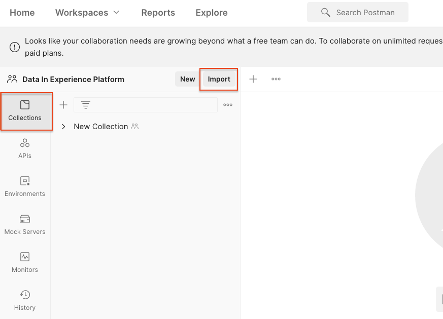

# Importazione dei dati di esempio in Adobe Experience Platform

Scopri come configurare un ambiente sandbox di Experience Platform con dati di esempio. Utilizzando una raccolta Postman, puoi creare gruppi di campi, schemi, set di dati e quindi importare dati di esempio in Experience Platform.

## Caso di utilizzo dei dati di esempio

Gli utenti aziendali di Experience Platform spesso devono seguire una serie di passaggi che includono l’identificazione dei gruppi di campi, la creazione di schemi, la preparazione di dati, la creazione di set di dati e quindi l’acquisizione di dati prima di poter esplorare le funzionalità di marketing offerte da Experience Platform. Questa esercitazione automatizza alcuni dei passaggi per poter inserire i dati in una sandbox di Platform il più rapidamente possibile.

Questa esercitazione si concentra su un brand fittizio e al dettaglio chiamato Luma. Investono in Adobe Experience Platform per combinare dati su fidelizzazione, gestione delle relazioni con i clienti, catalogo dei prodotti e acquisti offline in profili cliente in tempo reale e attivare questi profili per portare il marketing al livello successivo. Abbiamo generato dati di esempio per Luma e nel resto di questa esercitazione, questi dati verranno importati in uno degli ambienti sandbox di Experience Platform.

>[!NOTE]
>
>Il risultato finale di questa esercitazione è una sandbox contenente dati simili al [Guida introduttiva a Adobe Experience Platform per architetti di dati e ingegneri di dati tutorial](https://experienceleague.adobe.com/docs/platform-learn/getting-started-for-data-architects-and-data-engineers/overview.html). È stato aggiornato nell’aprile 2023 per supportare [Sfide di Journey Optimizer](https://experienceleague.adobe.com/docs/journey-optimizer-learn/challenges/introduction-and-prerequisites.html?lang=it). È stato aggiornato a giugno 2023 per passare al metodo di autenticazione OAuth.

## Prerequisiti

* Hai accesso alle API di Experience Platform e sai come eseguire l’autenticazione. In caso contrario, rivedi [esercitazione](https://experienceleague.adobe.com/docs/platform-learn/tutorials/platform-api-authentication.html?lang=it).
* Hai accesso a una sandbox di sviluppo di Experienci Platform.
* Conosci il tuo ID tenant Experience Platform. Puoi ottenerlo effettuando una [richiesta API](https://experienceleague.adobe.com/docs/experience-platform/xdm/api/getting-started.html?lang=en#know-your-tenant_id)
o estraendolo dall’URL al momento dell’accesso all’account Platform. Ad esempio, nell’URL seguente, il tenant è &quot;`techmarketingdemos`&quot; `https://experience.adobe.com/#/@techmarketingdemos/sname:prod/platform/home`.

## Utilizzo [!DNL Postman] {#postman}

### Configurare le variabili di ambiente

Prima di seguire i passaggi, assicurati di aver scaricato [Postman](https://www.postman.com/downloads/) applicazione. Cominciamo.

1. Scarica il file [platform-utils-main.zip](../assets/data-generator/platform-utils-main.zip) , che contiene tutti i file necessari per questa esercitazione.

   >[!NOTE]
   >
   >Dati utente contenuti in [platform-utils-main.zip](../assets/data-generator/platform-utils-main.zip) il file è fittizio e deve essere utilizzato solo a scopo dimostrativo.

1. Dalla cartella dei download, sposta il file `platform-utils-main.zip` nella posizione desiderata nel tuo computer e decomprimilo.
1. In `luma-data` cartella, apri tutte le `json` in un editor di testo e sostituiscono tutte le istanze di `_yourTenantId` con il tuo id tenant, preceduto da un trattino basso.
1. Apri `luma-offline-purchases.json`, `luma-inventory-events.json`, e `luma-web-events.json` in un editor di testo e aggiorna tutte le marche temporali in modo che gli eventi si verifichino nell’ultimo mese (ad esempio, cerca `"timestamp":"2022-11` e sostituire l&#39;anno e il mese)
1. Si noti la posizione della cartella decompressa, come sarà necessario in seguito durante la configurazione della `FILE_PATH` [!DNL Postman] variabile di ambiente:

   >[!NOTE]
   > Per ottenere il percorso del file sul Mac, vai al `platform-utils-main` cartella, fai clic con il pulsante destro del mouse sulla cartella e seleziona **Ottieni informazioni** opzione.
   >
   > 

   >[!NOTE]
   > Per ottenere il percorso del file nelle finestre, fare clic per aprire la posizione della cartella desiderata, quindi fare clic con il pulsante destro del mouse a destra del percorso nella barra degli indirizzi. Copiare l&#39;indirizzo per ottenere il percorso del file.
   > 
   > 

1. Apri [!DNL Postman] e creare un’area di lavoro dalla sezione **Aree di lavoro** menu a discesa:\
   
1. Immetti un **Nome** e opzionale **Riepilogo** per il workspace e fare clic su **Crea area di lavoro**. [!DNL Postman] al momento della creazione, passerà alla nuova area di lavoro.
   
1. Ora regola alcune impostazioni per eseguire il comando [!DNL Postman] raccolte in questa area di lavoro. Nell’intestazione di [!DNL Postman], fai clic sull’icona a forma di ingranaggio e seleziona **Impostazioni** per aprire il modale delle impostazioni. Puoi anche utilizzare la scelta rapida da tastiera (CMD/CTRL + ,) per aprire il modale.
1. Sotto `General` , aggiorna il timeout della richiesta in ms a `5000 ms` e abilita `allow reading file outside this directory`
   

   >[!NOTE]
   > Se i file vengono caricati dalla directory di lavoro, l&#39;esecuzione su più dispositivi risulterà fluida se gli stessi file vengono archiviati su altri dispositivi. Tuttavia, se si desidera eseguire i file dall&#39;esterno della directory di lavoro, è necessario attivare un&#39;impostazione per indicare lo stesso intento. Se il `FILE_PATH` non è uguale al [!DNL Postman]percorso della directory di lavoro di, questa opzione deve essere abilitata.

1. Chiudi **Impostazioni** pannello.
1. Seleziona la **Ambienti** e quindi seleziona **Importa**:
   
1. Importare il file di ambiente json scaricato `DataInExperiencePlatform.postman_environment`
1. In Postman, seleziona l’ambiente nel menu a discesa in alto a destra e fai clic sull’icona a forma di occhio per visualizzare le variabili di ambiente:
   

1. Assicurati che siano compilate le seguenti variabili di ambiente. Per informazioni su come ottenere il valore delle variabili di ambiente, vedi [Autenticazione per API Experience Platform](/help/platform/authentication/platform-api-authentication.md) esercitazione per istruzioni dettagliate.

   * `CLIENT_SECRET`
   * `API_KEY`—`Client ID` nella console Adobe Developer
   * `SCOPES`
   * `TECHNICAL_ACCOUNT_ID`
   * `IMS`
   * `IMS_ORG`—`Organization ID` nella console Adobe Developer
   * `SANDBOX_NAME`
   * `TENANT_ID`- Assicurati di usare un carattere di sottolineatura, ad esempio `_techmarketingdemos`
   * `CONTAINER_ID`
   * `platform_end_point`
   * `FILE_PATH`: utilizza il percorso della cartella locale in cui è stata decompressa la `platform-utils-main.zip` file. Accertati che includa il nome della cartella, ad esempio `/Users/dwright/Desktop/platform-utils-main`

1. **Salva** ambiente aggiornato

### Importare raccolte Postman

Ora devi importare le raccolte in Postman.

1. Seleziona **Raccolte** quindi scegliere l&#39;opzione di importazione:

   

1. Importa le seguenti raccolte:

   * `0-Authentication.postman_collection.json`
   * `1-Luma-Loyalty-Data.postman_collection.json`
   * `2-Luma-CRM-Data.postman_collection.json`
   * `3-Luma-Product-Catalog.postman_collection.json`
   * `4-Luma-Offline-Purchase-Events.postman_collection.json`
   * `5-Luma-Product-Inventory-Events.postman_collection.json`
   * `6-Luma-Test-Profiles.postman_collection.json`
   * `7-Luma-Web-Events.postman_collection.json`

   

### Autentica

Successivamente, devi autenticare e generare un token utente. I metodi di generazione dei token utilizzati in questa esercitazione sono adatti solo per l’uso non di produzione. La firma locale carica una libreria JavaScript da un host di terze parti e la firma remota invia la chiave privata a un servizio Web di proprietà e gestito da un Adobe. Anche se Adobe non memorizza questa chiave privata, le chiavi di produzione non devono mai essere condivise con nessuno.

1. Apri `0-Authentication` raccolta, seleziona la `OAuth: Request Access Token` e fai clic su `SEND` per autenticare e ottenere il token di accesso.

   

1. Rivedi le variabili di ambiente e osserva che `ACCESS_TOKEN` è ora popolato.

### Importare i dati

Ora puoi preparare e importare i dati nella sandbox di Platform. Le collezioni Postman che hai importato faranno tutto il sollevamento pesante!

1. Apri `1-Luma-Loyalty-Data` raccolta e clic **Esegui** nella scheda della panoramica per avviare Collection Runner.

   

1. Nella finestra dell’esecuzione della raccolta, accertati di selezionare l’ambiente dal menu a discesa, quindi aggiorna il **Ritardo** a `4000ms`, controlla **Salva risposte** e verificare che l&#39;ordine di esecuzione sia corretto. Fai clic su **Eseguire i dati sulla fedeltà Luma** pulsante

   

   >[!NOTE]
   >
   >**1-Luma-Loyalty-Data** crea uno schema per i dati sulla fedeltà dei clienti. Lo schema è basato sulla classe Profilo individuale XDM, sul gruppo di campi standard e su un gruppo di campi personalizzato e un tipo di data. La raccolta crea un set di dati utilizzando lo schema e carica dati di esempio sulla fedeltà dei clienti in Adobe Experience Platform.

   >[!NOTE]
   >
   >Se una richiesta di raccolta non riesce durante l’esecuzione della raccolta di Postman, interrompi l’esecuzione ed esegui una alla volta le richieste di raccolta.

1. Se tutto va bene, tutte le richieste in `Luma-Loyalty-Data` la raccolta deve passare.

   

1. Ora accediamo a [Interfaccia Adobe Experience Platform](https://platform.adobe.com/) e passa ai set di dati.
1. Apri `Luma Loyalty Dataset` set di dati e nella finestra dell’attività set di dati puoi visualizzare un’esecuzione batch riuscita che ha acquisito 1000 record. Puoi anche fare clic sull’opzione di anteprima del set di dati per verificare i record acquisiti. Potrebbe essere necessario attendere alcuni minuti per confermare che 1000 [!UICONTROL Nuovi frammenti di profilo] sono stati creati.
   
1. Ripeti i passaggi 1-3 per eseguire le altre raccolte:
   * `2-Luma-CRM-Data.postman_collection.json` crea uno schema e un set di dati compilato per i dati CRM dei clienti. Lo schema si basa sulla classe Profilo individuale XDM che include dettagli demografici, dettagli di contatto personali, dettagli delle preferenze e un gruppo di campi di identità personalizzato.
   * `3-Luma-Product-Catalog.postman_collection.json` crea uno schema e un set di dati compilato per le informazioni sul catalogo dei prodotti. Lo schema si basa su una classe di catalogo prodotti personalizzata e utilizza un gruppo di campi catalogo prodotti personalizzato.
   * `4-Luma-Offline-Purchase-Events.postman_collection.json` crea uno schema e un set di dati compilato per i dati evento di acquisto offline dei clienti. Lo schema è basato sulla classe ExperienceEvent XDM e comprende un gruppo di campi Identità personalizzata e Dettagli Commerce.
   * `5-Luma-Product-Inventory-Events.postman_collection.json` crea uno schema e un set di dati compilato per gli eventi relativi ai prodotti in entrata e in uscita. Lo schema si basa su una classe di evento business personalizzata e un gruppo di campi personalizzato.
   * `6-Luma-Test-Profiles.postman_collection.json` crea uno schema e un set di dati popolato con profili di test da utilizzare in Adobe Journey Optimizer
   * `7-Luma-Web-Events.postman_collection.json` crea uno schema e un set di dati popolato con semplici dati web storici.

## Convalida

I dati di esempio sono stati progettati in modo che, una volta eseguite le raccolte, vengano creati Real-Time Customer Profile che combinano dati provenienti da più sistemi. Un buon esempio è il primo record dei set di dati di fedeltà, gestione delle relazioni con i clienti e acquisto offline. Cerca quel profilo per confermare che i dati sono stati acquisiti. In [Interfaccia Adobe Experience Platform](https://experience.adobe.com/platform/):

1. Vai a **[!UICONTROL Profili]** > **[!UICONTROL Sfoglia]**
1. Seleziona `Luma Loyalty Id` come **[!UICONTROL Spazio dei nomi dell’identità]**
1. Cerca `5625458` come **[!UICONTROL Valore identità]**
1. Apri `Daniel Wright` profilo

>[!TIP]
>
>Se non vedi il profilo, controlla [!UICONTROL Set di dati] per confermare che tutti i set di dati sono stati creati e acquisiti correttamente. Se l’aspetto è buono, attendi quindici minuti e verifica se il profilo è disponibile nel visualizzatore.  In caso di problemi con l’acquisizione dei dati, controlla i messaggi di errore per provare a individuare il problema. È inoltre possibile provare ad abilitare la diagnostica degli errori nel [!UICONTROL Set di dati] e trascina il file di dati json per riacquisire i dati.

Sfogliando i dati in **[!UICONTROL Attributi]** e **[!UICONTROL Eventi]** schede, dovresti vedere che il profilo contiene dati provenienti dai vari file di dati:

## Passaggi successivi

Per scoprire di più su Adobe Journey Optimizer, questa sandbox contiene tutto il necessario per [Sfide di Journey Optimizer](https://experienceleague.adobe.com/docs/journey-optimizer-learn/challenges/introduction-and-prerequisites.html?lang=it)

Per informazioni sui criteri di unione, sulla governance dei dati, sul servizio query e sul generatore di segmenti, visita questa pagina [lezione 11 nell’esercitazione Guida introduttiva per architetti di dati e ingegneri di dati](https://experienceleague.adobe.com/docs/platform-learn/getting-started-for-data-architects-and-data-engineers/create-merge-policies.html?lang=en). Le lezioni precedenti di questo altro tutorial ti consentono di creare manualmente tutto ciò che è stato appena popolato da queste raccolte di Postman: buon inizio!

Se desideri creare un esempio di implementazione Web SDK da collegare a questa sandbox, passa attraverso
[Tutorial sull’implementazione di Adobe Experience Cloud con Web SDK](https://experienceleague.adobe.com/docs/platform-learn/implement-web-sdk/overview.html?lang=it). Dopo aver impostato le lezioni &quot;Configurazione iniziale&quot;, &quot;Configurazione tag&quot; e &quot;Configura Experience Platform&quot; dell’esercitazione SDK per web, accedi al sito web Luma utilizzando i primi dieci indirizzi e-mail presenti nel `luma-crm.json` file utilizzando la password `test` per vedere i frammenti di profilo unire con i dati caricati in questa esercitazione.

Se desideri creare un esempio di implementazione Mobile SDK da collegare a questa sandbox, passa attraverso
[Tutorial sull’implementazione di Adobe Experience Cloud nelle app per dispositivi mobili](https://experienceleague.adobe.com/docs/platform-learn/implement-mobile-sdk/overview.html?lang=it). Dopo aver impostato le lezioni &quot;Configurazione iniziale&quot;, &quot;Implementazione app&quot; e &quot;Experience Platform&quot; dell’esercitazione SDK per web, accedi al sito web Luma utilizzando i primi indirizzi e-mail dell’ `luma-crm.json` per visualizzare un’unione di frammenti di profilo con i dati caricati in questa esercitazione.

## Ripristina ambiente sandbox {#reset-sandbox}

Se si ripristina una sandbox non di produzione, vengono eliminate anche tutte le risorse associate a essa (schemi, set di dati e così via), mantenendo il nome della sandbox e le autorizzazioni associate. Questa sandbox &quot;pulita&quot; continua a essere disponibile con lo stesso nome per gli utenti che vi hanno accesso.

Segui i passaggi [qui](https://experienceleague.adobe.com/docs/experience-platform/sandbox/ui/user-guide.html?lang=en#reset-a-sandbox) per ripristinare un ambiente sandbox.
