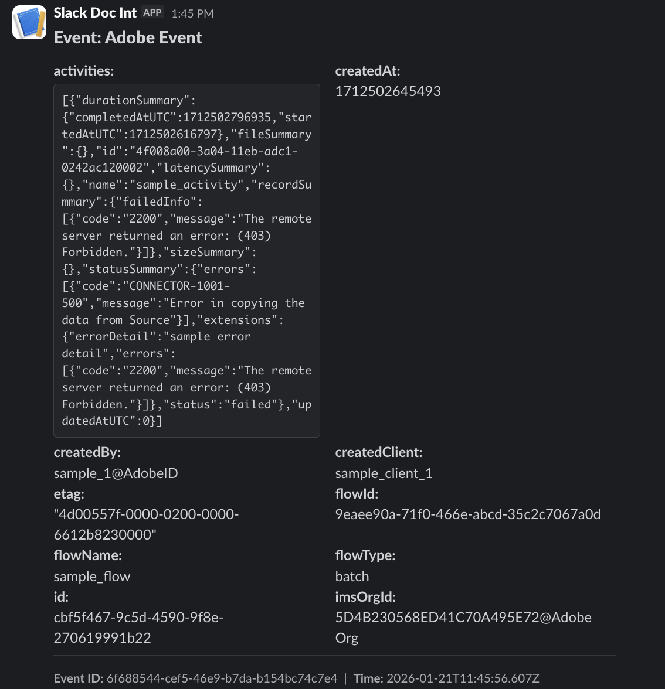

# Monitorare gli eventi di Experience Platform in Slack

Scopri come ricevere le notifiche di Experience Platform in Slack tramite l’integrazione con un proxy webhook di Adobe App Builder. I data engineer e gli amministratori potrebbero voler ricevere notifiche proattive in Slack da Adobe Experience Platform per monitorare lo stato delle loro implementazioni di Platform. Questo tutorial illustra l’architettura e i passaggi di implementazione per collegare Adobe I/O Events a Slack utilizzando Adobe App Builder.


>[!VIDEO](https://video.tv.adobe.com/v/3480183?learn=on)

## Perché un proxy webhook?

La connessione diretta di Adobe I/O Events a un webhook in ingresso Slack non è possibile a causa di una mancata corrispondenza del protocollo nel processo di verifica.

* **La sfida**: quando si registra un webhook con Adobe I/O Events, Adobe invia una richiesta di &quot;verifica&quot; (una `GET` o `POST`) all&#39;endpoint. L’endpoint deve elaborare correttamente questa sfida e restituire il valore specifico per confermare la proprietà.

* **Limitazione**: i webhook in ingresso di Slack sono progettati solo per acquisire payload JSON per la messaggistica. Non hanno la logica per riconoscere o rispondere all’handshake di verifica di Adobe.

* **Soluzione**: distribuire un proxy webhook intermedio utilizzando Adobe App Builder. Questo proxy è situato tra Adobe e Slack per:
   1. Intercetta la richiesta di Adobe e rispondi alla verifica.
   1. Formatta il payload in un messaggio compatibile con Slack e invialo a Slack.

* **Metodo di consegna**: azioni di runtime.  Le azioni di runtime vengono fornite con Adobe App Builder. Quando si utilizza un’azione di runtime (non web) come gestore eventi, Adobe I/O Events gestisce automaticamente la verifica della firma e le risposte di richiesta di verifica. Le azioni di runtime sono l’approccio consigliato in quanto richiedono meno codice e forniscono sicurezza incorporata.

## Panoramica dell’architettura

### Cos’è Adobe Developer Console?

Adobe Developer Console è il portale centrale per la gestione dei progetti Adobe, delle API e delle credenziali. È dove puoi creare il progetto, configurare l’autenticazione e registrare i webhook.

### Cos’è App Builder?

Adobe App Builder è un framework completo che consente agli sviluppatori aziendali di creare applicazioni native per il cloud.

* **Provisioning**: App Builder non è abilitato per impostazione predefinita; deve essere predisposto per la tua organizzazione come funzionalità. Assicurati che la tua organizzazione disponga del diritto **[!DNL App Builder]**.

* **Modello di progetto**: i progetti App Builder vengono creati specificatamente utilizzando il modello **[!UICONTROL App Builder]** in [!DNL Developer Console] ([!UICONTROL Progetto da modello] > [!UICONTROL App Builder]). Il modello imposta automaticamente le aree di lavoro e gli ambienti di runtime necessari.

* **Guida introduttiva di App Builder**: consulta la documentazione [per effettuare il provisioning e creare il primo progetto dal modello](https://developer.adobe.com/app-builder/docs/get_started/app_builder_get_started/first-app){target=_blank}.

### Cos’è Adobe I/O Runtime?

Adobe I/O Runtime è la piattaforma senza server che alimenta App Builder. Consente agli sviluppatori di implementare il codice (Functions-as-a-Service) che viene eseguito in risposta alle richieste HTTP senza gestire l’infrastruttura del server.

In questa implementazione viene utilizzata un&#39;azione **Action**. Un’azione è una funzione senza stato (scritta in Node.js) che viene eseguita sul Adobe I/O Runtime. La nostra azione funge da endpoint HTTP pubblico con cui Adobe I/O Events comunica.

Per ulteriori informazioni, consulta la [documentazione di Adobe I/O Runtime](https://developer.adobe.com/runtime/){target=_blank}.

## Guida all’implementazione

### Prerequisiti

Prima di iniziare, assicurati di disporre dei seguenti elementi:

* **Accesso a Adobe Developer Console**: è necessario avere accesso a un amministratore di sistema o a un ruolo [sviluppatore](../admin/add-developers.md) in un&#39;organizzazione in cui è abilitato App Builder.

  >[!TIP]
  > Per verificare il provisioning di App Builder, accedi a [Adobe Developer Console](https://developer.adobe.com/console/){target=_blank}, accertati di essere nell&#39;organizzazione desiderata, seleziona **[!UICONTROL Crea progetto da modello]** e verifica che il modello App Builder sia disponibile. In caso contrario, consulta la sezione Domande frequenti su App Builder &quot;[Come ottenere App Builder](https://developer.adobe.com/app-builder/docs/intro_and_overview/faq#how-to-get-app-builder){target=_blank}&quot;


* **Node.js e npm**: il progetto richiede Node.js, che include NPM (Node Package Manager). NPM viene utilizzato per installare Adobe CLI e gestire le dipendenze dei progetti.

   * [Scarica Node.js (versione LTS consigliata)](https://nodejs.org/){target=_blank}
   * [npm Guida introduttiva](https://docs.npmjs.com/downloading-and-installing-node-js-and-npm){target=_blank}: guida alla verifica dell&#39;installazione.

* **`aio CLI`**: installato tramite il terminale: `npm install -g @adobe/aio-cli`
* **Configurazione app Slack**: è necessario configurare un&#39;app Slack nell&#39;area di lavoro con un **webhook in ingresso** attivato.

   * [Crea un&#39;app Slack](https://api.slack.com/apps){target=_blank}
   * [Guida ai webhook in arrivo di Slack](https://docs.slack.dev/messaging/sending-messages-using-incoming-webhooks/){target=_blank} - Segui questa guida per creare la tua app e generare l&#39;URL del webhook (inizia con `https://hooks.slack.com/`...).

### Passaggio 1: creare un progetto in Adobe Developer Console

Innanzitutto, crea un progetto con il modello App Builder in Adobe Developer Console:

1. Accedi a [Adobe Developer Console](https://developer.adobe.com/console)
1. Seleziona **[!UICONTROL Crea progetto da modello]**
1. Seleziona il modello App Builder
1. Immettere un titolo per il progetto, ad esempio `Slack webhook integration`
1. Seleziona **[!UICONTROL Salva]**

### Passaggio 2: inizializzare l’ambiente di runtime

Esegui i seguenti comandi nel terminale per creare la struttura del progetto:

#### Accedi a `aio`

```
aio login
```

#### Inizializzare un nuovo progetto App Builder

```
aio app init slack-webhook-proxy
```

1. Seleziona la tua organizzazione e premi **Invio**
1. Seleziona il progetto creato nel passaggio precedente (ad esempio, `Slack webhook integration`) e premi **Invio**
1. Seleziona l&#39;opzione **[!UICONTROL Solo modelli supportati dalla mia organizzazione]**
1. Ignorare la sezione di esempio premendo **Invio**
1. Quando richiesto, assicurarsi che i seguenti componenti siano selezionati (il cerchio deve essere compilato) e premere **Invio**:
   1. **[!UICONTROL Azioni: distribuire le azioni di runtime]**
   1. **[!UICONTROL Eventi: pubblicazione in Adobe I/O Events]**
   1. **[!UICONTROL Web Assets: distribuisci su risorse statiche ospitate]**
1. Con le frecce Su e Giù, spostarsi nell&#39;elenco in arrivo e scegliere **[!UICONTROL Adobe Experience Platform: Profilo cliente in tempo reale]**, quindi premere **Invio**
1. **[!UICONTROL Azioni generiche]** generate automaticamente
1. Scegli **[!UICONTROL Pure HTML/JS]** per l&#39;interfaccia utente e premi **Invio**
1. Mantieni **[!UICONTROL generic]** come azione di esempio per mostrare come accedere a un nome API esterno e premere **Invio**
1. Mantieni **[!UICONTROL publish-events]** come nome dell&#39;azione di esempio per creare messaggi in formato eventi cloud e premi **Invio**

L&#39;inizializzazione dell&#39;app dovrebbe essere completata.

#### Passa alla directory del progetto

```
cd slack-webhook-proxy
```

#### Aggiungi l’azione web

```
aio app add action
```

1. Scegli **[!UICONTROL Solo i modelli supportati dalla mia organizzazione]** e premi **Invio**
2. Vedere l&#39;azione **[!UICONTROL publish-events]** nella tabella visualizzata; premere **Space** per selezionare l&#39;azione. Se il cerchio accanto al nome viene riempito come mostrato nell&#39;esercitazione video, premi **Invio**
3. Denomina l&#39;azione `webhook-proxy`

### Passaggio 3: codice dell&#39;azione proxy

In un IDE o in un editor di testo, creare/modificare il file `actions/webhook-proxy/index.js` con il codice seguente. Questa implementazione inoltra gli eventi a Slack. La verifica della firma e la gestione della verifica della verifica sono automatiche quando si utilizza la registrazione delle azioni di runtime.

```javascript
const fetch = require("node-fetch");
const { Core } = require("@adobe/aio-sdk");
 
/**
 * Adobe I/O Events to Slack Runtime Proxy
 *
 * Receives events from Adobe I/O Events and forwards them to Slack.
 * Signature verification and challenge handling are automatic when
 * using Runtime Action registration (non-web action).
 */
async function main(params) {
  const logger = Core.Logger("webhook-proxy", { level: params.LOG_LEVEL || "info" });
 
  try {
    logger.info(`Event received: ${JSON.stringify(params)}`);
 
    // Forward to Slack
    return forwardToSlack(params, params.SLACK_WEBHOOK_URL, logger);
 
  } catch (error) {
    logger.error(`Error: ${error.message}`);
    return { statusCode: 500, body: { error: "Internal server error" } };
  }
}
 
/**
 * Forwards the event payload to Slack
 */
async function forwardToSlack(payload, webhookUrl, logger) {
  if (!webhookUrl) {
    logger.error("SLACK_WEBHOOK_URL not configured");
    return { statusCode: 500, body: { error: "Server configuration error" } };
  }
 
  // Extract Adobe headers passed to runtime action
  const headers = {
    "x-adobe-event-code": payload["x-adobe-event-code"],
    "x-adobe-event-id": payload["x-adobe-event-id"],
    "x-adobe-provider": payload["x-adobe-provider"]
  };
 
  const slackMessage = buildSlackMessage(payload, headers);
 
  const response = await fetch(webhookUrl, {
    method: "POST",
    headers: { "Content-Type": "application/json" },
    body: JSON.stringify(slackMessage)
  });
 
  if (!response.ok) {
    const errorText = await response.text();
    logger.error(`Slack API error: ${response.status} - ${errorText}`);
    return { statusCode: response.status, body: { error: errorText } };
  }
 
  logger.info("Event forwarded to Slack");
  return { statusCode: 200, body: { success: true } };
}
 
/**
 * Builds a Slack Block Kit message from the event payload
 */
function buildSlackMessage(payload, headers) {
  // Adobe passes event code as x-adobe-event-code header (available in params for runtime actions)
  const eventType = headers["x-adobe-event-code"] ||
                    payload["x-adobe-event-code"] ||
                    payload.event_code ||
                    payload.type ||
                    payload.event_type ||
                    "Adobe Event";
  const eventId = headers["x-adobe-event-id"] || payload["x-adobe-event-id"] || payload.event_id || payload.id || "N/A";
  const eventData = payload.data || payload.event || payload;
 
  return {
    blocks: [
      {
        type: "header",
        text: { type: "plain_text", text: `Event: ${eventType}`, emoji: true }
      },
      {
        type: "section",
        fields: formatDataFields(eventData)
      },
      { type: "divider" },
      {
        type: "context",
        elements: [{
          type: "mrkdwn",
          text: `*Event ID:* ${eventId}  |  *Time:* ${new Date().toISOString()}`
        }]
      }
    ]
  };
}
 
/**
 * Formats event data as Slack mrkdwn fields
 */
function formatDataFields(data, maxFields = 10) {
  if (typeof data !== "object" || data === null) {
    return [{ type: "mrkdwn", text: `*Payload:*\n${String(data)}` }];
  }
 
  const entries = Object.entries(data);
  if (entries.length === 0) {
    return [{ type: "mrkdwn", text: "_No data provided_" }];
  }
 
  return entries.slice(0, maxFields).map(([key, value]) => ({
    type: "mrkdwn",
    text: `*${key}:*\n${typeof value === "object" ? `\`\`\`${JSON.stringify(value)}\`\`\`` : value}`
  }));
}
 
exports.main = main;
```

### Passaggio 4: configurare l’azione

La configurazione dell&#39;azione in `app.config.yaml` è critica. Utilizza web: no per creare un’azione non web che può essere registrata come azione di runtime in Developer Console.

```yaml
application:
  runtimeManifest:
    packages:
      slack-webhook-proxy:
        license: Apache-2.0
        actions:
          webhook-proxy:
            function: actions/webhook-proxy/index.js
            web: no
            runtime: nodejs:22
            inputs:
              LOG_LEVEL: info
              SLACK_WEBHOOK_URL: $SLACK_WEBHOOK_URL
            annotations:
              require-adobe-auth: false
              final: true
```

#### Perché `web: no?`

Quando utilizzi un’azione non web e la registri tramite l’opzione &quot;Azione runtime&quot; in Developer Console, Adobe I/O Events automaticamente:

* Gestisce la verifica della verifica della verifica della verifica (sia `GET` che `POST`)
* Verifica le firme digitali prima di richiamare l&#39;azione
* Catena un&#39;azione di convalida della firma davanti all&#39;azione

Questo significa che il codice deve gestire solo la logica di business (inoltro a Slack).

### Passaggio 5: Variabili di ambiente

Per gestire in modo sicuro le credenziali, vengono utilizzate le variabili di ambiente. Crea/modifica il file `.env` nella directory principale del progetto per aggiungere l&#39;URL del webhook di Slack. Assicurarsi di visualizzare i file nascosti nel sistema se il file `.env` non è visualizzato:

```
# ... other .env file content ...
 
SLACK_WEBHOOK_URL=https://hooks.slack.com/services/YOUR/WEBHOOK/URL
```

### Passaggio 6: distribuisci

Una volta impostate le variabili di ambiente, distribuisci l’azione. Assicurati di trovarti nella directory principale del progetto, ovvero `slack-webhook-proxy`, quando esegui questo comando nel terminale.

```
aio app deploy
```

L&#39;azione viene distribuita in Adobe I/O Runtime ed è disponibile in Developer Console per la registrazione.

### Passaggio 7: Registrazione finale (Adobe Developer Console)

Una volta implementata l’azione, registrala come destinazione per gli eventi Adobe.

1. Passa a [Adobe Developer Console](https://developer.adobe.com/console){target=_blank} e apri il progetto App Builder.
1. Scegli **[!UICONTROL Workspace]**
1. Seleziona **[!UICONTROL Aggiungi servizio]** e seleziona **[!UICONTROL Evento]**.
1. Seleziona **[!UICONTROL Adobe Experience Platform]** come prodotto.
1. Seleziona **[!UICONTROL Notifiche piattaforma]** come tipo di eventi.
1. Seleziona gli eventi specifici (o tutti) di cui vuoi ricevere una notifica in Slack e seleziona **[!UICONTROL Successivo]**.
1. Seleziona o [crea le tue credenziali OAuth](https://experienceleague.adobe.com/en/docs/platform-learn/tutorials/api/platform-api-authentication){target=_blank}.
1. Configura **[!UICONTROL Dettagli registrazione evento]**:
   1. **[!UICONTROL Nome registrazione]**: assegna alla registrazione un nome descrittivo.
   1. **[!UICONTROL Descrizione registrazione]**: assicurarsi che sia esplicito in modo che altri collaboratori possano essere a conoscenza delle operazioni eseguite.
   1. Seleziona **[!UICONTROL Avanti]**
   1. **[!UICONTROL Metodo di consegna]**: selezionare **[!UICONTROL Azione runtime]** (non &quot;Webhook&quot;).
   1. **[!UICONTROL Azione runtime]**: scegliere `webhook-proxy` dal menu a discesa (aggiornare la pagina se non è visualizzata).
1. Seleziona **[!UICONTROL Salva eventi configurati]**.


### Passaggio 8: convalida con un evento di esempio

Puoi verificare l’intero flusso end-to-end facendo clic sul pulsante &quot;Invia evento di esempio&quot; accanto a qualsiasi evento configurato.

L’evento di esempio viene inviato sul canale configurato durante la creazione dell’app Slack e del webhook. Dovresti trovare qualcosa di simile al seguente:



Congratulazioni, hai integrato correttamente Slack con gli eventi Experience Platform.

### Problemi comuni

Di seguito sono riportati alcuni problemi che è possibile riscontrare durante la configurazione del proxy e alcuni possibili modi per risolverli.

* **Impossibile visualizzare le organizzazioni IMS**: se l&#39;elenco delle organizzazioni IMS non viene visualizzato durante l&#39;esecuzione di `aio app init`, provare a eseguire le operazioni seguenti. Esegui `aio logout` nel terminale, esci da Experience Cloud nel browser Web predefinito ed esegui di nuovo `aio login`.
* **Azione non visualizzata nel menu a discesa**: verificare che `web: no` sia impostato in `app.config.yaml`. Nel menu a discesa Azione runtime vengono visualizzate solo le azioni non Web. Aggiorna la pagina Developer Console dopo la distribuzione.
* **Verifica della firma non riuscita**: se l&#39;elemento viene visualizzato nei registri di attivazione, significa che la convalida incorporata di Adobe ha rifiutato la richiesta. Questo non dovrebbe accadere per eventi Adobe legittimi. Verifica che la registrazione dell’evento sia configurata correttamente.
* **Slack non riceve messaggi**: verificare che `SLACK_WEBHOOK_URL` sia impostato correttamente nel file `.env` e che l&#39;app Slack abbia il webhook in ingresso abilitato.
* **Timeout azione**: le azioni di runtime hanno un timeout di 60 secondi. Se l&#39;azione richiede più tempo, è consigliabile utilizzare l&#39;approccio di inserimento nel diario.