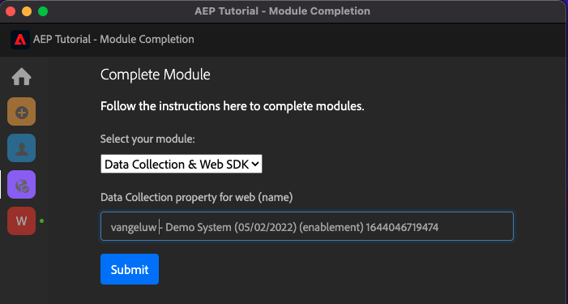
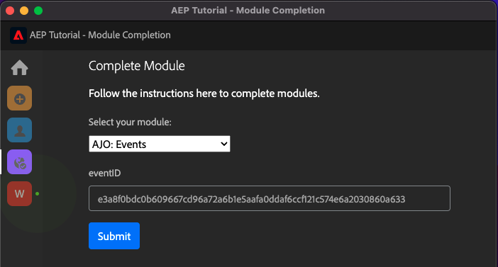

# Tutorial tecnico completo per Adobe Experience Platform - Come viene misurato il completamento?

Puoi aggiornare il completamento del Tutorial tecnico completo per Adobe Experience Platform utilizzando l’estensione Chrome creata.

Dopo aver seguito le istruzioni del modulo 0, hai inserito il **ID configurazione** nell’estensione Chrome e ti sei registrato. L’estensione Chrome dovrebbe ora essere simile a questa. Fai clic sull’icona viola per inviare il completamento di un modulo.

Vedrai questo:

Aprendo il menu a discesa, puoi selezionare il modulo da completare:

Per completare un modulo, è necessario fornire una prova del completamento.

Di seguito sono riportate le prove previste del completamento per ogni modulo.

## Introduzione

Prova prevista del completamento del modulo **Introduzione** è l’ID del progetto Demo System per il Web creato.

L’ID del progetto Demo System per il formato web è simile al seguente: `--demoProfileLdap-- - OCUC`.

Seleziona **Introduzione** nel menu a discesa , immetti il tuo **ID del progetto Demo System** e fai clic su **Invia** - pulsante.

## Raccolta dati e SDK web

Prova prevista del completamento del modulo **Raccolta dati e SDK web** è il nome della proprietà Data Collection per il Web.

Il nome della proprietà Raccolta dati per il formato Web è simile al seguente: `--demoProfileLdap-- - Demo System (05/02/2022) (enablement) 1644046719474`.

Seleziona **Raccolta dati e SDK web** nel menu a discesa , immetti il tuo **Nome proprietà raccolta dati per web** e fai clic su **Invia** - pulsante.

## Acquisizione dei dati

Prova prevista del completamento del modulo **Acquisizione dei dati** è l&#39;ID del set di dati per i 2 set di dati creati.

Il formato dell&#39;ID del set di dati si presenta così: **5f069724723ef41916a8b5d2**.

`--demoProfileLdap-- - Demo System - Event Dataset for Website`

`--demoProfileLdap-- - Demo System - Profile Dataset for Website`

Seleziona **Acquisizione dei dati** nel menu a discesa , immetti il tuo **ID set di dati** per entrambi i set di dati nei campi di input e fai clic sul pulsante **Invia** - pulsante.

## Profilo cliente in tempo reale

Prova prevista del completamento del modulo **Profilo cliente in tempo reale** è **ID segmento** del segmento creato tramite l’interfaccia utente, `--demoProfileLdap-- - Male customers with interest in Montana Wind Jacket`.

Il formato ID segmento si presenta così: **8cb7034d-d4ae-4d26-a61f-a76559c12457**.

Seleziona **Profilo cliente in tempo reale** nel menu a discesa , immetti il tuo **ID segmento** nel campo di input e fai clic sul pulsante **Invia** - pulsante.

## Servizio query

Prova prevista del completamento del modulo **Servizio query** è l&#39;ID del set di dati per `--demoProfileLdap--_callcenter_interaction_analysis` - set di dati che si ottiene dopo il completamento del modulo.

Il formato si presenta così: **62076f68f14a9d194995d4e2**.

Seleziona **Servizio query** nel menu a discesa , immetti il tuo **ID set di dati** nel campo di input e fai clic sul pulsante **Invia** - pulsante.

## Intelligent Services

Prova prevista del completamento del modulo **Intelligent Services** è l&#39;ID per **Servizio Customer AI per la propensione all&#39;acquisto di prodotti**.

Il formato si presenta così: **12729** e puoi recuperarlo dall’URL quando hai aperto il servizio.

Seleziona **Intelligent Services** nel menu a discesa , immetti il tuo **ID del servizio Customer AI** nel campo di input e fai clic sul pulsante **Invia** - pulsante.

## Real-Time CDP

Prova prevista del completamento del modulo **Real-Time CDP** è l&#39;ID del **Attività Adobe Target**.

Il formato si presenta così: **11804**.

Seleziona **Real-Time CDP** nel menu a discesa , immetti il tuo **ID attività Adobe Target** nel campo di input e fai clic sul pulsante **Invia** - pulsante.

## AJO: Orchestrazione

Prova prevista del completamento del modulo **AJO: Orchestrazione** è l&#39;ID evento per il tuo `--demoProfileLdap--AccountCreationEvent`.

Il formato si presenta così: **227402c540eb8f8855c6b2333adf6d54d7153d9d7d56fa475a6866081c57473 6**.

Seleziona **AJO: Orchestrazione** nel menu a discesa , immetti il tuo ** eventID** nel campo di input e fai clic sul pulsante **Invia** - pulsante.

## AJO: Azioni personalizzate

Prova prevista del completamento del modulo **AJO: Azioni personalizzate** è l’ID evento per l’evento `--demoProfileLdap--GeofenceEntry`.

Il formato si presenta così: **fa42ab7982ba55f039eacec24c1e32e5c51b310c67f0fa559ab49b89b63f4934**.

Seleziona **AJO: Azioni personalizzate** nel menu a discesa , immetti il tuo **eventID** nel campo di input e fai clic sul pulsante **Invia** - pulsante.

## AJO: Offerte

Prova prevista del completamento del modulo **AJO: Offerte** è l&#39;ID del **Decisione di offerta** che hai creato.

È possibile trovare le **ID decisione offerta** che assomiglia a questo **xcore:offer-activity:1122fcc4603ea499** qui:

Seleziona **AJO: Offerte** nel menu a discesa , immetti il tuo **ID decisione offerta** nel campo di input e fai clic sul pulsante **Invia** - pulsante.

## AJO: Eventi

Prova prevista del completamento del modulo **AJO: Eventi** è l&#39;ID evento per il tuo `--demoProfileLdap--StoreEntryEvent`.

Il formato si presenta così: **e3a8f0bdc0b609667cd96a72a6b1e5aafa0daf6ccf121c574e6a2030860a633**.

Seleziona **AJO: Eventi** nel menu a discesa , immetti il tuo **eventID** nel campo di input e fai clic sul pulsante **Invia** - pulsante.

## CJA

Prova prevista del completamento del modulo **CJA** è l&#39;ID del progetto `--demoProfileLdap-- - Omnichannel Analysis`.

Il formato si presenta così: **6217344f6249ac70c726db60**, puoi trovarlo nell’URL quando hai aperto il progetto.

Seleziona **CJA** nel menu a discesa , immetti il tuo **ID progetto** nel campo di input e fai clic sul pulsante **Invia** - pulsante.

## CJA: BigQuery

Prova prevista del completamento del modulo **CJA: BigQuery** è l&#39;ID del **BigQuery**-connessione.

È possibile trovare le **ID connessione BigQuery** che assomiglia a questo **85a2394d-8b94-410c-a239-4d8b94b10c38** qui:

Seleziona **CJA: BigQuery** nel menu a discesa , immetti il tuo **ID connessione BigQuery** nel campo di input e fai clic sul pulsante **Invia** - pulsante.

## RTCDP: EventHub

Prova prevista del completamento del modulo **RTCDP: EventHub** è l&#39;ID del **Hub eventi di Microsoft Azure** in Adobe Experience Platform.

È possibile trovare le **ID destinazione dell’hub eventi di Microsoft Azure** che assomiglia a questo **fa3f7ce5-86fd-4096-bf7c-e586fdc096ba** qui:

Seleziona **RTCDP: EventHub** nel menu a discesa , immetti il tuo **ID destinazione dell’hub eventi di Microsoft Azure** nel campo di input e fai clic sul pulsante **Invia** - pulsante.

## Connessioni RTCDP

Prova prevista del completamento del modulo **Connessioni RTCDP** è il tuo **ID proprietà inoltro evento**.

È possibile trovare le **ID proprietà inoltro evento** che assomiglia a questo **PR40f44184c88472e9c19d8d602aab0de** qui:

Seleziona **Connessioni RTCDP** nel menu a discesa , immetti il tuo **ID proprietà inoltro evento** nel campo di input e fai clic sul pulsante **Invia** - pulsante.

## Apache Kafka

Prova prevista del completamento del modulo **Apache Kafka** è l&#39;ID del connettore di origine `--demoProfileLdap-- - Kafka`.

L&#39;ID è simile a questo **f843d50a-ee30-4ca8-a766-0e4f3d29a2f7**, e lo puoi trovare qui:

Seleziona **Apache Kafka** nel menu a discesa , immetti il tuo **ID flusso** nel campo di input e fai clic sul pulsante **Invia** - pulsante.

[Torna a tutti i moduli](./overview.md)
