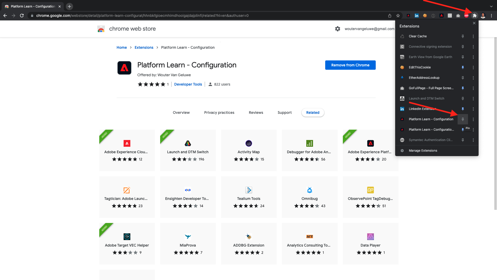
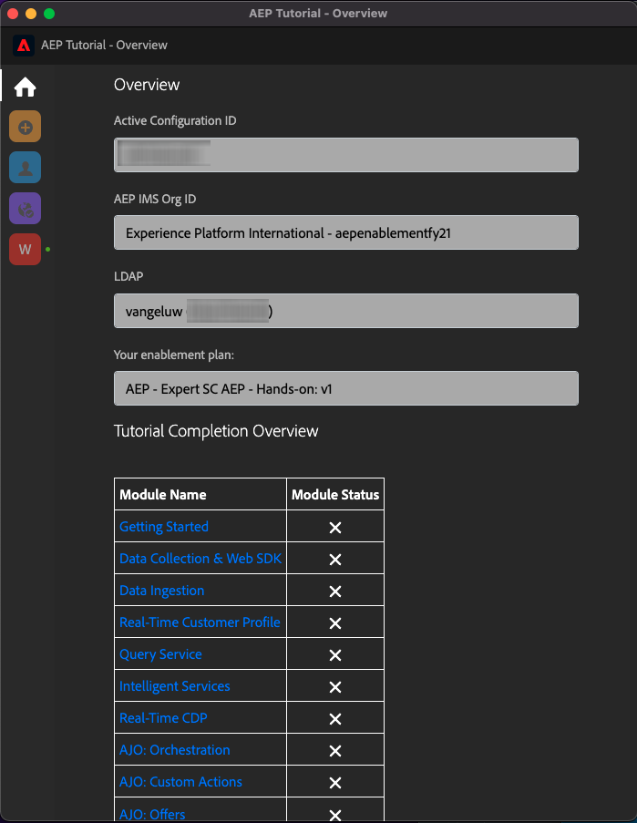

# 0.1 Installa l&#39;estensione Chrome per la documentazione di Experience League

## 0.1.1 Perché abbiamo creato un&#39;estensione Chrome?

La documentazione è stata resa generica in modo che possa essere facilmente riutilizzata da chiunque, utilizzando qualsiasi istanza di Adobe Experience Platform.
Rendendo la documentazione riutilizzabile, **Variabili di ambiente** sono stati introdotti nella documentazione, il che significa che troverai il **chiavi** nella documentazione. Ogni chiave è una variabile specifica per un ambiente specifico, e l’estensione Chrome la modificherà per te e per questo motivo sarà facile copiare il codice e il testo dalle pagine delle esercitazioni e incollarlo nelle varie interfacce utente che utilizzerai come parte dell’esercitazione.

Di seguito è riportato un esempio di tali valori. Attualmente, questi valori non possono ancora essere utilizzati, ma non appena installi e attivi l’estensione Chrome, vedrai che queste variabili si trasformano in testo &quot;normale&quot; che puoi copiare e riutilizzare.

| Nome | Chiave |
|:-------------:| :---------------:|
| ID organizzazione AEP IMS | `--aepImsOrgId--` |
| ID tenant AEP | `--aepTenantId--` |
| ID ingresso DCS | `--dcsInletId--` |
| LDAP profilo demo | `--demoProfileLdap--` |

Ad esempio, nella schermata seguente è possibile vedere un riferimento a `--aepTenantId--`.

Una volta installata l&#39;estensione, lo stesso testo viene modificato automaticamente per riflettere i valori specifici dell&#39;istanza.

L’estensione ti consente inoltre di:

- Iscriviti al tutorial
- Monitora i tuoi progressi inviando il completamento di ciascun modulo come indicato in [Come viene misurato il completamento?](../../completion.md)

## 0.1.2 Installare l’estensione Chrome

Per installare l’estensione Chrome, apri il browser Chrome e vai a: [https://chrome.google.com/webstore/detail/platform-learn-configurat/hhnbkfgioecmhimdhooigajdajplinfi/related?hl=en&amp;authuser=0](https://chrome.google.com/webstore/detail/platform-learn-configurat/hhnbkfgioecmhimdhooigajdajplinfi/related?hl=en&amp;authuser=0). Vedrete questo.

Fai clic su **Aggiungi a Chrome**.

Vedrete questo. Fai clic su **Aggiungi estensione**.

L&#39;estensione verrà quindi installata e verrà visualizzata una notifica simile.

In **estensioni** fai clic sul menu **pezzo di puzzle** e fissare **Informazioni sulla piattaforma - Configurazione** al menu dell&#39;estensione.

## 0.1.2 Configurare l’estensione Chrome

Vai a [https://experienceleague.adobe.com/docs/platform-learn/comprehensive-technical-tutorial-v22/overview.html?lang=en](https://experienceleague.adobe.com/docs/platform-learn/comprehensive-technical-tutorial-v22/overview.html?lang=en) quindi fai clic sull&#39;icona dell&#39;estensione per aprirla.

Vedrete questa finestra a comparsa. Fai clic sul pulsante **+** icona.

Immetti il nome e l&#39;ID di configurazione creati per il tuo ambiente Adobe Experience Platform. Fai clic su **Crea nuovo**.

>[!IMPORTANT]
>
>Se sei un dipendente Adobe: puoi trovare l’ID di configurazione da utilizzare nell’archivio Github interno (https://git.corp.adobe.com/vangeluw/platformenablement).
>
>Se sei un partner di soluzioni Adobe, contatta il tuo contatto o invia un&#39;e-mail al partner di soluzioni **spphelp@adobe.com**.

Nel menu a sinistra dell’estensione, verrà visualizzata un’icona con le iniziali. Fai clic su di essa. Verrà quindi visualizzata la mappatura tra **Variabili di ambiente** e i valori specifici dell&#39;istanza Adobe Experience Platform. Fai clic su **Attiva configurazione**.

Dopo aver attivato la configurazione, verrà visualizzato un punto verde accanto alle iniziali. Questo significa che l&#39;ID di configurazione è ora attivo. Verranno inoltre visualizzate una serie di opzioni di menu aggiuntive.

Ora sono disponibili 2 opzioni:

- Se sei un utente esistente dell&#39;abilitazione con una configurazione esistente, vai a **0.1.3 Utente esistente - Accesso**
- Se sei un utente completamente nuovo che avvia questa esercitazione per la prima volta, vai a **0.1.4 Registrazione** e saltare **0.1.3 Utente esistente - Accesso**

## 0.1.3 Utente esistente - Accesso

>[!IMPORTANT]
>
>Esercizio **0.1.3 Utente esistente - Accesso** funziona solo se sei un utente esistente che si è iscritto in precedenza a questa esercitazione.

Se sei un utente esistente che sta configurando questa estensione Chrome per la prima volta, fai clic sull’icona viola nel menu a sinistra. Vedrete questo.

Compila i valori richiesti.

>[!IMPORTANT]
>
>La **LDAP** è il campo più importante: utilizza lo stesso LDAP utilizzato la prima volta che ti sei registrato per l&#39;esercitazione. Questo assicurerà che l&#39;avanzamento sia caricato correttamente. Se non sei sicuro di quale sia il tuo ldap, dai un&#39;occhiata al tuo indirizzo e-mail. Utilizza il testo prima del simbolo @ nel tuo indirizzo e-mail come LDAP. Se l&#39;indirizzo e-mail è **vangeluw@adobe.com**, il LDAP inserito qui dovrebbe essere **vangeluw**).

Fai clic su **OK**.

Dopo 30 secondi-1 minuto, lo schermo cambierà e sarete ripristinati a **Pagina principale**, dove vedrai questo:

L’estensione Chrome è ora configurata ed è ora possibile verificare se tutto funziona correttamente.

## 0.1.4 Nuovo utente - Registrati

>[!IMPORTANT]
>
>Esercizio **0.1.4 Nuovo utente - Registrati** è destinato ai nuovi utenti che avviano questa esercitazione per la prima volta.

Se sei un nuovo utente che si è iscritto per la prima volta a questa esercitazione, fai clic sull’icona gialla nel menu . Vedrete questo.

Compila i campi come richiesto. Fai clic su **Salva**.

>[!IMPORTANT]
>
>La **LDAP** è il campo più importante. Se non sei sicuro di quale sia il tuo ldap, dai un&#39;occhiata al tuo indirizzo e-mail. Utilizza il testo prima del simbolo @ nel tuo indirizzo e-mail come LDAP. Se l&#39;indirizzo e-mail è **vangeluw@adobe.com**, il LDAP inserito qui dovrebbe essere **vangeluw**).

Dopo 30 secondi-1 minuto, lo schermo cambierà e sarete ripristinati a **Pagina principale**, dove vedrai questo:

L’estensione Chrome è ora configurata ed è ora possibile verificare se tutto funziona correttamente.

## 0.1.5 Verificare il contenuto delle esercitazioni

Come test, vai a [questa pagina](https://experienceleague.adobe.com/docs/platform-learn/comprehensive-technical-tutorial-v22/module4/ex3.html?lang=it).

Ora dovresti vedere tutto **Variabili di ambiente** sono stati sostituiti dai loro valori reali, in base all’ID di configurazione nell’estensione chrome.

Ora dovresti avere una vista simile a quella riportata di seguito, dove le variabili di ambiente `--aepTenantId--` è stato sostituito dal tuo ID tenant reale, che in questo caso è **_experienceplatform**.

Passaggio successivo: [0.2 Utilizzare Demo System Next per configurare la proprietà client Adobe Experience Platform Data Collection](./ex2.md)

[Torna al modulo 0](./getting-started.md)

[Torna a tutti i moduli](./../../overview.md)
