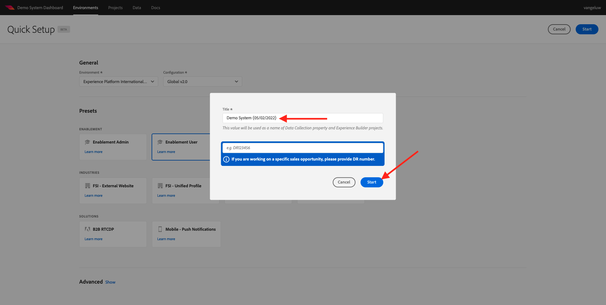

# 0.2 Utilizzare Demo System Next per configurare la proprietà client Adobe Experience Platform Data Collection

Dopo aver effettuato la registrazione al tutorial tecnico completo per Adobe Experience Platform, è disponibile un processo automatizzato che ti fornirà l’accesso a Demo System, in modo da poter accedere ed eseguire la configurazione seguente.

Una volta ottenuto l&#39;accesso a Demo System, procedi con i passaggi seguenti.

Vai a [https://dashboard.adobedemo.com/](https://dashboard.adobedemo.com/). Seleziona la sandbox e fai clic su **Configurazione rapida**.

Vedrai questo:

Sotto **Generale** - **Ambiente**, seleziona la tua istanza Adobe Experience Platform e la tua sandbox, in questo caso:

- **Experience Platform internazionale**
- **aepenablementfy22**
- Configurazione: selezionare **Global v2.0**

Quindi, seleziona il predefinito **Utente di abilitazione** e fai clic su **Inizio**.

Nella finestra a comparsa, immetti un nome per la proprietà Raccolta dati. Utilizza questa convenzione di denominazione: **Sistema di demo (GG/MM/AAAA)**. FYI: il tuo LDAP verrà aggiunto automaticamente, non devi aggiungerlo tu stesso.

Fai clic su **Avvia**.

Verrà quindi visualizzata questa finestra a comparsa che mostra lo stato di avanzamento durante la creazione di progetti di siti web e app mobili e le proprietà di raccolta dati.

Una volta completato il processo di configurazione rapida, avrai a disposizione:

- 1 Progetto Web Retail, che consente di utilizzare un sito web dimostrativo con il marchio demo Luma
- 1 Progetto Mobile Retail, che consente di utilizzare un’app mobile demo con il marchio demo Luma
- 1 Progetto CX App Retail, che consente di utilizzare un call center e un’app client con il marchio demo Luma
- 1 Proprietà di raccolta dati per il web, che utilizzerai per raccogliere dati dal sito web
- 1 Proprietà di raccolta dati per dispositivi mobili, che utilizzerai per raccogliere dati dall’app mobile

Tieni aperta questa schermata quando ne avrai bisogno nei passaggi successivi.

Passaggio successivo: [0.3 Creare il Datastream](./ex3.md)

[Torna al modulo 0](./getting-started.md)

[Torna a tutti i moduli](./../../overview.md)
