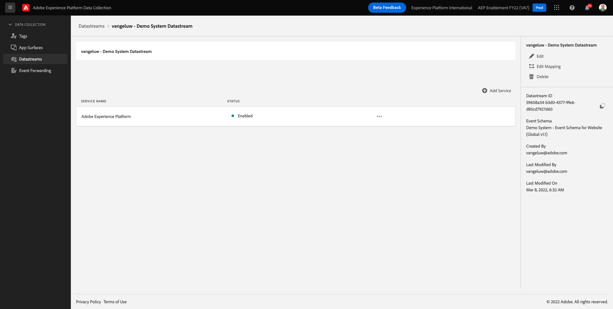

# 0.3 Creare il Datastream

Vai a [https://experience.adobe.com/#/data-collection/](https://experience.adobe.com/#/data-collection/). Dopo l’esercizio precedente, ora disponi di due proprietà di raccolta dati: uno per il web e uno per il mobile.

Queste proprietà sono quasi pronte per essere utilizzate, ma prima di poter iniziare a raccogliere dati utilizzando queste proprietà devi impostare un datastream. Otterrai maggiori informazioni sul concetto di ciò che un datastream è e cosa significa nell&#39;esercizio 1.2.

Per il momento, segui questi passaggi.

## 0.3.1 Creare il Datastream per Web

Fai clic su **[!UICONTROL Datastreams]** o **[!UICONTROL Datastreams (Beta)]**.

Nell’angolo in alto a destra dello schermo, seleziona il nome della sandbox, che deve essere `--aepSandboxId--`.

Fai clic su **[!UICONTROL Nuovo Datastream]**.

Per **[!UICONTROL Nome descrittivo]** e per la descrizione facoltativa, immetti `--demoProfileLdap-- - Demo System Datastream`. Per Schema evento, seleziona **Sistema demo - Schema evento per sito web (Global v1.1)**. Fai clic su **Salva**.

Vedrete questo. Fai clic su **Aggiungi servizio**.

Selezionare il servizio **[!UICONTROL Adobe Experience Platform]**, che esporrà campi aggiuntivi. Vedrete questo.

Per Set di dati evento, seleziona **Sistema di demo - Set di dati evento per il sito web (Global v1.1)** e per il set di dati profilo, seleziona **Sistema di demo - Set di dati di profilo per il sito web (Global v1.1)**. Fai clic su **Salva**.

Ora vedrete questo.

È tutto per ora. In [Modulo 1](./../module1/data-ingestion-launch-web-sdk.md) ulteriori informazioni su SDK per web e su come configurare tutte le sue funzionalità.

Nel menu a sinistra, fai clic su **[!UICONTROL Tag]**.

Filtra i risultati della ricerca per visualizzare le tue due proprietà di raccolta dati. Apri la proprietà per **Web** facendo clic su di essa.

Vedrete questo. Fai clic su **Estensioni**.

Nell’estensione Adobe Experience Platform Web SDK, fai clic su **Configura**.

Vedrete questo. Per **Datastreams**, al momento vedrai un valore fittizio impostato su 1. Ora devi fare clic sul pulsante **Scegli dall’elenco** pulsante di scelta. Nell’elenco a discesa , seleziona il Datastream creato in precedenza.

Assicurati di aver selezionato il **Datastream**. SUGGERIMENTO: Puoi filtrare facilmente i risultati nel menu a discesa digitando il tuo `--demoProfileLdap--`.

Scorri verso il basso fino a visualizzare **Raccolta dati**. Assicurati che la casella di controllo per **Abilita raccolta dati clic** non è abilitato. Fai clic su **Salva** per salvare le modifiche.

Vai a **Flusso di pubblicazione**.

Fai clic sul pulsante **...** per **Principale**, quindi fai clic su **Modifica**.

Fai clic su **Aggiungi tutte le risorse modificate** quindi fai clic su **Salva e genera per sviluppo**.

Le modifiche sono in fase di pubblicazione e saranno pronte tra un paio di minuti.

## 0.3.2 Creare il Datastream per Mobile

Vai a [https://experience.adobe.com/#/data-collection/](https://experience.adobe.com/#/data-collection/).

Fai clic su **[!UICONTROL Datastreams]** o **[!UICONTROL Datastreams (Beta)]**.

Nell’angolo in alto a destra dello schermo, seleziona il nome della sandbox, che deve essere `--aepSandboxId--`.

Fai clic su **[!UICONTROL Nuovo Datastream]**.

Per **[!UICONTROL Nome descrittivo]** e per la descrizione facoltativa, immetti `--demoProfileLdap-- - Demo System Datastream (Mobile)`. Per Schema evento, seleziona **Sistema demo - Schema evento per app mobile (versione globale 1.1)**. Fai clic su **Salva**.

Fai clic su **[!UICONTROL Salva]**.

Vedrete questo. Fai clic su **Aggiungi servizio**.

Selezionare il servizio **[!UICONTROL Adobe Experience Platform]**, che esporrà campi aggiuntivi. Vedrete questo.

Per Set di dati evento, seleziona **Sistema di demo - Set di dati evento per app mobile (Global v1.1)** e per il set di dati profilo, seleziona **Sistema di demo - Set di dati di profilo per app mobile (Global v1.1)**. Fai clic su **Salva**.

Vedrete questo.

Il Datastream è ora pronto per essere utilizzato nella proprietà del client di raccolta dati di Adobe Experience Platform per Mobile.

Vai a **Tag** e filtrare i risultati della ricerca per visualizzare le due proprietà di raccolta dati. Apri la proprietà per **Mobile** facendo clic su di essa.

Vedrete questo. Fai clic su **Estensioni**.

Sulla **Adobe Experience Platform Edge Network** estensione, fai clic su **Configura**.

Vedrete questo. Ora devi selezionare la sandbox e il datastream corretti che hai appena configurato. La sandbox da utilizzare è `--aepSandboxId--` e il datastream è chiamato `--demoProfileLdap-- - Demo System Datastream (Mobile)`.

Per **Dominio di rete Edge**, utilizza il dominio predefinito **edge.adobedc.net**.

Fai clic su **Salva** per salvare le modifiche.

Vai a **Flusso di pubblicazione**.

Fai clic sul pulsante **...** accanto a **Principale**, quindi fai clic su **Modifica**.

Fai clic su **Aggiungi tutte le risorse modificate**, quindi fai clic su **Salva e genera per sviluppo**.

Le modifiche sono in fase di pubblicazione e saranno pronte tra un paio di minuti.

Passaggio successivo: [0.4 Utilizzare il sito web](./ex4.md)

[Torna al modulo 0](./getting-started.md)

[Torna a tutti i moduli](./../../overview.md)