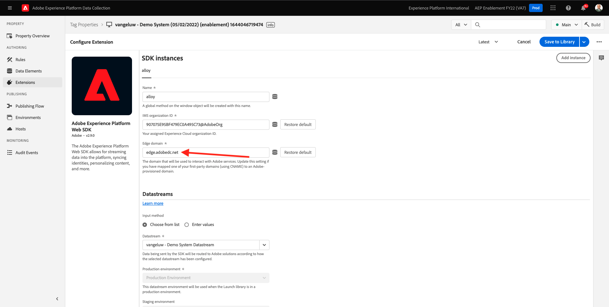
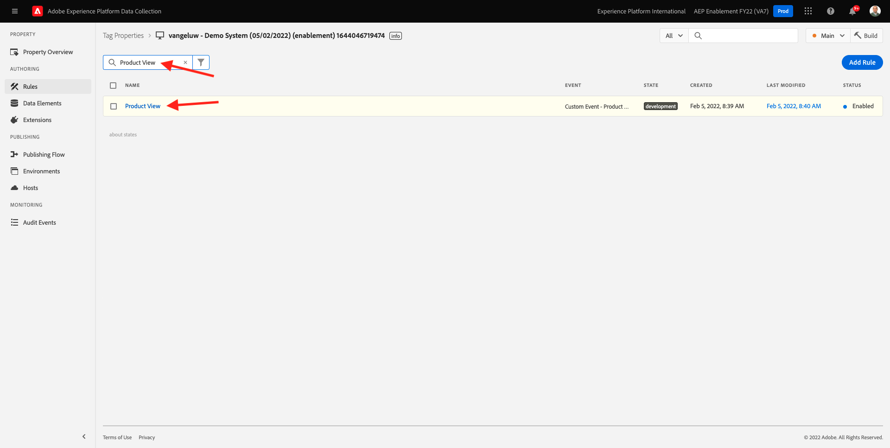

# 1.3 - Introduzione alla raccolta dati di Adobe Experience Platform

## Contesto

Ora diamo un&#39;occhiata più approfondita agli elementi di base della raccolta dati di Adobe Experience Platform, per capire cosa è installato sul tuo sito web dimostrativo. Potrai esaminare più da vicino l’estensione Adobe Experience Platform Web SDK, configurare un elemento dati e una regola e scoprire come pubblicare una libreria.

## 1.3.1 - Estensione Adobe Experience Platform Web SDK

Un&#39;estensione è un set di codice che estende l&#39;interfaccia di raccolta dati di Adobe Experience Platform e la funzionalità della libreria. Adobe Experience Platform Data Collection è la piattaforma e le estensioni sono simili alle app eseguite sulla piattaforma. Tutte le estensioni utilizzate nell’esercitazione vengono create e gestite da Adobe, ma terze parti possono creare estensioni personalizzate per limitare la quantità di codice personalizzato che gli utenti devono gestire per la raccolta dati di Adobe Experience Platform.

Vai a [Raccolta dati Adobe Experience Platform](https://experience.adobe.com/launch/) e seleziona **Tag**.

Questa è la pagina Proprietà raccolta dati di Adobe Experience Platform che hai visto prima.

Nel modulo 0, Demo System ha creato due proprietà Client: uno per il sito web e uno per l’app mobile. Trovarli cercando `--demoProfileLdap--` in **[!UICONTROL Ricerca]** scatola.

Apri **Web** proprietà.

Viene quindi visualizzata la pagina Panoramica proprietà . Fai clic su **[!UICONTROL Estensioni]** nella barra a sinistra. Fai clic sul pulsante **[!UICONTROL Configura]** nell&#39;estensione Adobe Experience Platform Web SDK.

Benvenuto nell’SDK web per Adobe Experience Platform! Qui puoi configurare l&#39;estensione con il Datastream creato in [Esercizio 0.2](./../module0/ex2.md) nonché una configurazione più avanzata. Verranno configurate solo due impostazioni per questo esercizio.

Il dominio Edge predefinito è sempre **edge.adobedc.net**. Se hai implementato una configurazione CNAME nel tuo ambiente Adobe Experience Cloud o Adobe Experience Platform, dovrai aggiornare la **[!UICONTROL Dominio Edge]**. L&#39;istanza Adobe Experience Platform utilizza questo dominio Edge: `--webSdkEdgeDomain--`.

Se il dominio Edge dell’istanza è diverso da quello predefinito, aggiorna il dominio Edge. Un dominio Edge consente di configurare un server di tracciamento di prima parte che utilizza una configurazione CNAME nel back-end per garantire la raccolta dei dati in Adobe.

Ora, assicurati che **[!UICONTROL Scegli dall’elenco]** il pulsante di scelta è selezionato sotto **[!UICONTROL Datastreams]** e seleziona il datastream denominato: `--demoProfileLdap-- - Demo System Datastream`dall&#39;elenco **[!UICONTROL Datastream]** scatola.

Fai clic su **[!UICONTROL Salva]** per tornare alla vista Estensioni.

## 1.3.2 Elementi dati

Gli elementi dati sono i blocchi costitutivi per il dizionario dati (o mappa dati). Utilizza elementi dati per raccogliere, organizzare e distribuire dati in tutta la tecnologia marketing e pubblicitaria.

Un singolo elemento dati è una variabile il cui valore può essere mappato alle stringhe di query, agli URL, ai valori dei cookie, alle variabili JavaScript e così via. È possibile fare riferimento a questo valore in base al nome della variabile in Adobe Experience Platform Data Collection. Questa raccolta di elementi dati diventa il dizionario dati definiti che è possibile utilizzare per creare le regole (eventi, condizioni e azioni). Questo dizionario dati viene condiviso in tutta la raccolta dati di Adobe Experience Platform per l&#39;utilizzo con qualsiasi estensione aggiunta alla proprietà.

Ora modificherai un elemento dati già esistente in un formato compatibile con l’SDK per web.

Fai clic su Elementi dati nella barra a sinistra per passare alla pagina Elementi dati .

>[!NOTE]
>
>Stai modificando solo un elemento dati in questo esercizio, ma puoi visualizzare il **[!UICONTROL Aggiungi elemento dati]** in questa pagina, che verrebbe utilizzata per aggiungere una nuova variabile al dizionario dati. Questo può quindi essere utilizzato in tutta la raccolta dati di Adobe Experience Platform. Puoi guardare liberamente alcuni degli altri elementi di dati già esistenti, principalmente utilizzando l’archiviazione locale come origine dati.

Nella barra di ricerca, digita **XDM - Visualizzazione prodotto** e fai clic sull’elemento dati che restituisce.

Questa schermata mostra l’oggetto XDM che verrà modificato. Experience Data Model (XDM) è un concetto che verrà esplorato ulteriormente in questa esercitazione tecnica, ma per il momento è sufficiente comprenderlo come formato richiesto dall’SDK per web di Adobe Experience Platform. Aggiungerai un po&#39; più di informazioni ai dati raccolti sulle pagine Articolo del sito web demo.

Fai clic sul pulsante più accanto a **web** in fondo all&#39;albero.

Fai clic sul pulsante più accanto a **webPageDetails**.

Fai clic su **siteSection**. Ora lo vedi **siteSection** non è ancora collegato ad alcun elemento dati. Cambiamolo.

Scorri verso l’alto e immetti il testo `%Product Category%`. Fai clic su **[!UICONTROL Salva]**.

A questo punto, l&#39;estensione Adobe Experience Platform Web SDK è installata e hai aggiornato un elemento dati per raccogliere i dati rispetto a una struttura XDM. Quindi, controlliamo le regole che invieranno i dati al momento corretto.

## 1.3.3 Regole

Adobe Experience Platform Data Collection è un sistema basato su regole. Cerca l&#39;interazione con l&#39;utente e i dati associati. Quando i criteri descritti nelle tue regole vengono soddisfatti, la regola attiva l&#39;estensione, lo script o il codice lato client identificato.

Genera le regole per integrare dati e funzionalità di tecnologie marketing e annunci che unificano prodotti diversi in un&#39;unica soluzione.

Suddividiamo la regola che invia dati sulle pagine dell&#39;articolo.

Fai clic su **[!UICONTROL Regole]** nella barra a sinistra.

**[!UICONTROL Ricerca]** per `Product View`.

Fai clic sulla regola restituita.

Diamo un&#39;occhiata ai singoli elementi che compongono questa regola. Per tutte le regole Se specificato **[!UICONTROL Evento]** si verifica, **[!UICONTROL Condizioni]** vengono valutati, quindi il **[!UICONTROL Azioni]** se necessario.

Fai clic sull’evento **Evento personalizzato - Visualizzazione prodotto**. Questa è la visualizzazione che viene caricata.

Fai clic sul pulsante **Tipo evento** a discesa.

In questo elenco sono elencate alcune delle interazioni standard che puoi utilizzare per segnalare ad Adobe Experience Platform Data Collection di eseguire le azioni, se le condizioni sono soddisfatte.

Fai clic su **[!UICONTROL Annulla]** per tornare alla regola.

Fai clic sull’azione **Invia evento &quot;Visualizzazione prodotto&quot; ad AEP**.

Qui puoi vedere i dati che vengono inviati ad Adobe Edge dall’SDK Web di Adobe Experience Platform. In particolare, si utilizza il **lega** **[!UICONTROL Istanza]** dell&#39;SDK web. Impostazione di un altro **[!UICONTROL Istanza]** consentirebbe, tra l&#39;altro, l&#39;utilizzo di diversi Datastreams. Hai specificato l&#39;evento **[!UICONTROL Tipo]** come **commerce.productViews** e i dati XDM che invii sono i **XDM - Visualizzazione prodotto** elemento dati modificato in precedenza.

Dopo aver esaminato la regola, puoi pubblicare tutte le modifiche in Raccolta dati di Adobe Experience Platform.

## 1.3.4 Pubblicazione in una libreria

Infine, per convalidare la regola e l’elemento dati appena aggiornato, devi pubblicare una libreria contenente gli elementi modificati nella nostra proprietà. Sono disponibili alcuni passaggi rapidi da eseguire nel **[!UICONTROL Pubblicazione]** sezione della raccolta dati di Adobe Experience Platform.

Fai clic su **[!UICONTROL Flusso di pubblicazione]** nella navigazione a sinistra

Fai clic sulla libreria esistente, denominata **Principale**.

Fai clic sul pulsante **Aggiungi tutte le risorse modificate** pulsante .

Scorri verso il basso per visualizzare la maggior parte delle risorse che rimarranno come **Revisione 1 (ultima)** Ma i due che abbiamo cambiato - **Elemento dati: ruleArticlePages** e **Estensione: Adobe Experience Platform Web SDK** sarà contrassegnato con **Più recente**.

Fai clic sul pulsante **Salva e genera per sviluppo** pulsante .

La libreria potrebbe richiedere alcuni minuti per la creazione e, una volta completata, verrà visualizzato un punto verde a sinistra del nome della libreria.

Come puoi vedere nella schermata Flusso di pubblicazione, il processo di pubblicazione in Adobe Experience Platform Data Collection contiene molto di più, oltre all’ambito di questa esercitazione. Useremo una singola libreria nel nostro ambiente di sviluppo.

Passaggio successivo: [1.4 Raccolta dati web lato client](./ex4.md)

[Torna al modulo 1](./data-ingestion-launch-web-sdk.md)

[Torna a tutti i moduli](./../../overview.md)
