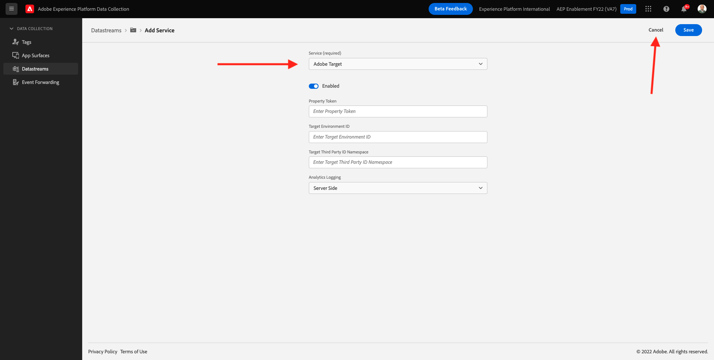

# 1.6 Implementare Adobe Target

## 1.6. Aggiorna il tuo Datastream per utilizzare Adobe Target

Se desideri inviare ad Adobe Target i dati raccolti dall’SDK per web e ottenere una risposta da Adobe Target con un’esperienza personalizzata per ogni cliente, segui questi passaggi.

Vai a [https://experience.adobe.com/launch/](https://experience.adobe.com/launch/) e vai a **Datastreams**.

Nell’angolo in alto a destra dello schermo, seleziona il nome della sandbox, che deve essere `--aepSandboxId--`. Apri il tuo datastream specifico, denominato `--demoProfileLdap-- - Demo System Datastream`.

Vedrete questo. Per abilitare Adobe Target, fai clic su **+Aggiungi servizio**.

Vedrete questo. Selezionare il servizio **Adobe Target**, dopo di che puoi facoltativamente fornire ulteriori informazioni. In questo momento, non è necessario salvarlo, quindi fai clic su **Annulla**.

Passaggio successivo: [Requisiti dello schema XDM 1.7 in Adobe Experience Platform](./ex7.md)

[Torna al modulo 1](./data-ingestion-launch-web-sdk.md)

[Torna a tutti i moduli](./../../overview.md)
