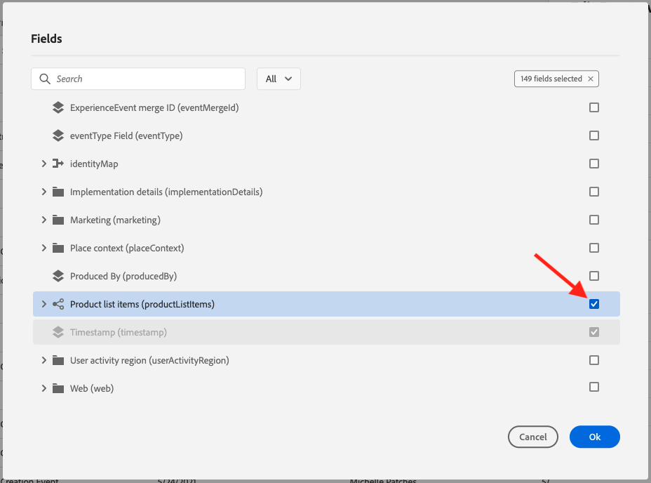
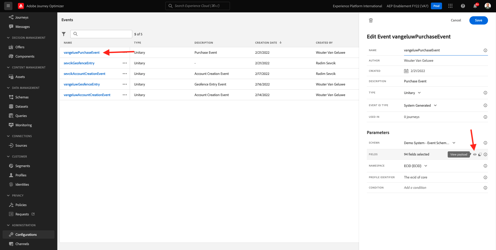
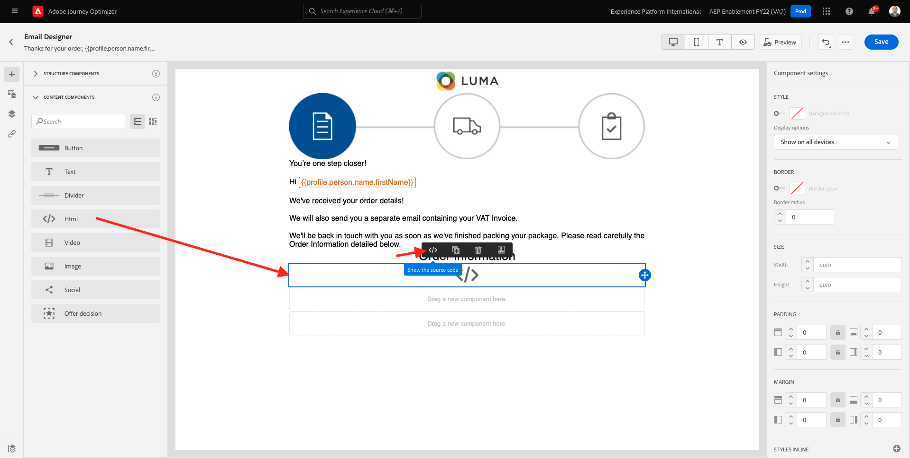
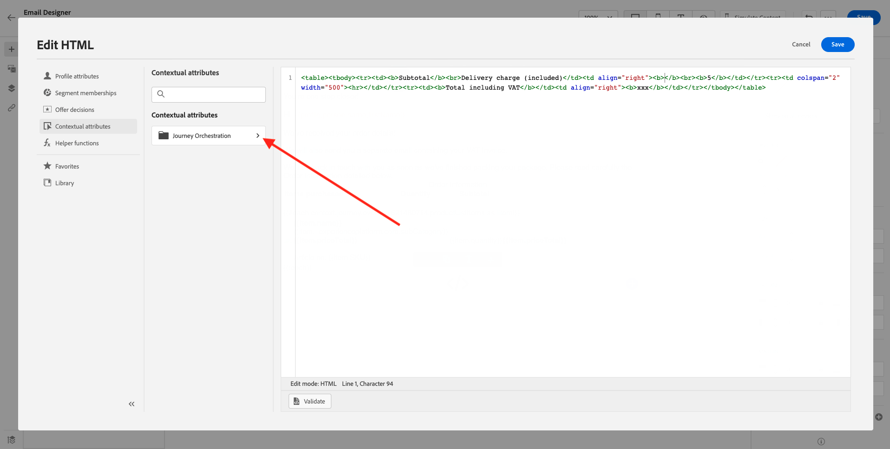
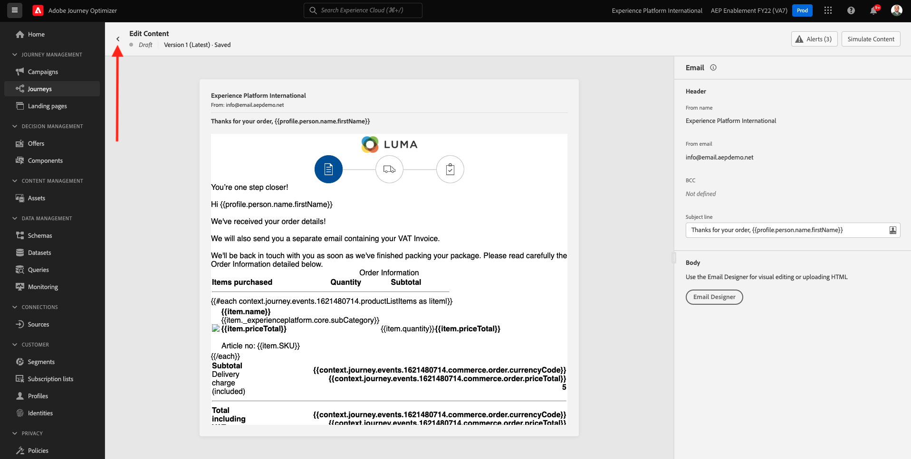
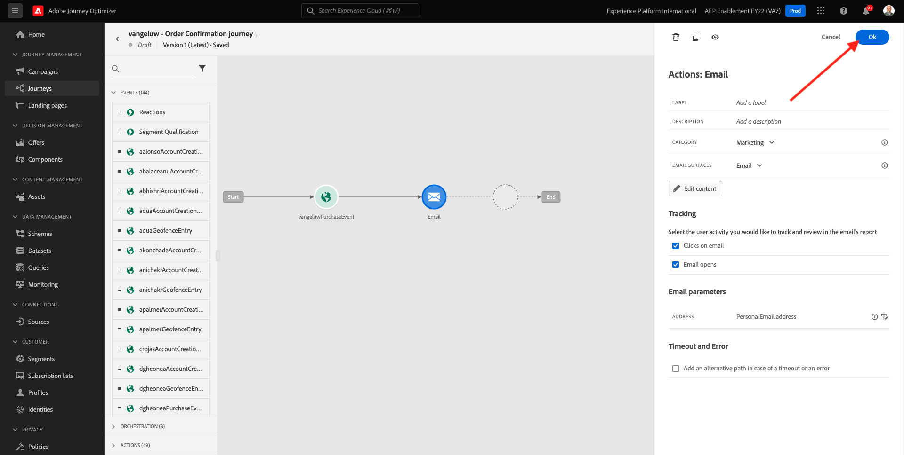

# 10.1 Configurare un percorso basato su trigger - Conferma ordine

Accedi a Adobe Journey Optimizer accedendo a [Adobe Experience Cloud](https://experience.adobe.com). Fai clic su **Journey Optimizer**.


Verrai reindirizzato al **Pagina principale**  in Journey Optimizer. In primo luogo, assicurati di utilizzare la sandbox corretta. La sandbox da utilizzare è denominata `--aepSandboxId--`. Per passare da una sandbox all’altra, fai clic su **PROD DI PRODUZIONE (VA7)** e selezionate la sandbox dall’elenco. In questo esempio, la sandbox è denominata **Abilitazione AEP FY22**. Allora sarai nel **Pagina principale** visualizzazione della sandbox `--aepSandboxId--`.


## 10.1.1 Creare l’evento

Nel menu , vai a **Configurazioni** e fai clic su **Gestisci** sotto **Eventi**.


Sulla **Eventi** viene visualizzata una visualizzazione simile a questa. Fai clic su **Crea evento**.


Verrà quindi visualizzata una configurazione di evento vuota.


Prima di tutto, dai al tuo Evento un Nome come questo: `--demoProfileLdap--PurchaseEvent`e aggiungi una descrizione come questa: `Purchase Event`.


Successivo è il **Tipo evento** selezione. Seleziona **Unitario**.


Successivo è il **Tipo ID evento** selezione. Seleziona **Sistema generato**


Segue la selezione dello schema. È stato preparato uno schema per questo esercizio. Utilizzare lo schema `Demo System - Event Schema for Website (Global v1.1) v.1`.


Dopo aver selezionato lo schema, nella sezione **Payload** sezione . Fai clic sul pulsante **Modifica/Matita** per aggiungere altri campi a questo evento.


Vedrete questa finestra a comparsa. È ora necessario selezionare caselle di controllo aggiuntive per accedere ai dati aggiuntivi quando questo evento viene attivato.


Prima di tutto, seleziona la casella di controllo sulla riga `--aepTenantId--`.


Quindi, scorri verso il basso e spunta la casella di controllo sulla riga `productListItems`.



Quindi, scorri verso il basso e spunta la casella di controllo sulla riga `commerce`.


Quindi, fai clic su **Ok**.

Vedrai che all’evento sono stati aggiunti altri campi. Fai clic su **Salva**.


Il nuovo evento viene quindi condiviso e l’evento verrà visualizzato nell’elenco degli eventi disponibili.

Fai di nuovo clic sull&#39;evento per aprire **Modifica evento** schermo di nuovo.
Passa il puntatore del mouse **Payload** per visualizzare di nuovo le 3 icone. Fai clic sul pulsante **Visualizza payload** icona.



Viene ora visualizzato un esempio del payload previsto. L&#39;evento dispone di un ID evento di orchestrazione univoco, che è possibile trovare scorrendo in quel payload fino a quando non viene visualizzato `_experience.campaign.orchestration.eventID`.


L’ID evento è ciò che deve essere inviato a Adobe Journey Optimizer per attivare il percorso da generare nel passaggio successivo. Annota questo eventID, in quanto ne avrai bisogno in uno dei passaggi successivi.
`"eventID": "ef6dd943c94fe1b4763c098ccd1772344662f2a9f614513106cb5ada8be36857"`

Fai clic su **Ok**, seguita da **Annulla**.

L’evento è ora configurato e pronto per essere utilizzato.

## 10.1.2 Crea il tuo percorso

Nel menu , vai a **Percorsi** e fai clic su **Crea Percorso**.


Vedrete questo. Dai un nome al tuo percorso. Seleziona `--demoProfileLdap-- - Order Confirmation journey`. Fai clic su **OK**.


Innanzitutto, devi aggiungere l’evento come punto di partenza del percorso. Cerca l&#39;evento `--demoProfileLdap--PurchaseEvent` e trascinarlo nell&#39;area di lavoro. Fai clic su **OK**.


Successivamente, sotto **Azioni**, cerca il **E-mail** e aggiungerlo all’area di lavoro.


Imposta la **Categoria** a **Marketing** e seleziona una superficie e-mail che ti consente di inviare e-mail. In questo caso, la superficie dell’e-mail da selezionare è **E-mail**. Assicurati che le caselle di controllo per **Clic su e-mail** e **aperture e-mail** sono entrambi abilitati.


Il passaggio successivo consiste nel creare il messaggio. A tale scopo, fai clic su **Modifica contenuto**.


Ora vedete questo. Fai clic sul pulsante **Linea oggetto** campo di testo.


Nell’area di testo inizia la scrittura **Grazie per il tuo ordine,**


L&#39;oggetto non è ancora stato completato. Ora devi inserire il token di personalizzazione per il campo **Nome** che è immagazzinato in `profile.person.name.firstName`. Nel menu a sinistra, scorri verso il basso per trovare il **Persona** > **Nome completo** >  **Nome** e fai clic sul **+** per aggiungere il token di personalizzazione alla riga dell’oggetto. Fai clic su **Salva**.


Allora tornerai qui. Fai clic su **E-mail Designer** per creare il contenuto dell’e-mail.


Nella schermata successiva, fai clic su **Progettazione da zero**.


Nel menu a sinistra trovi i componenti struttura che puoi utilizzare per definire la struttura dell’e-mail (righe e colonne).

Trascinare 8 volte a **Colonna 1:1** sulla tela, che dovrebbe darvi questo:


Vai a **Componenti contenuto**.


Trascina e rilascia una **Immagine** nella prima riga. Fai clic su **Sfoglia**.


Vai alla cartella **enablement-assets**, seleziona il file **luma-logo.png** e fai clic su **Seleziona**.


È tornato qui adesso. Fai clic sull’immagine per selezionarla e quindi utilizza la **Dimensione** per ridurre leggermente l’immagine del logo.


Vai a **Componenti contenuto** e trascinare un **Immagine** nella seconda riga. Seleziona la **Componente immagine** MA NON fare clic su Sfoglia.


Incolla l&#39;immagine nel campo **Origine**: `https://parsefiles.back4app.com/hgJBdVOS2eff03JCn6qXXOxT5jJFzialLAHJixD9/29043bedcde632a9cbe8a02a164189c9_preparing.png`. Questa immagine è ospitata all&#39;esterno di Adobe.


Quando cambi l’ambito in un altro campo, l’immagine viene riprodotta e vedrai quanto segue:


Quindi, vai a **Componenti contenuto** e trascina e rilascia una **Testo** nella terza riga.


Selezionare il testo predefinito nel componente **Digitare il testo qui.** e sostituirlo con il testo seguente:

```javascript
You’re one step closer!

Hi 

We've received your order details!

We will also send you a separate email containing your VAT Invoice.

We'll be back in touch with you as soon as we've finished packing your package. Please read carefully the Order Information detailed below.
```


Posizionare il cursore accanto al testo **Ciao** e fai clic su **Aggiungi personalizzazione**.


Passa a **Persona** > **Nome completo** > **Nome** e fai clic sul **+** per aggiungere il token di personalizzazione alla riga dell’oggetto. Fai clic su **Salva**.


Vedrai questo:


Quindi, vai a **Componenti contenuto** e trascina e rilascia una **Testo** nella quarta riga.


Selezionare il testo predefinito nel componente **Digitare il testo qui.** e sostituirlo con il testo seguente:

`Order Information`

Modifica la dimensione del font in **26 px** e centra il testo in questa cella. A quel punto avrai questo:


Quindi, vai a **Componenti contenuto** e trascinare un **HTML** nella quinta riga. Fai clic sul componente HTML , quindi fai clic su **Mostra il codice sorgente**.



In **Modifica HTML** popup, incolla questo HTML:

```<table><tbody><tr><td><b>Items purchased</b></td><td></td><td><b>Quantity</b></td><td><b>Subtotal</b></td></tr><tr><td colspan="4" width="500"><hr></td></tr></tbody></table>```

Fai clic su **Salva**.


Poi avrai questo. Fai clic su **Salva** per salvare i progressi.


Vai a **Componenti contenuto** e trascinare un **HTML** componente sulla sesta riga. Fai clic sul componente HTML , quindi fai clic su **Mostra il codice sorgente**.


In **Modifica HTML** popup, incolla questo HTML:

```{{#each xxx as |item|}}<table width="500"><tbody><tr><td></td><td><table><tbody><tr><td><b>{{item.name}}</b><br>{{item.--aepTenantId--.core.subCategory}}<br><b>{{item.priceTotal}}</b><br>&nbsp;<br>Article no: {{item.SKU}}</td></tr></tbody></table></td><td>{{item.quantity}}</td><td><b>{{item.priceTotal}}</b></td></tr></tbody></table>{{/each}}```

A quel punto avrai questo:


È ora necessario sostituire **xxx** mediante un riferimento all&#39;oggetto productListItems che fa parte dell&#39;evento che attiva il percorso.


Per prima cosa, elimina **xxx** prima nel codice HTML.


Nel menu a sinistra, fai clic su **Attributi contestuali**. Questo contesto viene trasmesso al messaggio dal percorso.


Vedrete questo. Fai clic sulla freccia accanto a **Journey Orchestration** per approfondire.


Fai clic sulla freccia accanto a **Eventi** per approfondire.


Fai clic sulla freccia accanto a `--demoProfileLdap--PurchaseEvent` per approfondire.


Fai clic sulla freccia accanto a **productListItems** per approfondire.


Fai clic sul pulsante **+** accanto a **Nome** per aggiungerlo all’area di lavoro. Poi avrai questo. Ora devi selezionare  **.name** come indicato nella schermata seguente, e quindi devi rimuovere **.name**.


Poi avrai questo. Fai clic su **Salva**.


Ora tornerai a utilizzare E-mail Designer. Fai clic su **Salva** per salvare i progressi.


Quindi, vai a **Componenti contenuto** e trascinare un **HTML** componente sulla settima riga. Fai clic sul componente HTML , quindi fai clic su **Mostra il codice sorgente**.


In **Modifica HTML** popup, incolla questo HTML:

```<table><tbody><tr><td><b>Subtotal</b><br>Delivery charge (included)</td><td align="right"><b>xxx</b><br><b>5</b></td></tr><tr><td colspan="2" width="500"><hr></td></tr><tr><td><b>Total including VAT</b></td><td align="right"><b>xxx</b></td></tr></tbody></table>```

Ci sono 2 riferimenti di **xxx** in questo codice HTML. È ora necessario sostituire ciascuna **xxx** mediante un riferimento all&#39;oggetto productListItems che fa parte dell&#39;evento che attiva il percorso.


Innanzitutto, elimina il primo **xxx** nel codice HTML.


Nel menu a sinistra, fai clic su **Attributi contestuali**.


Fai clic sulla freccia accanto a **Journey Orchestration** per approfondire.



Fai clic sulla freccia accanto a **Eventi** per approfondire.


Fai clic sulla freccia accanto a `--demoProfileLdap--PurchaseEvent` per approfondire.


Fai clic sulla freccia accanto a **Commerce** per approfondire.


Fai clic sulla freccia accanto a **Ordine** per approfondire.


Fai clic sul pulsante **+** accanto a **Totale prezzo** per aggiungerlo all’area di lavoro.


Poi avrai questo. Elimina il secondo **xxx** nel codice HTML.


Fai clic sul pulsante **+** accanto a **Totale prezzo** per aggiungerlo nuovamente all&#39;area di lavoro.


Puoi anche aggiungere il campo **Valuta** dall&#39;interno del **Ordine** sull&#39;area di lavoro, come potete vedere qui.
Al termine, fai clic su **Salva** per salvare le modifiche.


A questo punto potrai tornare a E-mail Designer. Fai clic su **Salva** di nuovo.


Torna al dashboard dei messaggi facendo clic sul pulsante **freccia** accanto all’oggetto nell’angolo in alto a sinistra.


Fai clic sulla freccia nell&#39;angolo in alto a sinistra per tornare al percorso.



Fai clic su **Ok** per chiudere l’azione e-mail.



Fai clic su **Pubblica** per pubblicare il percorso.


Fai clic su **Pubblica** di nuovo.


Il percorso è ora pubblicato.


## 10.1.5 Aggiornare la proprietà client di raccolta dati di Adobe Experience Platform

Vai a [Raccolta dati Adobe Experience Platform](https://experience.adobe.com/launch/) e seleziona **Tag**.

Questa è la pagina Proprietà raccolta dati di Adobe Experience Platform che hai visto prima.


Nel modulo 0, Demo System ha creato due proprietà Client: uno per il sito web e uno per l’app mobile. Trovarli cercando `--demoProfileLdap--` in **[!UICONTROL Ricerca]** scatola. Fai clic per aprire **Web** proprietà.


Vai a **Elementi dati**. Cerca e apri l’elemento dati **XDM - Acquisto**.


Vedrete questo. Passa al campo . **_experience.campaign.orchestration.eventID** e compila il tuo eventID qui. L&#39;ID evento da compilare qui è l&#39;ID evento creato come parte dell&#39;esercizio 10.1.2. Fai clic su **Salva** o **Salva nella libreria**.


Salva le modifiche nella proprietà Client e pubblica le modifiche aggiornando la libreria di sviluppo.


Le modifiche sono ora implementate e possono essere testate.

## 10.1.6 Verifica l&#39;e-mail di conferma dell&#39;ordine utilizzando il sito web demo

Mettiamo alla prova il percorso aggiornato acquistando un prodotto sul sito web demo.

Vai a [https://builder.adobedemo.com/projects](https://builder.adobedemo.com/projects). Dopo aver effettuato l’accesso con il tuo Adobe ID, vedrai questo. Fai clic sul progetto del tuo sito web per aprirlo.


Sulla **Schermi** pagina, fai clic su **Esegui**.


Vedrai il tuo sito web demo aperto. Seleziona l’URL e copialo negli Appunti.


Apri una nuova finestra del browser in incognito.


Incolla l’URL del sito web dimostrativo che hai copiato nel passaggio precedente. Ti verrà quindi chiesto di effettuare l&#39;accesso utilizzando il tuo Adobe ID.


Seleziona il tipo di account e completa il processo di accesso.


Il sito web verrà quindi caricato in una finestra del browser in incognito. Per ogni dimostrazione, è necessario utilizzare una nuova finestra del browser in incognito per caricare l’URL del sito web demo.


Fai clic sull’icona del logo Adobe nell’angolo in alto a sinistra dello schermo per aprire il Visualizzatore profili.


Guarda il pannello Visualizzatore profili e il Profilo cliente in tempo reale con **ID Experience Cloud** come identificatore principale per questo cliente attualmente sconosciuto.


Vai alla pagina Registrazione/Accesso . Fai clic su **CREARE UN ACCOUNT**.


Inserisci i tuoi dati e fai clic su **Registro** dopo di che verrai reindirizzato alla pagina precedente.


Aggiungi qualsiasi prodotto al tuo carrello e vai al **Carrello** pagina. Fai clic su **Procedi al pagamento**.


Quindi, verifica i campi nella pagina di pagamento e fai clic su **Pagamento**.


Riceverai quindi l&#39;e-mail di conferma dell&#39;ordine entro pochi secondi.


Ha finito questo esercizio.

Passaggio successivo: [10.2 Configurare un percorso di newsletter basato su batch](./ex2.md)

[Torna al modulo 10](./journeyoptimizer.md)

[Torna a tutti i moduli](../../overview.md)
