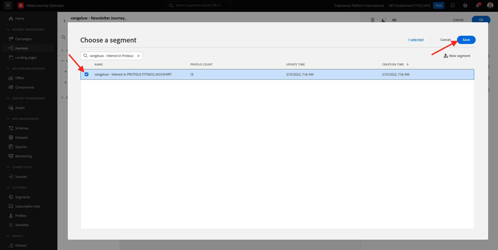

# 10.2 Configurare un percorso di newsletter basato su batch

Accedi a Adobe Journey Optimizer accedendo a [Adobe Experience Cloud](https://experience.adobe.com). Fai clic su **Journey Optimizer**.

Verrai reindirizzato al **Pagina principale**  in Journey Optimizer. In primo luogo, assicurati di utilizzare la sandbox corretta. La sandbox da utilizzare è denominata `--aepSandboxId--`. Per passare da una sandbox all’altra, fai clic su **PROD DI PRODUZIONE (VA7)** e selezionate la sandbox dall’elenco. In questo esempio, la sandbox è denominata **Abilitazione AEP FY22**. Allora sarai nel **Pagina principale** visualizzazione della sandbox `--aepSandboxId--`.

## 10.2.1 Creare un percorso di newsletter

Ora creerai un percorso basato su batch. A differenza del percorso basato su eventi dell’esercizio precedente che si basa su eventi di esperienza in arrivo o voci o uscite di segmenti per attivare un percorso per 1 cliente specifico, i percorsi basati su batch eseguono il targeting di un intero segmento una volta con contenuti univoci come newsletter, promozioni una tantum o informazioni generiche o periodicamente con contenuti simili inviati regolarmente, come ad esempio campagne di compleanno e promemoria.

Nel menu , vai a **Percorsi** e fai clic su **Crea Percorso**.

Sul lato destro viene visualizzato un modulo in cui è necessario specificare il nome e la descrizione del percorso. Immetti i seguenti valori:

- **Nome**: `--demoProfileLdap-- - Newsletter Journey`. Per esempio: **vangeluw - Percorso newsletter**.
- **Descrizione**: Newsletter mensile

Fai clic su **Ok**.

Sotto **Orchestrazione**, trascinamento **Leggi segmento** sulla tela. Ciò significa che, una volta pubblicato, il percorso inizierà recuperando l&#39;intero pubblico del segmento, che diventa il pubblico di destinazione del percorso e del messaggio. Fai clic su **Selezionare un segmento**.

In **Scegliere un segmento** a comparsa, cerca il tuo ldap e seleziona il segmento in cui hai creato [Modulo 6 - Real-time CDP - Creare un segmento e intervenire](../module6/real-time-cdp-build-a-segment-take-action.md) denominato `--demoProfileLdap-- - Interest in PROTEUS FITNESS JACKSHIRT`. ad esempio: vangeluw - Interesse in PROTEUS FITNESS JACKSHIRT. Fai clic su **Salva**.

Fai clic su **Ok**.

Nel menu a sinistra, trova la **Azioni** e trascina e rilascia una **E-mail** sull&#39;area di lavoro.

Imposta la **Categoria** a **Marketing** e seleziona una superficie e-mail che ti consente di inviare e-mail. In questo caso, la superficie dell’e-mail da selezionare è **E-mail**. Assicurati che le caselle di controllo per **Clic su e-mail** e **aperture e-mail** sono entrambi abilitati.

Il passaggio successivo consiste nel creare il messaggio. A tale scopo, fai clic su **Modifica contenuto**.

Ora vedete questo. Fai clic sul pulsante **Linea oggetto** campo di testo.

Inserisci questo testo per la riga dell’oggetto: `Luma Newsletter - your monthly update has arrived.`. Fai clic su **Salva**.

Allora tornerai qui. Fai clic su **E-mail Designer** per iniziare a creare il contenuto dell’e-mail.

Vedrete questo. Fai clic su **Importa HTML**.

Nella schermata a comparsa, dovrai trascinare il file HTML dell’e-mail. È possibile trovare il modello HTML [qui](../../assets/html/ajo-newsletter.html.zip). Scarica il file zip con il modello HTML sul computer locale e decomprimi il file sul desktop.

Trascina e rilascia il file **ajo-newsletter.html** per caricarlo in Journey Optimizer. Fai clic su **Importa**.

Questo contenuto e-mail è pronto perché contiene tutta la personalizzazione, le immagini e il testo previsti. Solo il segnaposto dell’offerta viene lasciato vuoto.

Potresti ricevere un messaggio di errore: **Errore durante il tentativo di recupero delle risorse**. Questo è collegato all’immagine nell’e-mail.

Se ricevi questo errore, seleziona l’immagine e fai clic sul pulsante **Modifica immagine** pulsante .

Fai clic su **Assets Essentials** per tornare alla libreria AEM Assets Essentials.

Vedrete questa finestra a comparsa. Passa alla cartella **enablement-assets** e seleziona l&#39;immagine **luma-newsletterContent.png**. Fai clic su **Seleziona**.

L’e-mail della newsletter di base è ora pronta. Fai clic su **Salva**.

Torna al dashboard dei messaggi facendo clic sul pulsante **freccia** accanto all’oggetto nell’angolo in alto a sinistra.

Fai clic sulla freccia nell&#39;angolo in alto a sinistra per tornare al percorso.

Fai clic su **Ok** per chiudere l’azione e-mail.

Il percorso della newsletter è ora pronto per essere pubblicato. Prima di farlo, noterai la **Pianificazione** in cui puoi passare da un percorso una tantum a una campagna ricorrente. Fai clic sul pulsante **Pianificazione** pulsante .

Vedrete questo. Seleziona **Una volta**.

Seleziona una data e un’ora entro l’ora successiva in modo da poter testare il percorso. Fai clic su **Ok**.

>[!NOTE]
>
>La data e l’ora di invio del messaggio devono essere entro più di un’ora.

Fai clic su **Pubblica**.

Fai clic su **Pubblica** di nuovo.

Il percorso base della newsletter è stato pubblicato. Il messaggio e-mail della newsletter verrà inviato come è stato definito nella pianificazione e il percorso verrà interrotto non appena l’ultima e-mail è stata inviata.

Ha finito questo esercizio.

Passaggio successivo: [10.3 Applicare la personalizzazione in un messaggio e-mail](./ex3.md)

[Torna al modulo 10](./journeyoptimizer.md)

[Torna a tutti i moduli](../../overview.md)
