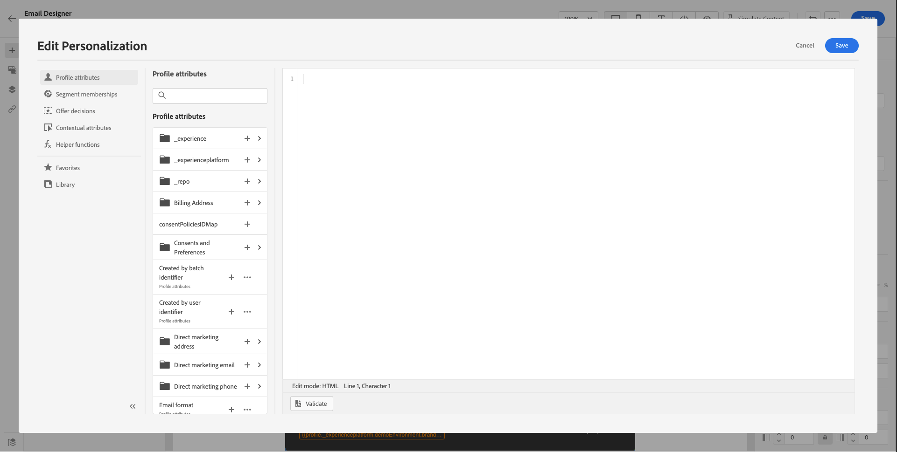

# 10.3 Applicare la personalizzazione in un messaggio e-mail

Accedi a Adobe Experience Cloud accedendo a [Adobe Experience Cloud](https://experience.adobe.com). Fai clic su **Adobe Journey Optimizer**.

Verrai reindirizzato al **Pagina principale** in Journey Optimizer. Prima di continuare, devi selezionare un **sandbox**. La sandbox da selezionare è denominata ``--aepTenantId--``. Per eseguire questa operazione, fai clic sul testo **[!UICONTROL Produzione Prod]** nella linea blu sopra lo schermo.

## 10.3.1 Personalizzazione basata su segmenti

In questo esercizio migliorerai il messaggio e-mail della newsletter con un testo personalizzato basato sull’appartenenza al segmento.

Vai a **Percorsi**. Trova il percorso di newsletter creato nell’esercizio precedente. Cerca `--demoProfileLdap-- - Newsletter`. Fai clic sul percorso per aprirlo.

Vedrete questo. Fai clic su **Duplica**.

Fai clic su ** Duplica**.

Seleziona la tua **E-mail** e fai clic su **Modifica contenuto**.

Fai clic su **E-mail Designer**.

Vedrete questo.

Apri **Componenti contenuto** e trascina un **Testo** sotto il contenuto della newsletter corrente.

Selezionare l’intero testo predefinito ed eliminarlo. Quindi fai clic sul pulsante **Aggiungi personalizzazione** nella barra degli strumenti.

Vedrai questo:

Nel menu a sinistra, fai clic su **Appartenenze ai segmenti**.

>[!NOTE]
>
>Se non riesci a trovare il segmento in questo elenco, scorri verso il basso per trovare istruzioni su come recuperare manualmente l’ID segmento.

Selezionare il segmento `Luma - Women's Category Interest` e fai clic su **+** , che dovrebbe avere questo aspetto:

È quindi necessario lasciare la prima riga così com&#39;è e sostituire le righe 2 e 3 con questo codice:

``
Psssst... a private sale in the women category will launch soon, we will keep you posted

Thanks for taking the time to read our newsletter. Here is a 10% promo code to use on the website: READER10

``

A quel punto avrai questo:

Fai clic su **Convalida** per verificare che il codice sia corretto. Fai clic su **Salva**.

Per salvare il messaggio, fai clic sul pulsante **Salva** nell&#39;angolo in alto a destra. Quindi, fai clic su **Simula contenuto**.

Seleziona uno dei profili creati come parte di questa esercitazione e fai clic su **Anteprima**. Verrà quindi visualizzato il risultato della configurazione.

Vedrete questo. Quindi, fai clic su **Chiudi**.

Torna al dashboard dei messaggi facendo clic sul pulsante **freccia** accanto all’oggetto nell’angolo in alto a sinistra.

Fai clic sulla freccia nell&#39;angolo in alto a sinistra per tornare al percorso.

Fai clic su **Ok** per chiudere l’azione e-mail.

Cambia il tuo **Pianificazione** a **Una volta** e definire un **Data/ora**. Fai clic su **Ok**.

>[!NOTE]
>
>La data e l’ora di invio del messaggio devono essere entro più di un’ora.

Fai clic sul pulsante **Pubblica** nel percorso.

Nella finestra a comparsa, fai clic su **Pubblica** di nuovo.

Il percorso base della newsletter è stato pubblicato. Il messaggio e-mail della newsletter verrà inviato in base alla pianificazione e il percorso si interromperà non appena l’ultima e-mail sarà stata inviata.

Ha finito questo esercizio.

Passaggio successivo: [10.4 Configurazione e utilizzo delle notifiche push per iOS](./ex4.md)

[Torna al modulo 10](./journeyoptimizer.md)

[Torna a tutti i moduli](../../overview.md)
