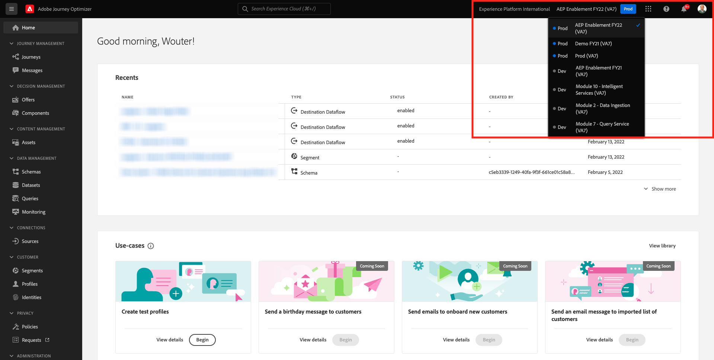
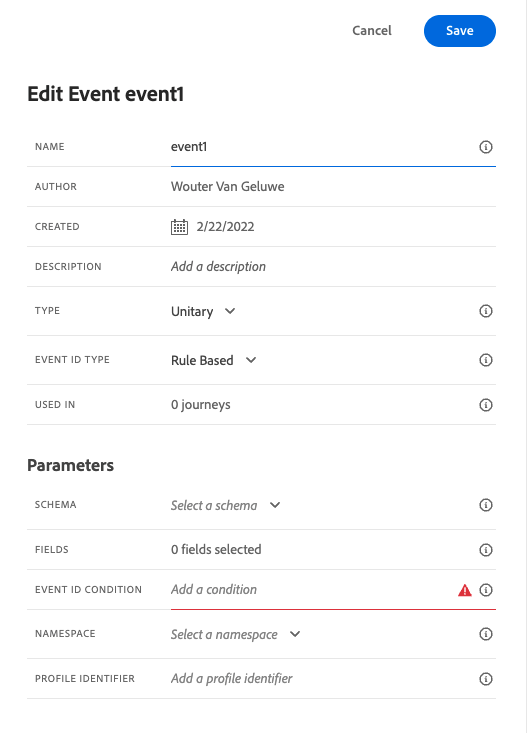
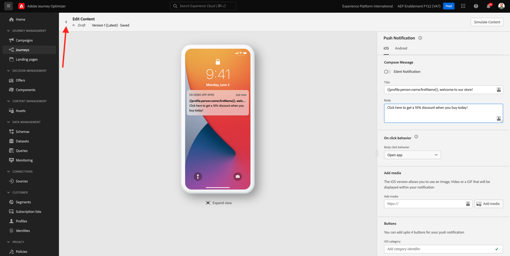

# 10.4 Configurazione e utilizzo delle notifiche push per iOS

Per utilizzare le notifiche push con Adobe Journey Optimizer, è necessario controllare e conoscere diverse impostazioni.

Di seguito sono riportate tutte le impostazioni da verificare:

- Set di dati e schemi in Adobe Experience Platform
- Datastream per dispositivi mobili
- Proprietà di raccolta dati per dispositivi mobili
- Superficie dell’app per i certificati push
- Verifica la configurazione push utilizzando AEP Assurance

Esaminiamo questi uno per uno.

Accedi a Adobe Journey Optimizer accedendo a [Adobe Experience Cloud](https://experience.adobe.com). Fai clic su **Journey Optimizer**.

Verrai reindirizzato al **Pagina principale**  in Journey Optimizer. In primo luogo, assicurati di utilizzare la sandbox corretta. La sandbox da utilizzare è denominata `--aepSandboxId--`. Per passare da una sandbox all’altra, fai clic su **PROD DI PRODUZIONE (VA7)** e selezionate la sandbox dall’elenco. In questo esempio, la sandbox è denominata **Abilitazione AEP FY22**. Allora sarai nel **Pagina principale** visualizzazione della sandbox `--aepSandboxId--`.

## Set di dati push 10.4.1

Adobe Journey Optimizer utilizza i set di dati per memorizzare elementi come i token push dai dispositivi mobili o le interazioni con i messaggi push (ad esempio: messaggio inviato, messaggio aperto, ecc.) in un set di dati in Adobe Journey Optimizer.

Puoi trovare questi set di dati andando in **[!UICONTROL Set di dati]** nel menu sul lato sinistro dello schermo. Per visualizzare i set di dati di sistema, fai clic sull’icona del filtro.

Abilita l’opzione . **Mostra set di dati di sistema** e cerca **AJO**. Vedrai quindi i set di dati utilizzati per le notifiche push.

## 10.4.2 Datastream per dispositivi mobili

Vai a [https://experience.adobe.com/#/data-collection/](https://experience.adobe.com/#/data-collection/).

Nel menu a sinistra, vai a **[!UICONTROL Datastream]** e cerca il tuo datastream creato in [Esercizio 0.2](./../module0/ex2.md), denominato `--demoProfileLdap-- - Demo System Datastream (Mobile)`. Fai clic su per aprirlo.

Fai clic su **Modifica** sulla **Adobe Experience Platform** servizio.

Vedrai quindi le impostazioni del datastream definite e in cui verranno memorizzati gli eventi dei set di dati e gli attributi del profilo.

Non sono necessarie modifiche, il datastream è ora pronto per essere utilizzato nella proprietà Data Collection Client per Mobile.

## 10.4.3 Rivedi la tua proprietà di raccolta dati per Mobile

Vai a [https://experience.adobe.com/#/data-collection/](https://experience.adobe.com/#/data-collection/). Come parte di [Esercizio 0.1](./../module0/ex1.md), sono state create 2 proprietà di raccolta dati.
Hai già utilizzato queste proprietà del client di raccolta dati come parte dei moduli precedenti.

Fai clic su per aprire la proprietà Raccolta dati per mobile.

Nella proprietà Raccolta dati, vai a **Estensioni**. Vedrai quindi le varie estensioni necessarie per l’app mobile. Fai clic per aprire l&#39;estensione **Adobe Experience Platform Edge Network**.

Vedrai che il tuo datastream per mobile è collegato qui. Quindi, fai clic su **Annulla** per tornare alla panoramica delle estensioni.

Tornerai qui. Verrà visualizzata l&#39;estensione per **Garanzia AEP**. AEP Assurance ti consente di controllare, provare, simulare e convalidare il modo in cui raccogli i dati o distribuisci le esperienze nella tua app mobile. Puoi trovare ulteriori informazioni su AEP Assurance e Project Griffon qui [https://aep-sdks.gitbook.io/docs/beta/project-griffon](https://aep-sdks.gitbook.io/docs/beta/project-griffon).

Quindi, fai clic su **Configura** per aprire l&#39;estensione **Adobe Journey Optimizer**.

Vedrai che qui è collegato il set di dati per il tracciamento degli eventi push.

Non è necessario apportare alcuna modifica alla proprietà Raccolta dati.

## 10.4.4 Esamina la configurazione della superficie dell’app

Vai a [https://experience.adobe.com/#/data-collection/](https://experience.adobe.com/#/data-collection/). Nel menu a sinistra, vai a **Superfici app** e apri, la superficie dell&#39;app per **APNS app Demo DX**.

Viene quindi visualizzata la superficie dell’app configurata per iOS e Android.

## 10.4.5 Verifica la configurazione della notifica push utilizzando AEP Assurance.

Una volta installata l’app, la troverai nella schermata iniziale del tuo dispositivo. Fai clic sull’icona per aprire l’app.

Quando utilizzi l’app per la prima volta, ti verrà richiesto di effettuare l’accesso utilizzando il tuo Adobe ID. Completa la procedura di accesso.

Dopo l’accesso, verrà visualizzata una notifica in cui si richiede l’autorizzazione per l’invio di notifiche. Invieremo notifiche come parte dell’esercitazione, quindi fai clic su **Consenti**.

Viene quindi visualizzata la home page dell’app. Vai a **Impostazioni**.

Nelle impostazioni, viene visualizzato un **Progetto pubblico** viene caricato nell’app. Fai clic su **Progetto personalizzato**.

Ora puoi caricare un progetto personalizzato. Fai clic sul codice QR per caricare facilmente il progetto.

Dopo l&#39;esercizio 0.1, si ottenne questo risultato. Fai clic per aprire **Progetto Mobile Retail** è stato creato per te.

Nel caso in cui tu abbia accidentalmente chiuso la finestra del tuo browser, o per sessioni future di dimostrazione o abilitazione, puoi anche accedere al tuo progetto web andando [https://builder.adobedemo.com/projects](https://builder.adobedemo.com/projects). Dopo aver effettuato l’accesso con il tuo Adobe ID, vedrai questo. Fai clic sul progetto della tua app mobile per aprirlo.

Vedrete questo. Fai clic su **Integrazioni**.

Selezionare la proprietà Raccolta dati per il dispositivo mobile creato nell&#39;esercizio 0.1. Successivamente, fare clic su **Esegui**.

Vedrai questa finestra a comparsa, che contiene un codice QR. Analizza questo codice QR dall&#39;interno dell&#39;app mobile.

Quindi vedrai l&#39;ID del progetto nell&#39;app, dopodiché puoi fare clic su **Salva**.

Ora, torna a **Pagina principale** nell’app. L’app è ora pronta per l’uso.

È ora necessario eseguire la scansione di un codice QR per collegare il dispositivo mobile alla sessione AEP Assurance.

Per avviare una sessione di AEP Assurance, vai a [https://experience.adobe.com/#/@experienceplatform/griffon](https://experience.adobe.com/#/@experienceplatform/griffon). Fai clic su **Crea sessione**.

Fai clic su **Avvia**.

Compila i valori seguenti:

- Nome sessione: use `--demoProfileLdap-- - push debugging` e sostituisci ldap con il tuo ldap
- URL di base: use **dxdemo://default**

Fai clic su **Avanti**.

Verrà quindi visualizzato un codice QR sullo schermo, che sarà necessario scansionare con il dispositivo iOS.

Sul tuo dispositivo mobile, apri l&#39;app della fotocamera e scansiona il codice QR visualizzato da AEP Assurance.

Verrà visualizzata una finestra a comparsa in cui viene richiesto di inserire il codice PIN. Copia il codice PIN dalla schermata AEP Assurance e fai clic su **Connetti**.

Vedrete questo.

In AEP Assurance, vedrai ora che un dispositivo è alla sessione di AEP Assurance.

Vai a **Debug push**. Vedrete qualcosa del genere.

Qualche spiegazione:

- La prima colonna, **Client** mostra gli identificatori disponibili sul dispositivo iOS. Vedrai un ECID e un token push.
- La seconda colonna mostra **Profilo** informazioni, con informazioni aggiuntive su quale piattaforma vive il token push (APNS o APNSSandbox). Se fai clic sul pulsante **Profilo Inspect** Verrai trasferito in Adobe Experience Platform e vedrai il Profilo del cliente in tempo reale completo.
- La terza colonna mostra le **Configurazione app**, istituito nell&#39;ambito dell&#39;esercizio **10.5.4 Creare la configurazione dell’app in Launch**

Per verificare la configurazione della configurazione push, fai clic sul pulsante **Invia notifica push** pulsante .

Devi accertarti che il **Demo DX** l&#39;app non è aperta al momento del clic sul pulsante **Invia notifica push** pulsante . Se l&#39;app è aperta, la notifica push potrebbe essere ricevuta in background e non sarebbe visibile.

Visualizzerai quindi una notifica push come questa sul tuo dispositivo mobile.

Se hai ricevuto la notifica push, significa che la configurazione è corretta e funziona correttamente.

## 10.4.6 Creare un nuovo evento

Nel menu , vai a **Amministrazione percorso** e fai clic su **Gestisci** sotto **Eventi**.

Sulla **Eventi** viene visualizzata una visualizzazione simile a questa. Fai clic su **Crea evento**.

Verrà quindi visualizzata una configurazione di evento vuota.

Prima di tutto, dai al tuo Evento un Nome come questo: `--demoProfileLdap--StoreEntryEvent` e imposta la descrizione su `Store Entry Event`.

Successivo è il **Tipo evento** selezione. Seleziona **Unitario**.

Successivo è il **Tipo ID evento** selezione. Seleziona **Sistema generato**

Segue la selezione dello schema. È stato preparato uno schema per questo esercizio. Utilizzare lo schema `Demo System - Event Schema for Mobile App (Global v1.1) v.1`.

Dopo aver selezionato lo schema, nella sezione **Payload** sezione . L&#39;evento è ora completamente configurato.

Dovresti vedere questo. Fai clic su **Salva**.

L’evento è ora configurato e salvato. Fai di nuovo clic sull&#39;evento per aprire **Modifica evento** schermo di nuovo.

Passa il puntatore del mouse **Payload** e fai clic sul **Visualizza payload** icona.

Viene ora visualizzato un esempio del payload previsto.

L’evento dispone di un ID evento di orchestrazione univoco, che puoi trovare scorrendo in quel payload fino a quando non vedi `_experience.campaign.orchestration.eventID`.

L’ID evento è ciò che deve essere inviato a Adobe Experience Platform per attivare il Percorso da generare nel passaggio successivo. Annota questo eventID, in quanto ne avrai bisogno nel passaggio successivo.
`"eventID": "e3a8f0bdc0b609667cd96a72a6b1e5aafa0ddaf6ccf121c574e6a2030860a633"`

Fai clic su **Ok**, seguita da **Annulla**.

## 10.4.7 Creare un percorso

Nel menu , vai a **Percorsi** e fai clic su **Crea Percorso**.

Vedrete questo. Dai un nome al tuo percorso. Seleziona `--demoProfileLdap-- - Store Entry journey`. Fai clic su **OK**.

Innanzitutto, devi aggiungere l’evento come punto di partenza del percorso. Cerca l&#39;evento `--demoProfileLdap--StoreEntryEvent` e trascinarlo nell&#39;area di lavoro. Fai clic su **OK**.

Successivamente, sotto **Azioni**, cerca il **Push** azione.
Trascina e rilascia la **Push** sull&#39;area di lavoro.

Imposta la **Categoria** a **Marketing** e seleziona una superficie push che ti consenta di inviare notifiche push. In questo caso, la superficie dell’e-mail da selezionare è **Push-iOS-Android**.

Il passaggio successivo consiste nel creare il messaggio. A tale scopo, fai clic su **Modifica contenuto**.

Vedrete questo. Fai clic sul pulsante **personalizzazione** per **Titolo** campo .

Vedrete questo. Ora puoi selezionare qualsiasi attributo Profilo direttamente dal Profilo cliente in tempo reale.

Cerca il campo **Nome**, quindi fai clic su **+** icona accanto al campo **Nome**. Vedrai quindi il token di personalizzazione per Nome aggiunto: **{{profile.person.name.firstName}}**.

Quindi, aggiungi il testo **, benvenuto nel nostro negozio!** dietro **{{profile.person.name.firstName}}**.

Fai clic su **Salva**.

Ora avete questo. Fai clic sul pulsante **personalizzazione** per **Corpo** campo .

Inserisci questo testo **Clicca qui per ottenere uno sconto del 10% quando acquisti oggi!** e fai clic su **Salva**.

Poi avrai questo. Fai clic sulla freccia nell&#39;angolo in alto a sinistra per tornare al percorso.

Fai clic su **OK** per chiudere l’azione push.

Fai clic su **Pubblica**.

Fai clic su **Pubblica** di nuovo.

Il percorso è ora pubblicato.

## 10.4.8 Verifica il percorso e il messaggio push

Nell’app mobile DX Demo 2.0, passa a **Impostazioni** schermo. Fai clic sul pulsante **Voce store** pulsante .

>[!NOTE]
>
>La **Voce store** pulsante attualmente in fase di implementazione. Non lo troverai ancora nell&#39;app.

Assicurati di chiudere l’app immediatamente dopo aver fatto clic sul pulsante **Voce store** in caso contrario il messaggio push non verrà visualizzato.

Dopo un paio di secondi, verrà visualizzato il messaggio.

Ha finito questo esercizio.

Passaggio successivo: [10.5 Creare un percorso di eventi aziendali](./ex5.md)

[Torna al modulo 10](./journeyoptimizer.md)

[Torna a tutti i moduli](../../overview.md)
