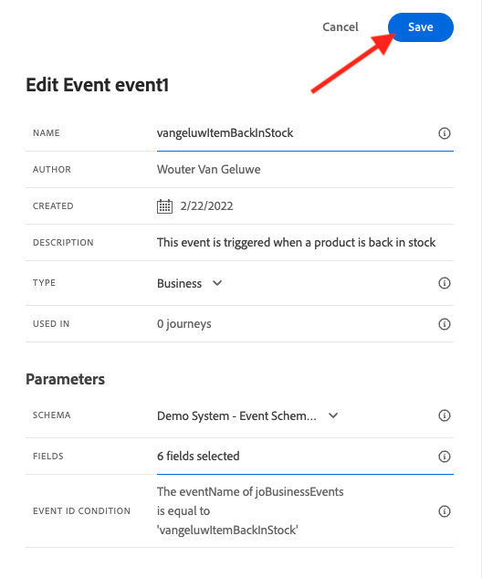

# 10.5 Creare un percorso di eventi aziendali

Accedi a Adobe Journey Optimizer accedendo a [Adobe Experience Cloud](https://experience.adobe.com). Fai clic su **Journey Optimizer**.


Verrai reindirizzato al **Pagina principale**  in Journey Optimizer. In primo luogo, assicurati di utilizzare la sandbox corretta. La sandbox da utilizzare è denominata `--aepSandboxId--`. Per passare da una sandbox all’altra, fai clic su **PROD DI PRODUZIONE (VA7)** e selezionate la sandbox dall’elenco. In questo esempio, la sandbox è denominata **Abilitazione AEP FY22**. Allora sarai nel **Pagina principale** visualizzazione della sandbox `--aepSandboxId--`.


## 10.5.1 Creare un evento aziendale

Nel menu a sinistra, fai clic su **Configurazioni**. Fai clic sul pulsante **Gestisci** all&#39;interno del pulsante **Eventi** il Card.


Gli eventi aziendali sono un nuovo tipo di evento che è possibile creare all’interno di Journey Optimizer. A differenza di **Unitario** eventi creati nei moduli precedenti, gli eventi aziendali non vengono attivati dal cliente ma dall’organizzazione. Ora creerai il tuo evento aziendale.

Fai clic su **Crea evento**.


Immetti i seguenti valori nel modulo Creazione evento:

- **Nome**: `--demoProfileLdap--ItemBackInStock`. Per esempio: **vangeluwItemBackInStock**
- **Descrizione**: Questo evento viene attivato quando un prodotto è di nuovo disponibile
- **Tipo**: select **Business** nel menu a discesa


Per lo schema, selezionare **Sistema demo - Schema eventi per JO Business Events (Global v1.1) v.1**. Ora devi selezionare i campi nello schema necessari per il nostro caso d’uso.


Segui questi passaggi:

Fai clic sul pulsante **matita** sul campo in cui è riportata la dicitura **1 campo selezionato**.


Seleziona tutti i campi disponibili nello schema, quindi fai clic su **OK**.


Per la condizione: è necessario specificare quali record in questo schema attiveranno l&#39;evento aziendale.

Segui questi passaggi:

Fai clic sul pulsante **matita** sul campo in cui è riportata la dicitura **Aggiungi una condizione**.


Sul lato sinistro, espandi il `--aepTenantId--` oggetto, espandere l&#39;oggetto **joBusinessEvents** e trascinare e rilasciare il campo **eventName** sulla tela.


Per il campo **eventName**, inserisci il seguente valore: `--demoProfileLdap--ItemBackInStock`. Per esempio: vangeluwItemBackInStock.
Fai clic su **OK**.


Fai clic su **OK**.


Infine, il modulo di creazione dell’evento sarà simile al seguente. Fai clic su **Salva** per salvare l&#39;evento aziendale.



## 10.5.2 Creare un percorso di eventi aziendali

Ora puoi sfruttare questo evento aziendale e il messaggio all’interno di un percorso. Vai a **Percorsi**. Fai clic su **Crea Percorso**.


Sul lato destro viene visualizzato un modulo in cui è necessario specificare il nome e la descrizione del percorso. Immetti i seguenti valori:

- **Nome**: `--demoProfileLdap-- - Item back in stock journey`. Per esempio: vangeluw - Articolo in magazzino percorso
- **Descrizione**: Questo percorso invia un SMS quando un articolo è di nuovo in stock al visitatore che ha mostrato un interesse.

Fai clic su **OK**.


Nel menu a sinistra, sotto **Eventi**, cerca il tuo ldap. Troverai l&#39;evento aziendale creato in precedenza `--demoProfileLdap--ItemBackInStock`. Trascina e rilascia l’evento nell’area di lavoro, che sarà il punto iniziale del percorso.


Come potete vedere, un **Leggi segmento** l’attività è stata aggiunta automaticamente all’area di lavoro. Questo perché gli eventi di business inviano solo un trigger per il percorso per leggere un segmento specifico, che poi recupererà l’elenco di profili per quel percorso.

Fai clic sul pulsante **Leggi segmento** attività.
La **Leggi segmento** La configurazione prevede di selezionare il segmento a cui si desidera inviare la notifica dell’evento aziendale appena accaduto. Fai clic sul pulsante **Selezionare un segmento** campo .


In **Scegliere un segmento** a comparsa, cerca il tuo ldap e seleziona il segmento in cui hai creato [Modulo 6 - Real-time CDP - Creare un segmento e intervenire](../module6/real-time-cdp-build-a-segment-take-action.md) denominato `--demoProfileLdap-- - Interest in PROTEUS FITNESS JACKSHIRT`. ad esempio: vangeluw - Interesse in PROTEUS FITNESS JACKSHIRT. Fai clic su **Salva**.


Quindi, fai clic su **Ok**.


Il passaggio successivo consiste nel trascinare e rilasciare l’azione da eseguire in questo percorso. Seleziona l’azione **SMS**, quindi trascinalo e rilascialo dopo la condizione appena aggiunta.


Imposta la **Categoria** a **Marketing** e selezionate una superficie sms che consente di inviare sms. In questo caso, la superficie dell’e-mail da selezionare è **SMS**.


Il passaggio successivo consiste nel creare il messaggio. A tale scopo, fai clic su **Modifica contenuto**.


Ora visualizzi il dashboard dei messaggi, in cui puoi configurare il testo dell’SMS. Fai clic sul pulsante **Componi messaggio** area per creare il messaggio.


Inserisci il seguente testo: `Hi {{profile.person.name.firstName}}, the Proteus Fitness Jackshirt is back in stock at Luma.`. Fai clic su **Salva**.


Torna al dashboard dei messaggi facendo clic sul pulsante **freccia** accanto all’oggetto nell’angolo in alto a sinistra.


Ora vedrai l’azione SMS completata. Fai clic su **Ok**.


Il percorso è ora pronto per essere pubblicato. Fai clic su **Pubblica**.


Fai clic su **Pubblica** di nuovo.


Il tuo percorso è ora pubblicato, ora puoi testarlo!


## 10.5.3 Verifica il percorso degli eventi aziendali

Ora puoi simulare il ristock di un prodotto acquisendo un nuovo evento rispetto al **Sistema demo - Schema eventi per JO Business Events (Global v1.1) v.1** utilizzo di Postman.

Nel menu a sinistra, fai clic su **Origini** quindi fai clic sul pulsante **Account** scheda .


Sulla **Account** Troverai l’account denominato **Eventi aziendali Journey Optimizer**. Fai clic su di esso per aprirlo.


Questo account ha un solo flusso di dati, fai clic sul nome del flusso di dati per selezionarlo.


Fai clic su **Copia payload dello schema** nel menu a destra. Questa opzione copia l’intero **arricciare** per inserire un record rispetto al comando **Sistema demo - Schema eventi per JO Business Events (Global v1.1) v.1** negli appunti.


Incolla il comando Curl all’interno di un editor di testo


Diamo un&#39;occhiata più da vicino a questa richiesta,

- La richiesta di POST viene inviata all’ID di ingresso DCS
- La richiesta fa riferimento allo schema, al set di dati e all’ID organizzazione.
- Infine, contiene il nodo xdmEntity che rappresenta i dati che vogliamo creare all&#39;interno del set di dati.

È ora necessario sostituire quanto segue `xdmEntity` linea..

```json
"xdmEntity": {
  "_experienceplatform": {
    "joBusinessEvents": {
      "eventDescription": "string",
      "eventName": "string",
      "stockEventId": "string"
    }
  },
  "_id": "/uri-reference",
  "eventType": "advertising.completes",
  "timestamp": "2018-11-12T20:20:39+00:00"
}
```

...in base a questa riga, assicurati di verificare il campo eventName come dovrebbe dire `--demoProfileLdap--ItemBackInStock`, che rappresenta la condizione specificata nell&#39;evento aziendale per attivare il percorso.

```json
"xdmEntity": {
  "_experienceplatform": {
    "joBusinessEvents": {
      "eventDescription": "Product Proteus Fitness Jackshirt is back in stock",
      "eventName": "--demoProfileLdap--ItemBackInStock",
      "stockEventId": "1"
    }
  },
  "_id": "/uri-reference",
  "eventType": "productBackInStock",
  "timestamp": "2021-04-19T15:25:39+00:00"
}
```

Il **arricciare** dovrebbe essere simile al seguente:


Seleziona tutto e copialo negli appunti.

Apri Postman. Sul lato sinistro di Postman, fai clic su **Importa**.


Seleziona la **Testo non elaborato** seleziona e incolla il comando precedentemente copiato qui. Fai clic su **Continua**.


Fai clic su **Importa**.


Postman ha automaticamente convertito il **arricciare** in un comando REST pronto per essere attivato, premere semplicemente **Invia** per richiedere la creazione di tale record all’interno del set di dati.


Verifica che la richiesta sia stata ricevuta correttamente. Cerca un **200 OK** status in postino.


L’SMS potrebbe richiedere un paio di minuti per arrivare sul cellulare. In caso contrario, il tuo **Interesse in Proteus Fitness Jackshirt** Il segmento potrebbe non contenere un profilo con un telefono cellulare corretto. In tal caso, accedi al sito web Luma e visita il **Proteus Fitness Jackshirt** prodotto e registrati assicurandoti di fornire il numero di telefono cellulare corretto.


Ora hai finito questo esercizio.

Passaggio successivo: [Riepilogo e vantaggi](./summary.md)

[Torna al modulo 10](./journeyoptimizer.md)

[Torna a tutti i moduli](../../overview.md)
