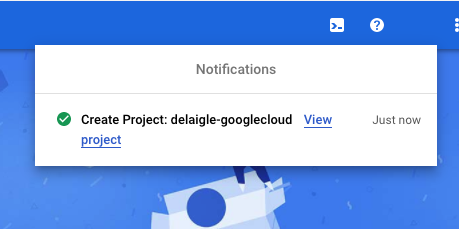

# 12.1 Creare l’account Google Cloud Platform

## Obiettivi

- Creare l’account Google Cloud Platform
- Acquisisci familiarità con la console Google Cloud Platform
- Crea e prepara il progetto BigQuery

## 12.1.1 Perché collegare Google BigQuery a Adobe Experience Platform per ottenere i dati di Google Analytics

Google Cloud Platform (GCP) è una suite di servizi pubblici di cloud computing offerti da Google. La piattaforma Google Cloud include una serie di servizi in hosting per elaborazione, archiviazione e sviluppo di applicazioni eseguite sull’hardware Google.

BigQuery è uno di questi servizi ed è sempre incluso con Google Analytics 360. I dati di Google Analytics vengono campionati frequentemente quando proviamo a ottenere i dati direttamente da essi (ad esempio, API). Ecco perché Google include BigQuery per ottenere dati non campionati, in modo che i marchi possano fare analisi avanzate utilizzando SQL e beneficiare della potenza di GCP.

I dati di Google Analytics vengono caricati quotidianamente in BigQuery utilizzando un meccanismo batch. Di conseguenza, non ha alcun senso utilizzare questa integrazione GCP/BigQuery per i casi di utilizzo di personalizzazione e attivazione in tempo reale.

Se un marchio desidera fornire casi d’uso di personalizzazione in tempo reale basati su dati di Google Analytics, può raccogliere tali dati sul sito web con Google Tag Manager e quindi inviarli a Adobe Experience Platform in tempo reale.

Il connettore sorgente GCP/BigQuery deve essere utilizzato per...

- tiene traccia di tutti i comportamenti dei clienti sul sito web e carica tali dati in Adobe Experience Platform per i casi d’uso di analisi, scienza dei dati e personalizzazione che non richiedono l’attivazione in tempo reale.
- carica Google Analytics dati storici in Adobe Experience Platform, ancora per casi d’uso di analisi e scienza dei dati

## 12.1.2 Crea il tuo account Google

Per ottenere un account Google Cloud Platform è necessario un account Google.

## 12.1.3 Attiva l&#39;account Google Cloud Platform

Ora che disponi dell’account Google, puoi creare un ambiente Google Cloud Platform. Per farlo, vai a [https://console.cloud.google.com/](https://console.cloud.google.com/).

Nella pagina successiva, Accetta i termini e le condizioni.

Fai clic su **Selezionare un progetto**.

Fai clic su **NUOVO PROGETTO**.

Assegna un nome al progetto seguendo questa convenzione di denominazione:

| Convenzione | Esempio |
| ----------------- |-------------| 
| `--demoProfileLdap---googlecloud` | delaigle googlecloud |

Fai clic su **Crea**.

Attendi che la notifica in alto a destra nella schermata ti dica che la creazione è terminata. Quindi, fai clic su **Visualizza progetto**.

Quindi, vai alla barra di ricerca nella parte superiore dello schermo e digita **BigQuery**. Seleziona il primo risultato.

Verrà quindi reindirizzato alla console BigQuery e verrà visualizzato un messaggio a comparsa.

**Fai clic su Fine**.

L’obiettivo di questo modulo è quello di ottenere i dati delle Google Analytics in Adobe Experience Platform. Per farlo, abbiamo bisogno di dati fittizi in un set di dati di Google Analytics per iniziare con.

Fai clic su **Aggiungi dati** nel menu a sinistra, quindi fai clic su **Esplorare i set di dati pubblici**.

Verrà visualizzata questa finestra:

Inserisci il termine di ricerca **Esempio di Google Analytics** nella barra di ricerca e seleziona il primo risultato.

Viene visualizzata la seguente schermata con una descrizione del set di dati. Fai clic su **VISUALIZZA SET DI DATI**.

Verrai quindi reindirizzato a BigQuery dove vedrai questo **bigquery-public-data** set di dati **Esplora risorse**.

In **Esplora risorse** A questo punto dovrebbero essere visualizzate diverse tabelle. Sentiti libero di esplorarle. Vai a `google_analytics_sample`.

Fare clic per aprire la tabella `ga_sessions`.

Prima di continuare con l&#39;esercizio successivo, annotare i seguenti elementi in un file di testo separato sul computer:

| Credenziali | Denominazione | Esempio |
| ----------------- |-------------| -------------|
| Progetto Nome | `--demoProfileLdap---googlecloud` | vangeluw googlecloud |
| ID progetto | random | composito-task-306413 |

Per trovare il nome del progetto e l’ID progetto, fai clic su **Nome progetto** nella barra dei menu superiore:

Vedrai il tuo ID progetto sul lato destro:

Ora puoi passare all&#39;Esercizio 12.2 dove ti sporcherai le mani interrogando i dati delle Google Analytics.

Passaggio successivo: [12.2 Crea la tua prima query in BigQuery](./ex2.md)

[Torna al modulo 12](./customer-journey-analytics-bigquery-gcp.md)

[Torna a tutti i moduli](./../../overview.md)
