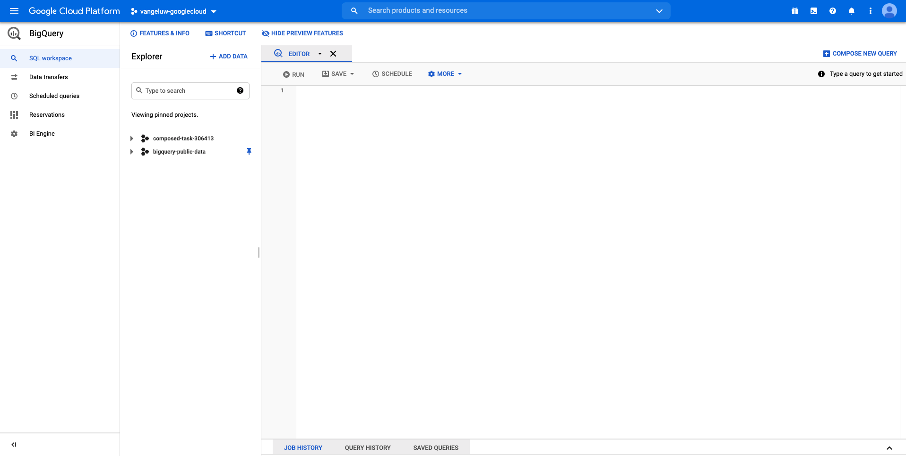
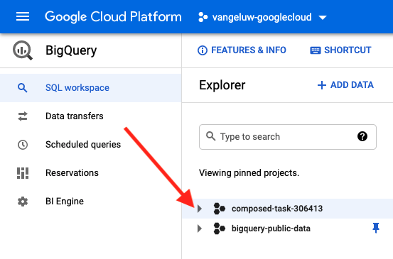
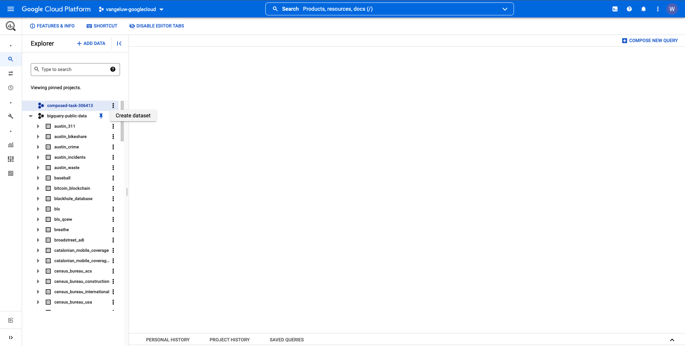
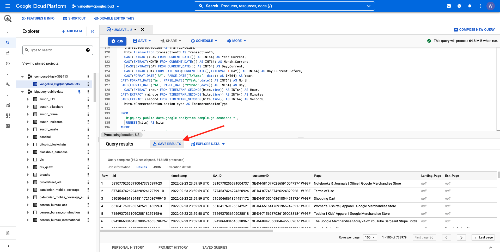

# 12.2 Crea la tua prima query in BigQuery

## Obiettivi

- Esplorare l’interfaccia utente BigQuery
- Crea una query SQL in BigQuery
- Salvare i risultati della query SQL in un set di dati in BigQuery

## Contesto

Quando i dati di Google Analytics sono in BigQuery, le dimensioni, le metriche e altre variabili sono tutte nidificate. Inoltre, i dati di Google Analytics vengono caricati quotidianamente in tabelle diverse. Ciò significa che cercare di collegare direttamente tabelle Google Analytics in BigQuery a Adobe Experience Platform è molto difficile e non è una buona idea.

La soluzione a questo problema è trasformare i dati delle Google Analytics in un formato leggibile per semplificare l’acquisizione in Adobe Experience Platform.

## 12.2.1 Crea un set di dati per salvare le nuove tabelle BigQuery

Vai a [Console BigQuery](https://console.cloud.google.com/bigquery).



In **Esplora risorse**, verrà visualizzato il tuo ID progetto. Fai clic sull’ID progetto (non fare clic sul pulsante **bigquery-public-data** set di dati).



Potete vedere che non c&#39;è ancora un set di dati, quindi creiamone uno ora.
Fai clic su **CREA SET DI DATI**.



Sul lato destro dello schermo, visualizzerai il **Creare un set di dati** menu.


Per **ID set di dati**, utilizza la seguente convenzione di denominazione. Per gli altri campi, lasciare le impostazioni predefinite.

| Denominazione | Esempio |
| ----------------- | ------------- | 
| `--demoProfileLdap--_BigQueryDataSets` | vangeluw_BigQueryDataSets |


Quindi, fai clic su **Creare un set di dati**.


Sarà quindi di nuovo nella console BigQuery con il set di dati creato.


## 12.2.2 Crea il tuo primo SQL BigQuery

Successivamente, creerai la tua prima query in BigQuery. L’obiettivo di questa query è quello di prendere i dati di esempio delle Google Analytics e trasformarli in modo che possano essere acquisiti in Adobe Experience Platform. Vai a **EDITOR** scheda .


Copia la seguente query SQL e incollala in tale editor di query. Puoi leggere la query e comprendere la sintassi BigQuery delle Google Analytics.


```sql
SELECT
  CONCAT(fullVisitorId, CAST(hitTime AS String), '-', hitNumber) AS _id,
  TIMESTAMP(DATETIME(Year_Current, Month_Current, Day_Current, Hour, Minutes, Seconds)) AS timeStamp,
  fullVisitorId as GA_ID,
  -- Fake CUSTOMER ID
  CONCAT('3E-D4-',fullVisitorId, '-1W-93F' ) as customerID,
  Page,
  Landing_Page,
  Exit_Page,
  Device,
  Browser,
  MarketingChannel,
  TrafficSource,
  TrafficMedium,
  -- Enhanced Ecommerce
  TransactionID,
  CASE
      WHEN EcommerceActionType = '2' THEN 'Product_Detail_Views'
      WHEN EcommerceActionType = '3' THEN 'Adds_To_Cart'
      WHEN EcommerceActionType = '4' THEN 'Product_Removes_From_Cart'
      WHEN EcommerceActionType = '5' THEN 'Product_Checkouts'
      WHEN EcommerceActionType = '6' THEN 'Product_Refunds'
    ELSE
    NULL
  END
     AS Ecommerce_Action_Type,
  -- Entrances (metric)
  SUM(CASE
      WHEN isEntrance = TRUE THEN 1
    ELSE
    0
  END
    ) AS Entries,
    
--Pageviews (metric)
    COUNT(*) AS Pageviews,
    
 -- Exits 
    SUM(
    IF
      (isExit IS NOT NULL,
        1,
        0)) AS Exits,
        
 --Bounces
   SUM(CASE
      WHEN isExit = TRUE AND isEntrance = TRUE THEN 1
    ELSE
    0
  END
    ) AS Bounces,
        
  -- Unique Purchases (metric)
  COUNT(DISTINCT TransactionID) AS Unique_Purchases,
  -- Product Detail Views (metric)
  COUNT(CASE
      WHEN EcommerceActionType = '2' THEN fullVisitorId
    ELSE
    NULL
  END
    ) AS Product_Detail_Views,
  -- Product Adds To Cart (metric)
  COUNT(CASE
      WHEN EcommerceActionType = '3' THEN fullVisitorId
    ELSE
    NULL
  END
    ) AS Adds_To_Cart,
  -- Product Removes From Cart (metric)
  COUNT(CASE
      WHEN EcommerceActionType = '4' THEN fullVisitorId
    ELSE
    NULL
  END
    ) AS Product_Removes_From_Cart,
  -- Product Checkouts (metric)
  COUNT(CASE
      WHEN EcommerceActionType = '5' THEN fullVisitorId
    ELSE
    NULL
  END
    ) AS Product_Checkouts,
  -- Product Refunds (metric)
  COUNT(CASE
      WHEN EcommerceActionType = '7' THEN fullVisitorId
    ELSE
    NULL
  END
    ) AS Product_Refunds
  FROM (
  SELECT
    -- Landing Page (dimension)
    CASE
      WHEN hits.isEntrance = TRUE THEN hits.page.pageTitle
    ELSE NULL
  END
    AS Landing_page,
    
        -- Exit Page (dimension)
    CASE
      WHEN hits.isExit = TRUE THEN hits.page.pageTitle
    ELSE
    NULL
  END
    AS Exit_page,
    
    hits.page.pageTitle AS Page,
    hits.isEntrance,
    hits.isExit,
    hits.hitNumber as hitNumber,
    hits.time as hitTime,
    date as Fecha,
    fullVisitorId,
    visitStartTime,
    device.deviceCategory AS Device,
    device.browser AS Browser,
    channelGrouping AS MarketingChannel,
    trafficSource.source AS TrafficSource,
    trafficSource.medium AS TrafficMedium,
    hits.transaction.transactionId AS TransactionID,
    CAST(EXTRACT(YEAR FROM CURRENT_DATE()) AS INT64) AS Year_Current,
    CAST(EXTRACT(MONTH FROM CURRENT_DATE()) AS INT64) AS Month_Current,
     CAST(EXTRACT(DAY FROM CURRENT_DATE()) AS INT64) AS Day_Current,
    CAST(EXTRACT(DAY FROM DATE_SUB(CURRENT_DATE(),INTERVAL 1 DAY)) AS INT64) AS Day_Current_Before,
    CAST(FORMAT_DATE('%Y', PARSE_DATE("%Y%m%d", date)) AS INT64) AS Year,
  CAST(FORMAT_DATE('%m', PARSE_DATE("%Y%m%d",date)) AS INT64) AS Month,
  CAST(FORMAT_DATE('%d', PARSE_DATE("%Y%m%d",date)) AS INT64) AS Day,
    CAST(EXTRACT (hour FROM TIMESTAMP_SECONDS(hits.time)) AS INT64) AS Hour,
  CAST(EXTRACT (minute FROM TIMESTAMP_SECONDS(hits.time)) AS INT64) AS Minutes,
  CAST(EXTRACT (second FROM TIMESTAMP_SECONDS(hits.time)) AS INT64) AS SecondS,
    hits.eCommerceAction.action_type AS EcommerceActionType
  
  FROM
    `bigquery-public-data.google_analytics_sample.ga_sessions_*`,
     UNNEST(hits) AS hits
  WHERE
    _table_suffix BETWEEN '20170101'
    AND '20170331'
    AND totals.visits = 1
    AND hits.type = 'PAGE'
    )
    
GROUP BY
  1,
  2,
  3,
  4,
  5,
  6,
  7,
  8,
  9,
  10,
  11,
  12,
  13,
  14
    
  ORDER BY 2 DESC
```

Quando sei pronto, fai clic su **Esegui** per eseguire la query:


L’esecuzione della query può richiedere un paio di minuti.

Al termine dell’esecuzione della query, visualizzerai l’output seguente nel **Risultati della query**.


## 12.2.3 Salvare i risultati della query SQL BigQuery

Il passaggio successivo consiste nel salvare l’output della query facendo clic sul pulsante **SALVA RISULTATI** pulsante .



Come posizione dell&#39;output, seleziona **Tabella BigQuery**.


Verrà visualizzato un nuovo popup, dove il tuo **Nome progetto** e **Nome set di dati** sono precompilati. Il nome del set di dati deve essere il set di dati creato all’inizio di questo esercizio, con questa convenzione di denominazione:

| Denominazione | Esempio |
| ----------------- | ------------- | 
| `--demoProfileLdap--_BigQueryDataSets` | `vangeluw_BigQueryDataSets` |

È ora necessario immettere un nome Tabella. Utilizza questa convenzione di denominazione:

| Denominazione | Esempio |
| ----------------- |------------- | 
| `--demoProfileLdap--_GAdataTableBigQuery` | `vangeluw_GAdataTableBigQuery` |


Fai clic su **SALVA**.

Potrebbero essere necessari alcuni minuti prima che i dati siano pronti nella tabella creata. Dopo un paio di minuti, aggiorna il browser. Dovresti quindi visualizzare all’interno del set di dati il `--demoProfileLdap--_GAdataTableBigquery` tabella sotto **Esplora risorse** all’interno del progetto BigQuery.


Ora si continua con l’esercizio successivo, in cui si collegherà questa tabella a Adobe Experience Platform.

Passaggio successivo: [12.3 Collegare GCP e BigQuery a Adobe Experience Platform](./ex3.md)

[Torna al modulo 12](./customer-journey-analytics-bigquery-gcp.md)

[Torna a tutti i moduli](./../../overview.md)
