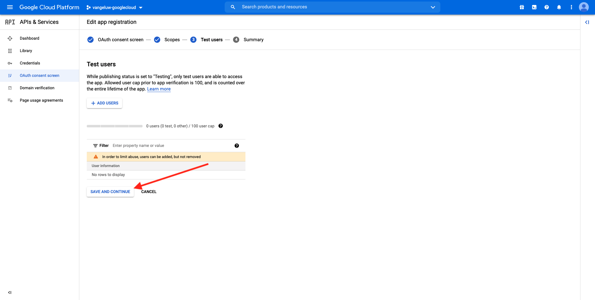
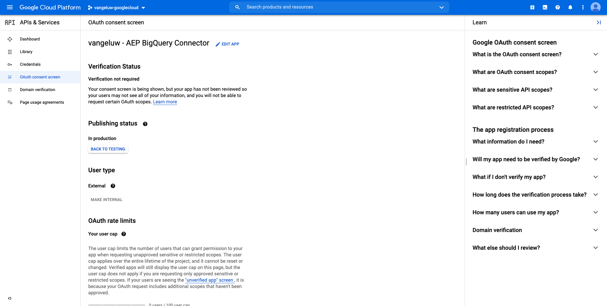
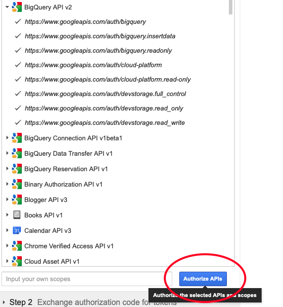

# 12.3 Collegare GCP e BigQuery a Adobe Experience Platform

## Obiettivi

- Esplorare API e servizi in Google Cloud Platform
- Acquisisci familiarità con OAuth Playground per testare le API di Google
- Crea la tua prima connessione BigQuery in Adobe Experience Platform

## Contesto

Adobe Experience Platform fornisce un connettore all&#39;interno di **Origini** questo ti aiuterà a portare i set di dati BigQuery in Adobe Experience Platform. Questo connettore dati si basa sull’API BigQuery di Google. Pertanto, è importante preparare correttamente la piattaforma Google Cloud e l’ambiente BigQuery per ricevere chiamate API da Adobe Experience Platform.

Per configurare il connettore di origine BigQuery in Adobe Experience Platform, sono necessari i seguenti 4 valori:

- progetto
- clientId
- clientSecret
- refreshToken

Finora avete solo il primo, il **ID progetto**. Questo **ID progetto** value è un ID casuale generato da Google quando hai creato il progetto BigQuery durante l’esercizio 12.1.

Copia l’ID del progetto in un file di testo separato.

| Credenziali | Denominazione | Esempio |
| ----------------- |-------------| -------------|
| ID progetto | random | composito-task-306413 |

Puoi controllare il tuo ID progetto in qualsiasi momento facendo clic sul tuo **Nome progetto** nella barra dei menu superiore:

Vedrai il tuo Project ID sul lato destro:

In questo esercizio imparerai come ottenere gli altri 3 campi obbligatori:

- clientId
- clientSecret
- refreshToken

## API e servizi di Google Cloud 12.3.1

Per iniziare, torna alla home page di Google Cloud Platform. A questo scopo, fai clic sul logo nell’angolo in alto a sinistra dello schermo.

Una volta nella home page, vai al menu a sinistra e fai clic su **API e servizi**, quindi Fai clic su **Dashboard**.

Ora vedrai il **API e servizi** homepage.

In questa pagina puoi vedere l’utilizzo delle varie connessioni API di Google. Per impostare una connessione API in modo che Adobe Experience Platform possa leggere da BigQuery, è necessario seguire questi passaggi:

- Innanzitutto, devi creare una schermata di consenso OAuth per abilitare le autenticazioni future. Per motivi di sicurezza Google è inoltre necessario che un utente effettui la prima autenticazione, prima che sia consentito un accesso programmatico.
- In secondo luogo, sono necessarie le credenziali API (clientId e clientSecret) che verranno utilizzate per l’autenticazione API e l’accesso al connettore BigQuery.

## Schermata di consenso OAuth 12.3.2

Cominciamo con la creazione della schermata di consenso OAuth. Nel menu a sinistra della **API e servizi** home page, fai clic su **Schermata di consenso OAuth**.

Vedrai questo:

Seleziona il tipo di utente: **Esterno**. Quindi, fai clic su **CREA**.

Allora sarai sul **Configurazione della schermata di consenso OAuth** finestra.

L’unica cosa da fare è inserire il nome della schermata di consenso nel **Nome applicazione** e seleziona il **E-mail di supporto utente**. Per il nome dell&#39;applicazione, utilizzare questa convenzione di denominazione:

| Denominazione | Esempio |
| ----------------- |-------------| 
| `--demoProfileLdap-- - AEP BigQuery Connector` | vangeluw - Connettore BigQuery AEP |

Quindi, scorri verso il basso fino a visualizzare **Informazioni sui contatti per gli sviluppatori** e compila un indirizzo e-mail.

Fai clic su **SALVA E CONTINUA**.

Vedrete questo. Fai clic su **SALVA E CONTINUA**.

Vedrete questo. Fai clic su **SALVA E CONTINUA**.

Vedrete questo. Fai clic su **TORNA AL DASHBOARD**.

Vedrete questo. Fai clic su **PUBBLICA APP**.

Fai clic su **CONFERMA**.

Vedrete questo.

Nel passaggio successivo, finirai la configurazione dell’API e otterrai le tue credenziali API.

## Credenziali API Google 12.3.3: Segreto client e ID client

Nel menu a sinistra, fai clic su **Credenziali**. Vedrai questo:

Fai clic sul pulsante **+ CREARE CREDENZIALI** pulsante .

Vedrete 3 opzioni. Fai clic sul pulsante **ID client OAuth**:

Nella schermata successiva, seleziona **Applicazione Web**.

Verranno visualizzati diversi nuovi campi. È ora necessario inserire il **Nome** dell’ID client OAuth e immetti anche il **URI di reindirizzamento autorizzati**.

Segui questa convenzione di denominazione:

| Campo | Valore | Esempio |
| ----------------- |-------------| -------------| 
| Nome | ldap - Connettore BigQuery AEP | vangeluw - Connettore Platform BigQuery |
| URI di reindirizzamento autorizzati | https://developers.google.com/oauthplayground | https://developers.google.com/oauthplayground |

La **URI di reindirizzamento autorizzati** Il campo è un campo molto importante perché sarà necessario in un secondo momento per ottenere il RefreshToken necessario per completare la configurazione del connettore di origine BigQuery in Adobe Experience Platform.

Prima di continuare, è necessario spingere fisicamente il **Invio** dopo aver inserito l’URL per memorizzare il valore nel **URI di reindirizzamento autorizzati** campo . Se non fai clic sul pulsante **Invio** In un secondo momento, ti imbatti in problemi nella **Playground OAuth 2.0**.

Quindi, fai clic su **Crea**:

Ora vedrai il tuo ID client e il tuo segreto client.

Copia questi due campi e incollali in un file di testo sul desktop. Puoi sempre accedere a queste credenziali in una fase successiva, ma è più semplice salvarle in un file di testo accanto al tuo ID progetto BigQuery.

Per eseguire nuovamente la configurazione del connettore di origine BigQuery in Adobe Experience Platform, ora sono già disponibili i seguenti valori:

| Credenziali del connettore BigQuery | Valore |
| ----------------- |-------------| 
| ID progetto | il tuo ID progetto (ad esempio: composito-task-306413) |
| clientid | yourclientid |
| cilentsecret | segreto client |

Ti stai ancora perdendo il **refreshToken**. L&#39;aggiornamentoToken è un requisito per motivi di sicurezza. Nel mondo delle API, i token generalmente scadono ogni 24 ore. Quindi **refreshToken** È necessario aggiornare il token di sicurezza ogni 24 ore, in modo che la configurazione del connettore sorgente possa continuare a connettersi a Google Cloud Platform e BigQuery.

## 12.3.4 API BigQuery e refreshToken

Esistono molti modi per ottenere un refreshToken per accedere alle API di Google Cloud Platform. Una di queste opzioni è l’utilizzo di Postman.
Tuttavia, Google ha creato qualcosa di più semplice da testare e riprodurre con le proprie API, uno strumento chiamato **Playground OAuth 2.0**.

Per accedere **Playground OAuth 2.0**, vai a [https://developers.google.com/oauthplayground](https://developers.google.com/oauthplayground).

Vedrai il **Playground OAuth 2.0** homepage.

Fai clic sul pulsante **ingranaggio** in alto a destra sullo schermo:

Assicurati che le impostazioni siano le stesse che puoi vedere nell&#39;immagine qui sopra.

Controlla le impostazioni per essere sicuro al 100%.

Al termine, seleziona la casella di controllo di **Utilizza le tue credenziali OAuth**

Vengono visualizzati due campi ed è disponibile il relativo valore.

Compila i campi seguenti:

| Impostazioni API per il parco giochi | Credenziali API di Google |
| ----------------- |-------------| 
| ID client OAuth | il proprio ID client (nel file di testo sul desktop) |
| Segreto client OAuth | Segreto client personale (nel file di testo sul desktop) |

Copia il **ID client** e **Segreto client** dal file di testo creato sul desktop.

Dopo aver compilato le credenziali, fai clic su **Chiudi**

Nel menu a sinistra, puoi visualizzare tutte le API Google disponibili. Cerca **API BigQuery v2**.

Quindi, seleziona l&#39;ambito come indicato nell&#39;immagine seguente:

Una volta selezionati, dovrebbe essere visualizzato un pulsante blu che riporta **Autorizzare le API**. Fai clic su di esso.

Seleziona l’account Google utilizzato per configurare GCP e BigQuery.

Potrebbe comparire un grande avviso: **Questa app non è verificata**. Questo accade perché il tuo connettore Platform BigQuery non è ancora stato rivisto formalmente, quindi Google non sa se è un&#39;app autentica o meno. Dovresti ignorare questa notifica.

Fai clic su **Avanzate**.

Fai clic su **Vai a ldap - Connettore BigQuery AEP (non sicuro)**.

Verrai reindirizzato alla nostra schermata di consenso OAuth che hai creato.

Se si utilizza l&#39;autenticazione a due fattori (2FA), immettere il codice di verifica inviato.

Google ora vi mostrerà otto diversi **Autorizzazione** prompt. Fai clic su **Consenti** per tutte e otto le richieste di autorizzazione. (Questa è una procedura che deve essere seguita e confermata una volta da un vero essere umano, prima che l’API consenta le richieste programmatiche)

Ancora una volta, **otto finestre a comparsa diverse** non verrà visualizzato, è necessario fare clic su **Consenti** per tutti loro.

Dopo le otto richieste di autorizzazione, verrà visualizzata questa panoramica. Fai clic su **Consenti** per completare il processo.

Dopo l&#39;ultimo **Consenti**-fai clic su, verrai rimandato al parco giochi OAuth 2.0 e vedrai questo:

Fai clic su **Codice di autorizzazione di Exchange per token**.

Dopo un paio di secondi, il **Passaggio 2: codice di autorizzazione per i token** la visualizzazione si chiude automaticamente e vedrai **Passaggio 3: configurare la richiesta all’API**.

Devi tornare a **Passaggio 2 Codice di autorizzazione dello scambio per i token** quindi fai clic su **Passaggio 2 Codice di autorizzazione dello scambio per i token** per visualizzare di nuovo il **Aggiorna token**.

Ora vedrai il **Aggiorna token**.

Copia il **Aggiorna token** e incollalo nel file di testo sul desktop insieme alle altre credenziali del connettore di origine BigQuery:

| Credenziali del connettore di origine BigQuery | Valore |
| ----------------- |-------------| 
| ID progetto | il tuo ID progetto casuale (ad esempio: (apt-estate-273608) |
| clientid | yourclientid |
| cilentsecret | segreto client |
| token di aggiornamento | token di aggiornamento |

Quindi, impostiamo il connettore di origine in Adobe Experience Platform.

## Esercizio 12.3.5 - Connetti Platform con la tua tabella BigQuery

Accedi a Adobe Experience Platform andando a questo URL: [https://experience.adobe.com/platform](https://experience.adobe.com/platform).

Dopo aver effettuato l&#39;accesso, si aprirà la homepage di Adobe Experience Platform.

Prima di continuare, devi selezionare un **sandbox**. La sandbox da selezionare è denominata ``--aepSandboxId--``. Per eseguire questa operazione, fai clic sul testo **[!UICONTROL Produzione Prod]** nella linea blu sopra lo schermo. Dopo aver selezionato la sandbox appropriata, visualizzerai la modifica dello schermo e ora ti trovi nella sandbox dedicata.

Nel menu a sinistra, vai a Origini. Vedrai il **Origini** homepage. In **Origini** menu, fai clic su **Database**. Fai clic sul pulsante **BigQuery Google** il Card. Quindi, fai clic su **Configurazione** o **+ Configura**.

A questo punto è necessario creare una nuova connessione.

Fai clic su **Nuovo account**. È ora necessario compilare tutti i campi seguenti, in base alla configurazione effettuata in GCP e BigQuery.

Cominciamo denominando la connessione:

Utilizza questa convenzione di denominazione:

| Credenziali del connettore BigQuery | Valore | Esempio |
| ----------------- |-------------| -------------| 
| Nome account | `--demoProfileLdap-- - BigQuery Connection` | vangeluw - Connessione BigQuery |
| Descrizione | `--demoProfileLdap-- - BigQuery Connection` | vangeluw - Connessione BigQuery |

Il che dovrebbe darvi qualcosa del genere:

Quindi, compila l’API GCP e BigQuery . **Autenticazione account**-dettagli memorizzati in un file di testo sul desktop:

| Credenziali del connettore BigQuery | Valore |
| ----------------- |-------------| 
| ID progetto | il tuo ID progetto casuale (ad esempio: (apt-estate-273608) |
| clientId | ... |
| cilentSecret | ... |
| refreshToken | ... |

Le **Autenticazione account**-i dettagli dovrebbero ora essere così:

Dopo aver compilato tutti questi campi, fai clic su **Connetti alla sorgente**.

Se **Autenticazione account** i dettagli sono stati compilati correttamente. Ora visualizzi una conferma visiva del corretto funzionamento della connessione, visualizzando il **Connesso** conferma.

Dopo aver creato la connessione, fai clic su **Successivo**:

Ora vedrai il set di dati BigQuery creato durante l’esercizio 12.2.

Ben fatto! Nell’esercizio successivo, puoi caricare i dati da quella tabella e mapparli in base a uno schema e a un set di dati in Adobe Experience Platform.

Passaggio successivo: [12.4 Caricare dati da BigQuery in Adobe Experience Platform](./ex4.md)

[Torna al modulo 12](./customer-journey-analytics-bigquery-gcp.md)

[Torna a tutti i moduli](./../../overview.md)
