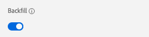

# 12.4 Caricare dati da BigQuery in Adobe Experience Platform

## Obiettivi

- Mappatura dei dati BigQuery su uno schema XDM
- Caricare dati BigQuery in Adobe Experience Platform
- Acquisisci familiarità con l’interfaccia utente del connettore di origine BigQuery

## Prima di iniziare

Dopo l’esercizio 12.3, dovrebbe essere aperta questa pagina in Adobe Experience Platform:

**Se lo avete aperto, continuate con l’esercizio 12.4.1.**

**Se non lo hai aperto, vai a [Adobe Experience Platform](https://experience.adobe.com/platform/home).**

Nel menu a sinistra, vai a Origini. Vedrai il **Origini** homepage. In **Origini** menu, fai clic su **Database**.

Seleziona la **BigQuery Google** Connettore sorgente e fai clic su **+ Configura**.

Viene quindi visualizzata la schermata di selezione dell&#39;account BigQuery di Google.

Seleziona il tuo account e fai clic su **Successivo**.

Vedrai il **Aggiungi dati** visualizza.

## 12.4.1 Selezione tabella BigQuery

In **Aggiungi dati** visualizza, seleziona il set di dati BigQuery.

È ora possibile visualizzare un&#39;anteprima di dati di esempio dei dati Google Analytics in BigQuery.

Fai clic su **Avanti**.

## Mappatura XDM 12.4.2

Ora verrà visualizzato questo:

È ora necessario creare un nuovo set di dati o selezionare un set di dati esistente in cui caricare i dati delle Google Analytics. Per questo esercizio, è già stato creato un set di dati e uno schema. Non è necessario creare un nuovo schema o set di dati.

Seleziona **Set di dati esistente**. Apri il menu a discesa per selezionare un set di dati. Cerca il set di dati denominato `Demo System - Event Dataset for BigQuery (Global v1.1)` e selezionalo. Fai clic su **Avanti**.

Scorri verso il basso. Ora devi mappare ogni **Campo di origine** da Google Analytics/BigQuery a XDM **Campo di destinazione**, campo per campo.

Utilizzare la tabella di mappatura riportata di seguito per questo esercizio.

| Campo di origine | Campo di destinazione |
| ----------------- |-------------| 
| **_id** | _id |
| **_id** | channel._id |
| timeStamp | timestamp |
| GA_ID | ``--aepTenantId--``.identity.core.gaid |
| customerID | ``--aepTenantId--``.identity.core.loyaltyId |
| Pagina | web.webPageDetails.name |
| Dispositivo | device.type |
| Browser | environment.browserDetails.vendor |
| MarketingChannel | marketing.trackingCode |
| TrafficSource | channel.typeAtSource |
| TrafficMedium | channel.mediaType |
| TransactionID | commerce.order.payments.transactionID |
| Ecommerce_Action_Type | eventType |
| Pageviews | web.webPageDetails.pageViews.value |
| Acquisti_univoci | commerce.purchases.value |
| Product_Detail_Views | commerce.productViews.value |
| Add_To_Cart | commerce.productListAdds.value |
| Product_Removes_From_Cart | commerce.productListRemovals.value |
| Product_Checkouts | commerce.checkouts.value |

Dopo aver copiato e incollato la mappatura di cui sopra nell’interfaccia utente di Adobe Experience Platform, verifica se non vengono visualizzati errori a causa di errori di battitura o di spazi iniziali/finali.

Ora hai un **Mappatura** come questo:

Campi di origine **GA_ID** e **customerID** sono mappati su un identificatore in questo schema XDM. Questo ti consente di arricchire i dati delle Google Analytics (dati comportamentali web/app) con altri set di dati come i dati Fedeltà o Call Center.

Fai clic su **Avanti**.

## 12.4.3 Pianificazione della connessione e dell&#39;acquisizione dei dati

Ora vedrai il **Pianificazione** scheda:

In **Pianificazione** è possibile definire una frequenza per il processo di inserimento dei dati per questo **Mappatura** e i dati.

Poiché in Google BigQuery i dati demo non verranno aggiornati, non è necessario impostare una pianificazione in questo esercizio. Devi selezionare qualcosa e per evitare troppi processi inutili di inserimento dei dati, devi impostare la frequenza in questo modo:

- Frequenza: **Settimana**
- Intervallo: **200**

**Importante**: attiva la **Backfill** interruttore.

Ultimo ma non meno importante, devi definire un **delta** campo .

La **delta** viene utilizzato per pianificare la connessione e caricare solo le nuove righe incluse nel set di dati BigQuery. Un campo delta è in genere sempre una colonna di marca temporale. Pertanto, per le future acquisizioni di dati pianificati, verranno acquisite solo le righe con una marca temporale nuova e più recente.

Seleziona **timeStamp** come campo delta.

Ora avete questo.

Fai clic su **Avanti**.

## 12.4.4 Revisione e avvio della connessione

In **Dettaglio del flusso di dati** visualizza. devi assegnare un nome alla connessione, che ti aiuterà a trovarla in un secondo momento.

Utilizza questa convenzione di denominazione:

| Campo | Denominazione | Esempio |
| ----------------- |-------------| -------------|
| Nome del flusso di dati | DataFlow - ldap - Interazione sito Web BigQuery | Flusso di dati - vangeluw - Interazione del sito Web BigQuery |
| Descrizione | DataFlow - ldap - Interazione sito Web BigQuery | Flusso di dati - vangeluw - Interazione del sito Web BigQuery |

Fai clic su **Avanti**.

Viene visualizzata una panoramica dettagliata della connessione. Assicurati che tutto sia corretto prima di continuare, in quanto alcune impostazioni non possono più essere modificate successivamente, come ad esempio la mappatura XDM.

Fai clic su **Fine**.

L&#39;impostazione della connessione potrebbe richiedere un po&#39; di tempo, quindi non preoccuparti se vedi questo:

Una volta creata la connessione, verrà visualizzato quanto segue:

Ora puoi continuare con il prossimo esercizio, in cui utilizzerai il Customer Journey Analytics per creare potenti visualizzazioni sui dati di Google Analytics.

Passaggio successivo: [12.5 Analizzare i dati delle Google Analytics utilizzando il Customer Journey Analytics](./ex5.md)

[Torna al modulo 12](./customer-journey-analytics-bigquery-gcp.md)

[Torna a tutti i moduli](./../../overview.md)
