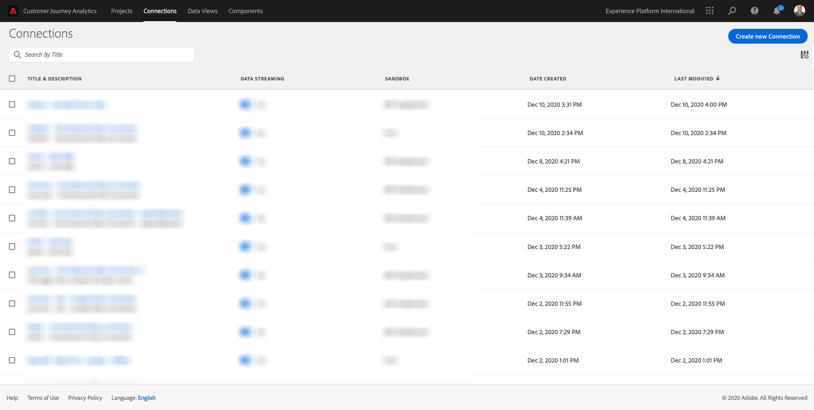
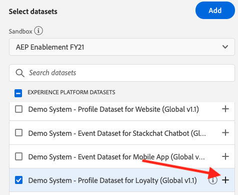
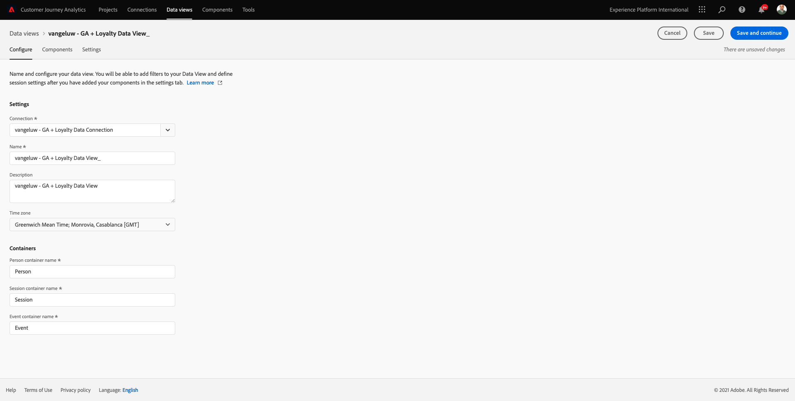
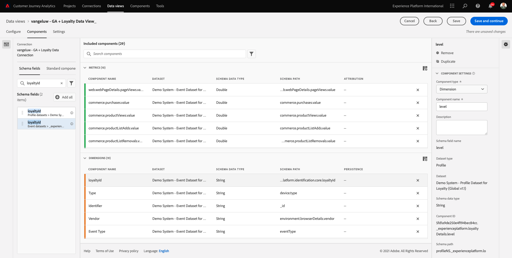
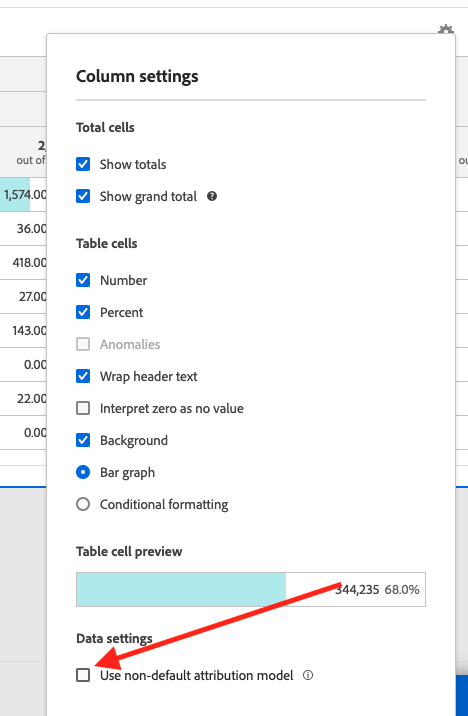
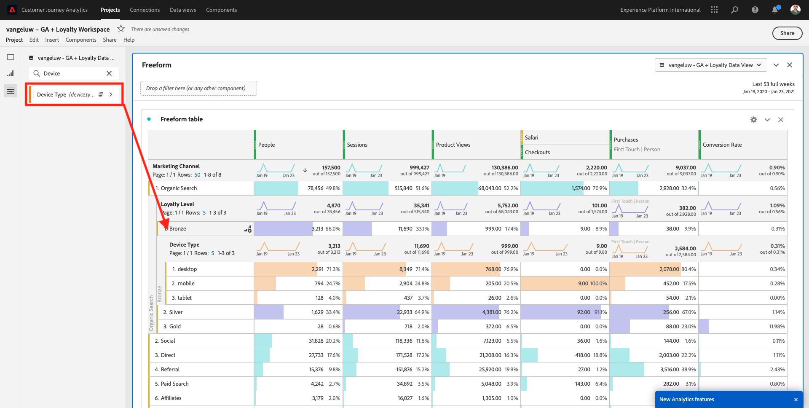
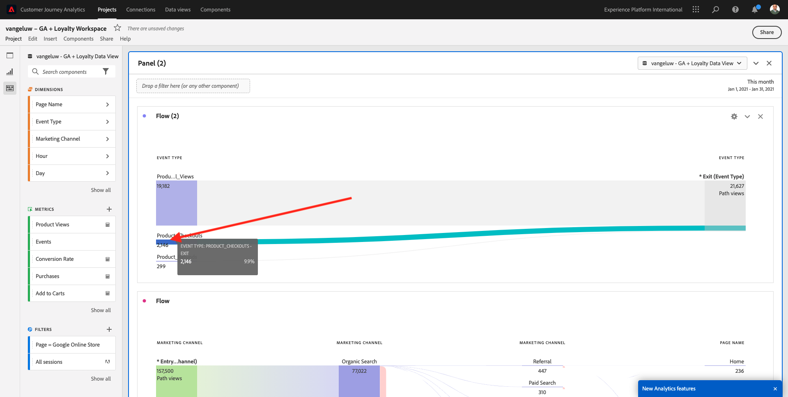

# 12.5 Analizzare i dati delle Google Analytics utilizzando il Customer Journey Analytics

## Obiettivi

- Collega il nostro set di dati BigQuery al Customer Journey Analytics (CJA)
- Collega e unisci le Google Analytics con i dati fedeltà.
- Acquisisci familiarità con l’interfaccia utente di CJA

## 12.5.1 Creare una connessione

Vai a [analytics.adobe.com](https://analytics.adobe.com) per accedere al Customer Journey Analytics.

Nella home page del Customer Journey Analytics, vai a **Connessioni**.

Qui puoi vedere tutte le diverse connessioni effettuate tra CJA e Platform. Queste connessioni hanno lo stesso obiettivo delle suite di rapporti in Adobe Analytics. Tuttavia, la raccolta dei dati è totalmente diversa. Tutti i dati provengono dai set di dati Adobe Experience Platform.

Fai clic su **Crea nuova connessione**.

Vedrai il **Crea connessione** Interfaccia utente.

Innanzitutto, devi selezionare la sandbox corretta da utilizzare. Nel menu della sandbox, seleziona la sandbox, che dovrebbe essere `--aepSandboxId--`. In questo esempio, la sandbox da utilizzare è **Abilitazione AEP FY21**.

Dopo aver selezionato la sandbox, i set di dati disponibili verranno aggiornati.

Nel menu a sinistra puoi visualizzare tutti i set di dati Adobe Experience Platform disponibili. Cercare il set di dati `Demo System - Event Dataset for BigQuery (Global v1.1)`. Fai clic su **+** per aggiungere il set di dati a questa connessione.

Dopo l’aggiunta, vedrai il set di dati all’interno della connessione.

Ora devi selezionare la **ID persona**. Assicurati che **loyaltyId** è selezionato come ID persona.

Ora arricchisci i dati di interazione del sito Web Google Analytics con un altro set di dati Adobe Experience Platform.

Cercare il set di dati `Demo System - Profile Dataset for Loyalty (Global v1.1)` set di dati e aggiungerlo a questa connessione.

Vedrai questo:

Per unire entrambi i set di dati, è necessario selezionare un **ID persona** che contiene lo stesso tipo di ID. Il set di dati `Demo System - Profile Dataset for Loyalty (Global v1.1)` utilizza **loyaltyId** come ID persona, che contiene lo stesso tipo di ID di `Demo System - Event Dataset for BigQuery (Global v1.1)`, che utilizza anche **loyaltyId** come ID persona.

Fai clic su **Avanti**.

Vedrai questo:

Qui devi dare un nome alla tua connessione.

Utilizza questa convenzione di denominazione: `ldap - GA + Loyalty Data Connection`.

Esempio: `vangeluw - GA + Loyalty Data Connection`

Prima di terminare, attivare anche **Importa automaticamente tutti i nuovi dati per tutti i set di dati in questa connessione, a partire da oggi.** come nell&#39;immagine seguente.

Questo avvierà un flusso di dati da Adobe Experience Platform a CJA ogni 60 minuti, tuttavia con elevati volumi di dati può richiedere fino a 24 ore.

È inoltre necessario eseguire il backfill dei dati storici, quindi controlla la casella di controllo per **Importa tutti i dati esistenti** e seleziona **meno di 1 milione** sotto **Numero medio di eventi giornalieri**.

Dopo aver creato il **Connessione** potrebbero essere necessarie alcune ore prima che i dati siano disponibili in CJA.

Fai clic su **Salva** e vai all&#39;esercizio successivo.

Verrà quindi visualizzata la connessione nell&#39;elenco delle connessioni disponibili.

## 12.5.2 Creare una visualizzazione dati

Al termine della connessione, puoi ora passare all’influenza della visualizzazione. Una differenza tra Adobe Analytics e CJA è che CJA ha bisogno di una visualizzazione dati per pulire e preparare i dati prima della visualizzazione.

Una visualizzazione dati è simile al concetto di suite di rapporti virtuali in Adobe Analytics, dove puoi definire definizioni di visite basate sul contesto, filtri e anche come vengono chiamati i componenti.

È necessaria almeno una visualizzazione dati per ogni connessione. Tuttavia, per alcuni casi d’uso, è grandioso avere più visualizzazioni dati per la stessa connessione, con l’obiettivo di fornire informazioni diverse a diversi team.

Se desideri che la tua azienda sia basata sui dati, devi adattare il modo in cui i dati vengono visualizzati in ciascun team. Alcuni esempi:

- Metriche UX solo per il team di progettazione UX
- Utilizza gli stessi nomi per KPI e Metriche per Google Analytics e Customer Journey Analytics in modo che il team di analisi digitale possa parlare solo 1 lingua.
- visualizzazione dati filtrata per mostrare, ad esempio, i dati per un solo mercato o 1 marchio, o solo per dispositivi mobili.

Sulla **Connessioni** seleziona la casella di controllo di fronte alla connessione appena creata.

Ora fai clic su **Crea visualizzazione dati**.

Verrai reindirizzato al **Crea visualizzazione dati** workflow.

È ora possibile configurare le definizioni di base per la visualizzazione dati. Ad esempio fuso orario, Timeout sessione o filtro della visualizzazione dati (la parte di segmentazione è simile alle suite di rapporti virtuali in Adobe Analytics).

La **Connessione** creato nell’esercizio precedente è già selezionato. La connessione è denominata `ldap - GA + Loyalty Data Connection`.

Successivamente, assegna alla visualizzazione dati un nome seguendo questa convenzione di denominazione: `ldap - GA + Loyalty Data View`.

Inserisci lo stesso valore per la descrizione: `ldap - GA + Loyalty Data View`.

Prima di eseguire qualsiasi analisi o visualizzazione, è necessario creare una visualizzazione dati con tutti i campi, le dimensioni e le metriche e le relative impostazioni di attribuzione.

| Campo | Convenzione di denominazione | Esempio |
| ----------------- |-------------|-------------|  
| Connessione nome | ldap - GA + visualizzazione dati fedeltà | vangeluw - GA + visualizzazione dati fedeltà |
| Descrizione | ldap - GA + visualizzazione dati fedeltà | vangeluw - GA + visualizzazione dati fedeltà |

Fai clic su **Salva e continua**.

Ora puoi aggiungere componenti alla visualizzazione dati. Come puoi vedere, alcune metriche e dimensioni vengono aggiunte automaticamente.

Aggiungi i seguenti componenti alla visualizzazione dati:

| Nome componente | Tipo di componente | Percorso componente |
| -----------------|-----------------|-----------------|
| livello | Dimensione | _experienceplatform.loyaltyDetails.level |
| punti | Metrica | _experienceplatform.loyaltyDetails.points |
| commerce.checkouts.value | Metrica | commerce.checkouts.value |
| commerce.productListRemovals.value | Metrica | commerce.productListRemovals.value |
| commerce.productListAdds | Metrica | commerce.productListAdds |
| commerce.productViews.value | Metrica | commerce.productViews.value |
| commerce.purchases.value | Metrica | commerce.purchases.value |
| web.webPageDetails.pageViews | Metrica | web.webPageDetails.pageViews |
| ID transazione | Dimensione | commerce.order.payments.transactionID |
| channel.mediaType | Dimensione | channel.mediaType |
| channel.typeAtSource | Dimensione | channel.typeAtSource |
| Codice di tracking | Dimensione | marketing.trackingCode |
| dorato | Dimensione | _experienceplatform.identity.core.gaid |
| web.webPageDetails.name | Dimensione | web.webPageDetails.name |
| Tipo evento | Dimensione | eventType |
| Fornitore | Dimensione | environment.browserDetails.vendor |
| Identificatore | Dimensione | _id |
| Marca temporale | Dimensione | timestamp |
| Tipo | Dimensione | device.type |
| loyaltyId | Dimensione | _experienceplatform.identity.core.loyaltyId |

A quel punto avrai questo:

Successivamente, devi modificare il nome descrittivo di alcune delle metriche e dimensioni sopra riportate in modo da poterle utilizzare facilmente durante la creazione dell’analisi. A tale scopo, seleziona la metrica o la dimensione e aggiorna la **Nome** come indicato nell&#39;immagine seguente.

| Nome originale componente | Nome visualizzato |
| -----------------|-----------------|
| livello | Livello fedeltà |
| punti | Punti fedeltà |
| commerce.checkouts.value | Pagamenti |
| commerce.productListRemovals.value | Rimozioni carrello |
| commerce.productListAdds | Aggiunte al carrello |
| commerce.productViews.value | Visualizzazioni prodotto |
| commerce.purchases.value | Acquisti |
| web.webPageDetails.pageViews | Page Views |
| channel.mediaType | Mezzo di traffico |
| channel.typeAtSource | Traffic Source |
| Codice di tracking | Canale di marketing |
| dorato | ID Google Analytics |
| Nome | Titolo pagina |
| Fornitore | Browser |
| Tipo | Device Type |
| loyaltyId | ID fedeltà |

Poi avrete qualcosa come questo:

Successivamente, è necessario apportare alcune modifiche al contesto Persona e Sessione per alcuni di questi componenti modificando il **Impostazioni di attribuzione**.

Per favore, cambia **Impostazioni di attribuzione** per i componenti seguenti:

| Componente |
| -----------------|
| Origine traffico |
| Canale di marketing |
| Browser |
| Mezzo di traffico |
| Tipo di dispositivo |
| ID Google Analytics |
| ID fedeltà |
| Livello fedeltà |
| Punti fedeltà |

A tale scopo, seleziona il componente e fai clic su **Usa modello di attribuzione personalizzato** e imposta **Modello** a **Ultimo contatto** e **Scadenza** a **Persona (finestra di reporting)**. Ripeti questa operazione per tutti i componenti di cui sopra.

Dopo aver apportato le modifiche nelle impostazioni di attribuzione per tutti i componenti di cui sopra, dovresti avere questa visualizzazione:

La visualizzazione dati è ora configurata. Fai clic su **Salva**.

Ora puoi analizzare i dati di Google Analytics in Adobe Analytics Analysis Workspace. Passiamo all&#39;esercizio successivo.

## 12.5.3 Crea il tuo progetto

In Customer Journey Analytics, vai a **Progetti**.

Vedrai questo:

Crea un progetto facendo clic su **Crea nuovo progetto**.

Ora hai un progetto vuoto:

Innanzitutto, salva il progetto e assegnagli un nome. Puoi usare il seguente comando per salvare:

| Sistema operativo | Taglio corto |
| ----------------- |-------------| 
| Windows | Ctrl+S |
| Mac | Comando+S |

Verrà visualizzata questa finestra a comparsa:

Utilizza questa convenzione di denominazione:

| Nome | Descrizione |
| ----------------- |-------------| 
| ldap - GA + Loalty Workspace | ldap - GA + Loalty Workspace |

Quindi, fai clic su **Salva progetto**.

Quindi, assicurati di selezionare la visualizzazione dati corretta nell’angolo in alto a destra dello schermo. Questa è la visualizzazione dati creata nell&#39;esercizio precedente, con la convenzione di denominazione `ldap - GA + Loyalty Data View`. In questo esempio, la visualizzazione dati da selezionare è `ldap - GA + Loyalty Data View`.

### 12.5.3.1 Tabelle a forma libera

Le tabelle a forma libera funzionano più o meno come tabelle pivot in Excel. Scegli qualcosa dalla barra a sinistra e trascinalo nella forma libera per ottenere un rapporto sulla tabella.

Le tabelle a forma libera sono quasi illimitate. È possibile fare (quasi) qualsiasi cosa e questo porta così tanto valore rispetto alle Google Analytics (poiché questo strumento ha alcune limitazioni di analisi). Questo è uno dei motivi per caricare i dati delle Google Analytics in un altro strumento di analisi.

Vediamo due esempi in cui è necessario utilizzare SQL, BigQuery e un po&#39; di tempo per rispondere a domande semplici che non è possibile fare all&#39;interno dell&#39;interfaccia utente Google Analytics o Google Data Studio:

- Quante persone arrivano al checkout dal browser Safari suddiviso per canale di marketing? La metrica di pagamento viene filtrata dal browser Safari. Abbiamo appena trascinato e rilasciato la variabile Browser = Safari nella parte superiore della colonna checkout.

- Come analista, posso vedere che il canale di social marketing ha conversioni basse. Sto utilizzando l’attribuzione Ultimo contatto come impostazione predefinita, ma cosa succede con Primo contatto? Passando il cursore sopra una metrica, vengono visualizzate le impostazioni della metrica. Qui posso selezionare il modello di attribuzione desiderato. Puoi eseguire Attribution in GA (non in studio dati) come attività autonoma, ma non puoi avere altre metriche o dimensioni non correlate all’analisi di attribuzione all’interno della stessa tabella.

Rispondiamo a queste domande e ad altre domande con Analysis Workspace in CJA.

Per prima cosa, seleziona l’intervallo di date a destra (**Ultime 53 settimane complete**) sul lato destro del pannello.

Quindi fai clic su **Applica** per applicare l’intervallo di date. Ricordare questo passaggio per gli esercizi successivi.

>[!NOTE]
>
>Se hai appena creato il **Connessione dati** e **Visualizzazione dati** potrebbe essere necessario aspettare un paio d&#39;ore. CJA richiede un po&#39; di tempo per eseguire il backfill dei dati storici in presenza di una grande quantità di record di dati.

Trasciniamo alcune dimensioni e metriche per analizzare i canali di marketing. Utilizza per prima cosa la dimensione **Canale di marketing** e trascinarlo nell&#39;area di lavoro della **Tabella a forma libera**. (Fai clic su **Mostra tutto** nel caso in cui non visualizzi la metrica immediatamente nel menu Metriche)

Vedrai questo:

Successivamente, devi aggiungere le metriche alla tabella a forma libera. Aggiungi le metriche seguenti: **Persone**, **Sessioni**, **Visualizzazioni prodotto**, **Pagamenti**, **Acquisti**, **Tasso di conversione** (Metrica calcolata).

Prima di eseguire questa operazione, è necessario creare la metrica calcolata **Tasso di conversione**. A tale scopo, fai clic sul pulsante **+** accanto a Metriche:

Come nome per la metrica calcolata, utilizza **Tasso di conversione**. Quindi trascina le metriche **acquisto** e **Sessioni** sulla tela. Imposta **Formato** a **Percentuale** e **Luoghi decimali** a **2**. Infine, fai clic su **Salva**.

Quindi, per utilizzare tutte queste metriche nel **Tabella a forma libera**, trascinateli uno per uno sul pannello **Tabella a forma libera**. Vedi l&#39;esempio seguente.

Finirete con un tavolo come questo:

Come indicato sopra, **Tabelle a forma libera** offre la libertà necessaria per eseguire analisi approfondite. Ad esempio, puoi scegliere qualsiasi altro Dimension per suddividere una metrica specifica all’interno della tabella.

Ad esempio, vai a dimensioni e cerca e seleziona la **Browser** variabile.

Verrà visualizzata una panoramica dei valori disponibili per questo Dimension.

Scegli il Dimension **Safari** e trascinarlo sopra una metrica, ad esempio **Pagamenti**. Vedrai questo:

Facendo questo, hai appena risposto ad una potenziale domanda che avevi: Quante persone arrivano alla pagina di pagamento utilizzando Safari, suddivise per canale di marketing?

Rispondiamo ora alla domanda Attribution.

Trova il **Acquisto** nella tabella.

Passa il puntatore del mouse sulla metrica e **Impostazioni** apparirà l’icona . Fai clic su di essa.

Viene visualizzato un menu contestuale. Seleziona la casella di controllo per **modello di attribuzione non predefinito**.

Nella finestra a comparsa è possibile modificare facilmente i modelli di attribuzione e l’intervallo di lookback (che è piuttosto complesso da ottenere con SQL).

Seleziona **Primo contatto** come modello di attribuzione.

Scegli **Persona** per la finestra di lookback.

Ora fai clic su **Applica**.

Ora puoi vedere che il modello di attribuzione per quella particolare metrica è Primo contatto.

Puoi eseguire tutte le suddivisioni desiderate, senza limiti di tipi di variabili, segmenti, dimensioni o intervalli di date.

Una cosa ancora più speciale è la capacità di unire qualsiasi set di dati da Adobe Experience Platform per arricchire i dati comportamentali digitali dalle Google Analytics. Ad esempio, offline, call center, dati fedeltà o CRM.

Per mostrare tale funzionalità, configura il primo raggruppamento che combina dati offline con dati online. Scegli la quota **Livello fedeltà** e trascinarlo su qualsiasi **Canale di marketing**, ad esempio, **Ricerca organica**:

Ora, analizziamo quale **Tipo di dispositivo** viene utilizzato dai clienti che hanno visitato il sito utilizzando **Ricerca organica** con **Livello fedeltà** che **Bronzo**. Prendi il Dimension **Tipo di dispositivo** e trascinarlo su **Bronzo**. Vedrai questo:

Come puoi vedere, per la tua prima suddivisione viene utilizzato il livello fedeltà. Questa dimensione proviene da un set di dati e uno schema diversi rispetto a quello utilizzato per il connettore BigQuery. ID persona **loyaltyID** (Demo System - Event Schema for BigQuery (Global v1.1)) e **loyaltyID** (Demo System - Profile Schema for Loyalty (Global v1.1)) si abbinano tra loro. Per questo motivo, puoi combinare Eventi esperienza da Google Analytics con Dati profilo dallo schema fedeltà.

Possiamo continuare a suddividere le righe con segmenti o intervalli di date specifici (forse per riflettere particolari campagne TV) per fare domande al Customer Journey Analytics e ottenere le risposte in movimento.

Ottenere lo stesso risultato finale con SQL e quindi uno strumento di visualizzazione di terze parti è una sfida notevole. Soprattutto quando fai domande e cerchi di ottenere le risposte al volo. Il Customer Journey Analytics non ha questa sfida e consente agli analisti di dati di eseguire query flessibili e in tempo reale.

## 12.5.3.2 Analisi funnel o fallout

I funnel sono un ottimo meccanismo per comprendere i passaggi principali in un percorso di clienti. Questi passaggi possono anche provenire da interazioni offline (ad esempio, dal call center) e possono essere combinati con punti di contatto digitali nello stesso funnel.

Il Customer Journey Analytics ti permette di farlo e molto altro. Se ricordate il modulo 13, siamo in grado di fare clic con il pulsante destro del mouse e fare cose come:

- Analizzare dove stanno andando gli utenti dopo un passaggio di abbandono
- Crea un segmento da qualsiasi punto dell’imbuto
- Visualizzare le tendenze in qualsiasi fase in una visualizzazione Grafico a linee

Vediamo un&#39;altra cosa che puoi fare: In che modo il mio funnel del Percorso cliente si confronta questo mese con il mese precedente? E per quanto riguarda i dispositivi mobili e desktop?

Di seguito vengono creati due pannelli:

- Analisi funnel (gennaio)
- Analisi funnel (febbraio)

Vedrai che stiamo confrontando un funnel in diversi periodi di tempo (gennaio e febbraio) suddivisi per tipo di dispositivo.

Questo tipo di analisi non è possibile nell’interfaccia utente di Google Analytics o è molto limitato. Quindi CJA aggiunge ancora una volta molto valore ai dati acquisiti dalle Google Analytics.

Creare la prima visualizzazione dell’abbandono. Chiudi il pannello corrente per iniziare da con uno nuovo.

Osserva il lato destro del pannello e fai clic sulla freccia per chiuderlo.

Quindi, fai clic su **+** per creare un nuovo pannello.

Ora seleziona la **Abbandono** Visualizzazione.

In qualità di analista, immagina di voler capire cosa sta succedendo con il tuo principale funnel di e-commerce: Home > Ricerca interna > Dettagli prodotto > Pagamento > Acquisto.

Cominciamo con l’aggiunta di alcuni nuovi passaggi al funnel. Per farlo, apri la **Nome pagina** dimensione.

Verranno visualizzate tutte le pagine disponibili visitate.

Trascinamento della selezione **Pagina principale** al primo passaggio.

Come secondo passaggio, utilizza il **Archiviare i risultati della ricerca**

Ora devi aggiungere alcune azioni e-commerce. Nei Dimension, cerca il Dimension **Tipo evento** dimensione. Fai clic su per aprire la dimensione.

Seleziona **Product_Detail_Views** e trascinarlo nel passaggio successivo.

Seleziona **Product_Checkouts** e trascinarlo nel passaggio successivo.

Ridimensiona la visualizzazione Abbandono.

È ora pronta la visualizzazione dell’abbandono.

Per iniziare ad analizzare e documentare gli insights, è sempre una buona idea **Testo** visualizzazione. Per aggiungere una **Testo** visualizzazione, fai clic su **Grafico** nel menu a sinistra per visualizzare tutte le visualizzazioni disponibili. Quindi trascina e rilascia la **Testo** visualizzazione sull’area di lavoro. Ridimensiona e sposta in modo che assomigli all&#39;immagine sottostante.

E di nuovo, ridimensionalo per adattarlo al dashboard:

Le visualizzazioni Abbandono consentono anche suddivisioni. Utilizza la **Tipo di dispositivo** apri la visualizzazione e trascina alcuni dei valori uno alla volta:

Una visualizzazione più avanzata ti offre i seguenti vantaggi:

Il Customer Journey Analytics ti permette di farlo e molto altro. Facendo clic con il pulsante destro del mouse in un punto qualsiasi dell’abbandono, puoi..

- Analizzare la posizione degli utenti da un passaggio di abbandono
- Crea un segmento da qualsiasi punto dell’imbuto
- Tendenza di qualsiasi passaggio in una visualizzazione Linee
- Confronta qualsiasi funnel con diversi periodi di tempo in modo visivo.

Ad esempio, fai clic con il pulsante destro del mouse in un passaggio dell’abbandono per visualizzare alcune di queste opzioni di analisi.

## 12.5.3.3 Analisi e visualizzazione del flusso

Se desideri eseguire un’analisi avanzata del flusso utilizzando Google Analytics, devi utilizzare SQL per estrarre i dati e quindi utilizzare una soluzione di terze parti per la parte di visualizzazione. Il Customer Journey Analytics ci aiuterà.

In questo passaggio, configurerai un’analisi di flusso per rispondere alla seguente domanda: Quali sono i principali canali che contribuiscono prima di una specifica pagina di destinazione?  Con due operazioni di trascinamento e rilascio e un clic, come analista, puoi scoprire il flusso dell’utente verso la pagina di destinazione con gli ultimi due tocco di canali di marketing.

Altre domande che il Customer Journey Analytics può aiutarti a rispondere:

- Qual è la combinazione principale di canali prima di una specifica pagina di destinazione?
- Cosa causa l’uscita di una sessione da parte di un utente quando arriva al Product_Checkout? Quali sono i passaggi precedenti?

Cominciamo di nuovo con un pannello vuoto per rispondere a queste domande. Chiudi il pannello corrente e fai clic su **+**.

Ora seleziona la **Flusso** visualizzazione.

Ora configuriamo un’analisi del flusso dei canali di marketing su più percorsi. Trascina e rilascia la **Canale di marketing** nella dimensione **Dimension di ingresso** area.

Ora puoi vedere i primi percorsi di ingresso:

Fai clic sul primo percorso per approfondire la ricerca.

Ora puoi visualizzare il percorso successivo (Canale di marketing).

Facciamo un terzo drill-down. Fai clic sulla prima opzione all’interno del nuovo percorso, **Riferimento**.

Ora dovresti vedere la visualizzazione così:

Complichiamo le cose. Immagina di voler analizzare la pagina di destinazione dopo due percorsi di marketing? A questo scopo, puoi utilizzare una dimensione secondaria per modificare l’ultimo percorso. Trova il **Nome pagina** e trascinalo in questo modo:

Ora verrà visualizzato questo:

Facciamo un&#39;altra analisi di flusso. Questa volta analizzerai cosa è successo dopo uno specifico punto di uscita. Altre soluzioni di Analytics richiedono l’utilizzo di SQL/ETL e, di nuovo, uno strumento di visualizzazione di terze parti per ottenere lo stesso risultato.

Porta un nuovo **Visualizzazione Flusso** al pannello.

A quel punto avrai questo:

Trova il Dimension **Tipo evento** e trascinarlo nella **Dimensione di uscita** area.

Ora potete vedere quale **Tipo evento**-paths ha portato i clienti all’uscita.

Esaminiamo cosa è successo prima dell&#39;uscita dall&#39;azione di pagamento. Fai clic sul pulsante **Product_Checkouts** percorso:

Viene visualizzato un nuovo percorso di azione con alcuni dati non offensivi.

Analizziamo ulteriormente! Cerca nel Dimension **Nome pagina** e trascinarlo nel nuovo percorso generato.

È ora disponibile un’analisi avanzata del flusso in pochi minuti. Puoi fare clic sui diversi percorsi per vedere come si collegano dall’uscita ai passaggi precedenti.

Ora disponi di un potente kit per analizzare i funnel ed esplorare i percorsi del comportamento dei clienti in diversi punti di contatto digitali ma anche offline.

Non dimenticare di salvare le modifiche!

## 12.5.4 Condividi il progetto

>[!IMPORTANT]
>
>Il contenuto seguente è destinato all&#39;FYI - Sì **NOT** Devo condividere il tuo progetto con chiunque altro.

FYI - Puoi condividere questo progetto con i colleghi per collaborare o per analizzare insieme le domande aziendali.

Passaggio successivo: [Riepilogo e vantaggi](./summary.md)

[Torna al modulo 12](./customer-journey-analytics-bigquery-gcp.md)

[Torna a tutti i moduli](./../../overview.md)
