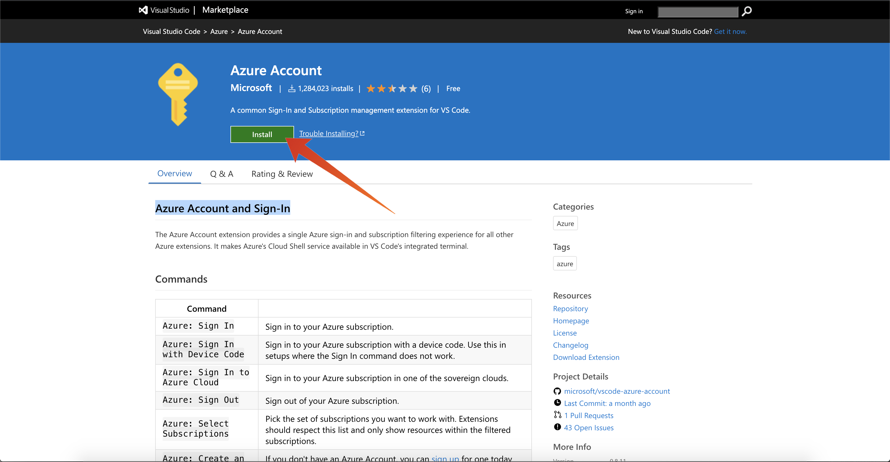

# 13.0 Configurare l&#39;ambiente

## 13.0.1 Creare una sottoscrizione di Azure

>[!NOTE]
>
>Se disponi già di una sottoscrizione di Azure, puoi saltare questo passaggio. Si prega di continuare con l&#39;esercizio 13.0.2 in questo caso.

Vai a [https://portal.azure.com](https://portal.azure.com) e accedi con il tuo account Azure. Se non ne hai uno, utilizza il tuo indirizzo e-mail personale per creare il tuo account Azure.


Dopo l&#39;accesso, verrà visualizzata la seguente schermata:


Fai clic sul menu a sinistra e seleziona **Tutte le risorse**, se non hai ancora effettuato la sottoscrizione, viene visualizzata la schermata di abbonamento ad Azure. In tal caso, seleziona **Inizia con una versione di prova gratuita di Azure**.


Compila il modulo di abbonamento di Azure, fornisci il tuo telefono cellulare e la tua carta di credito per l’attivazione (avrai un livello gratuito per 30 giorni e non potrai pagare, a meno che non aggiorni):


Al termine del processo di abbonamento, puoi andare:


## 13.0.2 Installare Visual Code Studio

Per gestire il progetto Azure, utilizzare Microsoft Visual Code Studio. Puoi scaricarlo tramite [questo link](https://code.visualstudio.com/download). Segui le istruzioni di installazione per il tuo sistema operativo specifico su quello stesso sito web.

## 13.0.3 Installare le estensioni del codice visivo

Installare le funzioni di Azure per il codice di Visual Studio da [https://marketplace.visualstudio.com/items?itemName=ms-azuretools.vscode-azurefunctions](https://marketplace.visualstudio.com/items?itemName=ms-azuretools.vscode-azurefunctions). Fai clic sul pulsante di installazione:


Installa l&#39;account Azure e accedi per il codice di Visual Studio da [https://marketplace.visualstudio.com/items?itemName=ms-vscode.azure-account](https://marketplace.visualstudio.com/items?itemName=ms-vscode.azure-account). Fai clic sul pulsante di installazione:



## 13.0.4 Installare node.js

>[!NOTE]
>
>Se hai già installato node.js, puoi saltare questo passaggio. Continuare con l&#39;esercizio 13.0.5 in questo caso.

### macOS

Assicurati di [Ebraico](https://brew.sh/) installato per primo. Seguire le istruzioni [qui](https://brew.sh/).


Dopo aver installato Homebrew, esegui questo comando:

```javascript
brew install node
```

### Windows

Scarica la [Windows Installer](https://nodejs.org/en/#home-downloadhead) direttamente dal [nodejs.org](https://nodejs.org/it/) sito web.

## 13.0.5 Verifica la versione di node.js

Per questo modulo, è necessario che node.js versione 12 sia installato. Qualsiasi altra versione di node.js può causare problemi con l’esercizio 13.5.

Prima di continuare, verifica la versione di node.js .

Esegui questo comando per verificare la versione di node.js:

```javascript
node -v
```

Se la tua versione è inferiore o superiore a 12, devi eseguire l’aggiornamento o il downgrade.

### Aggiornamento/downgrade della versione di node.js in macOS

Verifica di disporre del pacchetto **n** installato.

Per installare il pacchetto **n**, esegui questo comando:

```javascript
sudo npm install -g n
```

Se la versione è inferiore o superiore alla versione 12, esegui questo comando per eseguire l&#39;aggiornamento o il downgrade:

```javascript
sudo n 12.6.0
```

### Aggiornare/scaricare la versione di node.js su Windows

Disinstalla node.js da Windows > Pannello di controllo Campaign > Aggiungi o rimuovi programmi.

Installazione della versione richiesta dalla [nodejs.org](https://nodejs.org/en/) sito web.

## 13.0.6 Installare il pacchetto NPM: richiesta

Devi installare il pacchetto **richiesta** come parte della configurazione node.js.

Per installare il pacchetto **richiesta**, esegui questo comando:

```javascript
npm install request
```


Passaggio successivo: [13.1 Configurare l’ambiente EventHub di Microsoft Azure](./ex1.md)

[Torna al modulo 13](./segment-activation-microsoft-azure-eventhub.md)

[Torna a tutti i moduli](./../../overview.md)
