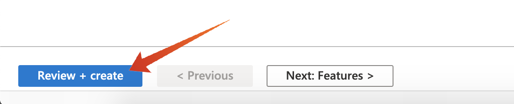

# 13.1 Configurare l’ambiente EventHub di Microsoft Azure

Azure Event Hubs è un servizio di pubblicazione-sottoscrizione altamente scalabile che può acquisire milioni di eventi al secondo e inviarli in più applicazioni. Questo consente di elaborare e analizzare le enormi quantità di dati prodotti dai dispositivi e dalle applicazioni collegati.

## 13.1.1 Cos’è Azure Event Hubs?

Azure Event Hubs è una grande piattaforma di streaming dati e un servizio di acquisizione eventi. Può ricevere ed elaborare milioni di eventi al secondo. I dati inviati a un hub eventi possono essere trasformati e memorizzati utilizzando qualsiasi provider di analisi in tempo reale o adattatori di batch/storage.

Hubs evento rappresenta il **porta principale** per una pipeline di eventi, spesso denominata inserimento di eventi nelle architetture della soluzione. Un archivio eventi è un componente o un servizio che si trova tra gli editori di eventi (come Adobe Experience Platform RTCDP) e i consumatori di eventi per dissociare la produzione di un flusso di eventi dal consumo di tali eventi. Event Hubs fornisce una piattaforma di streaming unificata con buffer di conservazione del tempo, che consente di scollegare i produttori di eventi dai consumatori di eventi.

## 13.1.2 Creare uno spazio dei nomi Hubs evento

Vai a [https://portal.azure.com/#home](https://portal.azure.com/#home) e seleziona **Creare una risorsa**.

Nella schermata delle risorse, immetti **Evento** nella barra di ricerca e seleziona **Hubs evento** dal menu a discesa :

Fai clic su **Crea**:

Se è la prima volta che crei una risorsa in Azure, dovrai crearne una nuova **Gruppo di risorse**. Se disponi già di un gruppo di risorse, puoi selezionarlo (o crearne uno nuovo).

Seleziona **Crea nuovo**, denomina il gruppo `--demoProfileLdap---aep-enablement`.

Completare la prova dei campi come indicato:

- Namespace : Definisci lo spazio dei nomi, deve essere univoco, utilizza il seguente pattern `--demoProfileLdap---aep-enablement`
- Posizione: **Europa occidentale** fa riferimento al centro dati di Azure ad Amsterdam
- Livello di prezzo: **Base**
- Unità di produzione: **1**

Fai clic su **Rivedi e crea**.

Fai clic su **Crea**.

La distribuzione del gruppo di risorse può richiedere da 1 a 2 minuti. Quando la distribuzione avrà esito positivo, verrà visualizzata la seguente schermata:

## 13.1.3 Configurazione dell’hub eventi in Azure

Vai a [https://portal.azure.com/#home](https://portal.azure.com/#home) e seleziona **Tutte le risorse**.

Dall’elenco delle risorse, seleziona la `--demoProfileLdap---aep-enablement` namespace:

In `--demoProfileLdap---aep-enablement` schermata di dettaglio, seleziona **Hubs evento**:

Fai clic su **+ Hub eventi**.

Utilizzo `--demoProfileLdap---aep-enablement-event-hub` come nome e fai clic su **Crea**.

Fai clic su **Hubs evento** nello spazio dei nomi dell&#39;hub eventi. Ora dovresti vedere il tuo **Hub eventi** elencati. In questo caso, puoi passare all’esercizio successivo.

## 13.1.4 Configurare l&#39;account di archiviazione Azure

Per eseguire il debug della funzione Hub eventi di Azure in esercizi successivi, è necessario fornire un account di archiviazione di Azure come parte della configurazione del progetto di Visual Studio Code. A questo punto verrà creato l&#39;account di archiviazione di Azure.

Vai a [https://portal.azure.com/#home](https://portal.azure.com/#home) e seleziona **Creare una risorsa**.

Invio **archiviazione** nella ricerca e seleziona **Account di archiviazione** dall&#39;elenco.

Seleziona **Crea**.

Specifica le **Gruppo risorse** (creato all&#39;inizio di questo esercizio), utilizza `--demoProfileLdap--aepstorage` come nome dell&#39;account di archiviazione e selezionare **Storage ridondante locale (LRS)**, quindi fai clic su **Rivedi e crea**.

Fai clic su **Crea**.

La creazione dell&#39;account di archiviazione richiederà un paio di secondi:

Al termine, la schermata visualizza **Vai alla risorsa** pulsante .

Fai clic su **Microsoft Azure**.

L&#39;account di archiviazione è ora visibile in **Risorse recenti**.

Passaggio successivo: [13.2 Configurare la destinazione dell&#39;hub eventi di Azure in Adobe Experience Platform](./ex2.md)

[Torna al modulo 13](./segment-activation-microsoft-azure-eventhub.md)

[Torna a tutti i moduli](./../../overview.md)
