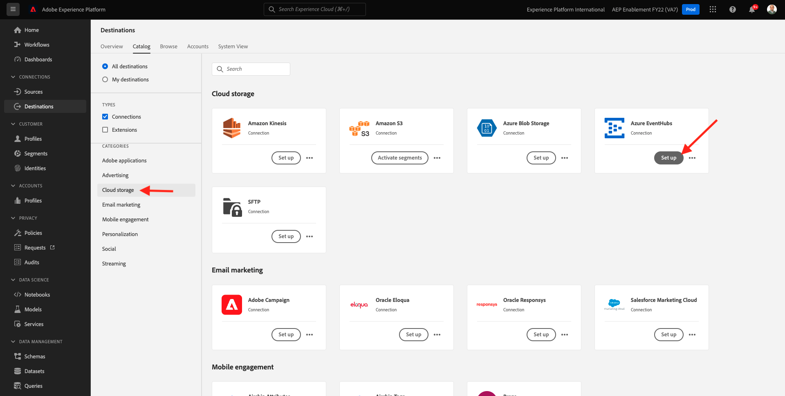

# 13.2 Configurare la destinazione dell&#39;hub eventi di Azure in Adobe Experience Platform

## 13.2.1 Identificare i parametri di connessione di Azure richiesti

Per definire una destinazione Hub eventi in Adobe Experience Platform, devi disporre dei seguenti elementi:

- Spazio dei nomi Hubs evento
- Hub eventi
- Nome chiave SAS di Azure
- Chiave SAS di Azure

Lo spazio dei nomi Event Hub e EventHub è stato definito nell’esercizio precedente: [Esercizio 1 - Configurazione dell’hub eventi in Azure](./ex1.md)

### Namespace Event Hubs

Per cercare le informazioni di cui sopra nel portale di Azure, passa a [https://portal.azure.com/#home](https://portal.azure.com/#home). Assicurati di utilizzare l’account Azure corretto.

Seleziona **Tutte le risorse** nel portale di Azure:

### Hub eventi

Cercare una risorsa con il tipo di risorsa **Namespace Event Hubs**, se hai seguito le convenzioni di denominazione utilizzate nell’esercizio precedente, Event Hubs Namespace sarà `--demoProfileLdap---aep-enablement`. Prendetene nota, ne avrete bisogno nel prossimo esercizio.

Fai clic sul nome dello spazio dei nomi Hubs evento per ottenere i dettagli:

Seleziona **Hubs evento** per ottenere un elenco degli hub evento definiti nello spazio dei nomi degli hub eventi, se si seguono le convenzioni di denominazione utilizzate nell’esercizio precedente, verrà trovato un hub eventi denominato `--demoProfileLdap---aep-enablement-event-hub`. Prendetene nota, ne avrete bisogno nel prossimo esercizio.

### Nome chiave SAS

Seleziona **Criteri di accesso condivisi** per **Namespace Event Hubs**

Verrà visualizzato un elenco dei criteri di accesso condiviso. La chiave SAS che stiamo cercando è **RootManageSharedAccessKey**. Nome della chiave SAS. Annotatela.

### Valore chiave SAS

Fai clic sul pulsante **RootManageSharedAccessKey** per ottenere il valore della chiave SAS. E premi il pulsante **Copia negli Appunti** per copiare **Chiave principale**:

### Riepilogo dei valori di destinazione

A questo punto, dovresti aver identificato tutti i valori necessari per definire la destinazione di Azure Event Hub in Adobe Experience Platform Real-time CDP.

| Nome attributo di destinazione | Valore attributo di destinazione | Valore di esempio |
|---|---|---|
| sasKeyName | Nome chiave SAS | RootManageSharedAccessKey |
| sasKey | Valore chiave SAS | srREx9ShJG1Rv7f/.. |
| namespace | Namespace Event Hubs | `--demoProfileLdap---aep-enablement` |
| eventHubName | Hub eventi | `--demoProfileLdap---aep-enablement-event-hub` |

## 13.2.2 Creare la destinazione dell&#39;hub eventi di Azure in Adobe Experience Platform

Accedi a Adobe Experience Platform andando a questo URL: [https://experience.adobe.com/platform](https://experience.adobe.com/platform).

Dopo aver effettuato l&#39;accesso, si aprirà la homepage di Adobe Experience Platform.

Prima di continuare, devi selezionare un **sandbox**. La sandbox da selezionare è denominata ``--aepSandboxId--``. Per eseguire questa operazione, fai clic sul testo **[!UICONTROL Produzione Prod]** nella linea blu sopra lo schermo. Dopo aver selezionato la sandbox appropriata, visualizzerai la modifica dello schermo e ora ti trovi nella sandbox dedicata.

Vai a **Destinazioni**, quindi vai a **Catalogo**.

Seleziona **Archiviazione cloud** e vai a **Hub eventi di Azure** e fai clic su **Configurazione** o **Configura**:

Inserisci i valori di destinazione raccolti nell&#39;esercizio precedente. Quindi, fai clic su **Connetti a destinazione**.

Se le tue credenziali sono corrette, verrà visualizzata una conferma: **Connesso**.

È ora necessario immettere il nome e la descrizione nel formato `--demoProfileLdap---aep-enablement`. Inserisci il **eventHubName** (vedere l’esercizio precedente, si presenta così: `--demoProfileLdap---aep-enablement-event-hub`) e fai clic su **Successivo**.

Fai clic su **Salva e esci**.

La destinazione viene ora creata e disponibile in Adobe Experience Platform.

Passaggio successivo: [13.3 Creare un segmento](./ex3.md)

[Torna al modulo 13](./segment-activation-microsoft-azure-eventhub.md)

[Torna a tutti i moduli](./../../overview.md)
