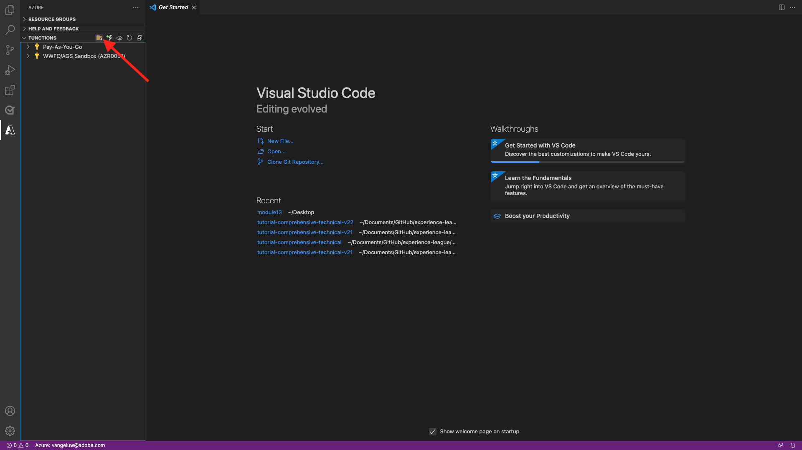
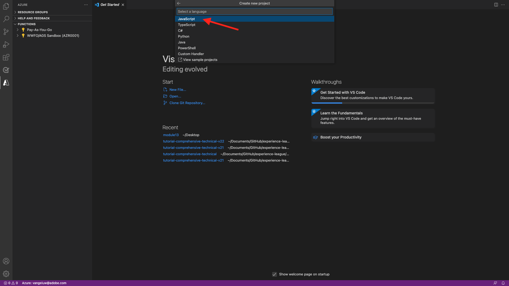
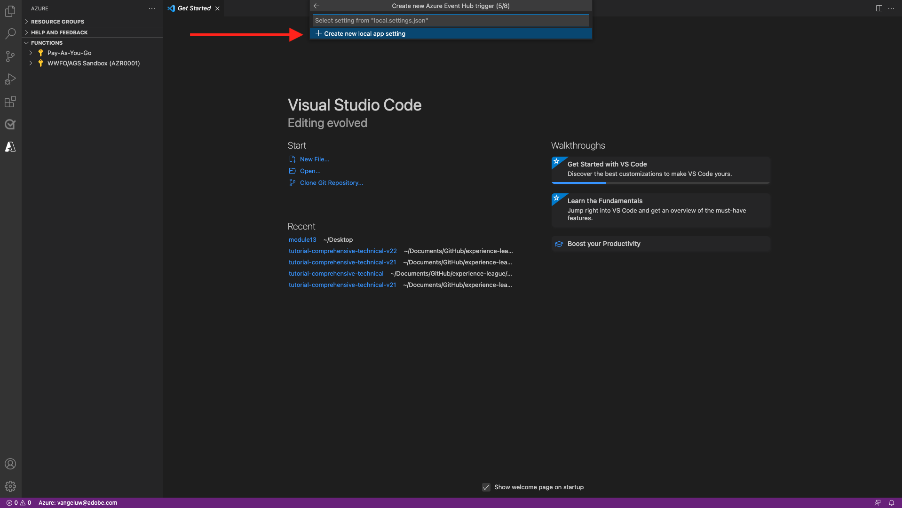
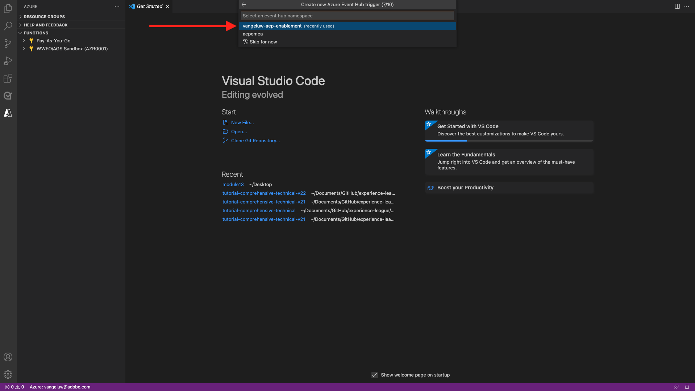
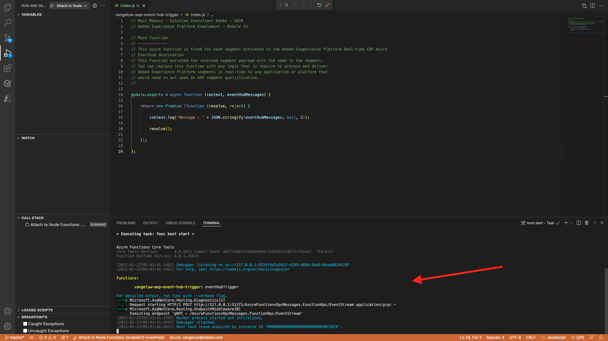

# 13.5 Creare il progetto Microsoft Azure

## 13.5.1 Come acquisire familiarità con le funzioni di Azure Event Hub

Funzioni di Azure ti consente di eseguire piccole parti di codice (denominate **Funzioni**) senza preoccuparsi delle infrastrutture applicative. Con le funzioni di Azure, l’infrastruttura cloud fornisce tutti i server aggiornati necessari per mantenere l’applicazione in esecuzione su larga scala.

Una funzione è **attivato** per un tipo specifico di evento. I trigger supportati includono la risposta a cambiamenti nei dati, risposte a messaggi (ad esempio, hub eventi), in esecuzione su una pianificazione o come risultato di una richiesta HTTP.

Funzioni di Azure è un servizio di elaborazione senza server che consente di eseguire il codice attivato dall’evento senza dover eseguire esplicitamente il provisioning o gestire l’infrastruttura.

Gli hub eventi di Azure si integrano con le funzioni di Azure per un’architettura senza server.

## 13.5.2 Aprire il codice di Visual Studio e accedere ad Azure

Il codice di Visual Studio consente di...

- definire ed eseguire il binding delle funzioni di Azure agli hub eventi
- test locale
- distribuzione in Azure
- esecuzione di una funzione di log remoto

### Apri codice di Visual Studio

Per aprire l&#39;immissione di codice di Visual Studio **visivo** nella ricerca del sistema operativo (ricerca Spotlight su OSX, ricerca nella barra delle applicazioni di Windows). Se non lo trovi, devi ripetere i passaggi descritti in [Esercizio 0 - Prerequisiti](./ex0.md).


### Accesso ad Azure

Quando si effettua l’accesso all’account Azure utilizzato per la registrazione in [Esercizio 0 - Prerequisiti](./ex0.md), il codice di Visual Studio consente di trovare ed eseguire il binding di tutte le risorse di Event Hub.

Fai clic sul pulsante **Azure** in Visual Studio Code. Se non disponi di tale opzione, potrebbe essersi verificato un errore durante l&#39;installazione delle estensioni richieste.

Seleziona successivo **Accesso ad Azure**:


Verrai reindirizzato al tuo browser per l&#39;accesso. Ricordare di selezionare l’account Azure che hai utilizzato per la registrazione.


Quando nel browser viene visualizzata la seguente schermata, si è connessi con Visual Code Studio:


Torna a Visual Code Studio (verrà visualizzato il nome della sottoscrizione di Azure, ad esempio **Sottoscrizione di Azure 1**):


## 13.5.3 Creare un progetto Azure

Quando passi il puntatore del mouse **Sottoscrizione di Azure 1**, sopra la sezione viene visualizzato un menu, seleziona **Crea nuovo progetto...**:



Seleziona una cartella locale a scelta per salvare il progetto e fai clic su **Seleziona**:


Ora verrà visualizzata la procedura guidata di creazione del progetto. Seleziona **Javascript** come lingua del progetto:



Seleziona **Trigger dell’hub eventi di Azure** come primo modello di funzione del progetto:


Immettere un nome per la funzione, utilizzare il formato seguente `--demoProfileLdap---aep-event-hub-trigger` e premere enter:


Seleziona **Crea nuova impostazione per app locale**:



Seleziona uno spazio dei nomi hub eventi per visualizzare l’hub eventi definito in **Esercizio 2**. In questo esempio lo spazio dei nomi Event Hub è **vangeluw-aep-enablement**:



Seleziona il tuo Event Hub, dovresti vedere l’Hub eventi definito in **Esercizio 2**. Nel mio caso, **vangeluw-aep-enablement-event-hub**:


Seleziona **RootManageSharedAccessKey** come criterio dell’hub eventi:


Immettere l&#39;utilizzo **$Default**:


Seleziona **Aggiungi all’area di lavoro** su come aprire il progetto:


Dopo aver creato il progetto, fai clic su **index.js** per aprire il file nell’editor:


Il payload inviato da Adobe Experience Platform al tuo Event Hub includerà gli ID del segmento:

```json
[{
"segmentMembership": {
"ups": {
"ca114007-4122-4ef6-a730-4d98e56dce45": {
"lastQualificationTime": "2020-08-31T10:59:43Z",
"status": "realized"
},
"be2df7e3-a6e3-4eb4-ab12-943a4be90837": {
"lastQualificationTime": "2020-08-31T10:59:56Z",
"status": "realized"
},
"39f0feef-a8f2-48c6-8ebe-3293bc49aaef": {
"lastQualificationTime": "2020-08-31T10:59:56Z",
"status": "realized"
}
}
},
"identityMap": {
"ecid": [{
"id": "08130494355355215032117568021714632048"
}]
}
}]
```

Sostituisci il codice contenuto in index.js del codice di Visual Studio con il codice seguente. Questo codice verrà eseguito ogni volta che Real-time CDP invia le qualifiche dei segmenti alla destinazione Event Hub. Nel nostro esempio, il codice riguarda solo la visualizzazione e l’ottimizzazione del payload ricevuto. Ma potete immaginare qualsiasi tipo di funzione per elaborare le qualifiche dei segmenti in tempo reale.

```javascript
// Marc Meewis - Solution Consultant Adobe - 2020
// Adobe Experience Platform Enablement - Module 13

// Main function
// -------------
// This azure function is fired for each segment activated to the Adobe Exeperience Platform Real-time CDP Azure 
// Eventhub destination
// This function enriched the received segment payload with the name fo the segment. 
// You can replace this function with any logic that is require to process and deliver
// Adobe Experience Platform segments in real-time to any application or platform that 
// would need to act upon an AEP segment qualiification.
// 

module.exports = async function (context, eventHubMessages) {

    return new Promise (function (resolve, reject) {

        context.log('Message : ' + JSON.stringify(eventHubMessages, null, 2));

        resolve();

    });    

};
```

Il risultato dovrebbe essere simile al seguente:


## 13.5.4 Esecuzione del progetto Azure

Ora è il momento di eseguire il progetto. A questo punto il progetto non verrà distribuito ad Azure. Lo eseguiremo localmente in modalità di debug. Seleziona l’icona Esegui e fai clic sulla freccia verde.


La prima volta che esegui il progetto in modalità di debug, dovrai allegare un account di archiviazione di Azure e fare clic su **Seleziona account di archiviazione**.


Dall&#39;elenco degli account di archiviazione, selezionare quello creato come parte [13.1.4 Configurare l&#39;account di archiviazione Azure](./ex1.md). L&#39;account di archiviazione è denominato `--demoProfileLdap--aepstorage`ad esempio: **mmeewisaepstorage**.


Il progetto è ora in esecuzione ed è elencato per gli eventi nell’Hub eventi. Nel prossimo esercizio dimostrerai il comportamento sul sito web dimostrativo Luma che ti qualificherà per questi segmenti. Di conseguenza, riceverai un payload di qualificazione dei segmenti nel terminale della funzione di attivazione di Event Hub:


## 13.5.5 Arresta progetto Azure

Per interrompere il progetto, seleziona la **Terminale** scheda, fare clic nella finestra del terminale e premere **CMD-C** su OSX o **CTRL+C** su Windows:



Passaggio successivo: [13.6 Scenario end-to-end](./ex6.md)

[Torna al modulo 13](./segment-activation-microsoft-azure-eventhub.md)

[Torna a tutti i moduli](./../../overview.md)
