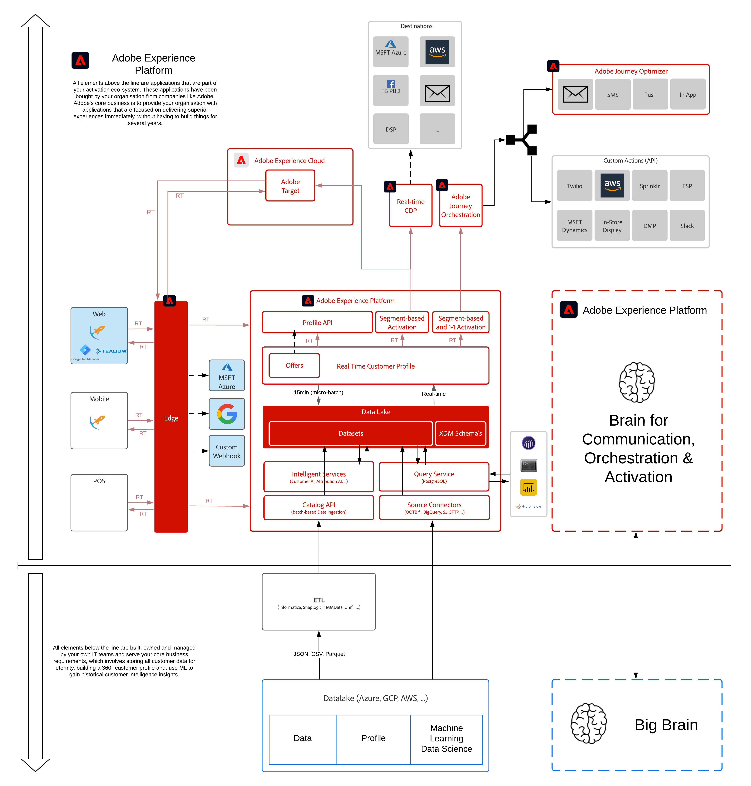

# 14. Connessioni Real-Time CDP: Inoltro eventi

**Autore: [Wouter Van Geluwe](https://www.linkedin.com/in/woutervangeluwe/), [Clemente Delalande](https://www.linkedin.com/in/clement-delalande/)**

In questo modulo, utilizzerai i set di dati, gli schemi e la proprietà client di raccolta dati di Adobe Experience Platform configurati in precedenza per raccogliere i dati e quindi inoltrare tali dati lato server a un endpoint di scelta.

In questo modulo:

- Creare una proprietà Adobe Experience Platform Data Collection Server
- Installa e utilizza l’estensione Adobe Cloud Connector in Adobe Experience Platform Data Collection
- Creare un endpoint della funzione Google e inviare i dati ad esso
- Creare un endpoint AWS e inviare i dati ad esso

Guarda questo video per comprendere il valore, il percorso del cliente e il processo di configurazione:

>[!VIDEO](https://video.tv.adobe.com/v/331987?quality=12&learn=on)

## Finalità di apprendimento

- Acquisisci familiarità con le proprietà di Adobe Experience Platform Data Collection Server e la nuova estensione Adobe Cloud Connector
- Comprendere come riutilizzare i dati dell’SDK web Adobe Experience Platform in soluzioni di terze parti come Google e AWS
- Scopri l’architettura alla base di Adobe Experience Platform Data Collection e Server Side Forwarding.

## Prerequisiti

- Accesso alla raccolta dati di Adobe Experience Platform e Adobe Experience Platform
- Informazioni sui set di dati Adobe Experience Platform e XDM

>[!IMPORTANT]
>
>Questa esercitazione è stata creata per facilitare un particolare formato del workshop. Utilizza sistemi e account specifici a cui potresti non avere accesso. Anche senza accesso, pensiamo che si possa ancora imparare molto leggendo attraverso questo contenuto molto dettagliato. Se partecipi a uno dei workshop e hai bisogno delle tue credenziali di accesso, contatta il tuo rappresentante di Adobe che ti fornirà le informazioni richieste.

## Panoramica dell’architettura

Scopri l’architettura riportata di seguito, che evidenzia i componenti che verranno discussi e utilizzati in questo modulo.

## Sandbox da utilizzare

Per questo modulo, utilizza questa sandbox: `--aepSandboxId--`.

>[!NOTE]
>
>Non dimenticare di installare, configurare e utilizzare l’estensione Chrome come riferimento in [0.1 - Installare l’estensione Chrome per la documentazione di Experience League](../module0/ex1.md)

## Esercizi

[14.1 Creare una proprietà Data Collection Event Forwarding](./ex1.md)

In questo esercizio, creerai la proprietà Adobe Experience Platform Data Collection Event Forwarding .

[14.2 Aggiorna il tuo Datastream per rendere i dati disponibili per la tua proprietà Data Collection Event Forwarding](./ex2.md)

In questo esercizio, aggiornerai il Datastream esistente per rendere disponibili alla proprietà Adobe Experience Platform Data Collection Server i dati raccolti dalla proprietà Adobe Experience Platform Data Collection Client.

[14.3 Creare e configurare un webhook personalizzato](./ex3.md)

In questo esercizio, creerai e configurerai un webhook personalizzato e inizierai a inoltrare i dati raccolti dall’SDK Web a tale webhook personalizzato.

[14.4 Creare e configurare una funzione Google Cloud](./ex4.md)

In questo esercizio, creerai e configurerai una funzione Google Cloud e inizierai a inoltrare a Google i dati raccolti dall’SDK per web.

[14.5 Eventi in avanti verso l&#39;ecosistema AWS](./ex5.md)

In questo esercizio, configurerai il tuo ambiente AWS utilizzando AWS API Gateway, AWS Kinesis, AWS Firehose e AWS S3, dopodiché inizierai a inoltrare i dati dell’evento raccolti dall’SDK per web.

[Riepilogo e vantaggi](./summary.md)

Riepilogo di questo modulo e panoramica dei vantaggi.

>[!NOTE]
>
>Grazie per aver investito il tuo tempo nell&#39;imparare tutto quello che c&#39;è da sapere su Adobe Experience Platform. Se hai domande, vuoi condividere feedback generali su suggerimenti su contenuti futuri, contatta direttamente Wouter Van Geluwe, inviando un&#39;e-mail a **vangeluw@adobe.com**.

[Torna a tutti i moduli](../../overview.md)
