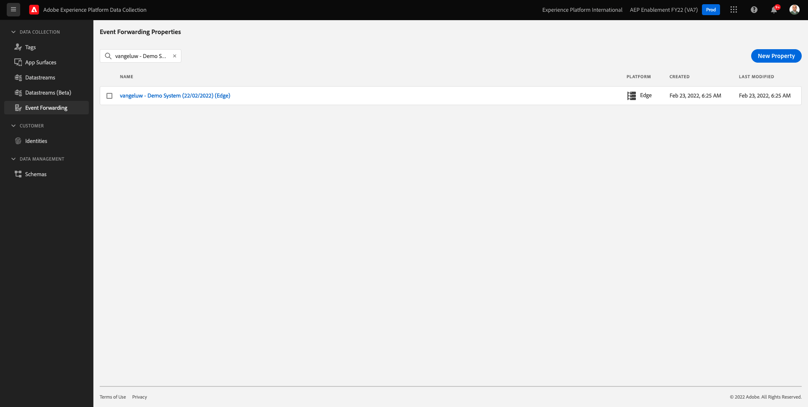
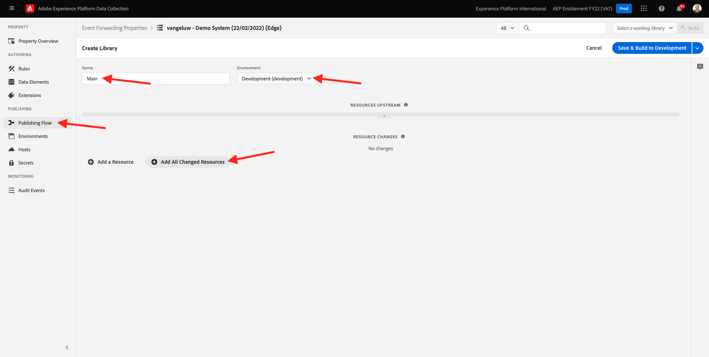

# 14.1 Creare una proprietà Adobe Experience Platform Data Collection Event Forwarding

>[!NOTE]
>
>L’estensione mobile Adobe Experience Platform Edge è attualmente in BETA. L&#39;utilizzo di questa estensione avviene solo su invito. Contatta il tuo Adobe Customer Success Manager per saperne di più e accedere ai materiali di questa esercitazione.

## 14.1.1 Cos&#39;è una proprietà Adobe Experience Platform Data Collection Event Forwarding?

In genere, quando i dati vengono raccolti utilizzando la raccolta dati di Adobe Experience Platform, vengono raccolti sul **Lato client**. La **Lato client** è un ambiente come un sito web o un’app mobile. Nel modulo 0 e nel modulo 1, la configurazione di una proprietà Adobe Experience Platform Data Collection Client è stata discussa in profondità e hai implementato la proprietà Adobe Experience Platform Data Collection Client sul sito web e sull’applicazione mobile, in modo che i dati potessero essere raccolti in tale sito quando un cliente interagiva con il sito web e l’applicazione mobile.

Quando i dati di interazione vengono raccolti dalla proprietà Adobe Experience Platform Data Collection Client, una richiesta viene inviata dal sito web o dall’app mobile a Adobe Edge. Edge è l’ambiente di raccolta dati di Adobe ed è il punto di ingresso per i dati clickstream nell’ecosistema di Adobe. Da Edge, i dati raccolti vengono quindi inviati ad applicazioni come Adobe Experience Platform, Adobe Analytics, Adobe Audience Manager o Adobe Target.

Con l&#39;aggiunta di una proprietà Adobe Experience Platform Data Collection Event Forwarding, è ora possibile configurare una proprietà Adobe Experience Platform Data Collection che ascolti i dati in arrivo sul server Edge. Quando la proprietà Adobe Experience Platform Data Collection Event Forwarding in esecuzione su Edge visualizza i dati in arrivo, può utilizzare tali dati e inoltrarli a un altro punto. Che da qualche altra parte può ora anche essere un webhook esterno non Adobe, che rende possibile inviare quei dati ad esempio, il vostro lago di dati di scelta, un&#39;applicazione decisionale, o qualsiasi altra applicazione che ha la capacità di aprire un webhook.

La configurazione di una proprietà Adobe Experience Platform Data Collection Event Forwarding ha un aspetto familiare a una proprietà Client, con la possibilità di configurare elementi dati e regole come in passato con le proprietà client Adobe Experience Platform Data Collection. Tuttavia, la modalità di accesso e utilizzo dei dati sarà leggermente diversa, a seconda del caso d’uso.

Cominciamo creando la proprietà Adobe Experience Platform Data Collection Event Forwarding .

## 14.1.2 Creare una proprietà Adobe Experience Platform Data Collection Event Forwarding

Vai a [https://experience.adobe.com/#/data-collection/](https://experience.adobe.com/#/data-collection/). Nel menu a sinistra, fai clic su **Inoltro eventi**. Verrà visualizzata una panoramica di tutte le proprietà disponibili di Adobe Experience Platform Data Collection Event Forwarding. Fai clic sul pulsante **Nuova proprietà.**

È ora necessario immettere un nome per la proprietà Adobe Experience Platform Data Collection Event Forwarding. Come convenzione di denominazione, utilizza `--demoProfileLdap-- - Demo System (DD/MM/YYYY) (Edge)`. Ad esempio, in questo esempio, il nome è **vangeluw - Demo System (22/02/2022) (Edge)**. Fai clic su **Salva**.

Tornerai quindi all’elenco delle proprietà di Adobe Experience Platform Data Collection Event Forwarding . Fai clic su per aprire la proprietà appena creata.

## 14.1.2 Configura l&#39;estensione Adobe Cloud Connector

Nel menu a sinistra, vai a **Estensioni**. Vedrai che il **Core** l&#39;estensione è già configurata.

Vai a **Catalogo**. Vedrete il **Connettore cloud di Adobe** estensione. Fai clic su **Installa** per installarlo.

Verrà quindi aggiunta l’estensione . Non c&#39;è configurazione da eseguire in questo passaggio. Verrai rimandato alla panoramica delle estensioni installate.

## 14.1.3 Distribuisci la proprietà Adobe Experience Platform Data Collection Event Forwarding

Nel menu a sinistra, vai a **Flusso di pubblicazione**. Fai clic su **Aggiungi libreria**.

Immettere il nome **Principale**, seleziona l’ambiente **Sviluppo (sviluppo)** e fai clic su **+ Aggiungi tutte le risorse modificate**.

Vedrete questo. Fai clic su **Salva e genera per sviluppo**.

Verrà quindi creata la libreria, che potrebbe richiedere 1-2 minuti.

Infine, la tua libreria verrà creata e pronta.

Passaggio successivo: [14.2 Aggiorna il tuo Datastream per rendere i dati disponibili per la tua proprietà Data Collection Event Forwarding](./ex2.md)

[Torna al modulo 14](./aep-data-collection-ssf.md)

[Torna a tutti i moduli](./../../overview.md)
