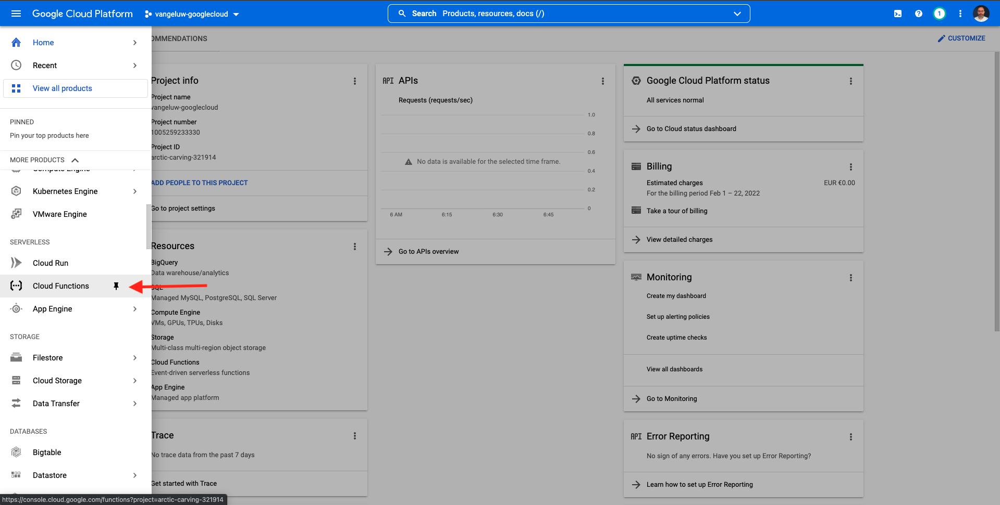
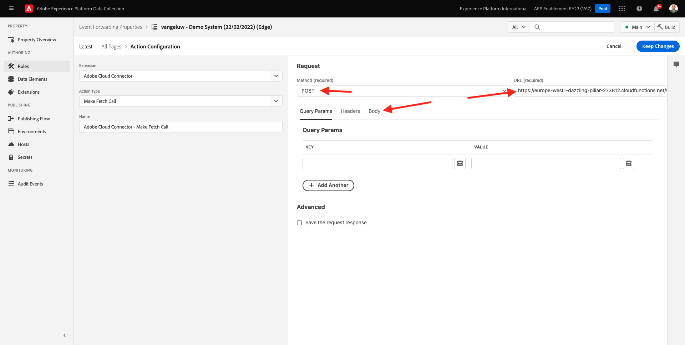
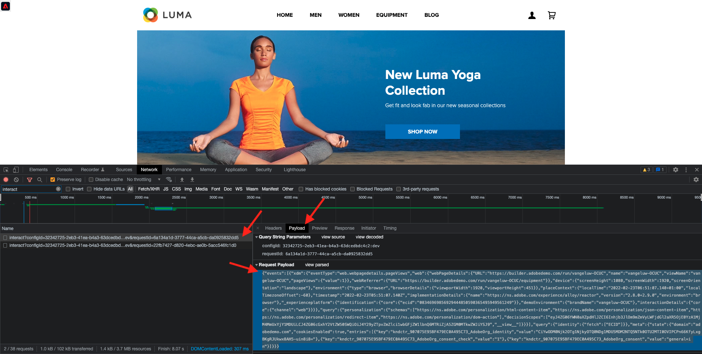
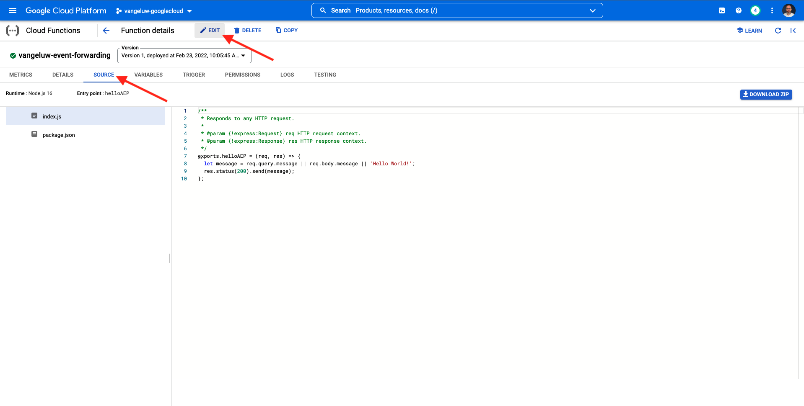

# 14.4 Creare e configurare una funzione Google Cloud

## 14.4.1 Crea la tua funzione Google Cloud

Vai a [https://console.cloud.google.com/](https://console.cloud.google.com/). Vai a **Funzioni cloud**.



Vedrete questo. Fai clic su **CREA FUNZIONE**.


Vedrete questo.


Effettua le seguenti scelte:

- **Nome funzione**: `--demoProfileLdap---event-forwarding`
- **Regione**: seleziona una regione
- **Tipo di trigger**: select **HTTP**
- **Autenticazione**: select **Consenti chiamate non autenticate**

Dovrebbe avere questo ora. Fai clic su **SALVA**.


Fai clic su **SUCCESSIVO**.


Vedrai questo:


Effettua le seguenti scelte:

- **Runtime**: select **Node.js 16** (o più recente)
- **Punto di ingresso**: enter **helloAEP**

Fai clic su **ABILITA API** per abilitare **API di Cloud Build**. Verrà visualizzata una nuova finestra. In quella nuova finestra, fai clic su **ABILITA** di nuovo.


Vedrete questo. Fai clic su **Abilita**.


Una volta **API di Cloud Build** è stato abilitato, verrà visualizzato questo.


Torna alla pagina **Funzione cloud**.
Nell’editor in linea della funzione cloud, assicurati di avere il seguente codice:

```javascript
/**
 * Responds to any HTTP request.
 *
 * @param {!express:Request} req HTTP request context.
 * @param {!express:Response} res HTTP response context.
 */
exports.helloAEP = (req, res) => {
  let message = req.query.message || req.body.message || 'Hello World!';
  res.status(200).send(message);
};
```

Quindi, fai clic su **DISTRIBUZIONE**.


Vedrete questo. È in corso la creazione della funzione Cloud. L&#39;operazione potrebbe richiedere un paio di minuti.


Una volta creata ed eseguita la funzione, verrà visualizzato questo. Fai clic sul nome della funzione per aprirla.


Vedrete questo. Vai a **TRIGGER**. Vedrai il **URL trigger** che è ciò che verrà utilizzato per definire l’endpoint nel lato server di Launch.


Copia l&#39;URL del trigger, che si presenta così: **https://europe-west1-dazzling-pillar-273812.cloudfunctions.net/vangeluw-event-forwarding**.

Nei passaggi successivi, configurerai Adobe Experience Platform Data Collection Server per lo streaming di informazioni specifiche su **Visualizzazioni pagina** alla tua funzione Google Cloud. Invece di inoltrare l&#39;intero payload così com&#39;è, invierai solo cose come **ECID**, **timestamp** e **Nome pagina** alla tua funzione Google Cloud.

Ecco un esempio di payload da analizzare per filtrare le variabili di cui sopra:

```json
{
  "events": [
    {
      "xdm": {
        "eventType": "web.webpagedetails.pageViews",
        "web": {
          "webPageDetails": {
            "URL": "https://builder.adobedemo.com/run/vangeluw-OCUC",
            "name": "vangeluw-OCUC",
            "viewName": "vangeluw-OCUC",
            "pageViews": {
              "value": 1
            }
          },
          "webReferrer": {
            "URL": "https://builder.adobedemo.com/run/vangeluw-OCUC/equipment"
          }
        },
        "device": {
          "screenHeight": 1080,
          "screenWidth": 1920,
          "screenOrientation": "landscape"
        },
        "environment": {
          "type": "browser",
          "browserDetails": {
            "viewportWidth": 1920,
            "viewportHeight": 451
          }
        },
        "placeContext": {
          "localTime": "2022-02-23T06:51:07.140+01:00",
          "localTimezoneOffset": -60
        },
        "timestamp": "2022-02-23T05:51:07.140Z",
        "implementationDetails": {
          "name": "https://ns.adobe.com/experience/alloy/reactor",
          "version": "2.8.0+2.9.0",
          "environment": "browser"
        },
        "_experienceplatform": {
          "identification": {
            "core": {
              "ecid": "08346969856929444850590365495949561249"
            }
          },
          "demoEnvironment": {
            "brandName": "vangeluw-OCUC"
          },
          "interactionDetails": {
            "core": {
              "channel": "web"
            }
          }
        }
      },
      "query": {
        "personalization": {
          "schemas": [
            "https://ns.adobe.com/personalization/html-content-item",
            "https://ns.adobe.com/personalization/json-content-item",
            "https://ns.adobe.com/personalization/redirect-item",
            "https://ns.adobe.com/personalization/dom-action"
          ],
          "decisionScopes": [
            "eyJ4ZG06YWN0aXZpdHlJZCI6Inhjb3JlOm9mZmVyLWFjdGl2aXR5OjE0YzA1MjM4MmUxYjY1MDUiLCJ4ZG06cGxhY2VtZW50SWQiOiJ4Y29yZTpvZmZlci1wbGFjZW1lbnQ6MTRiZjA5ZGM0MTkwZWJiYSJ9",
            "__view__"
          ]
        }
      }
    }
  ],
  "query": {
    "identity": {
      "fetch": [
        "ECID"
      ]
    }
  },
  "meta": {
    "state": {
      "domain": "adobedemo.com",
      "cookiesEnabled": true,
      "entries": [
        {
          "key": "kndctr_907075E95BF479EC0A495C73_AdobeOrg_identity",
          "value": "CiYwODM0Njk2OTg1NjkyOTQ0NDg1MDU5MDM2NTQ5NTk0OTU2MTI0OVIPCPn66KfyLxgBKgRJUkwx8AH5-uin8i8="
        },
        {
          "key": "kndctr_907075E95BF479EC0A495C73_AdobeOrg_consent_check",
          "value": "1"
        },
        {
          "key": "kndctr_907075E95BF479EC0A495C73_AdobeOrg_consent",
          "value": "general=in"
        }
      ]
    }
  }
}
```

Questi sono i campi che contengono le informazioni da analizzare:

- ECID: **events.xdm_experienceplatform.identity.core.ecid**
- timestamp: **timestamp**
- Nome pagina: **events.xdm.web.webPageDetails.name**

Andiamo ora su Adobe Experience Platform Data Collection Server per configurare gli elementi dati in modo che ciò sia possibile.

## 14.4.2 Aggiorna la proprietà Event Forwarding : Elementi dati

Vai a [https://experience.adobe.com/#/data-collection/](https://experience.adobe.com/#/data-collection/) e vai a **Inoltro eventi**. Cerca la proprietà Event Forwarding e fai clic su di essa per aprirla.


Nel menu a sinistra, vai a **Elementi dati**. Fai clic su **Aggiungi elemento dati**.


Verrà quindi visualizzato un nuovo elemento dati da configurare.


Effettua la selezione seguente:

- Come **Nome**, inserisci **customerECID**.
- Come **Estensione**, seleziona **Core**.
- Come **Tipo di elemento dati**, seleziona **Percorso**.
- Come **Percorso**, inserisci `arc.event.xdm.--aepTenantId--.identification.core.ecid`. Inserendo questo percorso, filtrerai il campo **ecid** dal payload dell’evento inviato dal sito web o dall’app mobile in Adobe Edge.

>[!NOTE]
>
>Nei percorsi sopra e sotto viene fatto riferimento a **arc**. **arc** sta per contesto risorsa Adobe e **arc** sta sempre per l&#39;oggetto disponibile più alto disponibile nel contesto lato server. Arricchimenti e trasformazioni possono essere aggiunti a quello **arc** mediante le funzioni di Adobe Experience Platform Data Collection Server.
>
>Nei percorsi sopra e sotto viene fatto riferimento a **event**. **event** sta per un evento univoco e Adobe Experience Platform Data Collection Server valuterà sempre ogni singolo evento. A volte è possibile visualizzare un riferimento a **events** nel payload inviato dal lato client dell’SDK per web, ma in Adobe Experience Platform Data Collection Server, ogni evento viene valutato singolarmente.

Ora avrà questo. Fai clic su **Salva**.


Fai clic su **Aggiungi elemento dati**.


Verrà quindi visualizzato un nuovo elemento dati da configurare.


Effettua la selezione seguente:

- Come **Nome**, inserisci **eventTimestamp**.
- Come **Estensione**, seleziona **Core**.
- Come **Tipo di elemento dati**, seleziona **Percorso**.
- Come **Percorso**, inserisci **arc.event.xdm.timestamp**. Inserendo questo percorso, filtrerai il campo **timestamp** dal payload dell’evento inviato dal sito web o dall’app mobile in Adobe Edge.

Ora avrà questo. Fai clic su **Salva**.


Fai clic su **Aggiungi elemento dati**.


Verrà quindi visualizzato un nuovo elemento dati da configurare.


Effettua la selezione seguente:

- Come **Nome**, inserisci **pageName**.
- Come **Estensione**, seleziona **Core**.
- Come **Tipo di elemento dati**, seleziona **Percorso**.
- Come **Percorso**, inserisci **arc.event.xdm.web.webPageDetails.name**. Inserendo questo percorso, filtrerai il campo **name** dal payload dell’evento inviato dal sito web o dall’app mobile in Adobe Edge.

Ora avrà questo. Fai clic su **Salva**.


Ora sono stati creati i seguenti elementi dati:


## 14.4.3 Aggiorna la proprietà Event Forwarding : Aggiornare una regola

Nel menu a sinistra, vai a **Regole**. Nell’esercizio precedente, hai creato la regola **Tutte le pagine**. Fai clic su tale regola per aprirla.


Allora farai questo. Fai clic sul pulsante **+** icona sotto **Azioni** per aggiungere una nuova azione.


Vedrete questo.


Effettua la selezione seguente:

- Seleziona la **Estensione**: **Connettore cloud di Adobe**.
- Seleziona la **Tipo di azione**: **Fai una chiamata di recupero**.

Questo dovrebbe darvi questo **Nome**: **Connettore cloud di Adobe - Effettua una chiamata di recupero**. Ora dovresti vedere quanto segue:


Quindi, configura quanto segue:

- Modifica il protocollo di richiesta da GET a **POST**
- Inserisci l’URL della funzione cloud Google che hai creato in uno dei passaggi precedenti, simile al seguente: **https://europe-west1-dazzling-pillar-273812.cloudfunctions.net/vangeluw-event-forwarding**

Dovrebbe avere questo ora. Quindi, vai a **Corpo**.



Vedrete questo. Fai clic sul pulsante di scelta per **JSON**.


Configura le **Corpo** come segue:

| CHIAVE | VALORE |
|--- |--- |
| customerECID | {{customerECID}} |
| pageName | {{pageName}} |
| eventTimestamp | {{eventTimestamp}} |

Vedrete questo. Fai clic su **Mantieni modifiche**.


Vedrete questo. Fai clic su **Salva**.


È ora possibile aggiornare la regola esistente in una proprietà Adobe Experience Platform Data Collection Server. Vai a **Flusso di pubblicazione** per pubblicare le modifiche. Apri la libreria di sviluppo . **Principale** facendo clic su **Modifica** come indicato.


Fai clic sul pulsante **Aggiungi tutte le risorse modificate** , dopodiché vedrai la regola e l&#39;elemento dati visualizzati in questa libreria. Quindi, fai clic su **Salva e genera per sviluppo**. Le modifiche vengono ora distribuite.


Dopo un paio di minuti, vedrai che la distribuzione è completata e pronta per essere testata.


## 14.3.4 Verifica la configurazione

Vai a [https://builder.adobedemo.com/projects](https://builder.adobedemo.com/projects). Dopo aver effettuato l’accesso con il tuo Adobe ID, vedrai questo. Fai clic sul progetto del tuo sito web per aprirlo.


Ora puoi seguire il flusso seguente per accedere al sito web. Fai clic su **Integrazioni**.


Sulla **Integrazioni** pagina , devi selezionare la proprietà Raccolta dati creata nell&#39;esercizio 0.1.


Vedrai il tuo sito web demo aperto. Seleziona l’URL e copialo negli Appunti.


Apri una nuova finestra del browser in incognito.


Incolla l’URL del sito web dimostrativo che hai copiato nel passaggio precedente. Ti verrà quindi chiesto di effettuare l&#39;accesso utilizzando il tuo Adobe ID.


Seleziona il tipo di account e completa il processo di accesso.


Il sito web verrà quindi caricato in una finestra del browser in incognito. Per ogni dimostrazione, è necessario utilizzare una nuova finestra del browser in incognito per caricare l’URL del sito web demo.


Quando apri il browser Developer View, puoi controllare le richieste di rete come indicato di seguito. Quando utilizzi il filtro **interagire**, vedrai le richieste di rete inviate dal client di raccolta dati di Adobe Experience Platform ad Adobe Edge.



Passa alla funzione Google Cloud e passa a **REGISTRI**. Ora dovresti avere una visualizzazione simile a questa, con una serie di voci di registro visualizzate. Ogni volta che vedi **Esecuzione della funzione avviata**, significa che il traffico in entrata è stato ricevuto nella tua funzione Google Cloud.


Aggiorna un po&#39; la tua funzione per lavorare con i dati in arrivo e visualizza le informazioni ricevute da Adobe Experience Platform Data Collection Server. Vai a **ORIGINE** e fai clic su **MODIFICA**.



Nella schermata successiva, fai clic su **SUCCESSIVO**.


Aggiorna il tuo codice in questo modo:

```javascript
/**
 * Responds to any HTTP request.
 *
 * @param {!express:Request} req HTTP request context.
 * @param {!express:Response} res HTTP response context.
 */
exports.helloAEP = (req, res) => {
  console.log('>>>>> Function has started. The following information was received from Event Forwarding:');
  console.log(req.body);

  let message = req.query.message || req.body.message || 'Hello World!';
  res.status(200).send(message);
};
```

Poi avrai questo. Fai clic su **DISTRIBUZIONE**.


Dopo un paio di minuti, la funzione verrà nuovamente distribuita. Fai clic sul nome della funzione per aprirla.


Nel sito web dimostrativo, accedi a un prodotto, ad esempio **CAPRI DI RELAX-FIT DEIRDRE**.


Passa alla funzione Google Cloud e passa a **REGISTRI**. Ora dovresti avere una visualizzazione simile a questa, con una serie di voci di registro visualizzate.

Per ogni visualizzazione di pagina sul sito web demo, è ora necessario visualizzare una nuova voce di registro nei registri della funzione Google Cloud, che mostra le informazioni ricevute.


I dati raccolti da Adobe Experience Platform Data Collection in tempo reale sono stati inviati correttamente a un endpoint Google Cloud Function. Da lì, tali dati possono essere utilizzati da qualsiasi applicazione Google Cloud Platform, ad esempio BigQuery per l&#39;archiviazione e il reporting o per i casi di utilizzo di Machine Learning.

Passaggio successivo: [14.5 Eventi in avanti verso l&#39;ecosistema AWS](./ex5.md)

[Torna al modulo 14](./aep-data-collection-ssf.md)

[Torna a tutti i moduli](./../../overview.md)
