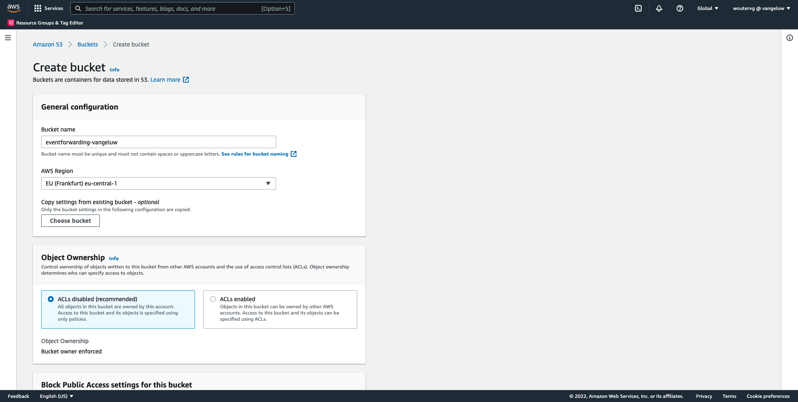
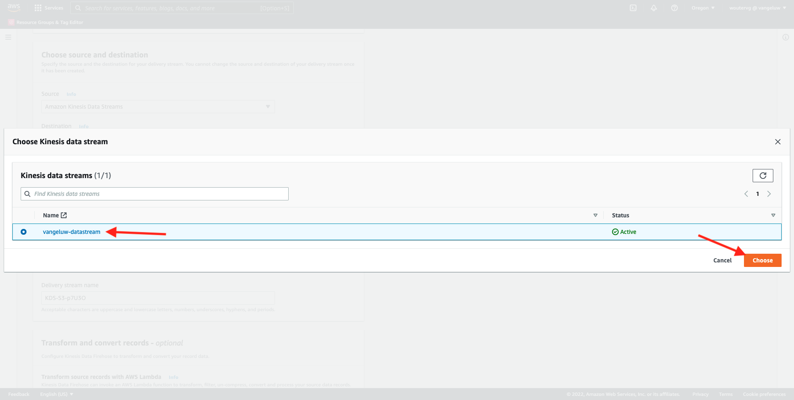
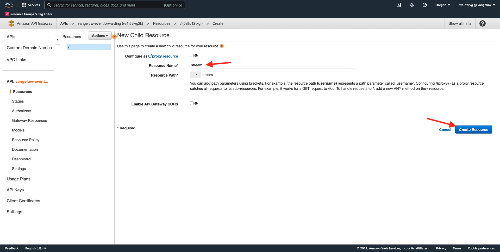
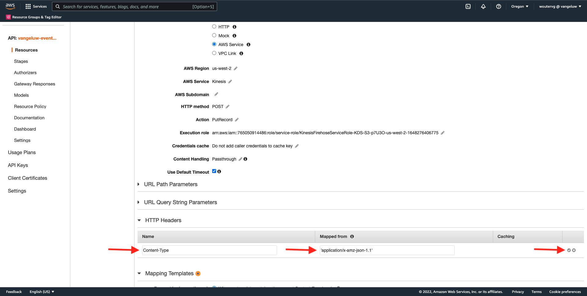
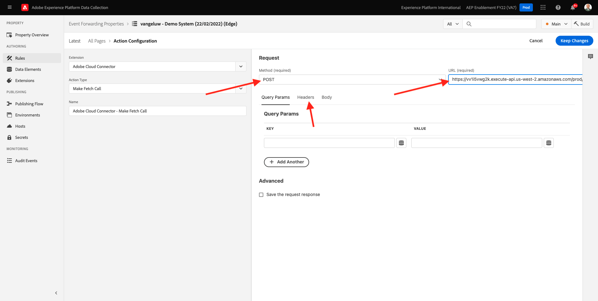

# 14.5 Eventi in avanti verso l&#39;ecosistema AWS

>[!IMPORTANT]
>
>Il completamento di questo esercizio è facoltativo e comporta un costo per l’utilizzo di AWS Kinesis. Mentre AWS fornisce un account di livello gratuito che consente di testare e configurare molti servizi senza costi, AWS Kinesis non fa parte di tale account di livello gratuito. Quindi, per implementare e testare questo esercizio, sarà necessario sostenere un costo per l’utilizzo di AWS Kinesis.

## Buono a sapere

Adobe Experience Platform supporta vari servizi Amazon come destinazione.
Kinesis e S3 sono entrambi [destinazioni di esportazione del profilo](https://experienceleague.adobe.com/docs/experience-platform/destinations/destination-types.html?lang=en) e può essere utilizzato come parte di Adobe Experience Platform Real-Time CDP.
Puoi facilmente inserire nei tuoi sistemi selezionati eventi di segmento di alto valore e attributi di profilo associati.

In questa nota viene illustrato come impostare il proprio flusso Kinesis di Amazon per lo streaming dei dati degli eventi provenienti dall’ecosistema Adobe Experience Platform Edge verso una destinazione di archiviazione cloud, ad esempio Amazon S3. Questa funzione è utile nel caso in cui desideri raccogliere eventi di esperienza da proprietà web e mobili e inviarli al datalake per l’analisi e il reporting operativo. I database generalmente acquisiscono i dati in modo batch con importazioni di file giornaliere di grandi dimensioni, non espongono endpoint http pubblico che potrebbe essere utilizzato in combinazione con l’inoltro degli eventi.

Supportare i casi d’uso di cui sopra implica che i dati in streaming devono essere bufferizzati o messi in coda prima di essere scritti in un file. È necessario prestare attenzione a non aprire i file per l’accesso in scrittura in più processi. Delegare questo compito a un sistema dedicato è ideale per scalare bene garantendo al contempo un ottimo livello di servizio, è qui che Kinesis viene in soccorso.

Amazon Kinesis Data Streams si concentra sull&#39;acquisizione e la memorizzazione di flussi di dati. Kinesis Data Firehose si concentra sulla distribuzione di flussi di dati per determinate destinazioni, ad esempio bucket S3.

Come parte di questo esercizio,..

- Eseguire la configurazione di base di un flusso di dati Kinesis
- Crea un flusso di consegna Firehose e utilizza il bucket S3 come destinazione
- Configura il gateway API Amazon come endpoint api rest per ricevere i dati dell’evento
- Inoltrare i dati evento non elaborati da Adobe Edge al flusso Kinesis

## 14.5.1 Configura il bucket AWS S3

Vai a [https://console.aws.amazon.com](https://console.aws.amazon.com) e accedi con l’account Amazon creato in precedenza.


Dopo l&#39;accesso, verrai reindirizzato al **Console di gestione AWS**.


In **Trova servizi** menu, cerca **s3**. Fai clic sul primo risultato della ricerca: **S3 - Storage scalabile nel cloud**.


Vedrai il **Amazon S3** homepage. Fai clic su **Crea bucket**.


In **Crea bucket** è necessario configurare due elementi:

- Nome: utilizza il nome `eventforwarding---demoProfileLdap--`. Ad esempio, in questo esercizio il nome del bucket è **aepmodulertcdpvangeluw**
- Regione: utilizza la regione **UE (Francoforte) eu-central-1**



Lascia invariate tutte le altre impostazioni predefinite. Scorri verso il basso e fai clic su **Crea bucket**.


Vedrai quindi il tuo bucket creato e verrà reindirizzato alla home page di Amazon S3.


## 14.5.2 Configurare AWS Kinesis Data Stream

In **Trova servizi** menu, cerca **cinesi**. Fai clic sul primo risultato della ricerca: **Kinesis - Utilizzo dei dati in streaming in tempo reale**.


Seleziona **Flussi dati Kinesis**. Fai clic su **Creare un flusso di dati**.


Per **Nome flusso dati**, utilizza `--demoProfileLdap---datastream`.


Non è necessario modificare nessuna delle altre impostazioni. Scorri verso il basso e fai clic su **Creare un flusso di dati**.


Vedrete questo. Una volta creato correttamente il flusso di dati, puoi passare all’esercizio successivo.


## 14.5.3 Configura il flusso di distribuzione AWS Firehose

In **Trova servizi** menu, cerca **cinesi**. Fai clic su **Kinesis Data Firehose**.


Fai clic su **Creare un flusso di consegna**.


Per **Origine**, seleziona **Flussi dati Amazon Kinesis**. Per **Destinazione**, seleziona **Amazon S3**. Fai clic su **Sfoglia** per selezionare il flusso di dati.


Seleziona il flusso di dati. Fai clic su **Scegli**.



Vedrete questo. Ricorda **Nome del flusso di consegna** perché ne avrete bisogno più tardi.


Scorri verso il basso fino a visualizzare **Impostazioni di destinazione**. Fai clic su **Sfoglia** per selezionare il bucket S3.


Seleziona il tuo bucket S3 e fai clic su **Scegli**.


Poi vedrete qualcosa del genere. Aggiorna le seguenti impostazioni:

- Partizionamento dinamico: impostato su **Abilitato**
- Disaggregazione di più record: impostato su **Disabilitato**
- Nuovo delimitatore di riga: impostato su **Abilitato**
- Analisi in linea per JSON: impostato su **Abilitato**


Scorri un po&#39; verso il basso, poi vedrai questo. Aggiorna le seguenti impostazioni:

- Tasti di partizione dinamica
   - Nome chiave: **dynamicPartitioningKey**
   - Espressione JQ: **.dynamicPartitioningKey**
- Prefisso bucket S3: aggiungi il seguente codice:

```bash
!{partitionKeyFromQuery:dynamicPartitioningKey}/!{timestamp:yyyy}/!{timestamp:MM}/!{timestamp:dd}/!{timestamp:HH}/}
```

- Prefisso di uscita errore del bucket S3: impostato su **errore**


Infine, scorri verso il basso e fai clic su **Creare un flusso di consegna**


Dopo un paio di minuti, verrà creato il flusso di consegna e **Attivo**.


## 14.5.4 Configura il tuo ruolo AWS IAM

In **Trova servizi** menu, cerca **iam**. Fai clic su **Gateway API**.


Fai clic su **Ruoli**.


Cerca il tuo **KinesisFirehose** ruolo. Fai clic su di esso per aprirlo.


Fai clic sul nome del criterio delle autorizzazioni per aprirlo.


Nella nuova schermata visualizzata, fai clic su **Modifica criterio**.


Sotto **Kinesis** - **Azioni**, assicura che **Scrivi** autorizzazioni per **PutRecord** è abilitato. Fai clic su **Criteri di revisione**.


Fai clic su **Salva modifiche**.


Allora tornerai qui. Fai clic su **Ruoli**.


Cerca il tuo **KinesisFirehose** ruolo. Fai clic su di esso per aprirlo.


Vai a **Relazioni di trust** e fai clic su **Modifica criterio di attendibilità**.


Sovrascrivi il criterio di attendibilità corrente incollando questo codice per sostituire il codice esistente:

```json
{
	"Version": "2012-10-17",
	"Statement": [
		{
			"Effect": "Allow",
			"Principal": {
				"Service": [
                    "firehose.amazonaws.com",
                    "kinesis.amazonaws.com",
                    "apigateway.amazonaws.com"
                ]
			},
			"Action": "sts:AssumeRole"
		}
	]
}
```

Fai clic su **Aggiorna criterio**


Vedrete questo. È necessario specificare il **ARN** per questo ruolo nel passaggio successivo.


## 14.5.5 Configurare il gateway API di AWS

Amazon API Gateway è un servizio AWS per la creazione, la pubblicazione, la manutenzione, il monitoraggio e la protezione delle API REST, HTTP e WebSocket su qualsiasi scala. Gli sviluppatori API possono creare API che accedono ad AWS o ad altri servizi web, nonché dati memorizzati in AWS Cloud.

Ora puoi esporre il flusso di dati Kinesis a Internet tramite un endpoint HTTPS che può essere utilizzato direttamente dai servizi Adobe, come Event Forwarding.

In **Trova servizi** menu, cerca **gateway api**. Fai clic su **Gateway API**.


Poi vedrete qualcosa del genere. Fai clic su **Creare API**.


Fai clic su **Crea** sulla **API REST** il Card.


Vedrete questo. Compila le impostazioni come segue:

- Scegli il protocollo: select **REST**
- Crea nuova API: select **Nuova API**
- Impostazioni:
   - Nome API: use `--demoProfileLdap---eventforwarding`
   - Tipo endpoint: select **Regionale**

Fai clic su **Creare API**.


Vedrete questo. Fai clic su **Azioni** quindi fai clic su **Crea risorsa**.


Vedrete questo. Imposta **Nome risorsa** a **flusso**. Fai clic su **Crea risorsa**.



Vedrete questo. Fai clic su **Azioni** quindi fai clic su **Metodo Create**.


Nel menu a discesa , seleziona **POST** e fai clic su **v** pulsante .


Vedrete questo. Compila le impostazioni come segue:

- Tipo di integrazione: **Servizio AWS**
- Regione AWS: seleziona la regione utilizzata dal flusso di dati Kinesis, in questo caso: **us-west-2**
- Servizio AWS: select **Kinesis**
- Sottodominio AWS: lascia vuoto
- Metodo HTTP: select **POST**
- Tipo azione: select **Usa nome azione**
- Azione: enter **PutRecord**
- Ruolo di esecuzione: incolla **ARN** del ruolo di esecuzione utilizzato dal Kinesis Data Firehose, come indicato nell&#39;esercizio precedente
- Gestione dei contenuti: select **Passaggio**
- Usa timeout predefinito: attiva la casella di controllo

Fai clic su **Salva**.


Vedrete questo. Fai clic su **Richiesta di integrazione**.


Fai clic su **Intestazioni HTTP**.


Scorri verso il basso e fai clic su **Aggiungi intestazione**.


Imposta **Nome** a **Content-Type**, set **Mappata da** a `'application/x-amz-json-1.1'`. Fai clic sul pulsante **v** per salvare le modifiche.



Vedrete questo. Per **Richiedi passaggio del corpo**, seleziona **In assenza di modelli definiti (consigliato)**. Quindi, fai clic su **Aggiungi modello di mappatura**.


Sotto **Content-Type**, inserisci **application/json**. Fai clic sul pulsante **v** per salvare le modifiche.


Scorri verso il basso per trovare una finestra dell&#39;editor di codice. Incolla qui il codice seguente:

```json
{
  "StreamName": "$input.path('StreamName')",
  "Data": "$util.base64Encode($input.json('$.Data'))",
  "PartitionKey": "$input.path('$.PartitionKey')"
}
```

Fai clic su **Salva**.


Quindi, scorri verso l’alto e fai clic su **&lt;- Esecuzione del metodo** per tornare indietro.


Fai clic su **PROVA**.


Scorri verso il basso e incolla questo codice in **Corpo della richiesta**. Fai clic su **Test**.

```json
{
  "Data": {
    "message": "Hello World",
    "dynamicPartitioningKey": "v2"
  },
  "PartitionKey": "1",
  "StreamName": "--demoProfileLdap---datastream"
}
```


Verrà quindi visualizzato un risultato simile:


Vedrete questo. Fai clic su **Azioni** quindi fai clic su **Implementare l’API**.


Per **Fase di distribuzione**, seleziona **Nuovo stadio**. Come **Nome della fase**, inserisci **prod**. Fai clic su **Distribuzione**.


Vedrete questo. Fai clic su **Salva modifiche**. FYI: l’URL nell’immagine è l’URL a cui inviare i dati (in questo esempio: https://vv1i5vwg2k.execute-api.us-west-2.amazonaws.com/prod).


Puoi testare la tua configurazione utilizzando la seguente richiesta cURL, tutto quello che devi fare è sostituire l&#39;URL seguente con il tuo, `https://vv1i5vwg2k.execute-api.us-west-2.amazonaws.com/prod` in questo esempio, e aggiungi `/stream` alla fine dell’URL.

```json
curl --location --request POST 'https://vv1i5vwg2k.execute-api.us-west-2.amazonaws.com/prod/stream' \
--header 'Content-Type: application/json' \
--data-raw '{
    "Data": {
        "userid": "--demoProfileLdap--@adobe.com",
        "firstName":"--demoProfileLdap--",
        "offerName":"10% off on outdoor gears",
        "offerCode": "10OFF-SPRING",
        "dynamicPartitioningKey": "campaign"
    },
    "PartitionKey": "1",
    "StreamName": "--demoProfileLdap---datastream"
}'
```

Incolla il codice aggiornato di cui sopra in una finestra Terminal e premi invio. Verrà quindi visualizzata questa risposta, simile alla risposta che potresti visualizzare durante il test precedente.


## 14.5.6 Aggiorna la proprietà Event Forwarding

È ora possibile eseguire l’attivazione nel flusso di dati di AWS Kinesis tramite gateway API di AWS, in modo da poter inviare eventi di esperienza grezzi all’ecosistema AWS. Utilizzando Connessioni Real-Time CDP e Inoltro eventi, ora puoi facilmente abilitare l’inoltro degli eventi all’endpoint gateway API di AWS appena creato.

### 14.5.6.1 Aggiorna la proprietà Event Forwarding : Creare un elemento dati

Vai a [https://experience.adobe.com/#/data-collection/](https://experience.adobe.com/#/data-collection/) e vai a **Inoltro eventi**. Cerca la proprietà Event Forwarding e fai clic su di essa per aprirla.


Nel menu a sinistra, vai a **Elementi dati**. Fai clic su **Aggiungi elemento dati**.


Verrà quindi visualizzato un nuovo elemento dati da configurare.


Effettua la selezione seguente:

- Come **Nome**, inserisci **awsDataObject**.
- Come **Estensione**, seleziona **Core**.
- Come **Tipo di elemento dati**, seleziona **Codice personalizzato**.

Ora avrà questo. Fai clic su **&lt;/> Open Editor**.


Nell’editor, incolla il seguente codice alla riga 3. Fai clic su **Salva**.

```javascript
const newObj = {...arc.event.xdm, dynamicPartitioningKey: "event_forwarding"}
return JSON.stringify(newObj);
```


>[!NOTE]
>
>Nel percorso precedente viene fatto riferimento a **arc**. **arc** sta per contesto risorsa Adobe e **arc** sta sempre per l&#39;oggetto disponibile più alto disponibile nel contesto lato server. Arricchimenti e trasformazioni possono essere aggiunti a quello **arc** mediante le funzioni di Adobe Experience Platform Data Collection Server.
>
>Nel percorso precedente viene fatto riferimento a **event**. **event** sta per un evento univoco e Adobe Experience Platform Data Collection Server valuterà sempre ogni singolo evento. A volte è possibile visualizzare un riferimento a **events** nel payload inviato dal lato client dell’SDK per web, ma in Adobe Experience Platform Data Collection Event Forwarding, ogni evento viene valutato singolarmente.

Allora tornerai qui. Fai clic su **Salva** o **Salva nella libreria**.


### 14.5.6.2 Aggiorna la proprietà Adobe Experience Platform Data Collection Server : Aggiorna la regola

Nel menu a sinistra, vai a **Regole**. Fai clic per aprire la regola **Tutte le pagine** creato in uno degli esercizi precedenti.


Vedrete questo. Fai clic sul pulsante **+** per aggiungere una nuova azione.


Vedrete questo. Effettua la selezione seguente:

- Seleziona la **Estensione**: **Connettore cloud di Adobe**.
- Seleziona la **Tipo di azione**: **Fai una chiamata di recupero**.

Questo dovrebbe darvi questo **Nome**: **Connettore cloud di Adobe - Effettua una chiamata di recupero**. Ora dovresti vedere quanto segue:


Quindi, configura quanto segue:

- Modifica il metodo di richiesta da GET a **POST**
- Inserisci l’URL dell’endpoint gateway API AWS creato in uno dei passaggi precedenti, simile al seguente: `https://vv1i5vwg2k.execute-api.us-west-2.amazonaws.com/prod/stream`

Dovrebbe avere questo ora. Quindi, vai a **Intestazioni**.



Sotto le intestazioni, aggiungi una nuova intestazione con chiave **Content-Type** e valore **application/json**. Quindi, vai a **Corpo**.


Vedrete questo. Incolla il seguente codice nel campo . **Corpo (grezzo)**. Fai clic su **Mantieni modifiche**.

```json
{
    "Data":{{awsDataObject}},
    "PartitionKey": "1",
    "StreamName": "--demoProfileLdap---datastream"
}
```


Vedrete che sarà di nuovo qui. Fai clic su **Salva** o **Salva nella libreria**.


Ora hai configurato la tua prima regola in una proprietà Inoltro eventi. Vai a **Flusso di pubblicazione** per pubblicare le modifiche.
Apri la libreria Sviluppo facendo clic su **Principale**.


Fai clic sul pulsante **Aggiungi tutte le risorse modificate** , dopodiché vedrai le modifiche a Rule e Data Element apparire in questa libreria. Quindi, fai clic su **Salva e genera per sviluppo**. Le modifiche vengono ora distribuite.


Dopo un paio di minuti, vedrai che la distribuzione è completata e pronta per essere testata.


## 14.5.7 Verifica la configurazione

Vai a [https://builder.adobedemo.com/projects](https://builder.adobedemo.com/projects). Dopo aver effettuato l’accesso con il tuo Adobe ID, vedrai questo. Fai clic sul progetto del tuo sito web per aprirlo.


Ora puoi seguire il flusso seguente per accedere al sito web. Fai clic su **Integrazioni**.


Sulla **Integrazioni** pagina , devi selezionare la proprietà Raccolta dati creata nell&#39;esercizio 0.1.


Vedrai il tuo sito web demo aperto. Seleziona l’URL e copialo negli Appunti.


Apri una nuova finestra del browser in incognito.


Incolla l’URL del sito web dimostrativo che hai copiato nel passaggio precedente. Ti verrà quindi chiesto di effettuare l&#39;accesso utilizzando il tuo Adobe ID.


Seleziona il tipo di account e completa il processo di accesso.


Il sito web verrà quindi caricato in una finestra del browser in incognito. Per ogni dimostrazione, è necessario utilizzare una nuova finestra del browser in incognito per caricare l’URL del sito web demo.


Quando apri il browser Developer View, puoi controllare le richieste di rete come indicato di seguito. Quando utilizzi il filtro **interagire**, vedrai le richieste di rete inviate dal client di raccolta dati di Adobe Experience Platform ad Adobe Edge.


Se selezioni il payload non elaborato, vai a [https://jsonformatter.org/json-pretty-print](https://jsonformatter.org/json-pretty-print) e incolla il payload. Fai clic su **Rendi carino**. Vedrai quindi il payload JSON, il **events** e **xdm** oggetto. In uno dei passaggi precedenti, quando hai definito l’elemento dati, hai utilizzato il riferimento **arc.event.xdm**, che consente di analizzare il **xdm** oggetto del payload.


Cambia la visualizzazione in **AWS**. Aprendo il flusso di dati e entrando nel **Monitoraggio** , verrà ora visualizzato il traffico in entrata.


Quando poi apri il flusso di consegna e vai nel **Monitoraggio** , vedrai anche il traffico in entrata.


Infine, quando guardi il tuo bucket S3, noterai che i file vengono creati lì come conseguenza dell’inserimento dei dati.


Quando scarichi un file di questo tipo e lo apri utilizzando un editor di testo, vedrai che contiene il payload XDM dagli eventi inoltrati.


Passaggio successivo: [Riepilogo e vantaggi](./summary.md)

[Torna al modulo 14](./aep-data-collection-ssf.md)

[Torna a tutti i moduli](./../../overview.md)
