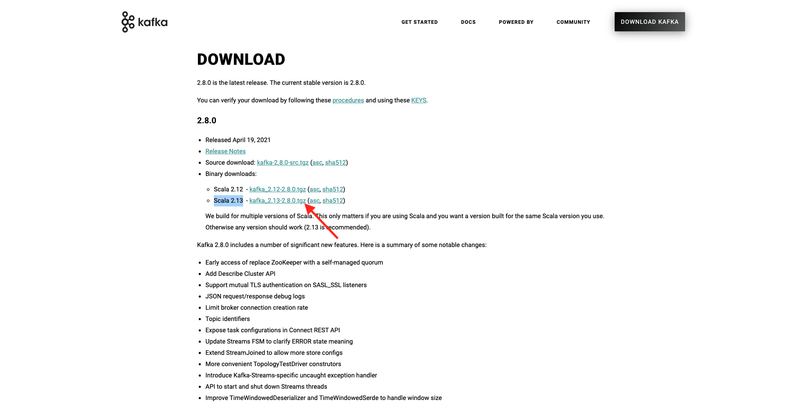
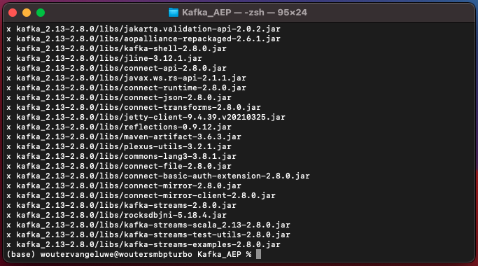
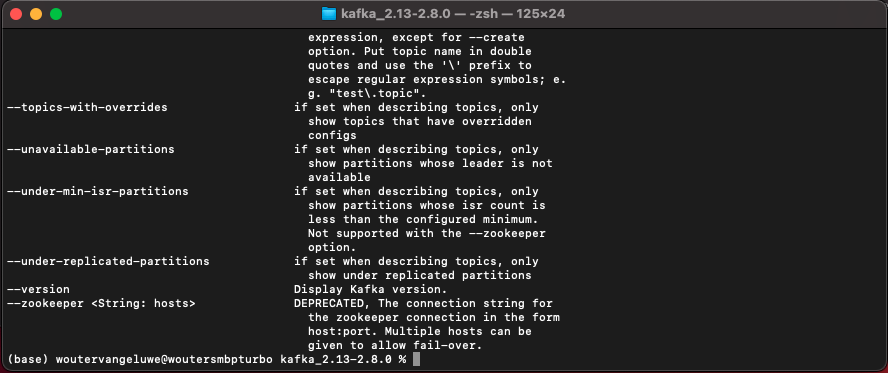
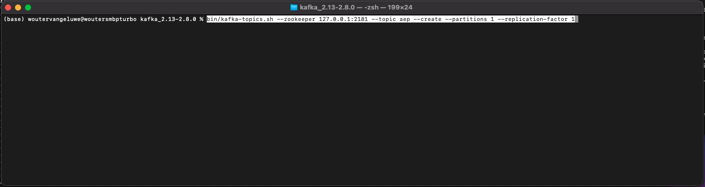
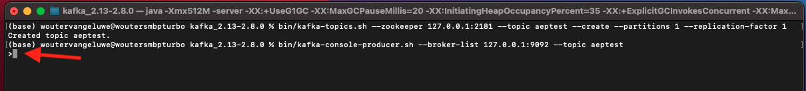

# 15.2 Installare e configurare il cluster Kafka

## 15.2.1 Scarica Apache Kafka

Vai a [https://kafka.apache.org/downloads](https://kafka.apache.org/downloads) e scarica l&#39;ultima versione rilasciata. Seleziona la versione binaria più recente, in questo caso **Scala 2,13**.

Poi vieni portato in un sito mirror. Fai clic sul link suggerito per scaricare Kafka.

Crea una cartella sul desktop denominata **Kafka_AEP** e inserire il file scaricato in quella directory.

Apri un **Terminale** facendo clic con il pulsante destro del mouse sulla cartella e facendo clic su **Nuovo terminale nella cartella**.

Esegui questo comando nella finestra Terminal per decomprimere il file scaricato:

`tar -xvf kafka_2.13-3.1.0.tgz`

>[!NOTE]
>
>Verifica che il comando precedente corrisponda alla versione del file scaricato. Se la versione è più recente, è necessario aggiornare il comando precedente per far corrispondere tale versione.

Vedrai questo:

Dopo aver decompresso quel file, ora avete una directory come questa:

E in quella directory, vedrete questi sottodirectory:

Torna alla finestra Terminal. Immetti il seguente comando:

`cd kafka_2.13-3.1.0`

>[!NOTE]
>
>Verifica che il comando precedente corrisponda alla versione del file scaricato. Se la versione è più recente, è necessario aggiornare il comando precedente per far corrispondere tale versione.

Quindi, immetti il comando `bin/kafka-topics.sh`.

Dovresti quindi visualizzare questa risposta. Ciò significa che Kafka è installato correttamente e che Java sta funzionando bene. (Promemoria: hai bisogno di Java 8 JDK o Java 11 JDK installato perché questo funzioni!. Puoi vedere quale versione Java hai installato utilizzando il comando `java -version`.)

## 15.2.2 Avvia Kafka

Per iniziare Kafka, avrai bisogno di avviare Kafka Zookeeper e Kafka, in questo ordine.

Apri un **Terminale** facendo clic con il pulsante destro del mouse sulla cartella **kafka_2.13-3.1.0** e facendo clic su **Nuovo terminale nella cartella**.

Inserisci questo comando:

`bin/zookeeper-server-start.sh config/zookeeper.properties`

Vedrai questo:

Tieni aperta questa finestra mentre stai attraversando questi esercizi!

Apri un altro, nuovo **Terminale** facendo clic con il pulsante destro del mouse sulla cartella **kafka_2.13-3.1.0** e facendo clic su **Nuovo terminale nella cartella**.

Inserisci questo comando:

`bin/kafka-server-start.sh config/server.properties`

Vedrai questo:

Tieni aperta questa finestra mentre stai attraversando questi esercizi!

## 15.2.3 Creare un argomento Kafka

Apri un **Terminale** facendo clic con il pulsante destro del mouse sulla cartella **kafka_2.13-3.1.0** e facendo clic su **Nuovo terminale nella cartella**.

Inserisci questo comando per creare un nuovo argomento Kafka con il nome **test positivo**. Questo argomento verrà utilizzato per il test in questo esercizio.

`bin/kafka-topics.sh --create --topic aeptest --bootstrap-server localhost:9092`

Verrà visualizzata una conferma simile:

Inserisci questo comando per creare un nuovo argomento Kafka con il nome **aep**. Questo argomento verrà utilizzato da Adobe Experience Platform Sink Connector che verrà configurato negli esercizi successivi.

`bin/kafka-topics.sh --create --topic aep --bootstrap-server localhost:9092`

Verrà visualizzata una conferma simile:

## 15.2.4 Eventi di produzione

Torna alla finestra Terminal in cui hai creato il tuo primo argomento Kafka e immetti il seguente comando:

`bin/kafka-console-producer.sh --broker-list 127.0.0.1:9092 --topic aeptest`

Vedrete questo. A ogni nuova riga seguita da un pulsante Invio viene inviato un nuovo messaggio nell’argomento **test positivo**.

Invio `Hello AEP` e premi Invio. Il tuo primo evento è stato inviato nell&#39;istanza Kafka locale, nell&#39;argomento **test positivo**.

Invio `Hello AEP again.` e premi Invio.

Invio `AEP Data Collection is the best.` e premi Invio.

Ora hai prodotto 3 eventi nell&#39;argomento **test positivo**. Questi eventi possono ora essere utilizzati da un&#39;applicazione che potrebbe necessitare di tali dati.

Sulla tastiera, fai clic su `Control` e `C` allo stesso tempo per chiudere il produttore.

## 15.2.4 Eventi di consumo

Nella stessa finestra Terminal utilizzata per generare eventi, immettere il comando seguente:

`bin/kafka-console-consumer.sh --bootstrap-server 127.0.0.1:9092 --topic aeptest --from-beginning`

Verranno quindi visualizzati tutti i messaggi prodotti nell&#39;esercizio precedente per l&#39;argomento **test positivo**, viene visualizzato nel consumer. Apache Kafka funziona così: un produttore crea eventi in una pipeline e un consumatore li consuma.

Sulla tastiera, fai clic su `Control` e `C` allo stesso tempo per chiudere il produttore.

In questo esercizio, hai esaminato tutte le nozioni di base per configurare un cluster Kafka locale, creare un argomento Kafka, produrre eventi e consumare eventi.

L&#39;obiettivo di questo modulo è quello di simulare cosa succederebbe se una vera organizzazione avesse già implementato un cluster Apache Kafka, e volesse trasmettere dati dal proprio cluster Kafka a Adobe Experience Platform.

Per facilitare tale implementazione, è stato creato un connettore Adobe Experience Platform Sink che può essere implementato utilizzando Kafka Connect. È possibile trovare la documentazione di quel connettore Sink Adobe Experience Platform qui: [https://github.com/adobe/experience-platform-streaming-connect](https://github.com/adobe/experience-platform-streaming-connect).

Negli esercizi successivi, implementerai tutto il necessario per utilizzare il connettore Sink Adobe Experience Platform dall&#39;interno del tuo cluster Kafka locale.

Chiudi la finestra del terminale.

Ha finito questo esercizio.

Passaggio successivo: [15.3 Configurare l’endpoint API HTTP in Adobe Experience Platform](./ex3.md)

[Torna al modulo 15](./aep-apache-kafka.md)

[Torna a tutti i moduli](../../overview.md)
