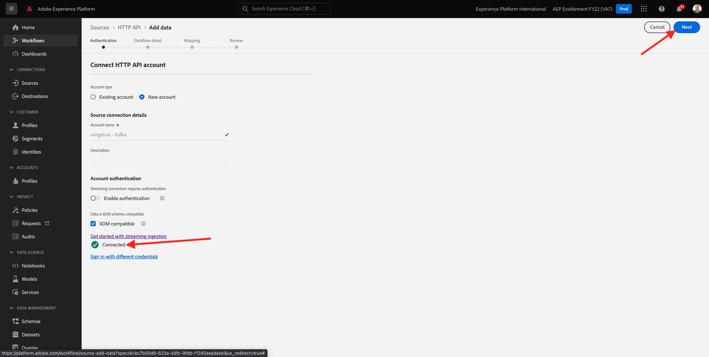
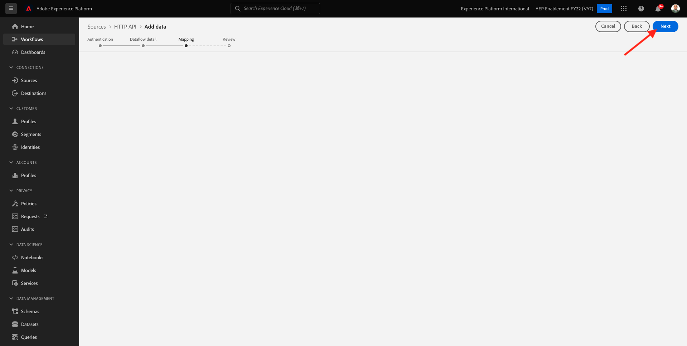

# 15.3 Configurare l&#39;endpoint di streaming API HTTP in Adobe Experience Platform

Prima di poter configurare il connettore per collegamenti mobili Adobe Experience Platform in Kafka, è necessario creare un connettore per sorgenti API HTTP in Adobe Experience Platform. Per impostare il connettore per collegamenti di rete Adobe Experience Platform è necessario l’URL dell’endpoint per lo streaming delle API HTTP.

Per creare un connettore sorgente API HTTP, accedi a Adobe Experience Platform da questo URL: [https://experience.adobe.com/platform](https://experience.adobe.com/platform).

Dopo aver effettuato l&#39;accesso, si aprirà la homepage di Adobe Experience Platform.

Prima di continuare, devi selezionare un **sandbox**. La sandbox da selezionare è denominata ``--aepSandboxId--``. Per eseguire questa operazione, fai clic sul testo **[!UICONTROL Produzione Prod]** nella linea blu sopra lo schermo. Dopo aver selezionato la sandbox appropriata, visualizzerai la modifica dello schermo e ora ti trovi nella sandbox dedicata.

Nel menu a sinistra, vai a **Origini** e scorri verso il basso nella **Catalogo fonti** fino a quando non vedi **API HTTP**. Fai clic su **Aggiungi dati**.

Fai clic su **Nuovo account**. Utilizzo `--demoProfileLdap-- - Kafka` come nome della connessione API HTTP, in questo caso **vangeluw - Kafka**. Attiva la casella di controllo per **Compatibile con XDM**. Fai clic su **Connetti alla sorgente**.

Verrà visualizzato questo, fai clic su **Successivo**.

Seleziona **Set di dati esistente**, apri il menu a discesa . Cerca e seleziona il set di dati **Sistema demo - Set di dati evento per Call Center (Global v1.1)**.

Fai clic su **Avanti**.

Fai clic su **Avanti**.

Fai clic su **Fine**.

Viene quindi visualizzata una panoramica del connettore sorgente API HTTP appena creato.

Dovrai copiare il **Endpoint di streaming** URL, simile a quello sottostante, come sarà necessario nell’esercizio successivo.

`https://dcs.adobedc.net/collection/d282bbfc8a540321341576275a8d052e9dc4ea80625dd9a5fe5b02397cfd80dc`

Ha finito questo esercizio.

Passaggio successivo: [15.4 Installare e configurare Kafka Connect e il connettore Sink Adobe Experience Platform](./ex4.md)

[Torna al modulo 15](./aep-apache-kafka.md)

[Torna a tutti i moduli](../../overview.md)
