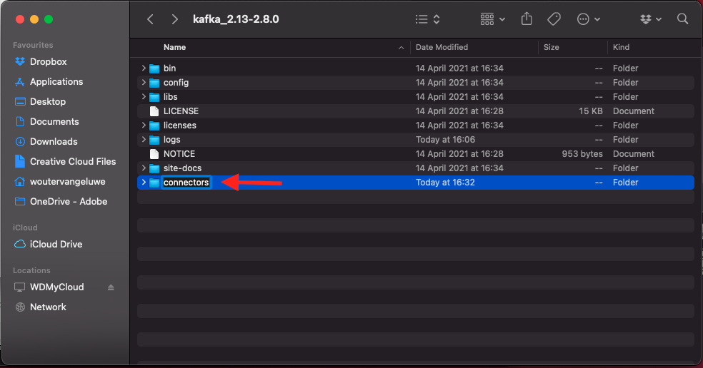
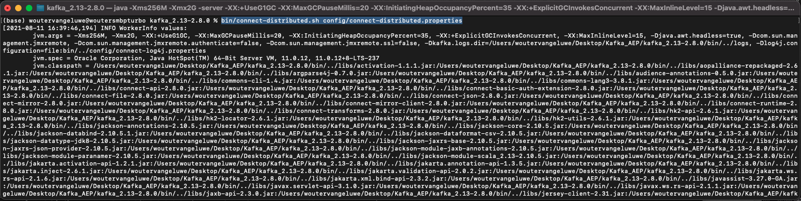
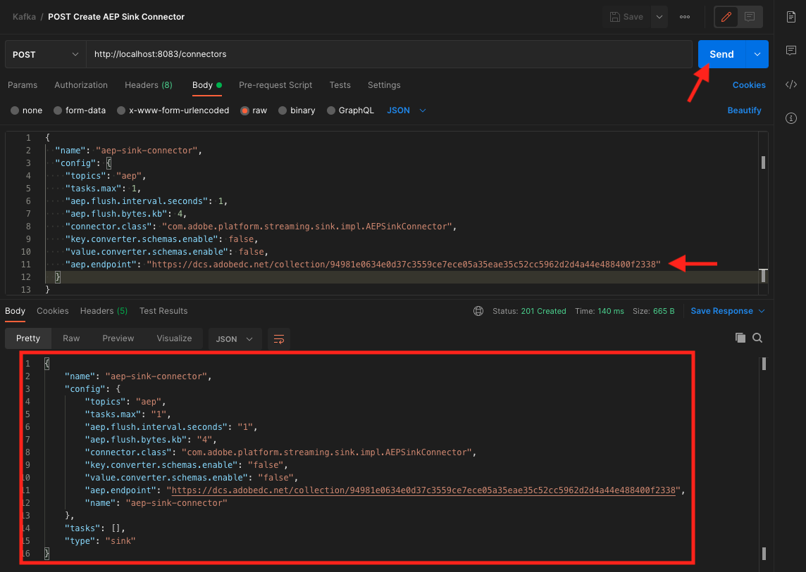
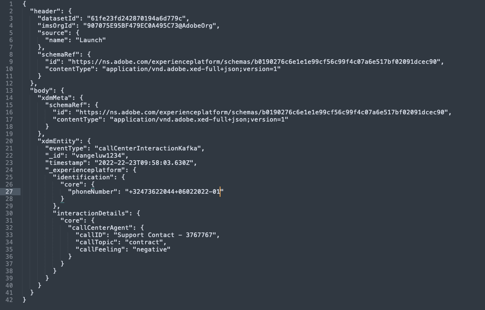

# 15.4 Installare e configurare Kafka Connect e il connettore Sink Adobe Experience Platform

## 15.4.1 Scarica il connettore Sink Adobe Experience Platform

Vai a [https://github.com/adobe/experience-platform-streaming-connect/releases](https://github.com/adobe/experience-platform-streaming-connect/releases) e scarica l&#39;ultima versione ufficiale di Adobe Experience Platform Sink Connector.


Inserire il file di download, **streaming-connect-sink-0.0.14-java-11.jar** sul desktop.


## 15.4.2 Configurare Kafka Connect

Passa alla cartella sul desktop denominata **Kafka_AEP** e passa alla cartella `kafka_2.13-3.1.0/config`.
In quella cartella, apri il file . **connect-distribution.properties** utilizzando qualsiasi editor di testo.


Nell’Editor di testo, andare alla riga 34 e 35 e assicurarsi di impostare i campi `key.converter.schemas.enable` e `value.converter.schemas.enable` a `false`

```json
key.converter.schemas.enable=false
value.converter.schemas.enable=false
```

Salva le modifiche apportate al file.


Quindi, torna alla cartella `kafka_2.13-3.1.0` e creare manualmente una nuova cartella e denominarla `connectors`.



Fai clic con il pulsante destro del mouse sulla cartella e fai clic su **Nuovo terminale nella cartella**.


Vedrete questo. Inserisci il comando `pwd` per recuperare il percorso completo della cartella. Seleziona il percorso completo e copialo negli Appunti.


Torna all’Editor di testo e al file **connect-distribution.properties** e scorri verso il basso fino all’ultima riga (riga 86 nello screenshot). Rimuovi il commento dalla riga che inizia con `# plugin.path=` e incollare il percorso completo della cartella denominata `connectors`. Il risultato dovrebbe essere simile al seguente:

`plugin.path=/Users/woutervangeluwe/Desktop/Kafka_AEP/kafka_2.13-3.1.0/connectors`

Salva le modifiche apportate al file **connect-distribution.properties** e chiudi l’Editor di testo.


Quindi, copia la versione ufficiale più recente del connettore Adobe Experience Platform Sink scaricato nella cartella denominata `connectors`. Il nome del file scaricato in precedenza è **streaming-connect-sink-0.0.14-java-11.jar**, puoi semplicemente spostarlo nella `connectors` cartella.


Quindi, apri una nuova finestra Terminal a livello di **kafka_2.13-3.1.0** cartella. Fai clic con il pulsante destro del mouse sulla cartella e fai clic su **Nuovo terminale nella cartella**.

Nella finestra Terminal, incollare questo comando: `bin/connect-distributed.sh config/connect-distributed.properties` e fai clic su **Invio**. Questo comando avvia Kafka Connect e carica la libreria del connettore Sink Adobe Experience Platform.



Dopo un paio di secondi, vedrete qualcosa come questo:


## 15.4.3 Crea il tuo connettore Sink Adobe Experience Platform utilizzando Postman

Ora è possibile interagire con Kafka Connect utilizzando Postman. Per eseguire questa operazione, scarica [questa raccolta Postman](../../assets/postman/postman_kafka.zip) e decomprimerlo nel computer locale sul desktop. Avrai quindi un file chiamato `Kafka_AEP.postman_collection.json`.


È necessario importare questo file in Postman. Per farlo, apri Postman e fai clic su **Importa**, trascina e rilascia il file `Kafka_AEP.postman_collection.json` nella finestra a comparsa e fai clic su **Importa**.


Troverai quindi questa raccolta nel menu a sinistra di Postman. Fai clic sulla prima richiesta, **Connettori Kafka Connect disponibili** per aprirlo.


Vedrete questo. Fai clic sul blu **Invia** dopo di che dovrebbe essere visualizzata una risposta vuota `[]`. La risposta vuota è dovuta al fatto che attualmente non sono definiti connettori Kafka Connect.


Per creare un connettore, fai clic su per aprire la seconda richiesta nell&#39;insieme Kafka, **POST Crea connettore Sink AEP**. Vedrete questo. Sulla linea 11, dove dice **&quot;aep.endpoint&quot;: &quot;&quot;**, devi incollare l’URL dell’endpoint di streaming API HTTP ricevuto alla fine dell’esercizio [15,3](./ex3.md). L’URL dell’endpoint di streaming API HTTP si presenta così: `https://dcs.adobedc.net/collection/d282bbfc8a540321341576275a8d052e9dc4ea80625dd9a5fe5b02397cfd80dc`.


Dopo averlo incollato, il corpo della richiesta dovrebbe essere simile al seguente. Fai clic sul blu **Invia** per creare il connettore. Riceverai una risposta immediata alla creazione del connettore.



Fai clic sulla prima richiesta, **Connettori Kafka Connect disponibili** per riaprirlo e fare clic su blu **Invia** di nuovo. ora viene creato un connettore Kafka Connect.


Quindi, apri la terza richiesta nella collezione Kafka, **GET controllare lo stato del connettore Kafka Connect**. Fai clic sul blu **Invia** quindi riceverai una risposta come quella riportata di seguito, che indica che il connettore è in esecuzione.


## 15.4.4 Produrre un evento di esperienza

Apri un nuovo **Terminale** facendo clic con il pulsante destro del mouse sulla cartella **kafka_2.13-3.1.0** e facendo clic su **Nuovo terminale nella cartella**.


Immetti il seguente comando:

`bin/kafka-console-producer.sh --broker-list 127.0.0.1:9092 --topic aep`


Vedrete questo. A ogni nuova riga seguita da un pulsante Invio viene inviato un nuovo messaggio nell’argomento **aep**.


Ora puoi inviare un messaggio che verrà utilizzato dal connettore Sink di Adobe Experience Platform e che verrà acquisito in Adobe Experience Platform in tempo reale.

Facciamo una piccola dimostrazione per testarlo.

Vai a [https://builder.adobedemo.com/projects](https://builder.adobedemo.com/projects). Dopo aver effettuato l’accesso con il tuo Adobe ID, vedrai questo. Fai clic sul progetto del tuo sito web per aprirlo.


Sulla **Schermi** pagina, fai clic su **Esegui**.


Vedrai il tuo sito web demo aperto. Seleziona l’URL e copialo negli Appunti.


Apri una nuova finestra del browser in incognito.


Incolla l’URL del sito web dimostrativo che hai copiato nel passaggio precedente. Ti verrà quindi chiesto di effettuare l&#39;accesso utilizzando il tuo Adobe ID.


Seleziona il tipo di account e completa il processo di accesso.


Il sito web verrà quindi caricato in una finestra del browser in incognito. Per ogni dimostrazione, è necessario utilizzare una nuova finestra del browser in incognito per caricare l’URL del sito web demo.


Fai clic sull’icona del logo Adobe nell’angolo in alto a sinistra dello schermo per aprire il Visualizzatore profili.


Guarda il pannello Visualizzatore profili e il Profilo cliente in tempo reale con **ID Experience Cloud** come identificatore principale per questo cliente attualmente sconosciuto.


Vai alla pagina Registrazione/Accesso . Fai clic su **CREARE UN ACCOUNT**.


Inserisci i tuoi dati e fai clic su **Registro** dopo di che verrai reindirizzato alla pagina precedente.


Apri il pannello Visualizzatore profili e vai a Profilo cliente in tempo reale. Nel pannello Visualizzatore profilo dovrebbero essere visualizzati tutti i dati personali, come le e-mail e gli identificatori telefonici appena aggiunti.


Puoi visualizzare alcuni eventi di esperienza in base alle attività passate.


Cambiamo questo e inviamo un evento di esperienza Callcenter da Kafka a Adobe Experience Platform.

Prendi il payload dell’evento esperienza seguente e copialo in un editor di testo.

```json
{
  "header": {
    "datasetId": "61fe23fd242870194a6d779c",
    "imsOrgId": "--aepImsOrgID--",
    "source": {
      "name": "Launch"
    },
    "schemaRef": {
      "id": "https://ns.adobe.com/experienceplatform/schemas/b0190276c6e1e1e99cf56c99f4c07a6e517bf02091dcec90",
      "contentType": "application/vnd.adobe.xed-full+json;version=1"
    }
  },
  "body": {
    "xdmMeta": {
      "schemaRef": {
        "id": "https://ns.adobe.com/experienceplatform/schemas/b0190276c6e1e1e99cf56c99f4c07a6e517bf02091dcec90",
        "contentType": "application/vnd.adobe.xed-full+json;version=1"
      }
    },
    "xdmEntity": {
      "eventType": "callCenterInteractionKafka",
      "_id": "",
      "timestamp": "2022-02-23T09:54:12.232Z",
      "_experienceplatform": {
        "identification": {
          "core": {
            "phoneNumber": ""
          }
        },
        "interactionDetails": {
          "core": {
            "callCenterAgent": {
              "callID": "Support Contact - 3767767",
              "callTopic": "contract",
              "callFeeling": "negative"
            }
          }
        }
      }
    }
  }
}
```

Vedrete questo. È necessario aggiornare manualmente 2 campi:

- **_id**: per favore impostalo su un id casuale, qualcosa come `--demoProfileLdap--1234`
- **timestamp**: aggiorna la marca temporale alla data e all’ora correnti
- **phoneNumber**: inserisci il numero telefonico dell&#39;account appena creato sul sito web demo. Puoi trovarlo nel pannello Visualizzatore profilo in **Identità**.

È inoltre necessario controllare e forse aggiornare questi campi:
- **datasetId**: devi copiare l’ID del set di dati per il sistema di demo del set di dati - Set di dati evento per Call Center (Global v1.1)
- **imsOrgID**: l’ID organizzazione IMS è `--aepImsOrgId--`

>[!NOTE]
>
>Il campo **_id** deve essere univoco per ogni acquisizione di dati. Se si producono più eventi, assicurarsi di aggiornare il campo **_id** ogni volta a un nuovo valore univoco.


A quel punto dovresti avere qualcosa del genere:



Quindi, copia l’evento esperienza completo negli Appunti. Lo spazio vuoto del payload JSON deve essere rimosso e per questo utilizzeremo uno strumento online. Vai a [http://jsonviewer.stack.hu/](http://jsonviewer.stack.hu/) per farlo.


Incolla l’evento esperienza nell’editor e fai clic su **Rimuovi spazio vuoto**.


Quindi, seleziona tutto il testo di output e copialo negli Appunti.


Torna alla finestra Terminal.


Incolla il nuovo payload senza spazi bianchi nella finestra Terminal e fai clic su **Invio**.


Quindi, torna al tuo sito web dimostrativo e aggiorna la pagina. Ora dovresti visualizzare un evento di esperienza sul tuo profilo, in **Altri eventi**, proprio come quello qui sotto:


>[!NOTE]
>
>Se desideri che le interazioni del call center vengano visualizzate nel pannello Visualizzatore profilo, devi aggiungere l’etichetta seguente e filtrare il progetto in [https://builder.adobedemo.com/projects](https://builder.adobedemo.com/projects), andando alla scheda **Visualizzatore profili**.


Ha finito questo esercizio.

Passaggio successivo: [Riepilogo e vantaggi](./summary.md)

[Torna al modulo 15](./aep-apache-kafka.md)

[Torna a tutti i moduli](../../overview.md)
