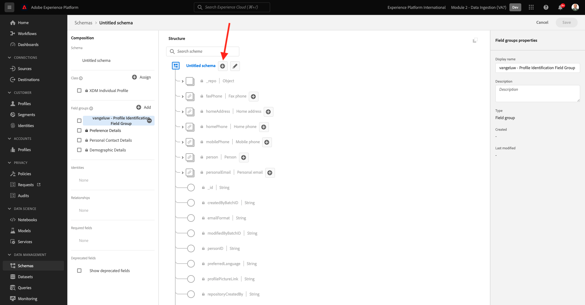
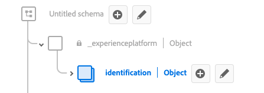
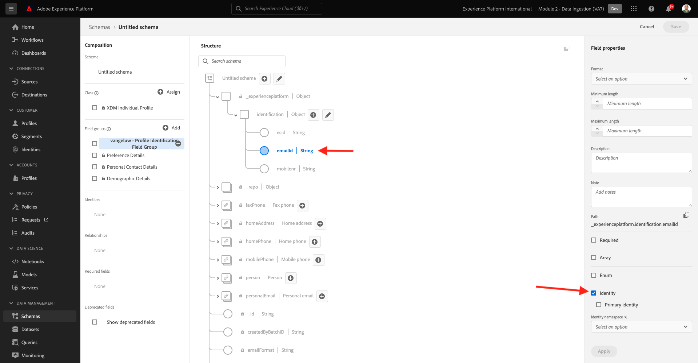
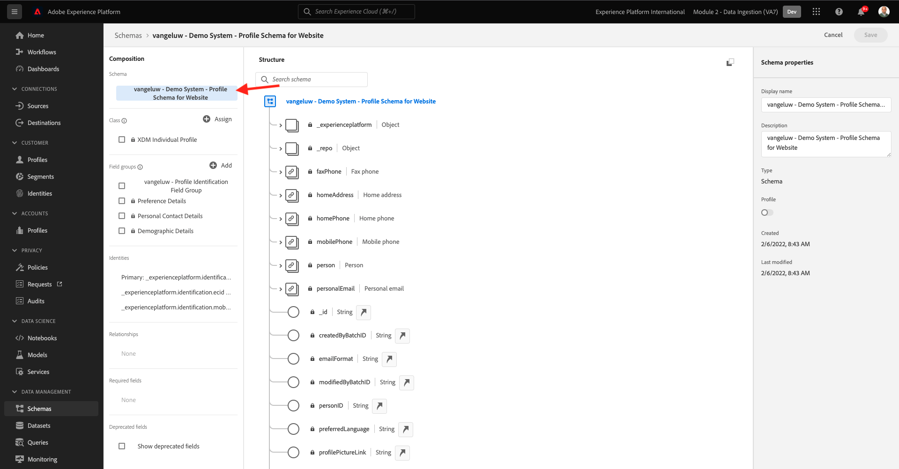
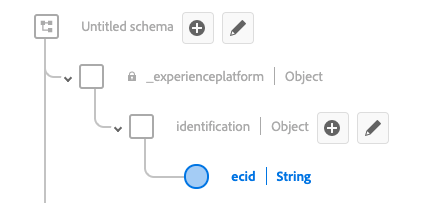

# 2.2 Configurare gli schemi e impostare gli identificatori

In questo esercizio, configurerai gli schemi XDM richiesti per classificare le informazioni sul profilo e il comportamento del cliente. In ogni schema XDM, dovrai anche configurare un identificatore principale per collegare tutte le informazioni a.

## Storia

Prima di iniziare a configurare lo schema XDM e l’impostazione degli identificatori principali, è necessario considerare il contesto aziendale in cui si sta tentando di eseguire le operazioni seguenti:

- Dati desiderati
- Desideri collegare dati a un cliente
- Vuoi creare un profilo cliente progressivo e in tempo reale

Sono disponibili due tipi di dati da acquisire:

- Chi è questo cliente?
- Cosa fa questo cliente?

Tuttavia, la questione **Chi è questo cliente?** è una domanda molto aperta che ha molte risposte. Quando la tua azienda vuole vedere questa domanda a cui è stata data risposta, stai cercando informazioni demografiche come Nome, Cognome e Indirizzo. Ma anche per informazioni di contatto come un indirizzo e-mail o un numero di telefono cellulare. E anche per informazioni collegate a Lingua, OptIn/OptOut e forse anche a Immagini di profilo. Infine, quello che devi sapere davvero è come identificare questo cliente nei vari sistemi utilizzati dalla tua azienda.

La stessa cosa vale per la domanda **Cosa fa questo cliente?**. È una domanda molto aperta con molte risposte. Quando la tua azienda desidera ricevere una risposta a questa domanda, stai cercando qualsiasi interazione che un cliente ha avuto con una delle tue proprietà online e offline. Quali pagine o prodotti sono stati visitati? Questo cliente ha aggiunto un prodotto al suo carrello o anche acquistato un articolo? Quale dispositivo e browser è stato utilizzato per sfogliare il sito web? Che tipo di informazioni sta cercando questo cliente e come possiamo usarlo per configurare e fornire un&#39;esperienza piacevole a questo cliente? Infine, ciò che dobbiamo sapere davvero è come identificare questo cliente nei vari sistemi che la tua azienda userà.

## 2.1.1 - Chi è questo cliente

Acquisizione della risposta in **Chi è questo cliente?** per la tua azienda è fatto tramite la pagina di accesso/registrazione.

Dal punto di vista dello schema, lo consideriamo come **Classe**. La domanda: **Chi è questo cliente?** è qualcosa che definiamo nella classe **[!UICONTROL Profilo individuale XDM]**.

Quindi, quando crei uno schema XDM per acquisire la risposta a **Chi è questo cliente?**, innanzitutto è necessario creare e definire uno schema che faccia riferimento alla classe **[!UICONTROL Profilo individuale XDM]**.

Per specificare il tipo di risposte che è possibile dare a quella domanda, è necessario definire [!UICONTROL Gruppi di campi]. [!UICONTROL Gruppi di campi] sono estensioni della classe Profile e dispongono di configurazioni molto specifiche. Ad esempio, le informazioni demografiche come Nome, Cognome, Genere e Compleanno fanno parte del gruppo [!UICONTROL Gruppo di campi]: **[!UICONTROL Dettagli demografici]**.

In secondo luogo, la tua azienda deve decidere come identificare questo cliente. Nel caso della tua azienda, l’identificatore principale di un cliente noto potrebbe essere un ID cliente specifico, ad esempio un indirizzo e-mail. Ma tecnicamente, esistono altri modi per identificare un cliente presso la tua azienda, come usare un numero di cellulare.
In questo laboratorio, definiremo l’indirizzo e-mail come identificatore principale e il numero di telefono come identificatore secondario.

Infine, è importante distinguere il canale su cui sono stati acquisiti i dati. In questo caso, parleremo delle registrazioni di siti web e dello schema che deve essere definito deve riflettere **dove** i dati di registrazione sono stati acquisiti. Il canale avrà anche un ruolo importante nell&#39;influenzare i dati acquisiti. Di conseguenza, è consigliabile definire schemi per ogni combinazione di canale, identificatore primario e tipo di dati raccolti.

In base a quanto precede, è necessario configurare uno schema in Adobe Experience Platform.

Accedi a Adobe Experience Platform andando a questo URL: [https://experience.adobe.com/platform](https://experience.adobe.com/platform).

Dopo aver effettuato l&#39;accesso, si aprirà la homepage di Adobe Experience Platform.

Prima di continuare, devi selezionare un **sandbox**. La sandbox da selezionare è denominata ``--module2sandbox--``. Per eseguire questa operazione, fai clic sul testo **[!UICONTROL Produzione Prod]** nella linea blu sopra lo schermo. Dopo aver selezionato la sandbox appropriata, visualizzerai la modifica dello schermo e ora ti trovi nella sandbox dedicata.

In Adobe Experience Platform, fai clic su **[!UICONTROL Schemi]** nel menu sul lato sinistro dello schermo. Verrà visualizzato l&#39;elenco delle opzioni disponibili [!UICONTROL Schemi].

Creare un nuovo schema. Per creare un nuovo schema, fai clic sul pulsante **[!UICONTROL + Crea schema]** e seleziona **[!UICONTROL Profilo individuale XDM]**.

Dopo aver fatto clic sul pulsante **[!UICONTROL + Crea schema]** viene creato un nuovo schema e ti verrà richiesto di selezionare o creare **gruppi di campi**.

Ora è necessario definire quale risposta alla domanda **Chi è questo cliente?** dovrebbe assomigliare.
Nell&#39;introduzione di questo laboratorio, abbiamo notato la necessità dei seguenti attributi per definire un cliente:

- Informazioni demografiche come Nome, Cognome e Indirizzo
- Informazioni di contatto come un indirizzo di casa, un indirizzo e-mail o un numero di telefono cellulare
- Altre informazioni collegate a Lingua, OptIn/OptOut e forse anche alle immagini di profilo.
- Identificatore principale per un cliente

Per includere tali informazioni nello schema, è necessario aggiungere quanto segue [!UICONTROL Gruppi di campi] nello schema:

- Dettagli demografici (Informazioni demografiche)
- Dati personali di contatto (informazioni di contatto)
- Dettagli sulle preferenze (altre informazioni)
- gruppo di campi di identificazione del profilo personalizzato della tua azienda (identificatori primari e secondari)

In **[!UICONTROL Aggiungi gruppo di campi]** seleziona la [!UICONTROL Gruppo di campi] **[!UICONTROL Dettagli demografici]**, **[!UICONTROL Dati di contatto personali]** e **[!UICONTROL Dettagli sulle preferenze]**.

Fai clic sul pulsante **[!UICONTROL Aggiungi gruppi di campi]** per aggiungere il pulsante [!UICONTROL Gruppo di campi] allo schema.

A questo punto avrai questo:

Successivamente, è necessario un nuovo [!UICONTROL Gruppo di campi] per acquisire **[!UICONTROL Identificatore]** utilizzato per la raccolta dati. Come avete visto nell&#39;esercizio precedente, c&#39;è un concetto di identificatori primari e secondari. L’identificatore principale è quello più importante, in quanto tutti i dati raccolti saranno collegati a questo identificatore.

Ora creerai il tuo personalizzato [!UICONTROL Gruppo di campi] e in quanto tale, estenderai il [!UICONTROL Schema XDM] per soddisfare i requisiti aziendali.

Fai clic sul pulsante **[!UICONTROL + Aggiungi]** pulsante per iniziare ad aggiungere un [!UICONTROL Gruppo di campi].

Invece di riutilizzare un esistente [!UICONTROL Gruppo di campi], ora creerai il tuo [!UICONTROL Gruppo di campi]. Per farlo, seleziona **[!UICONTROL Crea nuovo gruppo di campi]**.

È ora necessario fornire un **[!UICONTROL Nome visualizzato]** e **[!UICONTROL Descrizione]** per il tuo nuovo [!UICONTROL Gruppo di campi].

Come nome del nostro schema, utilizzeremo questo:
`--demoProfileLdap-- - Profile Identification Field Group`

Ad esempio, per ldap **[!UICONTROL vangeluw]**, deve essere il nome dello schema:

**[!UICONTROL vangeluw - Gruppo di campi di identificazione profilo]**

Questo dovrebbe darvi qualcosa del genere:

Fai clic sul pulsante **[!UICONTROL Aggiungi gruppi di campi]** per aggiungere la nuova creazione [!UICONTROL Gruppo di campi] allo schema.

A questo punto dovrebbe essere presente questa struttura dello schema.

La nuova [!UICONTROL Gruppo di campi] è ancora vuoto, quindi ora dovrai aggiungere campi a tale [!UICONTROL Gruppo di campi].
In [!UICONTROL Gruppo di campi]- elenco, fai clic sul tuo personalizzato [!UICONTROL Gruppo di campi].

Ora vengono visualizzati diversi nuovi pulsanti.

Nel livello superiore dello schema, fai clic sul pulsante **[!UICONTROL + Aggiungi campo]** pulsante .

Dopo aver fatto clic sul pulsante **[!UICONTROL + Aggiungi campo]** viene ora visualizzata una nuova **[!UICONTROL oggetto]** nello schema. Questo oggetto rappresenta un **[!UICONTROL oggetto]** nello schema e prende il nome dal tuo ID tenant Adobe Experience Platform. L&#39;ID tenant Adobe Experience Platform è `--aepTenantId--`.

Ora verrà aggiunto un nuovo oggetto sotto tale tenant. A tale scopo, fai clic sul campo . **[!UICONTROL Nuovo campo]** sotto l&#39;oggetto tenant.

Utilizzare le seguenti definizioni degli oggetti:

- Nome campo: **[!UICONTROL identificazione]**
- Nome visualizzato:  **[!UICONTROL identificazione]**
- Tipo: **[!UICONTROL Oggetto]**

Fai clic su **[!UICONTROL Applica]** per salvare le modifiche.

Dopo aver fatto clic su **[!UICONTROL Applica]**, ora visualizzi **[!UICONTROL identificazione]** nello schema.

Verranno aggiunti 3 nuovi campi nella sezione  **[!UICONTROL identificazione]** oggetto:

- ecid:
   - Nome campo: **[!UICONTROL ecid]**
   - Nome visualizzato:  **[!UICONTROL ecid]**
   - Tipo:**[!UICONTROL String]**

- emailId
   - Nome campo: **[!UICONTROL emailId]**
   - Nome visualizzato:  **[!UICONTROL emailId]**
   - Tipo:**[!UICONTROL String]**

- mobilter
   - Nome campo: **[!UICONTROL mobilter]**
   - Nome visualizzato:  **[!UICONTROL mobilter]**
   - Tipo:**[!UICONTROL String]**

Ogni campo viene definito come tipo **[!UICONTROL Stringa]** e configureremo questi campi come **[!UICONTROL Identità]**. Per lo schema **[!UICONTROL Schema di registrazione sito web]**, supponiamo che un cliente venga sempre identificato dal suo indirizzo e-mail, il che significa che devi configurare il campo . **[!UICONTROL emailId]** come **[!UICONTROL primario]** e gli altri campi come **[!UICONTROL secondario]** identificatori.

Per aggiungere i campi, fai clic sul pulsante **[!UICONTROL +]** accanto al pulsante **[!UICONTROL identificazione]** oggetto.

Ora hai un campo vuoto. Devi configurare i 3 campi sopra indicati come indicato.

Questo è il modo in cui ogni campo deve tenere conto della configurazione iniziale del campo.

Fai clic sul pulsante **[!UICONTROL +]** accanto al pulsante **[!UICONTROL identificazione]** per creare un nuovo campo e compilare i campi come indicato.

- ecid

Per salvare il campo, scorri verso il basso nella **[!UICONTROL Proprietà campo]** finché non viene visualizzato il pulsante **[!UICONTROL Applica]**. Fai clic sul pulsante **[!UICONTROL Applica]** pulsante .

Fai clic sul pulsante **[!UICONTROL +]** accanto al pulsante **[!UICONTROL identificazione]** per creare un nuovo campo e compilare i campi come indicato.

- emailId

Per salvare il campo, scorri verso il basso nella **[!UICONTROL Proprietà campo]** finché non viene visualizzato il pulsante **[!UICONTROL Applica]**. Fai clic sul pulsante **[!UICONTROL Applica]** pulsante .

Fai clic sul pulsante **[!UICONTROL +]** accanto al pulsante **[!UICONTROL identificazione]** per creare un nuovo campo e compilare i campi come indicato.

- mobilter

Per salvare il campo, scorri verso il basso nella **[!UICONTROL Proprietà campo]** finché non viene visualizzato il pulsante **[!UICONTROL Applica]**. Fai clic sul pulsante **[!UICONTROL Applica]** pulsante .

Ora sono disponibili 3 campi, ma questi non sono stati definiti come **[!UICONTROL Identità]**- campi ancora.

Per iniziare a definire questi campi come **[!UICONTROL Identità]**-fields, segui questi passaggi:

- Selezionare il campo **[!UICONTROL emailId]**.
- Sul lato destro, nelle proprietà del campo, scorri verso il basso fino a visualizzare **[!UICONTROL Identità]**. Seleziona la casella di controllo per **[!UICONTROL Identità]**.

   

- Ora seleziona la casella di controllo **[!UICONTROL Identità principale]**.

   

- Infine, seleziona lo spazio dei nomi **[!UICONTROL E-mail]** dall&#39;elenco di **[!UICONTROL Namespace]**. Un namespace viene utilizzato dal grafico Identity in Adobe Experience Platform per classificare gli identificatori nei namespace e definire la relazione tra tali namespace.

   

- Infine, fai clic su **[!UICONTROL Applica]** per salvare le modifiche.

   

Successivamente, è necessario definire gli altri campi per **[!UICONTROL ecid]** e **[!UICONTROL mobilter]** come identificatori secondari.

- Selezionare il campo **[!UICONTROL ecid]**.
- Sul lato destro, nelle proprietà del campo, scorri verso il basso fino a visualizzare **[!UICONTROL Identità]**. Seleziona la casella di controllo per **[!UICONTROL Identità]**.

   

- Quindi, seleziona lo spazio dei nomi **[!UICONTROL ECID]** dall&#39;elenco di **[!UICONTROL Namespace]**. A [!UICONTROL Namespace] viene utilizzato da Identity Graph in Adobe Experience Platform per classificare gli identificatori nei namespace e definire la relazione tra tali namespace.

   

- Fai clic su **[!UICONTROL Applica]** per salvare le modifiche.

   

- Selezionare il campo **[!UICONTROL mobilter]**.
- Sul lato destro, nelle proprietà del campo, scorri verso il basso fino a visualizzare **[!UICONTROL Identità]**. Seleziona la casella di controllo per **[!UICONTROL Identità]**.

   

- Assicurati di selezionare lo spazio dei nomi **[!UICONTROL Telefono]** dall&#39;elenco di **[!UICONTROL Namespace]**. Un namespace viene utilizzato dal grafico Identity in Adobe Experience Platform per classificare gli identificatori nei namespace e definire la relazione tra tali namespace.

   

- Fai clic su **[!UICONTROL Applica]** per salvare le modifiche.

   

La **[!UICONTROL identificazione]** dovrebbe ora essere simile a questo, con i 3 campi id che mostrano anche un **[!UICONTROL impronta digitale]** per mostrare che sono stati definiti come identificatori.

Assegna un nome allo schema. Selezionare il campo **Schema senza titolo**.

Come nome del nostro schema, utilizzerai questo:

`--demoProfileLdap-- - Demo System - Profile Schema for Website`

Sostituisci **[!UICONTROL ldap]** dal tuo ldap specifico. Ad esempio, per ldap **[!UICONTROL vangeluw]**, deve essere il nome dello schema:

**[!UICONTROL vangeluw - Demo System - Schema del profilo per il sito web]**

Questo dovrebbe darvi qualcosa del genere:

Ora hai definito uno schema, hai collegato quelli esistenti e quelli appena creati [!UICONTROL Gruppi di campi] e hanno degli identificatori definiti.

Fai clic su **[!UICONTROL Salva]** per salvare le modifiche.

L&#39;ultima cosa da fare è attivare lo schema da collegare **[!UICONTROL Profilo]**.
Attivando lo schema per il profilo, assicurati che tutti i dati inviati a Adobe Experience Platform in base a questo schema facciano parte dell’ambiente Profilo cliente in tempo reale, che garantisce che tutti i dati possano essere utilizzati in tempo reale per le query, la segmentazione e l’attivazione.

A questo scopo, selezioniamo il nome dello schema.

Nella scheda a destra dello schema, viene visualizzata una **[!UICONTROL Attiva/disattiva profilo]**, attualmente disattivato.

Attiva la [!UICONTROL Profilo] - attivarla facendo clic su di essa.

Verrà visualizzato questo messaggio:

Fai clic su **[!UICONTROL Abilita]** per abilitare questo schema per il profilo.

Lo schema è ora configurato come parte del [!UICONTROL Profilo cliente in tempo reale].

Infine, fai clic su **[!UICONTROL Salva]** per salvare lo schema.

### 2.1.2 - Cosa fa questo cliente

Acquisire la risposta alla domanda **Cosa fa questo cliente?** per la tua azienda viene eseguito attraverso, ad esempio, una visualizzazione di prodotto in una pagina di prodotto.

Dal punto di vista dello schema, lo consideriamo come **[!UICONTROL Classe]**. La domanda: **Cosa fa questo cliente?** è qualcosa che abbiamo definito in classe **[!UICONTROL ExperienceEvent]**.

Quindi quando crei un [!UICONTROL Schema XDM] per acquisire la risposta a **Cosa fa questo cliente?**, innanzitutto è necessario creare e definire uno schema che faccia riferimento alla classe **[!UICONTROL ExperienceEvent]**.

Per specificare il tipo di risposte che è possibile dare a quella domanda, è necessario definire [!UICONTROL Gruppo di campi]. [!UICONTROL Gruppi di campi] sono estensioni del [!UICONTROL ExperienceEvent]-class e hanno configurazioni molto specifiche. Ad esempio, le informazioni sul tipo di prodotti che un cliente ha visualizzato o aggiunto al carrello fanno parte del [!UICONTROL Gruppo di campi] **Dettagli Commerce**.

In secondo luogo, la tua azienda deve decidere come identificare il comportamento di questo cliente. Poiché stiamo parlando di interazioni su un sito web, è possibile che la tua azienda conosca il cliente, ma è ugualmente possibile che un visitatore anonimo sia attivo sul sito web. Quindi non possiamo usare un identificatore come indirizzo e-mail. In questo caso, la tua azienda probabilmente deciderà di utilizzare il [!UICONTROL ID Experience Cloud (ECID)] come identificatore principale.

Infine, è importante distinguere il canale su cui sono stati acquisiti i dati. In questo caso, parleremo di Interazioni sito web e dello schema che deve essere definito deve riflettere **dove** i dati di interazione sono stati acquisiti. Il canale avrà anche un ruolo importante nell&#39;influenzare i dati acquisiti. Di conseguenza, è consigliabile definire schemi per ogni combinazione di canale, identificatore primario e tipo di dati raccolti.

In base a quanto sopra, sarà necessario configurare uno schema in Adobe Experience Platform.

Dopo aver effettuato l&#39;accesso, si aprirà la homepage di Adobe Experience Platform.

Prima di continuare, devi selezionare un **[!UICONTROL sandbox]**. La [!UICONTROL sandbox] per selezionare il nome ``--module2sandbox--``. Per eseguire questa operazione, fai clic sul testo **[!UICONTROL Produzione Prod]** nella linea blu sopra lo schermo. Dopo aver selezionato la sandbox appropriata, visualizzerai la modifica dello schermo e ora ti trovi nella sandbox dedicata.

In Adobe Experience Platform, fai clic su **[!UICONTROL Schemi]** nel menu sul lato sinistro dello schermo.

In [!UICONTROL Schemi], verranno visualizzati tutti gli schemi esistenti.

Creare un nuovo schema. Per creare un nuovo schema, fai clic sul pulsante **[!UICONTROL + Crea schema]** e seleziona **[!UICONTROL ExperienceEvent XDM]**.

Dopo aver fatto clic sul pulsante **[!UICONTROL + Crea schema]** viene creato un nuovo schema e ti verrà richiesto di selezionare o creare **gruppi di campi**.

Ora è necessario definire quale risposta alla domanda **Cosa fa questo cliente?** dovrebbe assomigliare.
Nell&#39;introduzione di questo laboratorio, abbiamo notato la necessità di seguenti attributi per definire le attività di un cliente:

- Quali pagine o prodotti sono stati visitati?
- Questo cliente ha aggiunto un prodotto al suo carrello o anche acquistato un articolo?
- Quale dispositivo e browser è stato utilizzato per sfogliare il sito web?
- Che tipo di informazioni sta cercando questo cliente e come possiamo usarlo per configurare e fornire un&#39;esperienza piacevole a questo cliente?
- Identificatore principale per un cliente

Per includere tali informazioni nello schema, è necessario aggiungere quanto segue [!UICONTROL Gruppo di campi] nello schema:

- Dettagli Web
- Dettagli Commerce
- Dettagli dell’ambiente
- identificazione del profilo personalizzato della tua azienda [!UICONTROL Gruppo di campi] (Identificatori primari e secondari)

In **[!UICONTROL Aggiungi gruppo di campi]** seleziona la [!UICONTROL Gruppi di campi] **[!UICONTROL Dettagli Web]**, **[!UICONTROL Dettagli Commerce]** e **[!UICONTROL Dettagli dell&#39;ambiente]**.

Fai clic sul pulsante **[!UICONTROL Aggiungi gruppi di campi]** per aggiungere il gruppo di campi allo schema.

A quel punto avrai questo:

Successivamente, devi creare una nuova [!UICONTROL Gruppo di campi] per acquisire **[!UICONTROL Identificatore]** utilizzato per la raccolta dati. Come avete visto nell&#39;esercizio precedente, c&#39;è un concetto di identificatori primari e secondari. L’identificatore principale è quello più importante, in quanto tutti i dati raccolti saranno collegati a questo identificatore.

Ora creerai il tuo personalizzato [!UICONTROL Gruppo di campi] e in quanto tale, estenderai il [!UICONTROL Schema XDM] per soddisfare i requisiti aziendali.

A [!UICONTROL Gruppo di campi] è collegato a un [!UICONTROL Classe]Ciò significa che non è possibile riutilizzare semplicemente i [!UICONTROL Gruppo di campi].

Fai clic sul pulsante **[!UICONTROL + Aggiungi]** pulsante per iniziare ad aggiungere un [!UICONTROL Gruppo di campi].

Invece di riutilizzare un esistente [!UICONTROL Gruppo di campi], ora creerai il tuo [!UICONTROL Gruppo di campi]. Per farlo, seleziona **[!UICONTROL Crea nuovo gruppo di campi]**.

È ora necessario fornire un **[!UICONTROL Nome visualizzato]** e **[!UICONTROL Descrizione]** per il nuovo gruppo di campi.

Come nome del gruppo di campi, utilizza quanto segue:

`--demoProfileLdap-- - ExperienceEvent Identification Field Group`

Ad esempio, per ldap **[!UICONTROL vangeluw]**, deve essere il nome dello schema:

**[!UICONTROL vangeluw - Gruppo di campi di identificazione ExperienceEvent]**

Questo dovrebbe darvi qualcosa del genere:

Fai clic sul pulsante **[!UICONTROL Aggiungi gruppo di campi]** per aggiungere la nuova creazione [!UICONTROL Gruppo di campi] allo schema.

Ora dovrebbe avere questo [!UICONTROL Schema] struttura in atto.

La nuova [!UICONTROL Gruppo di campi] è ancora vuoto, pertanto ora dovrai aggiungere campi a tale gruppo di campi.
In [!UICONTROL Gruppo di campi]- elenco, fai clic sul tuo personalizzato [!UICONTROL Gruppo di campi].

Ora vengono visualizzati diversi nuovi pulsanti.

Nella parte superiore dello schema, accanto al nome dello schema, fare clic sul pulsante **[!UICONTROL +]** pulsante .

Dopo aver fatto clic sul pulsante **[!UICONTROL +]** viene ora visualizzata una nuova **[!UICONTROL oggetto]** nello schema. Questo oggetto rappresenta un **[!UICONTROL oggetto]** nel tuo [!UICONTROL Schema] e prende il nome dal tuo Adobe Experience Platform Tenant ID. L&#39;ID tenant Adobe Experience Platform è `--aepTenantId--`.

Ora verrà aggiunto un nuovo oggetto sotto tale tenant. A tale scopo, fai clic sul campo . **[!UICONTROL Nuovo campo]** sotto l&#39;oggetto tenant.

Utilizzare le seguenti definizioni degli oggetti:

- Nome campo: **[!UICONTROL identificazione]**
- Nome visualizzato:  **[!UICONTROL identificazione]**
- Tipo: **[!UICONTROL Oggetto]**

Scorri verso il basso e fai clic su **[!UICONTROL Applica]** per salvare le modifiche.

Dopo aver fatto clic su **[!UICONTROL Applica]**, ora visualizzi **[!UICONTROL identificazione]** nello schema.

Ora aggiungerai 1 nuovo campo nella sezione  **[!UICONTROL identificazione]** oggetto.

Fai clic sul pulsante **[!UICONTROL +]** accanto al pulsante **[!UICONTROL identificazione]** per creare un nuovo campo.

Il campo ECID verrà definito come tipo **[!UICONTROL Stringa]** e configurerai questo campo come **[!UICONTROL Identità]**. Per lo schema **[!UICONTROL Sistema demo - Schema evento per il sito web]**, supponiamo che un cliente sia sempre identificato dai suoi [!UICONTROL ECID], che significa che devi configurare il campo . **[!UICONTROL ECID]** come **primario** identifier

Ora hai un campo vuoto. Devi configurare il campo sopra indicato come indicato.

- ecid:

   - Nome campo: **[!UICONTROL ecid]**
   - Nome visualizzato:  **[!UICONTROL ecid]**
   - Tipo:**[!UICONTROL String]**

Questo è il modo in cui [!UICONTROL ecid]-field deve seguire la configurazione iniziale del campo:

Scorri verso il basso e fai clic su **[!UICONTROL Applica]**.

Ora disponi di un nuovo campo, ma questo campo non è stato definito come **[!UICONTROL Identità]**-campo ancora.

Per iniziare a definire questi campi come **[!UICONTROL Identità]**-fields, segui questi passaggi:

- Selezionare il campo **[!UICONTROL ecid]**.
- Sul lato destro, nelle proprietà del campo, scorri verso il basso fino a visualizzare **[!UICONTROL Identità]**. Seleziona la casella di controllo per **[!UICONTROL Identità]**.

- Ora seleziona la casella di controllo **[!UICONTROL Identità principale]**.

- Infine, seleziona lo spazio dei nomi **[!UICONTROL ECID]** dall&#39;elenco di **[!UICONTROL Namespace]**. A [!UICONTROL Namespace] viene utilizzato dal [!UICONTROL Grafico di identità] in Adobe Experience Platform per classificare gli identificatori nei namespace e definire la relazione tra tali namespace.

   

- Infine, fai clic su **[!UICONTROL Applica]** per salvare le modifiche.

   

La **[!UICONTROL identificazione]** dovrebbe ora essere simile a questo, con il campo ecid che ora mostra anche un **impronta digitale** per mostrare che sono stati definiti come identificatori.

Assegna un nome allo schema. Selezionare il campo **Schema senza titolo**.

Come nome del nostro schema, utilizzeremo questo:
`--demoProfileLdap-- - Demo System - Event Schema for Website`

Ad esempio, per ldap **[!UICONTROL vangeluw]**, deve essere il nome dello schema:

**[!UICONTROL vangeluw - Demo System - Event Schema for Website]**

Questo dovrebbe darvi qualcosa del genere:

Fai clic su **[!UICONTROL Salva]** per salvare le modifiche.

È importante notare che quando alla fine si acquisiscono dati in base a questo schema, alcuni campi sono obbligatori.
Ad esempio, i campi **[!UICONTROL _id]** e **[!UICONTROL timestamp]** sono campi obbligatori.

- _id deve contenere un ID univoco per un’acquisizione di dati specifica
- la marca temporale deve essere la marca temporale dell&#39;hit, nel formato **[!UICONTROL &quot;AAAA-MM-DTHH:MM:SSSZ&quot;]**, come ad esempio: **[!UICONTROL &quot;2019-04-08T07:20:000Z&quot;]**

Ora hai definito uno schema, hai collegato quelli esistenti e quelli appena creati [!UICONTROL Gruppi di campi] e hanno degli identificatori definiti.

L&#39;ultima cosa da fare è attivare lo schema da collegare **[!UICONTROL Profilo]**.
Attivando lo schema per [!UICONTROL Profilo], assicurati che tutti i dati inviati a Adobe Experience Platform in base a questo schema siano parte del Profilo del cliente in tempo reale, in modo che tutti i dati possano essere utilizzati in tempo reale per le query, la segmentazione e l’attivazione.

A questo scopo, selezioniamo il nome dello schema.

Nella scheda a destra dello schema, viene visualizzata una **[!UICONTROL Profilo] interruttore**, attualmente disattivato.

Attiva la [!UICONTROL Profilo] - attivarla facendo clic su di essa.

Verrà visualizzato questo messaggio:

Fai clic su **[!UICONTROL Abilita]** per abilitare questo schema per il profilo.

Lo schema è ora configurato per far parte del Profilo cliente in tempo reale.

Infine, fai clic su **[!UICONTROL Salva]** per salvare lo schema.

Ora hai finito di creare schemi che vengono attivati per essere utilizzati nel Profilo cliente in tempo reale.

Diamo un&#39;occhiata ai set di dati nel prossimo esercizio.

Passaggio successivo: [2.3 Configurare i set di dati](./ex3.md)

[Torna al modulo 2](./data-ingestion.md)

[Torna a tutti i moduli](../../overview.md)
