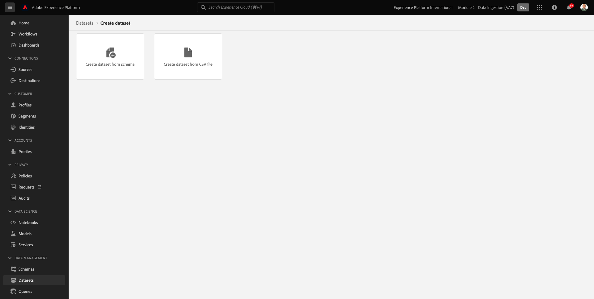
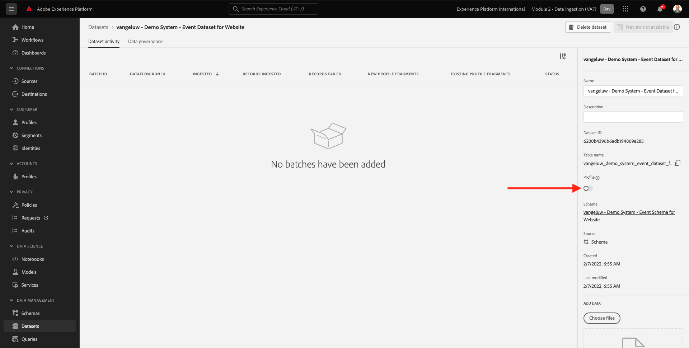

# 2.3 Configurare i set di dati

In questo esercizio configurerai i set di dati necessari per acquisire e memorizzare le informazioni sul profilo e il comportamento del cliente. Per ogni set di dati creato in questo verrà utilizzato uno degli schemi generati nel passaggio precedente.

## Storia

Dopo aver definito la risposta alle domande **Chi è questo cliente?** e **Cosa fa questo cliente?** a questo punto devi creare un bucket che utilizza tali informazioni per ricevere e convalidare i dati inviati a Adobe Experience Platform.

## 2.3.1 - Creare set di dati

È ora necessario creare 2 set di dati:

- 1 set di dati per acquisire le informazioni che rispondono alle **Chi è questo cliente?** - domanda.
- 1 set di dati per acquisire le informazioni che rispondono alle **Cosa fa questo cliente?** - domanda.

Accedi a Adobe Experience Platform andando a questo URL: [https://experience.adobe.com/platform](https://experience.adobe.com/platform).

Dopo aver effettuato l&#39;accesso, si aprirà la homepage di Adobe Experience Platform.

Prima di continuare, devi selezionare un **[!UICONTROL sandbox]**. La sandbox da selezionare è denominata ``--module2sandbox--``. Per eseguire questa operazione, fai clic sul testo **[!UICONTROL Produzione Prod]** nella linea blu sopra lo schermo. Dopo aver selezionato il [!UICONTROL sandbox], vedrai la modifica dello schermo e ora sei nel tuo dedicato [!UICONTROL sandbox].

In Adobe Experience Platform, fai clic su **[!UICONTROL Set di dati]** nel menu sul lato sinistro dello schermo.  Vedrai questo:

Cominciamo creando il set di dati per acquisire le informazioni di registrazione del sito web.

È necessario creare un nuovo set di dati. Per creare un nuovo set di dati, fai clic sul pulsante **[!UICONTROL + Crea set di dati]**.

Dopo aver fatto clic sul pulsante **[!UICONTROL + Crea set di dati]** viene visualizzata la seguente schermata.

È necessario definire un set di dati dallo schema definito nel passaggio precedente. Fai clic sul pulsante **[!UICONTROL Crea set di dati da schema]** - opzione.

Nella schermata successiva, devi selezionare lo schema creato in 1, `--demoProfileLdap-- - Demo System - Profile Schema for Website`.

Dopo aver selezionato lo schema, fai clic su **[!UICONTROL Successivo]** per continuare.

Diamo un nome al tuo set di dati.

Come nome del set di dati, utilizza questo:

`--demoProfileLdap-- - Demo System - Profile Dataset for Website`

Ad esempio, per ldap **[!UICONTROL vangeluw]**, deve essere il nome dello schema:

**[!UICONTROL vangeluw - Demo System - Set di dati di profilo per il sito web]**

Questo dovrebbe darvi qualcosa del genere:

Fai clic su **[!UICONTROL Fine]** per completare la configurazione del set di dati.

Ora verrà visualizzato questo:

Torna alla pagina [!UICONTROL Set di dati] panoramica. Nella panoramica viene ora visualizzato il set di dati creato.

Successivamente, configurerai un secondo set di dati per acquisire le interazioni con i siti web.

È necessario creare un nuovo set di dati. Per creare un nuovo set di dati, fai clic sul pulsante **[!UICONTROL + Crea set di dati]**.

Dopo aver fatto clic sul pulsante **[!UICONTROL + Crea set di dati]** viene visualizzata la seguente schermata.

È necessario definire un set di dati dallo schema definito nel passaggio precedente. Fai clic sul pulsante **[!UICONTROL Crea set di dati da schema]** - opzione.

Nella schermata successiva, devi selezionare lo schema creato in 2.2, `--demoProfileLdap-- - Demo System - Event Schema for Website`.

Dopo aver selezionato lo schema, fai clic su **[!UICONTROL Successivo]** per continuare.

Diamo un nome al tuo set di dati.

Come nome del nostro set di dati, utilizzeremo questo:

`--demoProfileLdap-- - Demo System - Event Dataset for Website`

Ad esempio, per ldap **[!UICONTROL vangeluw]**, deve essere il nome dello schema:

**[!UICONTROL vangeluw - Demo System - Set di dati evento per il sito web]**

Questo dovrebbe darvi qualcosa del genere:

Fai clic su **[!UICONTROL Fine]** per completare la configurazione del set di dati.

Vedrai questo:

Torna alla pagina [!UICONTROL Set di dati] schermata di panoramica.

Ora devi abilitare i set di dati affinché facciano parte del Profilo cliente in tempo reale di Adobe Experience Platform.

Apri il set di dati `--demoProfileLdap--` - Sistema di demo - Set di dati del profilo per il sito Web facendo clic su di esso.

Individua il [!UICONTROL Profilo] icona di attivazione/disattivazione sul lato destro dello schermo.

Fai clic sul pulsante [!UICONTROL Profilo] attiva/disattiva questo set di dati per [!UICONTROL Profilo].

Fai clic sul pulsante **[!UICONTROL Abilita]**.

Il set di dati è ora abilitato per [!UICONTROL Profilo].

Torna alla panoramica dei set di dati e apri il set di dati `--demoProfileLdap-- - Demo System - Event Dataset` per Sito Web facendo clic su di esso.

Individua il [!UICONTROL Profilo] icona di attivazione/disattivazione sul lato destro dello schermo.

Fai clic sul pulsante [!UICONTROL Profilo] attiva/disattiva [!UICONTROL Profilo].

Fai clic su **[!UICONTROL Abilita]**.

Il set di dati è ora abilitato per [!UICONTROL Profilo].

Passaggio successivo: [2.4 Acquisizione dati da fonti offline](./ex4.md)

[Torna al modulo 2](./data-ingestion.md)

[Torna a tutti i moduli](../../overview.md)
