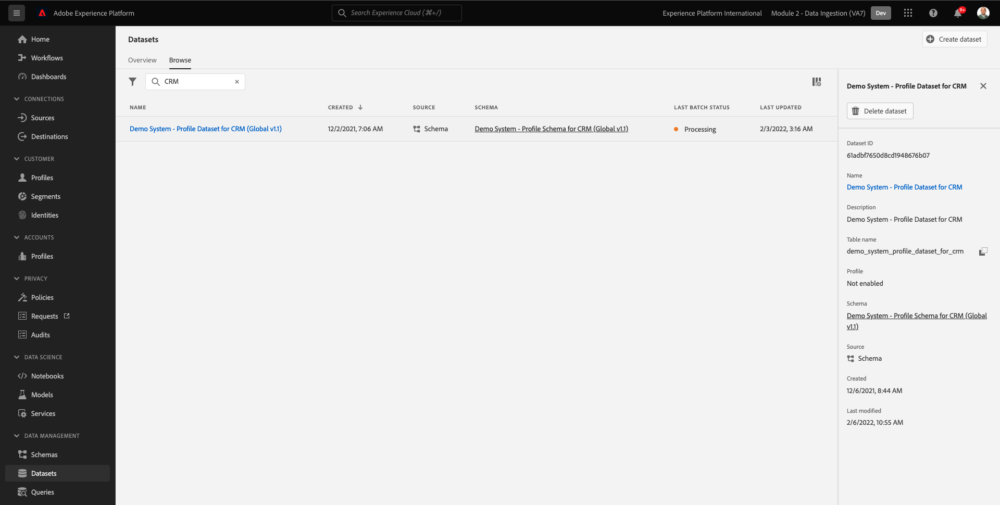
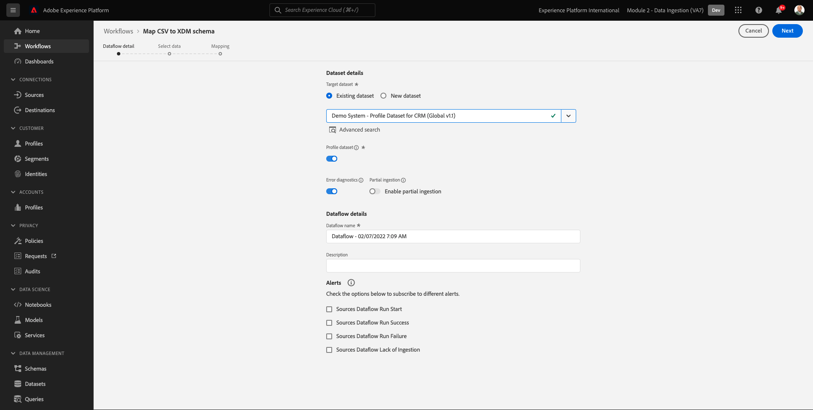
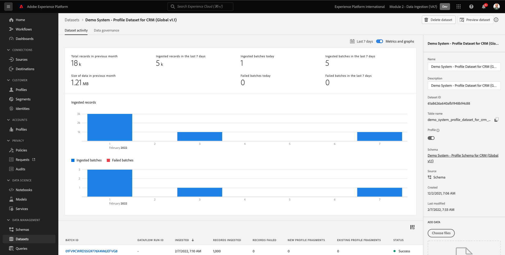
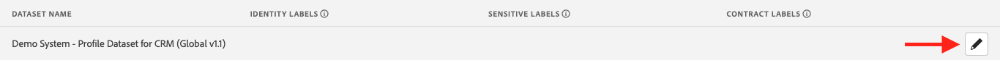

# 2.4 Acquisizione dati da fonti offline

In questo esercizio, l’obiettivo è quello di integrare dati esterni come i dati CRM in Platform.

## Finalità di apprendimento

- Scopri come generare i dati di test
- Scopri come acquisire CSV
- Scopri come utilizzare l’interfaccia utente web per l’inserimento dei dati tramite flussi di lavoro
- Comprendere le funzioni di governance dei dati di Experience Platform

## Risorse

- Interfaccia utente Mockaroo: [https://www.mockaroo.com/](https://www.mockaroo.com/)
- Experience Platform di interfaccia utente: [https://experience.adobe.com/platform/](https://experience.adobe.com/platform/)

## Attività

- Crea un file CSV con data demo. Acquisisci il file CSV in Adobe Experience Platform utilizzando i flussi di lavoro disponibili.
- Comprendere le opzioni di governance dei dati in Adobe Experience Platform

## 2.4.1 Crea il tuo set di dati CRM tramite uno strumento per la generazione di dati

Per questo hai bisogno di 1000 linee di esempio di dati CRM.

Apri il modello Mockaroo andando in [https://www.mockaroo.com/12674210](https://www.mockaroo.com/12674210).

Nel modello, noterai i campi seguenti:

- id
- nome_primo
- cognome
- e-mail
- genere
- datadina
- home_latitude
- home_longitude
- country_code
- città
- paese

Tutti questi campi sono stati definiti per produrre dati compatibili con Platform.

Per generare il file CSV, fai clic sul pulsante **[!UICONTROL Scarica dati]** che ti darà un file CSV con 1000 righe di dati demo.

Apri il file CSV in Microsoft Excel per visualizzarne il contenuto.

Quando il tuo file CSV è pronto, puoi procedere con la mappatura rispetto a XDM.

### 2.4.2 Verifica del set di dati di onboarding CRM in Adobe Experience Platform

Apri [Adobe Experience Platform](https://experience.adobe.com/platform) e vai a **[!UICONTROL Set di dati]**.

Prima di continuare, devi selezionare un **[!UICONTROL sandbox]**. La sandbox da selezionare è denominata ``--module2sandbox--``. Per eseguire questa operazione, fai clic sul testo **[!UICONTROL Produzione Prod]** nella linea blu sopra lo schermo. Dopo aver selezionato il [!UICONTROL sandbox], vedrai la modifica dello schermo e ora sei nel tuo dedicato [!UICONTROL sandbox].

In Adobe Experience Platform, fai clic su **[!UICONTROL Set di dati]** nel menu sul lato sinistro dello schermo.

In questa abilitazione utilizzerai un set di dati condiviso basato su . Il set di dati condiviso è già stato creato ed è denominato **[!UICONTROL Sistema di demo - Set di dati di profilo per CRM (Global v1.1)]**.

Apri il set di dati **[!UICONTROL Sistema di demo - Set di dati di profilo per CRM (Global v1.1)]**.

Nella schermata di panoramica sono disponibili 3 informazioni principali.

Prima di tutto, il [!UICONTROL Attività set di dati] dashboard mostra il numero totale di record CRM nel set di dati e i batch acquisiti e il loro stato

In secondo luogo, scorrendo la pagina puoi controllare quando vengono acquisiti batch di dati, quanti record sono stati caricati e anche, se il batch è stato caricato correttamente o meno. La **[!UICONTROL ID batch]** è l&#39;identificatore di un processo batch specifico e **[!UICONTROL ID batch]** è importante in quanto può essere utilizzato per risolvere i problemi relativi al mancato inserimento di un batch specifico.

Infine, il [!UICONTROL Informazioni sul set di dati] la scheda mostra informazioni importanti come [!UICONTROL ID set di dati] (ancora una volta, importante dal punto di vista della risoluzione dei problemi), il Nome del set di dati e se il set di dati è stato abilitato per Profilo.

L&#39;impostazione più importante qui è il collegamento tra il set di dati e lo schema. Lo schema definisce i dati da acquisire e l’aspetto dei dati.

In questo caso, utilizziamo il **[!UICONTROL Sistema demo - Schema del profilo per CRM (Global v1.1)]**, mappata sulla classe di **[!UICONTROL Profilo]** e ha implementato estensioni, denominate anche gruppi di campi.

Facendo clic sul nome dello schema, viene visualizzata la [!UICONTROL Schema] panoramica in cui è possibile visualizzare tutti i campi attivati per questo schema.

Per ogni schema deve essere definito un descrittore primario personalizzato. Nel caso del set di dati CRM, lo schema ha definito che il campo **[!UICONTROL crmId]** deve essere l&#39;identificatore principale. Se desideri creare uno schema e collegarlo al [!UICONTROL Profilo cliente in tempo reale], è necessario definire un [!UICONTROL Gruppo di campi] si riferisce al tuo descrittore principale.

Nella schermata precedente, puoi vedere che il nostro descrittore si trova in `--aepTenantId--.identification.core.crmId`, impostato come [!UICONTROL Identificatore principale], collegato al [!UICONTROL namespace] di **[!UICONTROL Sistema demo - CRMID]**.

Ogni schema e, in quanto tale, ogni set di dati che deve essere utilizzato nel [!UICONTROL Profilo cliente in tempo reale] dovrebbe averne uno [!UICONTROL Identificatore principale]. Questo [!UICONTROL Identificatore principale] è l’utente identificatore del marchio per un cliente in quel set di dati. Nel caso di un set di dati CRM, potrebbe essere l’indirizzo e-mail o l’ID CRM, nel caso di un set di dati del Call Center potrebbe essere il numero mobile di un cliente.

È consigliabile creare uno schema separato e specifico per ogni set di dati e impostare il descrittore per ogni set di dati in modo specifico in modo che corrisponda al funzionamento delle soluzioni correnti utilizzate dal marchio.

### 2.4.3 Utilizzo di un flusso di lavoro per mappare un file CSV su uno schema XDM

L’obiettivo è quello di integrare i dati CRM in Platform. Tutti i dati acquisiti in Platform devono essere mappati rispetto allo schema XDM specifico. Attualmente disponi di un set di dati CSV con 1000 righe da un lato e di un set di dati collegato a uno schema dall’altro. Per caricare tale file CSV in quel set di dati, è necessario eseguire una mappatura. Per facilitare questo esercizio di mappatura, **[!UICONTROL Flussi di lavoro]** disponibile in Adobe Experience Platform.

La [!UICONTROL workflow] che utilizzeremo qui, è la [!UICONTROL workflow] denominato **[!UICONTROL Mappatura di CSV su schema XDM]** in [!UICONTROL Acquisizione dei dati] menu.

Fai clic sul pulsante **[!UICONTROL Mappatura di CSV su schema XDM]** pulsante . Fai clic su **[!UICONTROL Launch]** per avviare il processo.

Nella schermata successiva, devi selezionare un set di dati in cui inserire il file. Puoi scegliere se selezionare un set di dati già esistente o crearne uno nuovo. Per questo esercizio, ne riutilizzeremo uno esistente: selezionare **[!UICONTROL Sistema di demo - Set di dati di profilo per CRM (Global v1.1)]** come indicato di seguito e lasciare le altre impostazioni impostate su default.

Fai clic su **[!UICONTROL Successivo]** per passare al passaggio successivo.

Trascina e rilascia il file CSV o fai clic su **[!UICONTROL Sfoglia]** accedi al desktop e seleziona il file CSV.

Dopo aver selezionato il file CSV, questo viene caricato immediatamente e vedrai un&#39;anteprima del tuo file in pochi secondi.

Fai clic su **[!UICONTROL Successivo]** per passare al passaggio successivo. L’elaborazione del file può richiedere alcuni secondi.

È ora necessario mappare le intestazioni di colonna CSV con una proprietà XDM nel **[!UICONTROL Sistema demo - Set di dati profilo per CRM]**.

Adobe Experience Platform ha già fatto alcune proposte per voi, cercando di collegare il [!UICONTROL Attributi di origine] con [!UICONTROL Campi dello schema di destinazione].

Per [!UICONTROL Mappature dello schema], Adobe Experience Platform ha già provato a collegare i campi tra loro. Tuttavia, non tutte le proposte di mappatura sono corrette. Ora devi **Accettare campi di destinazione** una per una.

#### datadina

Campo Schema origine **datadina** deve essere collegato al campo target **person.nascitaDate**.

#### città

Campo Schema origine **città** deve essere collegato al campo target **homeAddress.city**.

#### paese

Campo Schema origine **paese** deve essere collegato al campo target **homeAddress.country**.

#### country_code

Campo Schema origine **country_code** deve essere collegato al campo target **homeAddress.countryCode**.

#### e-mail

Campo Schema origine **email** deve essere collegato al campo target **personalEmail.address**.

#### briciolo

Il campo Schema origine ** crmid** deve essere collegato al campo di destinazione **`--aepTenantId--`.identity.core.crmId**.

#### nome_primo

Campo Schema origine **nome_primo** deve essere collegato al campo target **person.name.firstName**.

#### genere

Campo Schema origine **genere** deve essere collegato al campo target **person.gender**.

#### home_latitude

Campo Schema origine **home_latitude** deve essere collegato al campo target **homeAddress._schema.latitude**.

#### home_longitude

Campo Schema origine **home_longitude** deve essere collegato al campo target **homeAddress._schema.longitude**.

#### id

Campo Schema origine **id** deve essere collegato al campo target **_id**.

#### cognome

Campo Schema origine **cognome** deve essere collegato al campo target **person.name.lastName**.

Ora dovresti avere questo:

Fai clic sul pulsante **[!UICONTROL Fine]** per completare il flusso di lavoro.

Dopo aver fatto clic su **[!UICONTROL Fine]**, vedrai il **Flusso di dati** panoramica e dopo un paio di minuti puoi aggiornare la schermata per verificare se il flusso di lavoro è stato completato correttamente. Fai clic su **Nome set di dati di destinazione**.

Vedrai quindi il set di dati in cui è stata elaborata l’acquisizione.

Nel set di dati viene visualizzata una [!UICONTROL ID batch] che è stato acquisito in questo momento, con 1000 record acquisiti e uno stato di **[!UICONTROL Completato]**.

Fai clic sul pulsante **[!UICONTROL Anteprima set di dati]**- pulsante per ottenere una visualizzazione rapida di un piccolo campione del set di dati per garantire che i dati caricati siano corretti.

Una volta caricati i dati, puoi definire l’approccio corretto per la governance dei dati per il nostro set di dati.

### 2.5.4 Aggiunta di governance dei dati al set di dati

Ora che i dati del cliente vengono acquisiti, devi accertarti che questo set di dati sia adeguatamente gestito per il controllo dell’utilizzo e dell’esportazione. Fai clic sul pulsante **[!UICONTROL Governance dei dati]** è possibile impostare tre tipi di restrizioni: Dati contrattuali, di identità e sensibili.

Puoi trovare ulteriori informazioni sulle diverse etichette e su come verranno applicate in futuro tramite il framework dei criteri su questo collegamento: [https://www.adobe.io/apis/experienceplatform/home/dule/duleservices.html](https://www.adobe.io/apis/experienceplatform/home/dule/duleservices.html)

Limitiamo i dati di identità per l’intero set di dati. Passa il puntatore del mouse sul nome del set di dati e fai clic sull’icona a forma di matita per modificare le impostazioni.

Vai a **[!UICONTROL Dati identità]** e vedrai che la **[!UICONTROL I2]** opzione selezionata : si presuppone che tutte le informazioni in questo set di dati siano almeno indirettamente identificabili dalla persona.

Fai clic su **[!UICONTROL Salva modifiche]** e osservano che **[!UICONTROL I2]** è ora impostato per tutti i campi dati nel set di dati.

Puoi anche impostare questi flag per i singoli campi di dati, ad esempio **[!UICONTROL firstName]** è probabile che il campo sia classificato come **[!UICONTROL I1]** livello per informazioni direttamente identificabili.

Selezionare il campo **[!UICONTROL firstName]** selezionando la casella di controllo e cliccando su **[!UICONTROL Modificare le etichette di governance]** nell&#39;angolo superiore destro dello schermo.

Vai a **[!UICONTROL Dati identità]** e vedrai che la **[!UICONTROL I2]** è già selezionata (ereditata dal set di dati). Il campo firstName ha anche una configurazione specifica del campo ed è impostato come **[!UICONTROL I1 - Dati direttamente identificabili]**.

Con questo, ora hai acquisito e classificato correttamente i dati CRM in Adobe Experience Platform.

Passaggio successivo: [2.5 Data Landing Zone](./ex5.md)

[Torna al modulo 2](./data-ingestion.md)

[Torna a tutti i moduli](../../overview.md)
