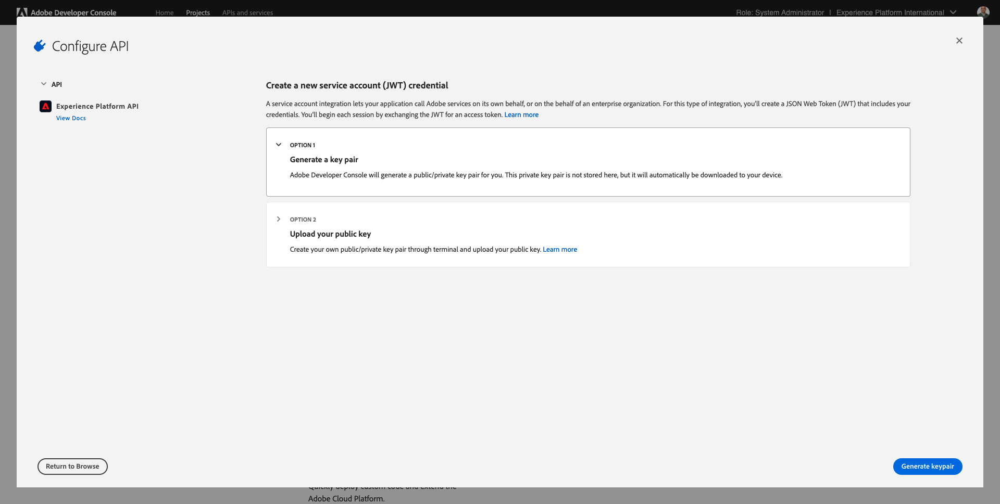
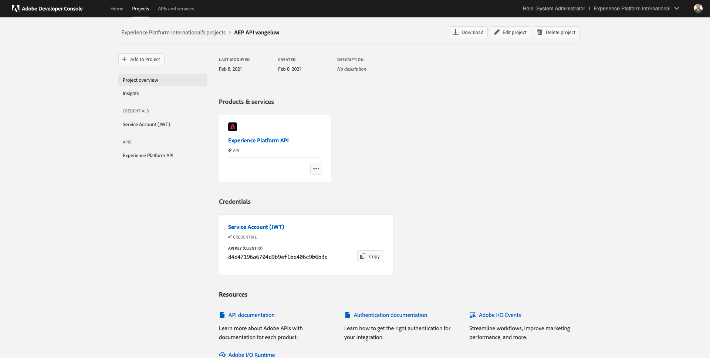
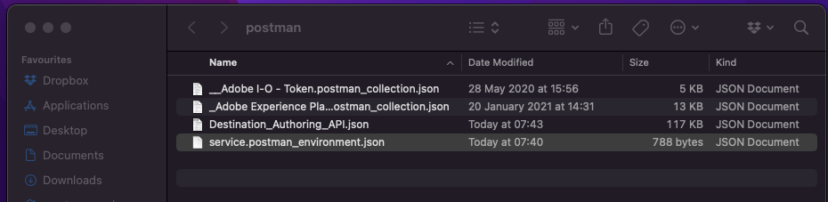
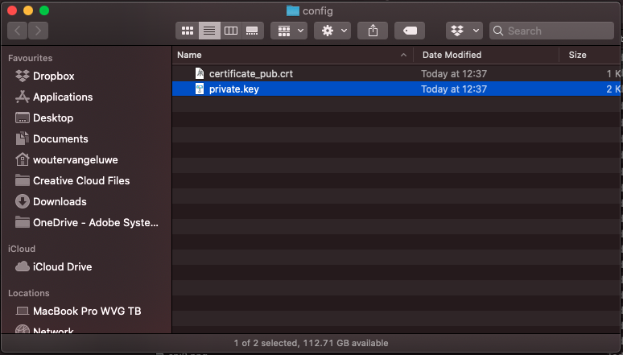
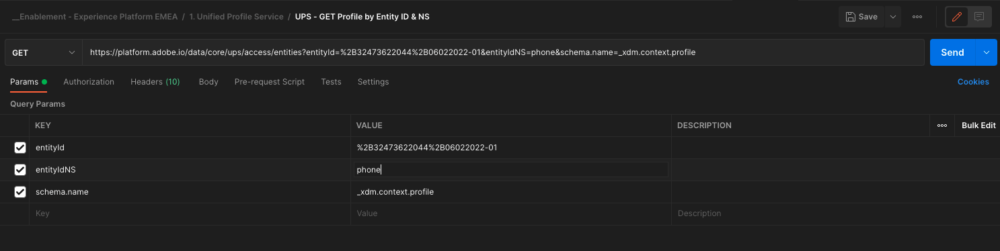

# 3.3 Visualizzare il proprio profilo cliente in tempo reale - API

In questo esercizio, utilizzerai Postman e Adobe I/O per eseguire query sulle API di Adobe Experience Platform per visualizzare il tuo profilo cliente in tempo reale.

## Storia

Nel Profilo del cliente in tempo reale, tutti i dati del profilo vengono visualizzati insieme ai dati dell’evento, nonché alle appartenenze al segmento esistenti. I dati mostrati possono provenire da qualsiasi luogo, da applicazioni di Adobe e soluzioni esterne. Questa è la vista più potente in Adobe Experience Platform, il sistema di esperienza di registrazione.

Il Profilo del cliente in tempo reale può essere utilizzato da tutte le applicazioni Adobe, ma anche da soluzioni esterne come i call center o le app client in-store. Il modo per farlo è collegare queste soluzioni esterne alle API di Adobe Experience Platform.

## 3.3.1 I tuoi identificatori

Nel pannello Visualizzatore profilo del sito web puoi trovare più identità. Ogni identità è collegata a un Namespace.


Nel pannello a raggi X sono disponibili 4 diverse combinazioni di ID e namespace:

| Identità | Namespace |
|:-------------:| :---------------:|
| Experience Cloud ID (ECID) | 12507560687324495704459439363261812234 |
| ID e-mail | woutervangeluwe+06022022-01@gmail.com |
| ID numero cellulare | +32473622044+06022022-01 |

Ricordare questi identificatori per il passaggio successivo.

Tenendo presenti questi ID, passa a Postman.

## 3.3.2 Configurare il progetto Adobe I/O

In questo esercizio utilizzerai Adobe I/O abbastanza intensamente per eseguire query sulle API di Platform. Segui i passaggi seguenti per configurare l’Adobe I/O.

Vai a [https://developer.adobe.com/console/home](https://developer.adobe.com/console/home)


Assicurati di selezionare l’istanza Adobe Experience Platform corretta nell’angolo in alto a destra dello schermo. L&#39;istanza è `--envName--`.


Fai clic su **Crea nuovo progetto**.

 o


Seleziona **+ Aggiungi al progetto** e seleziona **API**.


Vedrai questo:


Fai clic sul pulsante **Adobe Experience Platform** icona.


Fai clic su **API Experience Platform**.


Fai clic su **Avanti**.


Ora puoi scegliere di generare la coppia di chiavi di sicurezza in Adobe I/O o di caricarne una esistente.

Scegli **Opzione 1 - Generare una coppia di chiavi**.



Fai clic su **Genera coppia di chiavi**.


Vedrete un rotatore per circa 30 secondi.


Questo verrà visualizzato e la tua coppia di chiavi generata verrà scaricata come file zip: **config.zip**.

Decomprimi il file **config.zip** sul desktop, vedrai che contiene 2 file:


- **certificate_pub.crt** è il certificato di chiave pubblica. Dal punto di vista della sicurezza, si tratta del certificato che viene utilizzato liberamente per configurare integrazioni con applicazioni online.
- **private.key** è la tua chiave privata. Questo non dovrebbe mai, mai essere condiviso con nessuno. La chiave privata è ciò che utilizzi per autenticare l’implementazione API e dovrebbe essere un segreto. Se condividi la tua chiave privata con chiunque, puoi accedere alla tua implementazione e abusare dell’API per acquisire dati dannosi in Platform ed estrarre tutti i dati che si trovano in Platform.


Assicurati di salvare il **config.zip** in una posizione sicura, poiché avrai bisogno di questo per i passaggi successivi e per l’accesso futuro alle API di Adobe I/O e Adobe Experience Platform.

Fai clic su **Avanti**.


Ora devi selezionare la **Profili di prodotto** per la tua integrazione.

Seleziona i profili di prodotto richiesti.

**FYI**: nell’istanza Adobe Experience Platform, i profili di prodotto avranno un nome diverso. Devi selezionare almeno un profilo di prodotto con i diritti di accesso appropriati, configurati in Adobe Admin Console.


Fai clic su **Salva API configurata**.


Vedrete un rotore per un paio di secondi.


E poi, vedrete la vostra integrazione.


Fai clic sul pulsante **Scarica per Postman** quindi fai clic su **Account di servizio (JWT)** per scaricare un ambiente Postman (attendere il download dell’ambiente, l’operazione potrebbe richiedere un paio di secondi).


Scorri verso il basso fino a visualizzare **Account di servizio (JWT)**, dove puoi trovare tutti i dettagli di integrazione utilizzati per configurare l’integrazione con Adobe Experience Platform.


Il progetto IO ha attualmente un nome generico. Devi dare un nome descrittivo alla tua integrazione. Fai clic su **Progetto 1** (o nome simile) come indicato


Fai clic su **Modifica progetto**.


Immetti un nome e una descrizione per l’integrazione. Come convenzione di denominazione, utilizzeremo `AEP API --demoProfileLdap--`. Sostituisci ldap con il tuo ldap.
Ad esempio, se il tuo ldap è vangeluw, il nome e la descrizione della tua integrazione diventano AEP API vangeluw.

Invio `AEP API --demoProfileLdap--` come **Titolo del progetto**. Fai clic su **Salva**.


L’integrazione dell’Adobe I/O è stata completata.



## 3.3.3 Autenticazione Postman ad Adobe I/O

Vai a [https://www.getpostman.com/](https://www.getpostman.com/).

Fai clic su **Introduzione**.


Successivamente, scarica e installa Postman.


Dopo l&#39;installazione di Postman, avvia l&#39;applicazione.

In Postman sono disponibili 2 concetti: Ambienti e raccolte.

- L&#39;ambiente contiene tutte le variabili ambientali che sono più o meno coerenti. Nell’ambiente, troverai elementi come IMSOrg del nostro ambiente Platform, insieme a credenziali di sicurezza come la tua Chiave privata e altri. Il file dell&#39;ambiente è quello scaricato durante la configurazione dell&#39;Adobe I/O nell&#39;esercizio precedente, con questo nome: **service.postman_environment.json**.

- La raccolta contiene una serie di richieste API che puoi utilizzare. Useremo 2 raccolte
   - 1 Raccolta per l&#39;autenticazione all&#39;Adobe I/0
   - 1 Raccolta per gli esercizi in questo modulo
   - 1 raccolta per gli esercizi nel modulo Real-Time CDP, per l’authoring delle destinazioni

Scarica il file [postman.zip](../../assets/postman/postman_profile.zip) sul desktop locale.

In questo **postman.zip** file, troverai i seguenti file:

- `_Adobe I-O - Token.postman_collection.json`
- `_Adobe Experience Platform Enablement.postman_collection.json`
- `Destination_Authoring_API.json`

Decomprimi il file **postman.zip** archivia e archivia questi 3 file in una cartella sul desktop, insieme all&#39;ambiente Postman scaricato da Adobe I/O. Devi avere questi 4 file in quella cartella:



Torna a Postman. Fai clic su **Importa**.


Fai clic su **Carica file**.


Passa alla cartella sul desktop in cui sono stati estratti i 4 file scaricati. Seleziona questi 4 file contemporaneamente e fai clic su **Apri**.


Dopo aver fatto clic su **Apri**, Postman ti mostrerà una panoramica dell’ambiente e delle raccolte che stai per importare. Fai clic su **Importa**.


Ora disponi di tutto il necessario in Postman per iniziare a interagire con Adobe Experience Platform tramite le API.

La prima cosa da fare è assicurarti di essere autenticato correttamente. Per essere autenticato, devi richiedere un token di accesso.

Assicurati di aver selezionato l’ambiente corretto prima di eseguire qualsiasi richiesta. Per controllare l’ambiente attualmente selezionato, verifica l’elenco a discesa Ambiente nell’angolo in alto a destra.

L’ambiente selezionato deve avere un nome simile a questo:


Fai clic sul pulsante **occhio** e quindi fai clic su **Modifica** per aggiornare la chiave privata nel file di ambiente.


Vedrete questo. Tutti i campi sono precompilati, ad eccezione del campo . **PRIVATE_KEY**.


La chiave privata è stata generata al momento della creazione del progetto Adobe I/O. È stato scaricato come file zip, denominato **config.zip**. Estrai il file zip sul desktop.


Apri la cartella **config** e aprire il file **private.key** con l’editor di testo desiderato.



Vedrete qualcosa che assomiglia a questo, copiare tutto il testo negli Appunti.


Torna a Postman e incolla la chiave privata nei campi accanto alla variabile **PRIVATE_KEY**, per entrambe le colonne **VALORE INIZIALE** e **VALORE CORRENTE**. Fai clic su **Salva**.


L’ambiente e le raccolte Postman sono ora configurati e funzionano. Ora puoi eseguire l’autenticazione da Postman ad Adobe I/O.

A questo scopo, devi caricare una libreria esterna che si occuperà della crittografia e decrittografia della comunicazione. Per caricare questa libreria, devi eseguire la richiesta con il nome **INIT: Carica libreria Crypto per RS256**. Seleziona questa richiesta nel **_Adobe I/O - Raccolta token** e lo vedrete al centro dello schermo.


Fai clic sul blu **Invia** pulsante . Dopo un paio di secondi, dovrebbe essere visualizzata una risposta nel **Corpo** sezione Postman:


Una volta caricata la libreria di crittografia, possiamo eseguire l&#39;autenticazione in Adobe I/O.

In **\_Adobe I/O - Raccolta token**, seleziona la richiesta con il nome **IMS: Genera JWT + Auth**. Di nuovo, vedrai i dettagli della richiesta visualizzati al centro dello schermo.


Fai clic sul blu **Invia** pulsante . Dopo un paio di secondi, dovrebbe essere visualizzata una risposta nel **Corpo** sezione Postman:


Se la configurazione ha avuto successo, dovresti vedere una risposta simile che contiene le seguenti informazioni:

| Chiave | Valore |
|:-------------:| :---------------:| 
| token_type | **portatore** |
| access_token | **eyJ4NXUiJpbXNfbmEx...QT7mqZkumN1tdsPEioOEl4087Dg** |
| expires_in | **8639973** |

L&#39;Adobe I/O ti ha dato un **portatore**-token, con un valore specifico (questo access_token molto lungo) e una finestra di scadenza.

Il token ricevuto è valido per 24 ore. Ciò significa che dopo 24 ore, se desideri utilizzare Postman per l’autenticazione per Adobe I/O, dovrai generare un nuovo token eseguendo nuovamente questa richiesta.

## 3.3.4 API Profilo cliente in tempo reale, schema: Profilo

Ora puoi procedere e inviare la tua prima richiesta alle API Profilo cliente in tempo reale di Platform.

In Postman, individua la raccolta **Abilitazione _Adobe Experience Platform**.


In **1. Servizio di profilo unificato**, seleziona la prima richiesta con il nome **UPS - GET profilo per ID entità e NS**.


Per questa richiesta sono disponibili tre variabili richieste:

| Chiave | Valore | Definizione |
|:-------------:| :---------------:| :---------------:| 
| entityId | **id** | l&#39;ID cliente specifico |
| entityIdNS | **namespace** | lo spazio dei nomi specifico applicabile all&#39;ID |
| schema.name | **_xdm.context.profile** | lo schema specifico per il quale si desidera ricevere le informazioni |

Quindi, se desideri chiedere alle API di Adobe Experience Platform di restituirti tutte le informazioni sul profilo per il tuo ECID, dovrai configurare la richiesta come segue:

| Chiave | Valore |
|:-------------:| :---------------:| 
| entityId | **yourECID** |
| entityIdNS | **ecid** |
| schema.name | **_xdm.context.profile** |


È inoltre necessario verificare la **Intestazione** - campi della richiesta. Vai a **Intestazioni**. Vedrai questo:


| Chiave | Valore |
| ----------- | ----------- |
| x-sandbox-name | `--aepSandboxId--` |

>[!NOTE]
>
>È necessario specificare il nome della sandbox Adobe Experience Platform in uso. Il tuo nome x-sandbox dovrebbe essere `--aepSandboxId--`.

Fai clic su **Invia** per inviare la richiesta a Platform.

Dovresti ricevere una risposta immediata da Platform, mostrandoti una cosa come questa:


Questa è la risposta completa da Platform:

```javascript
{
    "A28iM3aJBJRbEQpOnUh5HOM9": {
        "entityId": "A28iM3aJBJRbEQpOnUh5HOM9",
        "mergePolicy": {
            "id": "e632ccb8-882a-4b5e-8375-96a1ba3df1aa"
        },
        "sources": [
            "61fe23c5be4b5f19485dc379",
            "profile-streaming-segment",
            "61fe23cfa07c1219489b3ba4"
        ],
        "tags": [
            "1644130566774:1542:232:va7",
            "0a1e9dd4-940a-46ec-9114-7e371cf5c4d0",
            "aep_ups_partitioned_profile_cdc_low_lag_sla_0:106:1090888313",
            "a6fed09e-2c56-403e-8692-4e99e4779dfa:IRL1",
            "1644419616318:2989:31:va7",
            "aep_ups_profile_change_event_prod_va7:71:7946633524-8361f22c-c09e-4364-b24b-b57435c4d14f"
        ],
        "identityGraph": [
            "BUF9zMKLrXq72p4HpbsHv1SSBnr0LTAxQGdtYWlsLmNvbQ",
            "GkicrkFjgmCjUg",
            "GtCbrkFjgkSOFg",
            "A2-AP9zOsakzNTe9Rqwf7Wse",
            "BkFuK4QcJpSPByuSBnr0LTAx",
            "A28jSB484ziuECF3fEoXmFlF",
            "A28iM3aJBJRbEQpOnUh5HOM9"
        ],
        "entity": {
            "_experienceplatform": {
                "individualCharacteristics": {},
                "loyaltyDetails": {
                    "level": "Basic",
                    "points": 0
                },
                "identification": {
                    "core": {
                        "phoneNumber": "+32473622044+06022022-01",
                        "email": "woutervangeluwe+06022022-01@gmail.com",
                        "loyaltyId": "5415776",
                        "ecid": "12019606991718502754997192487345616673",
                        "crmId": "1478212"
                    }
                }
            },
            "personalEmail": {
                "address": "woutervangeluwe+06022022-01@gmail.com"
            },
            "_repo": {
                "createDate": "2022-02-06T06:56:06.424Z"
            },
            "testProfile": true,
            "homeAddress": {
                "postalCode": "1831",
                "city": "Diegem",
                "street1": "Culliganlaan 2F"
            },
            "mobilePhone": {
                "number": "+32473622044+06022022-01"
            },
            "segmentMembership": {
                "ups": {
                    "bc999ded-b6d7-40d4-87a7-d3a280b950e3": {
                        "lastQualificationTime": "2022-02-09T20:38:33Z",
                        "status": "exited"
                    },
                    "23b1cd4e-d62f-44bd-8392-3095a33109c4": {
                        "lastQualificationTime": "2022-02-09T20:38:33Z",
                        "status": "exited"
                    },
                    "f0807704-a1c8-4ac4-85dd-60db2fbf18f1": {
                        "lastQualificationTime": "2022-02-09T20:38:33Z",
                        "status": "existing"
                    }
                }
            },
            "person": {
                "name": {
                    "lastName": "Van Geluwe",
                    "firstName": "Wouter"
                },
                "gender": "female",
                "birthDate": "1982-07-08"
            },
            "userActivityRegions": {
                "IRL1": {
                    "captureTimestamp": "2022-02-09T15:21:11Z"
                }
            },
            "identityMap": {
                "email": [
                    {
                        "id": "woutervangeluwe+06022022-01@gmail.com"
                    }
                ],
                "crmid": [
                    {
                        "id": "1478212"
                    }
                ],
                "ecid": [
                    {
                        "id": "12507560687324495704459439363261812234"
                    },
                    {
                        "id": "12019606991718502754997192487345616673"
                    },
                    {
                        "id": "38335942889672702722192106363935964471"
                    }
                ],
                "phone": [
                    {
                        "id": "+32473622044+06022022-01"
                    }
                ],
                "loyaltyid": [
                    {
                        "id": "5415776"
                    }
                ]
            }
        },
        "lastModifiedAt": "2022-02-09T20:38:36Z"
    }
}
```

Questi sono attualmente tutti i dati di profilo disponibili in Platform per questo ECID.

Non è necessario utilizzare l’ECID per richiedere i dati del profilo dal Profilo cliente in tempo reale di Platform. Per richiedere questi dati, puoi usare qualsiasi ID in qualsiasi namespace.

Torniamo a Postman e facciamo finta di essere il call center e inviamo una richiesta a Platform specificando lo spazio dei nomi di **Telefono** e il tuo numero di cellulare.

Quindi, se desideri chiedere alle API di Platform di restituirti tutte le informazioni sul profilo per un telefono specifico, dovrai configurare la richiesta come segue:

| Chiave | Valore |
|:-------------:| :---------------:| 
| entityId | **numero di telefono** |
| entityIdNS | **telefono** (sostituire l&#39;ecid con un telefono) |
| schema.name | **_xdm.context.profile** |

Se il numero di telefono contiene simboli speciali come **+**, è necessario selezionare il numero di telefono completo, fare clic con il pulsante destro del mouse e fare clic su **EncodeURIComponent**.


A quel punto avrai questo:



È inoltre necessario verificare la **Intestazione** - campi della richiesta. Vai a **Intestazioni**. Vedrai questo:


| Chiave | Valore |
| ----------- | ----------- |
| x-sandbox-name | `--aepSandboxId--` |

>[!NOTE]
>
>È necessario specificare il nome della sandbox Adobe Experience Platform in uso. Il tuo nome x-sandbox dovrebbe essere `--aepSandboxId--`.

Fai clic sul blu **Invia** e verifica la risposta.


Facciamo la stessa cosa per il tuo indirizzo e-mail specificando lo spazio dei nomi di **email** e il tuo indirizzo e-mail.

Quindi, se desideri chiedere alle API di Platform di restituirti tutte le informazioni sul profilo per un indirizzo e-mail specifico, dovrai configurare la richiesta come segue:

| Chiave | Valore |
|:-------------:| :---------------:| 
| entityId | **corrimano** |
| entityIdNS | **email** (sostituire Telefono con e-mail) |
| schema.name | **_xdm.context.profile** |

Se il tuo indirizzo e-mail contiene simboli speciali come **+**, devi selezionare il tuo indirizzo e-mail completo, fare clic con il pulsante destro del mouse e fare clic su **EncodeURIComponent**.


A quel punto avrai questo:


È inoltre necessario verificare la **Intestazione** - campi della richiesta. Vai a **Intestazioni**. Vedrai questo:


| Chiave | Valore |
| ----------- | ----------- |
| x-sandbox-name | `--aepSandboxId--` |

>[!NOTE]
>
>È necessario specificare il nome della sandbox Adobe Experience Platform in uso. Il tuo nome x-sandbox dovrebbe essere `--aepSandboxId--`.

Fai clic sul blu **Invia** e verifica la risposta.


Si tratta di un tipo di flessibilità molto importante che viene offerta ai marchi. Ciò significa che qualsiasi ambiente può inviare una richiesta a Platform utilizzando il proprio ID e namespace, senza dover comprendere la complessità di più namespace e ID.

Ad esempio:

- il Call Center richiede i dati da Platform utilizzando lo spazio dei nomi **telefono**
- il sistema fedeltà richiederà i dati a Platform utilizzando lo spazio dei nomi **email**
- applicazioni online potrebbero utilizzare lo spazio dei nomi **ecid**

Il Call Center non sa necessariamente che tipo di identificatore viene utilizzato nel sistema fedeltà e il sistema fedeltà non sa necessariamente che tipo di identificatore viene utilizzato dalle applicazioni online. Ogni singolo sistema può utilizzare le informazioni che possiede e capire per ottenere le informazioni di cui ha bisogno, quando ne ha bisogno.

## 3.3.5 API Profilo cliente in tempo reale, schema: Profilo ed ExperienceEvent

Dopo aver eseguito correttamente le query sulle API di Platform per i dati di profilo, ora facciamo lo stesso con i dati di ExperienceEvent.

In Postman, individua la raccolta **Abilitazione _Adobe Experience Platform**.


In **1. Servizio di profilo unificato**, seleziona la seconda richiesta con il nome **UPS - Profilo di GET ed EE per ID entità e NS**.


Per questa richiesta sono disponibili quattro variabili richieste:

| Chiave | Valore | Definizione |
|:-------------:| :---------------:|  :---------------:| 
| schema.name | **_xdm.context.experienceevent** | lo schema specifico per il quale si desidera ricevere le informazioni. In questo caso, stiamo cercando dati mappati sullo schema ExperienceEvent. |
| relatedSchema.name | **_xdm.context.profile** | Mentre cerchiamo i dati mappati sullo schema ExperienceEvent , dobbiamo specificare un’identità per la quale desideri ricevere tali dati. Lo schema che ha accesso all&#39;identità è lo schema del profilo, quindi il relativo schema è lo schema del profilo. |
| relatedEntityId | **id** | ID cliente specifico |
| relatedEntityIdNS | **namespace** | lo spazio dei nomi specifico applicabile all&#39;ID |

Quindi, se desideri chiedere alle API di Platform di restituirti tutte le informazioni sul profilo per il tuo ecid, devi configurare la richiesta come segue:

| Chiave | Valore |
|:-------------:| :---------------:| 
| schema.name | **_xdm.context.experienceevent** |
| relatedSchema.name | **_xdm.context.profile** |
| relatedEntityId | **yourECID** |
| relatedEntityIdNS | **ecid** |


È inoltre necessario verificare la **Intestazione** - campi della richiesta. Vai a **Intestazioni**. Vedrai questo:


| Chiave | Valore |
| ----------- | ----------- |
| x-sandbox-name | `--aepSandboxId--` |

>[!NOTE]
>
>È necessario specificare il nome della sandbox Adobe Experience Platform in uso. Il tuo nome x-sandbox dovrebbe essere `--aepSandboxId--`.

Fai clic su **Invia** per inviare la richiesta a Platform.

Dovresti ricevere una risposta immediata da Platform, mostrandoti una cosa come questa:


Di seguito è riportata la risposta completa da Platform. In questo esempio, otto ExperienceEvents sono collegati all’ECID del cliente. Osserva quanto segue per vedere le diverse variabili sulla richiesta, come illustrato di seguito è la diretta conseguenza della configurazione in Launch negli esercizi precedenti.

Inoltre, quando il pannello a raggi X mostra le informazioni di ExperienceEvent, utilizza il payload sottostante per analizzare e recuperare informazioni come Nome prodotto (cerca productName nel payload seguente) e URL immagine prodotto (cerca productImageUrl nel payload sottostante).

```javascript
{
    "_page": {
        "orderby": "timestamp",
        "start": "d686ab8a-2d0c-4722-9ff5-bfc1020b0b55-0",
        "count": 31,
        "next": ""
    },
    "children": [
        {
            "relatedEntityId": "A28iM3aJBJRbEQpOnUh5HOM9",
            "entityId": "d686ab8a-2d0c-4722-9ff5-bfc1020b0b55-0",
            "timestamp": 1644127126596,
            "entity": {
                "environment": {
                    "ipV4": "213.118.129.117",
                    "type": "browser",
                    "browserDetails": {
                        "viewportHeight": 969,
                        "viewportWidth": 1920,
                        "userAgent": "Mozilla/5.0 (Macintosh; Intel Mac OS X 10_15_7) AppleWebKit/537.36 (KHTML, like Gecko) Chrome/98.0.4758.80 Safari/537.36"
                    }
                },
                "web": {
                    "webPageDetails": {
                        "pageViews": {
                            "value": 1
                        },
                        "name": "vangeluw-OCUC",
                        "URL": "https://builder.adobedemo.com/run/vangeluw-OCUC"
                    },
                    "webReferrer": {
                        "URL": "https://adobe.okta.com/"
                    }
                },
                "_experienceplatform": {
                    "interactionDetails": {
                        "core": {
                            "channel": "web"
                        }
                    },
                    "demoEnvironment": {
                        "brandName": "vangeluw-OCUC"
                    },
                    "identification": {
                        "core": {
                            "ecid": "12507560687324495704459439363261812234"
                        }
                    }
                },
                "implementationDetails": {
                    "name": "https://ns.adobe.com/experience/alloy/reactor",
                    "version": "2.8.0+2.9.0",
                    "environment": "browser"
                },
                "identityMap": {
                    "ECID": [
                        {
                            "id": "12507560687324495704459439363261812234",
                            "authenticatedState": "ambiguous",
                            "primary": true
                        }
                    ]
                },
                "eventType": "web.webpagedetails.pageViews",
                "_id": "d686ab8a-2d0c-4722-9ff5-bfc1020b0b55-0",
                "placeContext": {
                    "localTime": "2022-02-06T06:58:46.596+01:00",
                    "localTimezoneOffset": -60
                },
                "device": {
                    "screenOrientation": "landscape",
                    "screenWidth": 1920,
                    "screenHeight": 1080
                },
                "timestamp": "2022-02-06T05:58:46.596Z"
            },
            "lastModifiedAt": "2022-02-06T05:59:48Z"
        },
        {
            "relatedEntityId": "A28iM3aJBJRbEQpOnUh5HOM9",
            "entityId": "919a46bf-a591-4c32-9201-b72250d5f5d9-0",
            "timestamp": 1644127129876,
            "entity": {
                "environment": {
                    "ipV4": "213.118.129.117",
                    "type": "browser",
                    "browserDetails": {
                        "viewportHeight": 969,
                        "viewportWidth": 1920,
                        "userAgent": "Mozilla/5.0 (Macintosh; Intel Mac OS X 10_15_7) AppleWebKit/537.36 (KHTML, like Gecko) Chrome/98.0.4758.80 Safari/537.36"
                    }
                },
                "web": {
                    "webPageDetails": {
                        "pageViews": {
                            "value": 1
                        },
                        "name": "vangeluw-OCUC#",
                        "URL": "https://builder.adobedemo.com/run/vangeluw-OCUC#"
                    },
                    "webReferrer": {
                        "URL": "https://adobe.okta.com/"
                    }
                },
                "_experienceplatform": {
                    "interactionDetails": {
                        "core": {
                            "channel": "web"
                        }
                    },
                    "demoEnvironment": {
                        "brandName": "vangeluw-OCUC"
                    },
                    "identification": {
                        "core": {
                            "ecid": "12507560687324495704459439363261812234"
                        }
                    }
                },
                "implementationDetails": {
                    "name": "https://ns.adobe.com/experience/alloy/reactor",
                    "version": "2.8.0+2.9.0",
                    "environment": "browser"
                },
                "identityMap": {
                    "ECID": [
                        {
                            "id": "12507560687324495704459439363261812234",
                            "authenticatedState": "ambiguous",
                            "primary": true
                        }
                    ]
                },
                "eventType": "web.webpagedetails.pageViews",
                "_id": "919a46bf-a591-4c32-9201-b72250d5f5d9-0",
                "placeContext": {
                    "localTime": "2022-02-06T06:58:49.876+01:00",
                    "localTimezoneOffset": -60
                },
                "device": {
                    "screenOrientation": "landscape",
                    "screenWidth": 1920,
                    "screenHeight": 1080
                },
                "timestamp": "2022-02-06T05:58:49.876Z"
            },
            "lastModifiedAt": "2022-02-06T05:59:48Z"
        },
        {
            "relatedEntityId": "A28iM3aJBJRbEQpOnUh5HOM9",
            "entityId": "41a80489-00d4-446c-b456-8cb19c3f309a-0",
            "timestamp": 1644130597134,
            "entity": {
                "environment": {
                    "ipV4": "213.118.129.117",
                    "type": "browser",
                    "browserDetails": {
                        "viewportHeight": 1001,
                        "viewportWidth": 1920,
                        "userAgent": "Mozilla/5.0 (Macintosh; Intel Mac OS X 10_15_7) AppleWebKit/537.36 (KHTML, like Gecko) Chrome/98.0.4758.80 Safari/537.36"
                    }
                },
                "web": {
                    "webPageDetails": {
                        "pageViews": {
                            "value": 1
                        },
                        "name": "login",
                        "URL": "https://builder.adobedemo.com/run/vangeluw-OCUC/login"
                    },
                    "webReferrer": {
                        "URL": "https://builder.adobedemo.com/run/vangeluw-OCUC/login"
                    }
                },
                "_experienceplatform": {
                    "interactionDetails": {
                        "core": {
                            "channel": "web"
                        }
                    },
                    "demoEnvironment": {
                        "brandName": "vangeluw-OCUC"
                    },
                    "identification": {
                        "core": {
                            "ecid": "12507560687324495704459439363261812234"
                        }
                    }
                },
                "implementationDetails": {
                    "name": "https://ns.adobe.com/experience/alloy/reactor",
                    "version": "2.8.0+2.9.0",
                    "environment": "browser"
                },
                "identityMap": {
                    "ECID": [
                        {
                            "id": "12507560687324495704459439363261812234",
                            "authenticatedState": "ambiguous",
                            "primary": true
                        }
                    ]
                },
                "eventType": "web.webpagedetails.pageViews",
                "_id": "41a80489-00d4-446c-b456-8cb19c3f309a-0",
                "placeContext": {
                    "localTime": "2022-02-06T07:56:37.134+01:00",
                    "localTimezoneOffset": -60
                },
                "device": {
                    "screenOrientation": "landscape",
                    "screenWidth": 1920,
                    "screenHeight": 1080
                },
                "timestamp": "2022-02-06T06:56:37.134Z"
            },
            "lastModifiedAt": "2022-02-06T06:56:38Z"
        },
        {
            "relatedEntityId": "A28jSB484ziuECF3fEoXmFlF",
            "entityId": "8ACC7B6C-2320-4865-B414-3B0CFA01F628",
            "timestamp": 1644419615000,
            "entity": {
                "environment": {
                    "ipV4": "213.118.129.117",
                    "browserDetails": {
                        "userAgent": "Mozilla/5.0 (iPhone; CPU OS 15_3 like Mac OS X; en_BE)"
                    }
                },
                "eventType": "application.login",
                "_id": "8ACC7B6C-2320-4865-B414-3B0CFA01F628",
                "_experienceplatform": {
                    "interactionDetails": {
                        "core": {
                            "channel": "mobile"
                        }
                    },
                    "demoEnvironment": {
                        "brandName": "vangeluw-2L6V"
                    },
                    "identification": {
                        "core": {
                            "ecid": "12019606991718502754997192487345616673",
                            "email": "woutervangeluwe+06022022-01@gmail.com"
                        }
                    }
                },
                "timestamp": "2022-02-09T15:13:35Z",
                "identityMap": {
                    "ECID": [
                        {
                            "id": "12019606991718502754997192487345616673",
                            "authenticatedState": "ambiguous",
                            "primary": true
                        }
                    ]
                }
            },
            "lastModifiedAt": "2022-02-09T15:13:38Z"
        },
        {
            "relatedEntityId": "A28jSB484ziuECF3fEoXmFlF",
            "entityId": "54F68CE5-E9E1-4AD0-91B1-7B607A9285C4",
            "timestamp": 1644419658000,
            "entity": {
                "environment": {
                    "ipV4": "213.118.129.117",
                    "browserDetails": {
                        "userAgent": "Mozilla/5.0 (iPhone; CPU OS 15_3 like Mac OS X; en_BE)"
                    }
                },
                "_experienceplatform": {
                    "interactionDetails": {
                        "core": {
                            "channel": "mobile"
                        }
                    },
                    "demoEnvironment": {
                        "brandName": "vangeluw-2L6V"
                    },
                    "identification": {
                        "core": {
                            "ecid": "12019606991718502754997192487345616673"
                        }
                    }
                },
                "identityMap": {
                    "ECID": [
                        {
                            "id": "12019606991718502754997192487345616673",
                            "authenticatedState": "ambiguous",
                            "primary": true
                        }
                    ]
                },
                "eventType": "commerce.productViews",
                "_id": "54F68CE5-E9E1-4AD0-91B1-7B607A9285C4",
                "commerce": {
                    "productViews": {
                        "value": 1
                    }
                },
                "productListItems": [
                    {
                        "quantity": 1,
                        "productAddMethod": "Mobile",
                        "_experienceplatform": {
                            "core": {
                                "mainCategory": "Women",
                                "productURL": "product1",
                                "imageURL": "https://contentviewer.s3.amazonaws.com/helium/wh08-white_main.jpg"
                            }
                        },
                        "priceTotal": 42,
                        "name": "Cassia Funnel Sweatshirt",
                        "SKU": "product1",
                        "currencyCode": "USD"
                    }
                ],
                "timestamp": "2022-02-09T15:14:18Z"
            },
            "lastModifiedAt": "2022-02-09T15:14:21Z"
        },
        {
            "relatedEntityId": "A2-AP9zOsakzNTe9Rqwf7Wse",
            "entityId": "bfe26684-bc3b-40c5-9fe5-5aba854c3227-0",
            "timestamp": 1644420036035,
            "entity": {
                "environment": {
                    "ipV4": "193.105.139.131",
                    "type": "browser",
                    "browserDetails": {
                        "viewportHeight": 969,
                        "viewportWidth": 1920,
                        "userAgent": "Mozilla/5.0 (Macintosh; Intel Mac OS X 10_15_7) AppleWebKit/537.36 (KHTML, like Gecko) Chrome/98.0.4758.80 Safari/537.36"
                    }
                },
                "web": {
                    "webPageDetails": {
                        "pageViews": {
                            "value": 1
                        },
                        "name": "vangeluw-OCUC",
                        "URL": "https://builder.adobedemo.com/run/vangeluw-OCUC"
                    },
                    "webReferrer": {
                        "URL": "https://adobe.okta.com/"
                    }
                },
                "_experienceplatform": {
                    "interactionDetails": {
                        "core": {
                            "channel": "web"
                        }
                    },
                    "demoEnvironment": {
                        "brandName": "vangeluw-OCUC"
                    },
                    "identification": {
                        "core": {
                            "ecid": "38335942889672702722192106363935964471"
                        }
                    }
                },
                "implementationDetails": {
                    "name": "https://ns.adobe.com/experience/alloy/reactor",
                    "version": "2.8.0+2.9.0",
                    "environment": "browser"
                },
                "identityMap": {
                    "ECID": [
                        {
                            "id": "38335942889672702722192106363935964471",
                            "authenticatedState": "ambiguous",
                            "primary": true
                        }
                    ]
                },
                "eventType": "web.webpagedetails.pageViews",
                "_id": "bfe26684-bc3b-40c5-9fe5-5aba854c3227-0",
                "placeContext": {
                    "localTime": "2022-02-09T16:20:36.035+01:00",
                    "localTimezoneOffset": -60
                },
                "device": {
                    "screenOrientation": "landscape",
                    "screenWidth": 1920,
                    "screenHeight": 1080
                },
                "timestamp": "2022-02-09T15:20:36.035Z"
            },
            "lastModifiedAt": "2022-02-09T15:20:39Z"
        },
        {
            "relatedEntityId": "A2-AP9zOsakzNTe9Rqwf7Wse",
            "entityId": "0480c434-8fcd-4a80-b298-c561276ac989-0",
            "timestamp": 1644420037078,
            "entity": {
                "environment": {
                    "ipV4": "193.105.139.131",
                    "type": "browser",
                    "browserDetails": {
                        "viewportHeight": 969,
                        "viewportWidth": 1920,
                        "userAgent": "Mozilla/5.0 (Macintosh; Intel Mac OS X 10_15_7) AppleWebKit/537.36 (KHTML, like Gecko) Chrome/98.0.4758.80 Safari/537.36"
                    }
                },
                "web": {
                    "webPageDetails": {
                        "pageViews": {
                            "value": 1
                        },
                        "name": "vangeluw-OCUC#",
                        "URL": "https://builder.adobedemo.com/run/vangeluw-OCUC#"
                    },
                    "webReferrer": {
                        "URL": "https://adobe.okta.com/"
                    }
                },
                "_experienceplatform": {
                    "interactionDetails": {
                        "core": {
                            "channel": "web"
                        }
                    },
                    "demoEnvironment": {
                        "brandName": "vangeluw-OCUC"
                    },
                    "identification": {
                        "core": {
                            "ecid": "38335942889672702722192106363935964471"
                        }
                    }
                },
                "implementationDetails": {
                    "name": "https://ns.adobe.com/experience/alloy/reactor",
                    "version": "2.8.0+2.9.0",
                    "environment": "browser"
                },
                "identityMap": {
                    "ECID": [
                        {
                            "id": "38335942889672702722192106363935964471",
                            "authenticatedState": "ambiguous",
                            "primary": true
                        }
                    ]
                },
                "eventType": "web.webpagedetails.pageViews",
                "_id": "0480c434-8fcd-4a80-b298-c561276ac989-0",
                "placeContext": {
                    "localTime": "2022-02-09T16:20:37.078+01:00",
                    "localTimezoneOffset": -60
                },
                "device": {
                    "screenOrientation": "landscape",
                    "screenWidth": 1920,
                    "screenHeight": 1080
                },
                "timestamp": "2022-02-09T15:20:37.078Z"
            },
            "lastModifiedAt": "2022-02-09T15:20:39Z"
        },
        {
            "relatedEntityId": "A2-AP9zOsakzNTe9Rqwf7Wse",
            "entityId": "6b1b3983-6966-4551-a711-6b6e410fd819-0",
            "timestamp": 1644420045993,
            "entity": {
                "environment": {
                    "ipV4": "193.105.139.131",
                    "type": "browser",
                    "browserDetails": {
                        "viewportHeight": 969,
                        "viewportWidth": 1920,
                        "userAgent": "Mozilla/5.0 (Macintosh; Intel Mac OS X 10_15_7) AppleWebKit/537.36 (KHTML, like Gecko) Chrome/98.0.4758.80 Safari/537.36"
                    }
                },
                "web": {
                    "webPageDetails": {
                        "pageViews": {
                            "value": 1
                        },
                        "name": "login",
                        "URL": "https://builder.adobedemo.com/run/vangeluw-OCUC/login"
                    },
                    "webReferrer": {
                        "URL": "https://adobe.okta.com/"
                    }
                },
                "_experienceplatform": {
                    "interactionDetails": {
                        "core": {
                            "channel": "web"
                        }
                    },
                    "demoEnvironment": {
                        "brandName": "vangeluw-OCUC"
                    },
                    "identification": {
                        "core": {
                            "ecid": "38335942889672702722192106363935964471"
                        }
                    }
                },
                "implementationDetails": {
                    "name": "https://ns.adobe.com/experience/alloy/reactor",
                    "version": "2.8.0+2.9.0",
                    "environment": "browser"
                },
                "identityMap": {
                    "ECID": [
                        {
                            "id": "38335942889672702722192106363935964471",
                            "authenticatedState": "ambiguous",
                            "primary": true
                        }
                    ]
                },
                "eventType": "web.webpagedetails.pageViews",
                "_id": "6b1b3983-6966-4551-a711-6b6e410fd819-0",
                "placeContext": {
                    "localTime": "2022-02-09T16:20:45.993+01:00",
                    "localTimezoneOffset": -60
                },
                "device": {
                    "screenOrientation": "landscape",
                    "screenWidth": 1920,
                    "screenHeight": 1080
                },
                "timestamp": "2022-02-09T15:20:45.993Z"
            },
            "lastModifiedAt": "2022-02-09T15:20:47Z"
        },
        {
            "relatedEntityId": "A2-AP9zOsakzNTe9Rqwf7Wse",
            "entityId": "ae0f3551-7753-4467-8547-8fdbb66c2214-0",
            "timestamp": 1644420058565,
            "entity": {
                "environment": {
                    "ipV4": "193.105.139.131",
                    "type": "browser",
                    "browserDetails": {
                        "viewportHeight": 969,
                        "viewportWidth": 1920,
                        "userAgent": "Mozilla/5.0 (Macintosh; Intel Mac OS X 10_15_7) AppleWebKit/537.36 (KHTML, like Gecko) Chrome/98.0.4758.80 Safari/537.36"
                    }
                },
                "web": {
                    "webPageDetails": {
                        "URL": "https://builder.adobedemo.com/run/vangeluw-OCUC/home"
                    },
                    "webReferrer": {
                        "URL": "https://adobe.okta.com/"
                    }
                },
                "_experienceplatform": {
                    "interactionDetails": {
                        "core": {
                            "channel": "web"
                        }
                    },
                    "demoEnvironment": {
                        "brandName": "vangeluw-OCUC"
                    },
                    "identification": {
                        "core": {
                            "ecid": "38335942889672702722192106363935964471",
                            "email": "woutervangeluwe+06022022-01@gmail.com"
                        }
                    }
                },
                "implementationDetails": {
                    "name": "https://ns.adobe.com/experience/alloy/reactor",
                    "version": "2.8.0+2.9.0",
                    "environment": "browser"
                },
                "identityMap": {
                    "ECID": [
                        {
                            "id": "38335942889672702722192106363935964471",
                            "authenticatedState": "ambiguous",
                            "primary": true
                        }
                    ]
                },
                "eventType": "web.login",
                "_id": "ae0f3551-7753-4467-8547-8fdbb66c2214-0",
                "placeContext": {
                    "localTime": "2022-02-09T16:20:58.565+01:00",
                    "localTimezoneOffset": -60
                },
                "device": {
                    "screenOrientation": "landscape",
                    "screenWidth": 1920,
                    "screenHeight": 1080
                },
                "timestamp": "2022-02-09T15:20:58.565Z"
            },
            "lastModifiedAt": "2022-02-09T15:20:59Z"
        },
        {
            "relatedEntityId": "A2-AP9zOsakzNTe9Rqwf7Wse",
            "entityId": "5e67a9c9-b201-4e21-bd3a-4d10475f6156-0",
            "timestamp": 1644420058653,
            "entity": {
                "environment": {
                    "ipV4": "193.105.139.131",
                    "type": "browser",
                    "browserDetails": {
                        "viewportHeight": 969,
                        "viewportWidth": 1920,
                        "userAgent": "Mozilla/5.0 (Macintosh; Intel Mac OS X 10_15_7) AppleWebKit/537.36 (KHTML, like Gecko) Chrome/98.0.4758.80 Safari/537.36"
                    }
                },
                "web": {
                    "webPageDetails": {
                        "pageViews": {
                            "value": 1
                        },
                        "name": "home",
                        "URL": "https://builder.adobedemo.com/run/vangeluw-OCUC/home"
                    },
                    "webReferrer": {
                        "URL": "https://adobe.okta.com/"
                    }
                },
                "_experienceplatform": {
                    "interactionDetails": {
                        "core": {
                            "channel": "web"
                        }
                    },
                    "demoEnvironment": {
                        "brandName": "vangeluw-OCUC"
                    },
                    "identification": {
                        "core": {
                            "ecid": "38335942889672702722192106363935964471"
                        }
                    }
                },
                "implementationDetails": {
                    "name": "https://ns.adobe.com/experience/alloy/reactor",
                    "version": "2.8.0+2.9.0",
                    "environment": "browser"
                },
                "identityMap": {
                    "ECID": [
                        {
                            "id": "38335942889672702722192106363935964471",
                            "authenticatedState": "ambiguous",
                            "primary": true
                        }
                    ]
                },
                "eventType": "web.webpagedetails.pageViews",
                "_id": "5e67a9c9-b201-4e21-bd3a-4d10475f6156-0",
                "placeContext": {
                    "localTime": "2022-02-09T16:20:58.653+01:00",
                    "localTimezoneOffset": -60
                },
                "device": {
                    "screenOrientation": "landscape",
                    "screenWidth": 1920,
                    "screenHeight": 1080
                },
                "timestamp": "2022-02-09T15:20:58.653Z"
            },
            "lastModifiedAt": "2022-02-09T15:21:00Z"
        },
        {
            "relatedEntityId": "A2-AP9zOsakzNTe9Rqwf7Wse",
            "entityId": "33253c5a-6a7e-4858-a7d2-4e6d4a1c7901-0",
            "timestamp": 1644420061804,
            "entity": {
                "environment": {
                    "ipV4": "193.105.139.131",
                    "type": "browser",
                    "browserDetails": {
                        "viewportHeight": 969,
                        "viewportWidth": 1920,
                        "userAgent": "Mozilla/5.0 (Macintosh; Intel Mac OS X 10_15_7) AppleWebKit/537.36 (KHTML, like Gecko) Chrome/98.0.4758.80 Safari/537.36"
                    }
                },
                "web": {
                    "webPageDetails": {
                        "pageViews": {
                            "value": 1
                        },
                        "name": "vangeluw-OCUC",
                        "URL": "https://builder.adobedemo.com/run/vangeluw-OCUC"
                    },
                    "webReferrer": {
                        "URL": "https://builder.adobedemo.com/run/vangeluw-OCUC/home"
                    }
                },
                "_experienceplatform": {
                    "interactionDetails": {
                        "core": {
                            "channel": "web"
                        }
                    },
                    "demoEnvironment": {
                        "brandName": "vangeluw-OCUC"
                    },
                    "identification": {
                        "core": {
                            "ecid": "38335942889672702722192106363935964471"
                        }
                    }
                },
                "implementationDetails": {
                    "name": "https://ns.adobe.com/experience/alloy/reactor",
                    "version": "2.8.0+2.9.0",
                    "environment": "browser"
                },
                "identityMap": {
                    "ECID": [
                        {
                            "id": "38335942889672702722192106363935964471",
                            "authenticatedState": "ambiguous",
                            "primary": true
                        }
                    ]
                },
                "eventType": "web.webpagedetails.pageViews",
                "_id": "33253c5a-6a7e-4858-a7d2-4e6d4a1c7901-0",
                "placeContext": {
                    "localTime": "2022-02-09T16:21:01.804+01:00",
                    "localTimezoneOffset": -60
                },
                "device": {
                    "screenOrientation": "landscape",
                    "screenWidth": 1920,
                    "screenHeight": 1080
                },
                "timestamp": "2022-02-09T15:21:01.804Z"
            },
            "lastModifiedAt": "2022-02-09T15:21:03Z"
        },
        {
            "relatedEntityId": "A2-AP9zOsakzNTe9Rqwf7Wse",
            "entityId": "d8e81fb7-6de9-44c1-b9c6-60d93b520209-0",
            "timestamp": 1644420071737,
            "entity": {
                "environment": {
                    "ipV4": "193.105.139.131",
                    "type": "browser",
                    "browserDetails": {
                        "viewportHeight": 969,
                        "viewportWidth": 1920,
                        "userAgent": "Mozilla/5.0 (Macintosh; Intel Mac OS X 10_15_7) AppleWebKit/537.36 (KHTML, like Gecko) Chrome/98.0.4758.80 Safari/537.36"
                    }
                },
                "web": {
                    "webPageDetails": {
                        "pageViews": {
                            "value": 1
                        },
                        "name": "vangeluw-OCUC",
                        "URL": "https://builder.adobedemo.com/run/vangeluw-OCUC"
                    },
                    "webReferrer": {
                        "URL": "https://builder.adobedemo.com/run/vangeluw-OCUC/home"
                    }
                },
                "_experienceplatform": {
                    "interactionDetails": {
                        "core": {
                            "channel": "web"
                        }
                    },
                    "demoEnvironment": {
                        "brandName": "vangeluw-OCUC"
                    },
                    "identification": {
                        "core": {
                            "ecid": "38335942889672702722192106363935964471"
                        }
                    }
                },
                "implementationDetails": {
                    "name": "https://ns.adobe.com/experience/alloy/reactor",
                    "version": "2.8.0+2.9.0",
                    "environment": "browser"
                },
                "identityMap": {
                    "ECID": [
                        {
                            "id": "38335942889672702722192106363935964471",
                            "authenticatedState": "ambiguous",
                            "primary": true
                        }
                    ]
                },
                "eventType": "web.webpagedetails.pageViews",
                "_id": "d8e81fb7-6de9-44c1-b9c6-60d93b520209-0",
                "placeContext": {
                    "localTime": "2022-02-09T16:21:11.737+01:00",
                    "localTimezoneOffset": -60
                },
                "device": {
                    "screenOrientation": "landscape",
                    "screenWidth": 1920,
                    "screenHeight": 1080
                },
                "timestamp": "2022-02-09T15:21:11.737Z"
            },
            "lastModifiedAt": "2022-02-09T15:21:14Z"
        }
    ],
    "_links": {
        "next": {
            "href": ""
        }
    }
}
```

Questi sono attualmente tutti i dati ExperienceEvent disponibili in Platform per questo ECID.

Non è necessario utilizzare l’ECID per richiedere i dati ExperienceEvent dal profilo Real-time di Adobe Experience Platform. Per richiedere questi dati puoi usare qualsiasi ID in qualsiasi namespace.

Passaggio successivo: [3.4 Creare un segmento - Interfaccia utente](./ex4.md)

[Torna al modulo 3](./real-time-customer-profile.md)

[Torna a tutti i moduli](../../overview.md)
