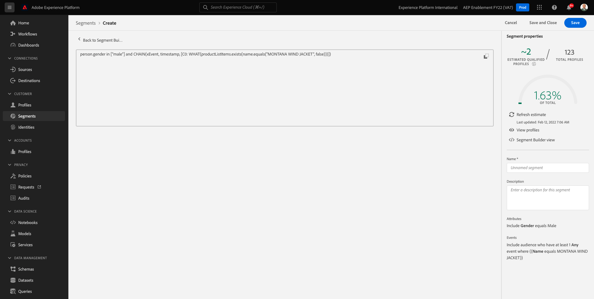

# 3.4 Creare un segmento - Interfaccia utente

In questo esercizio creerai un segmento utilizzando il Generatore di segmenti di Adobe Experience Platform.

## Storia

Vai a [Adobe Experience Platform](https://experience.adobe.com/platform). Dopo aver effettuato l&#39;accesso, si aprirà la homepage di Adobe Experience Platform.


Prima di continuare, devi selezionare un **sandbox**. La sandbox da selezionare è denominata ``--aepSandboxId--``. Per eseguire questa operazione, fai clic sul testo **[!UICONTROL Produzione Prod]** nella linea blu sopra lo schermo. Dopo aver selezionato il [!UICONTROL sandbox], vedrai la modifica dello schermo e ora sei nel tuo dedicato [!UICONTROL sandbox].


Nel menu a sinistra, vai a **Segmenti**. In questa pagina puoi vedere una panoramica di tutti i segmenti esistenti. Fai clic sul pulsante **+ Crea segmento** per iniziare a creare un nuovo segmento.


Una volta entrato nel nuovo generatore di segmenti, noterai immediatamente il **Attributi** l&#39;opzione di menu e **Profilo individuale XDM** riferimento.


Poiché XDM è il linguaggio che attiva l’attività di esperienza, XDM è anche la base per il generatore di segmenti. Tutti i dati acquisiti in Platform devono essere mappati su XDM e, di conseguenza, tutti i dati diventano parte dello stesso modello di dati, indipendentemente da dove provengono. Questo ti offre un grande vantaggio nella creazione di segmenti, poiché da questa interfaccia utente del generatore di segmenti puoi combinare dati di qualsiasi origine nello stesso flusso di lavoro. I segmenti generati nel Generatore di segmenti possono essere inviati a soluzioni come Adobe Target, Adobe Campaign e Adobe Audience Manager per l’attivazione.

Costruiamo un segmento che include tutti **maschio** clienti.

Per arrivare all&#39;attributo di genere, è necessario comprendere e conoscere XDM.

Il genere è un attributo di Persona, che può essere trovato in Attributi. Per arrivarci, inizierai cliccando su **Profilo individuale XDM**. Vedrete questo. Da **Profilo individuale XDM** finestra, seleziona **Persona**.


Vedrete questo. In **Persona**, puoi trovare la **Genere** attributo. Trascina l’attributo Genere nel generatore di segmenti.


Ora puoi scegliere il genere specifico tra le opzioni prepopolate. In questo caso, selezioniamo **Maschio**.


Dopo aver selezionato **Maschio**, puoi ottenere una stima della popolazione del segmento spingendo il **Aggiorna stima** pulsante . Questo è molto utile per un utente aziendale, in modo che possa vedere l’impatto di alcuni attributi sulla dimensione del segmento risultante.


Vedrai quindi una stima come quella seguente:


Successivamente, devi perfezionare un po&#39; il segmento. Devi creare un segmento di tutti i clienti maschili che hanno visualizzato il prodotto **Proteus Fitness Jackshirt (Arancione)**.

Per creare questo segmento, devi aggiungere un evento esperienza. Per trovare tutti gli eventi di esperienza, fai clic sul pulsante **Eventi** nella **Campi** barra dei menu.


Ora, vedrai il livello superiore, **Eventi esperienza XDM** nodo. Fai clic su **ExperienceEvent XDM**.


Vai a **Elementi elenco prodotti**.


Seleziona **Nome** e trascina e rilascia la **Nome** dal menu di sinistra nell’area di lavoro del generatore di segmenti nel **Eventi** sezione .


Vedrai questo:


Il parametro di confronto deve essere **è** e nel campo di immissione immettere **JACKET A VENTO MONTANA**.


Ogni volta che aggiungi un elemento al generatore di segmenti, puoi fare clic sul pulsante **Aggiorna stima** per ottenere una nuova stima della popolazione nel segmento.

Finora, hai utilizzato solo l’interfaccia utente per creare il segmento, ma esiste anche un’opzione di codice per creare un segmento.

Durante la creazione di un segmento, stai in realtà componendo una query PQL (Profile Query Language). Per visualizzare il codice PQL, puoi fare clic sul pulsante **Vista Codice** nell’angolo in alto a destra del generatore di segmenti.



Ora puoi vedere l’istruzione PQL completa:

```sql
person.gender in ["male"] and CHAIN(xEvent, timestamp, [C0: WHAT(productListItems.exists(name.equals("MONTANA WIND JACKET", false)))])
```

Puoi anche visualizzare in anteprima un esempio dei profili cliente che fanno parte di questo segmento, facendo clic su **Visualizza profili**.


Infine, diamo un nome al segmento e salvalo.

Come convenzione di denominazione, utilizza:

- `--demoProfileLdap-- - Male customers with interest in Montana Wind Jacket`


Quindi, fai clic sul pulsante **Salva e chiudi** per salvare il segmento, dopodiché verrai riportato alla pagina di panoramica del segmento.


Ora puoi continuare l’esercizio successivo e creare un segmento tramite l’API.

Passaggio successivo: [3.5 Creare un segmento - API](./ex5.md)

[Torna al modulo 3](./real-time-customer-profile.md)

[Torna a tutti i moduli](../../overview.md)
