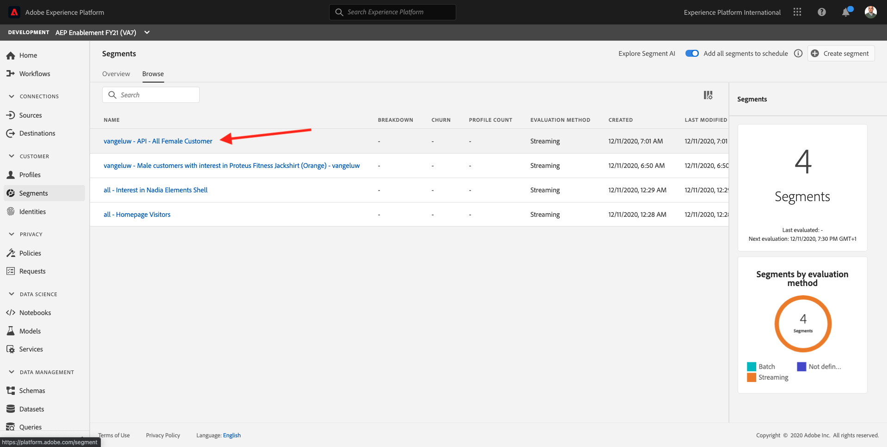

# 3.5 Creare un segmento - API

In questo esercizio, utilizzerai Postman e Adobe I/O per creare un segmento e memorizzare i risultati di tale segmento come un set di dati, utilizzando le API di Adobe Experience Platform.

## Storia

Nel Profilo cliente in tempo reale, tutti i dati del profilo vengono visualizzati insieme ai dati dell’evento e alle appartenenze al segmento esistenti. I dati visualizzati possono provenire da qualsiasi luogo, da applicazioni di Adobe e soluzioni esterne. Questa è la vista più potente in Adobe Experience Platform, il sistema di esperienza di registrazione.

## Esercizio 3.5.1 - Creare un segmento tramite l’API di Platform

Vai su Postman.

Individua la raccolta: **Abilitazione _Adobe Experience Platform**. In questa raccolta verrà visualizzata una cartella **2. Segmentazione**. In questo esercizio utilizzeremo queste richieste.


In seguito, seguiremo tutti i passaggi necessari per creare un segmento tramite l’API. Costruiremo un segmento semplice: &quot;**ldap** - Tutti I Clienti Femminili&quot;.

### Passaggio 1 - Creare una definizione di segmento

Fai clic sulla richiesta denominata **Passaggio 1 - Profilo: Creare Una Definizione Di Segmento**.


Vai al **Corpo** sezione di questa richiesta.


In **Corpo** di questa richiesta vedrai quanto segue:


La lingua utilizzata per questa richiesta è denominata Lingua query profilo oppure **PQL**.

Puoi trovare ulteriori informazioni e documentazione su PQL [qui](https://experienceleague.adobe.com/docs/experience-platform/segmentation/pql/overview.html?lang=en).


Attenzione: aggiorna la variabile **name** nella richiesta che segue sostituendo **ldap** con il tuo **ldap**.

```json
{
    "name" : "ldap - API - All Female Customer",
    "expression" : {"type":"PQL", "format":"pql/json", "value":"{\"nodeType\":\"fnApply\",\"fnName\":\"in\",\"params\":[{\"nodeType\":\"fieldLookup\",\"fieldName\":\"gender\",\"object\":{\"nodeType\":\"fieldLookup\",\"fieldName\":\"person\",\"object\":{\"nodeType\":\"literal\",\"literalType\":\"XDMObject\",\"value\":\"profile\"}}},{\"literalType\":\"List\",\"nodeType\":\"literal\",\"value\":[\"female\"]}]}"},
    "createdBy": "ldap",
    "schema" : { "name" : "_xdm.context.profile"},
    "ttlInDays" : 90
}
```

Dopo aver aggiunto le specifiche **ldap**, il corpo deve essere simile al seguente:

```json
{
    "name" : "vangeluw - API - All Female Customer",
    "expression" : {"type":"PQL", "format":"pql/json", "value":"{\"nodeType\":\"fnApply\",\"fnName\":\"in\",\"params\":[{\"nodeType\":\"fieldLookup\",\"fieldName\":\"gender\",\"object\":{\"nodeType\":\"fieldLookup\",\"fieldName\":\"person\",\"object\":{\"nodeType\":\"literal\",\"literalType\":\"XDMObject\",\"value\":\"profile\"}}},{\"literalType\":\"List\",\"nodeType\":\"literal\",\"value\":[\"female\"]}]}"},
    "createdBy": "vangeluw",
    "schema" : { "name" : "_xdm.context.profile"},
    "ttlInDays" : 90
}
```

È inoltre necessario verificare la **Intestazione** - campi della richiesta. Vai a **Intestazioni**. Vedrai questo:


| Chiave | Valore |
| -------------- | ------------------ |
| x-sandbox-name | `--aepSandboxId--` |

>[!NOTE]
>
>È necessario specificare il nome della sandbox Adobe Experience Platform in uso. Il tuo nome x-sandbox dovrebbe essere `--aepSandboxId--`.

Ora fai clic sul blu **Invia** per creare il segmento e visualizzarne i risultati.


Dopo questo passaggio, puoi visualizzare la definizione del segmento nell’interfaccia utente di Platform. Per controllare, accedi a Adobe Experience Platform e vai a **Segmenti**.



### Passaggio 2 - Creare un processo POST segmento

Nell&#39;esercizio precedente, hai creato un _streaming_ segmento. Un segmento in streaming valuta continuamente le qualifiche in tempo reale. Quello che state facendo qui, è creare un _batch_ segmento. Il segmento batch fornisce un’anteprima dell’aspetto del segmento in termini di qualifiche, ma _questo non significa che il segmento sia stato eseguito_. Attualmente, _nessuno è idoneo per questo segmento_. Per rendere le persone idonee, il segmento batch deve essere eseguito, che è esattamente ciò che faremo qui.

Ora POST un processo di segmento.

Vai su Postman.


Nella tua raccolta Postman, fai clic sulla richiesta denominata **Passaggio 2 - Processo del segmento di POST** per aprirlo.


È inoltre necessario verificare la **Intestazione** - campi della richiesta. Vai a **Intestazioni**. Vedrai questo:


| Chiave | Valore |
| -------------- | ------------------ |
| x-sandbox-name | `--aepSandboxId--` |

>[!NOTE]
>
>È necessario specificare il nome della sandbox Adobe Experience Platform in uso. Il tuo nome x-sandbox dovrebbe essere `--aepSandboxId--`.

Clicca sul blu **Invia** pulsante .

Dovresti vedere un risultato simile:


Il processo del segmento è ora in esecuzione e l’operazione potrebbe richiedere del tempo. Nel passaggio 3, potrai controllare lo stato di questo processo.


### Passaggio 3 - GET dello stato del processo del segmento

Vai su Postman.


Nella tua raccolta Postman, fai clic sulla richiesta denominata **Passaggio 3 - GET dello stato del processo del segmento**.


È inoltre necessario verificare la **Intestazione** - campi della richiesta. Vai a **Intestazioni**. Vedrai questo:


| Chiave | Valore |
| -------------- | ------------------ |
| x-sandbox-name | `--aepSandboxId--` |

>[!NOTE]
>
>È necessario specificare il nome della sandbox Adobe Experience Platform in uso. Il tuo nome x-sandbox dovrebbe essere `--aepSandboxId--`.

Clicca sul blu **Invia** pulsante .

Dovresti vedere un risultato simile:


In questo esempio, la **status** del processo è impostato su **IN CODA**.

Ripeti questa richiesta facendo clic su blu **Invia** ogni due minuti fino al **status** è impostato su **COMPLETATO**.


Una volta che lo stato è **COMPLETATO**, il processo del segmento è stato eseguito e i clienti si stanno qualificando per il segmento.

Congratulazioni, hai completato con successo l’esercizio Segmentazione. Vediamo ora come può essere attivato il Profilo cliente in tempo reale nell’intera azienda.

Passaggio successivo: [3.6 Vedi Profilo cliente in tempo reale in azione nel Call Center](./ex6.md)

[Torna al modulo 3](./real-time-customer-profile.md)

[Torna a tutti i moduli](../../overview.md)
