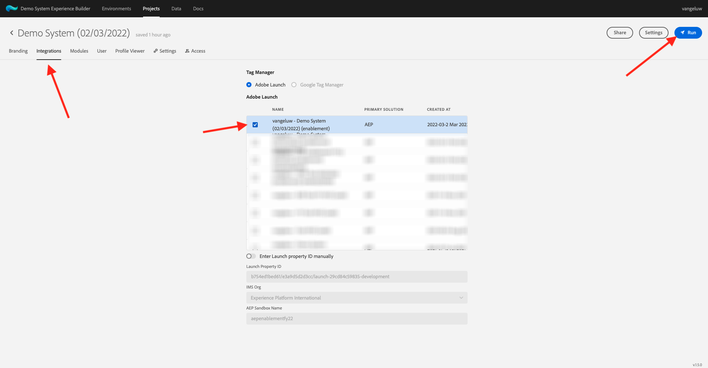
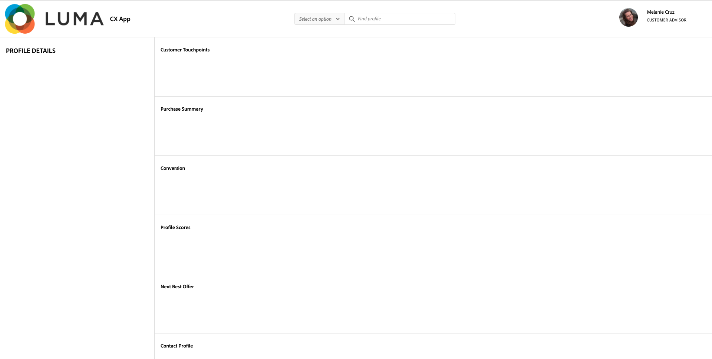

# 3.6 Vedi il tuo Profilo del cliente in tempo reale in azione nel Call Center

In questo esercizio, l&#39;obiettivo è quello di farti attraversare il percorso del cliente e agire come un vero cliente.

Su questo sito web, abbiamo implementato Adobe Experience Platform. Ogni azione è considerata un evento di esperienza e viene inviata a Adobe Experience Platform in tempo reale, idratando il Profilo del cliente in tempo reale.

In un esercizio precedente, hai iniziato come cliente anonimo che stava navigando sul sito, e dopo un paio di passaggi, sei diventato un cliente noto.

Quando lo stesso cliente recupera il proprio telefono e chiama il tuo call center, è fondamentale che le informazioni provenienti da altri canali siano immediatamente disponibili, in modo che l&#39;esperienza del call center possa essere rilevante e personalizzata.

## 3.6.1 Utilizzare l&#39;app CX

Come parte del nostro Demo System, abbiamo creato un modello di app CX che può essere utilizzato per simulare un ambiente call center. Segui questi passaggi per creare un progetto CX App.

Vai a [https://builder.adobedemo.com/projects](https://builder.adobedemo.com/projects). Fai clic su **Nuovo progetto**.

Verrà quindi visualizzato il progetto dell&#39;app CX. Fai clic sul progetto per aprirlo.

Nel progetto dell&#39;app CX, vai a **Integrazioni**. Seleziona la proprietà Raccolta dati di Adobe Experience Platform creata nel modulo 0. È necessario selezionare la proprietà che ha **(abilitazione)** a nome. Quindi, fai clic su **Esegui**.

Vedrete questo.

Nel pannello Visualizzatore profilo sono disponibili le seguenti combinazioni di ID e namespace:

| Identità | Namespace |
|:-------------:| :---------------:|
| Experience Cloud ID (ECID) | 12507560687324495704459439363261812234 |
| ID e-mail | woutervangeluwe+06022022-01@gmail.com |
| ID numero cellulare | +32473622044+06022022-01 |

Quando il cliente chiama il tuo call center, il numero di telefono può essere utilizzato per identificare il cliente. In questo esercizio, utilizzerai il numero di telefono per recuperare il profilo del cliente nell&#39;app CX.

Seleziona **Numero di telefono** nel menu a discesa e immetti il numero di telefono utilizzato sul sito web. Hit **Invio**.

Verranno visualizzate le informazioni idealmente visualizzate nel Call Center, in modo che i dipendenti del Call Center dispongano immediatamente di tutte le informazioni pertinenti disponibili quando parlano con un cliente.

Passaggio successivo: [Riepilogo e vantaggi](./summary.md)

[Torna al modulo 3](./real-time-customer-profile.md)

[Torna a tutti i moduli](../../overview.md)
