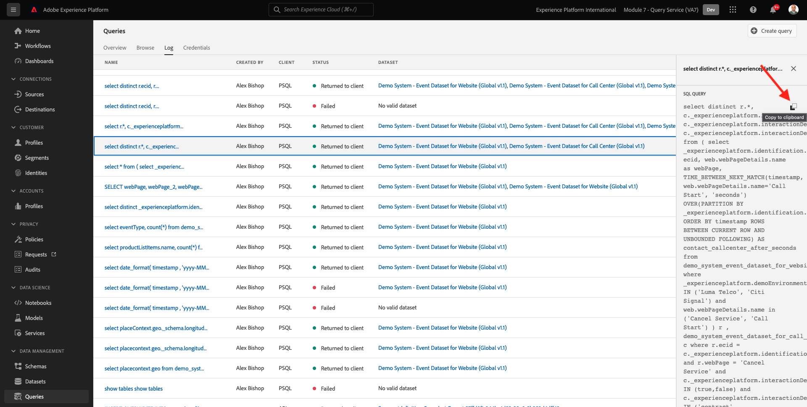

# 4.1 Guida introduttiva

## 4.1.1 Acquisire familiarità con l&#39;interfaccia utente di Adobe Experience Platform

Vai a [Adobe Experience Platform](https://experience.adobe.com/platform). Dopo aver effettuato l&#39;accesso, si aprirà la homepage di Adobe Experience Platform.

Prima di continuare, devi selezionare un **sandbox**. La sandbox da selezionare è denominata ``--module7sandbox--``. Per eseguire questa operazione, fai clic sul testo **[!UICONTROL Produzione Prod]** nella linea blu sopra lo schermo. Dopo aver selezionato il [!UICONTROL sandbox], vedrai la modifica dello schermo e ora sei nel tuo dedicato [!UICONTROL sandbox].

## 4.1.2 Esplorare i dati sulla piattaforma

Portare dati da diversi canali è un compito difficile per qualsiasi marchio. E in questo esercizio, i clienti Citi Signal sono coinvolti con Citi Signal sul suo sito web, sulla sua app mobile, i dati di acquisto sono raccolti dal sistema Punti di Vendita di Citi Signal, e hanno i dati CRM e Fedeltà. Citi Signal utilizza Adobe Analytics e Adobe Launch per acquisire dati dal sito web, dall’app mobile e dal sistema POS, pertanto questi dati stanno già scorrendo in Adobe Experience Platform. Cominciamo con l&#39;esplorazione di tutti i dati per Citi Signal già esistenti in Adobe Experience Platform.

Nel menu a sinistra, vai a **Set di dati**.

Citi Signal sta eseguendo lo streaming dei dati in Adobe Experience Platform ed è disponibile nella `Demo System - Event Dataset for Website (Global v1.1)` set di dati. Cerca `Demo System - Event Dataset for Website`.

I dati di interazione del Callcenter di Citi Signal vengono catturati nella `Demo System - Event Dataset for Call Center (Global v1.1)` set di dati. Cerca `Demo System - Event Dataset for Call Center` dati nella casella di ricerca. Fai clic sul nome del set di dati per aprirlo.

Dopo aver fatto clic sul set di dati, otterrai una panoramica dell’attività del set di dati, ad esempio i batch acquisiti e non riusciti.

Fai clic su **Anteprima set di dati** per visualizzare un esempio dei dati memorizzati in `Demo System - Event Dataset for Call Center (Global v1.1)` set di dati. Il pannello a sinistra mostra la struttura dello schema per questo set di dati.

Fai clic sul pulsante **Chiudi** per chiudere il pulsante **Anteprima set di dati** finestra.

## 4.1.3 Introduzione al servizio query

È possibile accedere a Adobe Experience Platform Query Service facendo clic su **Query** nel menu a sinistra.

Per **Registro** viene visualizzata la pagina Elenco query, che fornisce un elenco di tutte le query eseguite in questa organizzazione, con le ultime in alto.

Fai clic su una query SQL dall’elenco e osserva i dettagli forniti nella barra a destra.

È possibile scorrere la finestra per visualizzare l&#39;intera query oppure fare clic sull&#39;icona evidenziata di seguito per copiare l&#39;intera query sul blocco note. Al momento non è necessario copiare la query.

Non è possibile visualizzare solo le query eseguite, questa interfaccia utente consente di creare nuovi set di dati dalle query. Questi set di dati possono essere collegati al Profilo cliente in tempo reale di Adobe Experience Platform o possono essere utilizzati come input per Adobe Experience Platform Data Science Workspace.

## 4.1.4 Connettere il client PSQL al servizio query

Query Service supporta i client con un driver per PostgreSQL. In questo utilizzeremo PSQL, un&#39;interfaccia a riga di comando, e Power BI o Tableau. Connettiamoci a PSQL.

Fai clic su **Credenziali**.

Verrà visualizzata la schermata sottostante. La schermata Configurazione fornisce le informazioni e le credenziali del server per l’autenticazione al servizio query. Per il momento, ci concentreremo sul lato destro dello schermo che contiene un comando di connessione per PSQL. Fai clic sul pulsante Copia per copiare il comando negli Appunti.

Per Windows: Aprire la riga di comando premendo il tasto Windows e digitando cmd, quindi facendo clic sul risultato del prompt dei comandi.

Per macOS: Apri Terminal.app tramite la ricerca Spotlight:

Incolla il comando di connessione copiato dall’interfaccia utente del servizio query e premi Invio nella finestra del prompt dei comandi:

Windows:

MacOS:

È ora disponibile una connessione a Query Service tramite PSQL.

Negli esercizi successivi, ci sarà una certa interazione con questa finestra. Lo considereremo come il tuo **Interfaccia della riga di comando PSQL**.

Ora puoi iniziare a inviare le query.

Passaggio successivo: [4.2 Utilizzo del servizio Query](./ex2.md)

[Torna al modulo 4](./query-service.md)

[Torna a tutti i moduli](../../overview.md)
