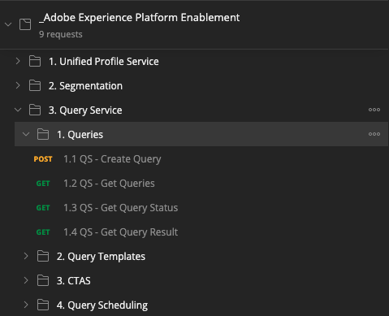

# API del servizio query 4.7

## Oggetto

- Utilizza l’API del servizio query per gestire i modelli di query e le pianificazioni delle query

## Contesto

In questo esercizio eseguirai chiamate API per gestire modelli di query e pianificazioni di query utilizzando una raccolta Postman. Definirai modelli di query, eseguirai query regolari e query CTAS. A **CTAS** query (crea tabella come query di selezione) memorizza il relativo set di risultati in un set di dati esplicito. Mentre le query regolari vengono memorizzate in un set di dati implicito (o generato dal sistema), generalmente esportato in formato file parquet.

## Documentazione

- [Guida al servizio query di Adobe Experience Platform](https://experienceleague.adobe.com/docs/experience-platform/query/api/getting-started.html)
- [API del servizio query](https://www.adobe.io/apis/experienceplatform/home/api-reference.html#!acpdr/swagger-specs/qs-api.yaml)

## API del servizio query 4.7.1

L’API del servizio query consente di gestire le query non interattive rispetto al data-lake di Adobe Experience Platform.

Non interattivo significa che una richiesta di esecuzione di una query non darà luogo a una risposta immediata. La query verrà elaborata e il relativo set di risultati verrà memorizzato in un tag implicito o esplicito (CTAS: crea una tabella come set di dati).

## 4.7.2 Query di esempio

Come query di esempio, utilizzerai la prima query elencata in [4.3 - Query, query, query e analisi di abbandono](./ex3.md):

Quante visualizzazioni di prodotto abbiamo quotidianamente?

**SQL**

```sql
select date_format( timestamp , 'yyyy-MM-dd') AS Day,
       count(*) AS productViews
from   demo_system_event_dataset_for_website_global_v1_1
where  --aepTenantId--.demoEnvironment.brandName IN ('Luma Telco', 'Citi Signal')
and eventType = 'commerce.productViews'
group by Day
limit 10;
```

## 4.7.3 Query

Apri Postman sul computer. Come parte del modulo 3, hai creato un ambiente Postman e importato una raccolta Postman. Segui le istruzioni in [Esercizio 3.3.3](./../module3/ex3.md) nel caso in cui non l&#39;abbia ancora fatto.

Come parte della raccolta Postman che hai importato, vedrai una cartella **3. Servizio query**. Se non trovi questa cartella, scarica di nuovo il [Raccolta Postman](../../assets/postman/postman_profile.zip) e reimporta la raccolta in Postman come indicato in [Esercizio 3.3.3](./../module3/ex3.md).



>[!NOTE]
>
>Al momento, solo la cartella **1. Query** contiene richieste. Altre richieste verranno aggiunte in una fase del livello.

Apri la cartella e scopri come eseguire, monitorare e scaricare le chiamate API del servizio query.

Una chiamata POST a [/query/query] con il seguente payload verrà attivata l’esecuzione della query;

### 4.7.3.1 Crea query

Fai clic sulla richiesta denominata **1.1 QS - Crea query** e vai a **Intestazioni**. Vedrai questo:


Concentriamoci su questo campo di intestazione:

| Chiave | Valore |
| ----------- | ----------- |
| x-sandbox-name | `--module7sandbox--` |

>[!NOTE]
>
>È necessario specificare il nome della sandbox Adobe Experience Platform in uso. Campo intestazione **x-sandbox-name** devono `--module7sandbox--`.

Vai al **Corpo** sezione di questa richiesta. In **Corpo** di questa richiesta vedrai quanto segue:


```sql
{
    "name" : "ldap - QS API demo - Citi Signal - Product Views Per Day",
	"description": "ldap - QS API demo - Citi Signal - Product Views Per Day",
	"dbName": "module7:all",
	"sql": "select date_format( timestamp , 'yyyy-MM-dd') AS Day, count(*) AS productViews from demo_system_event_dataset_for_website_global_v1_1 where _experienceplatform.demoEnvironment.brandName IN ('Luma Telco', 'Citi Signal') and eventType = 'commerce.productViews' group by Day limit 10"
}
```

Attenzione: aggiorna la variabile **name** nella richiesta che segue sostituendo **ldap** con il tuo **ldap**.

Dopo aver aggiunto le specifiche **ldap**, il corpo deve essere simile al seguente:

```json
{
    "name" : "vangeluw - QS API demo - Citi Signal - Product Views Per Day",
	"description": "vangeluw - QS API demo - Citi Signal - Product Views Per Day",
	"dbName": "module7:all",
	"sql": "select date_format( timestamp , 'yyyy-MM-dd') AS Day, count(*) AS productViews from demo_system_event_dataset_for_website_global_v1_1 where _experienceplatform.demoEnvironment.brandName IN ('Luma Telco', 'Citi Signal') and eventType = 'commerce.productViews' group by Day limit 10"
}
```

>[!NOTE]
>
>La chiave **dbName** nel corpo JSON riportato sopra si riferisce alla sandbox utilizzata nella tua istanza Adobe Experience Platform. Se utilizzate la sandbox di PROD, il valore dbName deve essere **prod:all**, se utilizzi un altro sandbox come ad esempio **modulo7**, dbName deve essere uguale a **modulo7:all**.

Quindi, fai clic su blu **Invia** per creare il segmento e visualizzarne i risultati.


In caso di esito positivo, la richiesta di POST restituirà la seguente risposta:

```json
{
    "isInsertInto": false,
    "request": {
        "dbName": "module7:all",
        "sql": "select date_format( timestamp , 'yyyy-MM-dd') AS Day, count(*) AS productViews from demo_system_event_dataset_for_website_global_v1_1 where _experienceplatform.demoEnvironment.brandName IN ('Luma Telco', 'Citi Signal') and eventType = 'commerce.productViews' group by Day limit 10",
        "name": "vangeluw - QS API demo - Citi Signal - Product Views Per Day",
        "description": "vangeluw - QS API demo - Citi Signal - Product Views Per Day"
    },
    "clientId": "5a143b5ae4aa4631a1f3b09cd051333f",
    "state": "SUBMITTED",
    "rowCount": 0,
    "errors": [],
    "isCTAS": false,
    "version": 1,
    "id": "8f0d7f25-f7aa-493b-9792-290f884a7e5b",
    "elapsedTime": 0,
    "updated": "2021-01-20T13:23:13.951Z",
    "client": "API",
    "userId": "A3392DB95FFF08EE0A495E87@techacct.adobe.com",
    "created": "2021-01-20T13:23:13.951Z",
    "_links": {
        "self": {
            "href": "https://platform-va7.adobe.io/data/foundation/query/queries/8f0d7f25-f7aa-493b-9792-290f884a7e5b",
            "method": "GET"
        },
        "soft_delete": {
            "href": "https://platform-va7.adobe.io/data/foundation/query/queries/8f0d7f25-f7aa-493b-9792-290f884a7e5b",
            "method": "PATCH",
            "body": "{ \"op\": \"soft_delete\"}"
        },
        "cancel": {
            "href": "https://platform-va7.adobe.io/data/foundation/query/queries/8f0d7f25-f7aa-493b-9792-290f884a7e5b",
            "method": "PATCH",
            "body": "{ \"op\": \"cancel\"}"
        }
    }
}
```

La corrente **stato** della query **INVIATO**, una volta eseguito il relativo stato diventerà **SUCCESSO**.

Puoi anche cercare le query inviate tramite l’interfaccia utente di Adobe Experience Platform, apri [Adobe Experience Platform](https://experience.adobe.com/#/@experienceplatform/platform/home), passa a **Query**, a **Registro** e seleziona la query:


### 4.7.3.2 Ottieni query

Fai clic sulla richiesta denominata **1.2 QS - Ottieni query** e vai a **Intestazioni**. Vedrai questo:


Concentriamoci su questo campo di intestazione:

| Chiave | Valore |
| ----------- | ----------- |
| x-sandbox-name | `--module7sandbox--` |

>[!NOTE]
>
>È necessario specificare il nome della sandbox Adobe Experience Platform in uso. Campo intestazione **x-sandbox-name** devono `--module7sandbox--`.

Vai a **Parametri**. Vedrai questo:


La **ordine** consente di specificare un ordinamento basato su **creato** proprietà. Osserva che **&#39;-&#39;** effettua l’accesso davanti a creato, il che significa che l’ordine in cui viene restituito l’elenco di query utilizzerà la data creata in **decrescente** ordine. La query deve essere in cima all&#39;elenco.

Quindi, fai clic su blu **Invia** per creare il segmento e visualizzarne i risultati.


In caso di esito positivo, la richiesta restituirà una risposta simile a quella riportata di seguito. La **stato** della risposta **INVIATO**, **IN_PROGRESS** o **SUCCESSO**. Potrebbero essere necessari alcuni minuti prima che la query abbia un **SUCCESSO** stato. Puoi ripetere l’invio di questa richiesta diverse volte, fino a quando non visualizzi la **SUCCESSO** stato.

```json
{
    "queries": [
        {
            "isInsertInto": false,
            "request": {
                "dbName": "module7:all",
                "sql": "select date_format( timestamp , 'yyyy-MM-dd') AS Day, count(*) AS productViews from demo_system_event_dataset_for_website_global_v1_1 where _experienceplatform.demoEnvironment.brandName IN ('Luma Telco', 'Citi Signal') and eventType = 'commerce.productViews' group by Day limit 10",
                "name": "vangeluw - QS API demo - Citi Signal - Product Views Per Day",
                "description": "vangeluw - QS API demo - Citi Signal - Product Views Per Day"
            },
            "clientId": "5a143b5ae4aa4631a1f3b09cd051333f",
            "state": "SUCCESS",
            "rowCount": 1,
            "errors": [],
            "isCTAS": false,
            "version": 1,
            "id": "8f0d7f25-f7aa-493b-9792-290f884a7e5b",
            "elapsedTime": 217481,
            "updated": "2021-01-20T13:26:51.432Z",
            "client": "API",
            "userId": "A3392DB95FFF08EE0A495E87@techacct.adobe.com",
            "created": "2021-01-20T13:23:13.951Z",
            "_links": {
                "self": {
                    "href": "https://platform-va7.adobe.io/data/foundation/query/queries/8f0d7f25-f7aa-493b-9792-290f884a7e5b",
                    "method": "GET"
                },
                "soft_delete": {
                    "href": "https://platform-va7.adobe.io/data/foundation/query/queries/8f0d7f25-f7aa-493b-9792-290f884a7e5b",
                    "method": "PATCH",
                    "body": "{ \"op\": \"soft_delete\"}"
                },
                "referenced_datasets": [
                    {
                        "id": "60080ace62c49a19490c5870",
                        "href": "https://platform-va7.adobe.io/data/foundation/catalog/dataSets/60080ace62c49a19490c5870"
                    }
                ]
            }
        }
     ]
    },
    "version": 1
}
```

Quando lo stato è **SUCCESSO**, continua con la richiesta successiva.

### 4.7.3.3 Ottieni lo stato della query

Fai clic sulla richiesta denominata **1.3 QS - Ottieni stato query** e vai a **Intestazioni**. Vedrai questo:


Concentriamoci su questo campo di intestazione:

| Chiave | Valore |
| ----------- | ----------- |
| x-sandbox-name | `--module7sandbox--` |

>[!NOTE]
>
>È necessario specificare il nome della sandbox Adobe Experience Platform in uso. Campo intestazione **x-sandbox-name** devono `--module7sandbox--`.

Quindi, fai clic su blu **Invia** per creare il segmento e visualizzarne i risultati.


In caso di esito positivo, la richiesta restituirà una risposta simile a quella riportata di seguito.

```json
{
    "isInsertInto": false,
    "request": {
        "dbName": "module7:all",
        "sql": "select date_format( timestamp , 'yyyy-MM-dd') AS Day, count(*) AS productViews from demo_system_event_dataset_for_website_global_v1_1 where _experienceplatform.demoEnvironment.brandName IN ('Luma Telco', 'Citi Signal') and eventType = 'commerce.productViews' group by Day limit 10",
        "name": "vangeluw - QS API demo - Citi Signal - Product Views Per Day",
        "description": "vangeluw - QS API demo - Citi Signal - Product Views Per Day"
    },
    "clientId": "5a143b5ae4aa4631a1f3b09cd051333f",
    "state": "SUCCESS",
    "rowCount": 1,
    "errors": [],
    "isCTAS": false,
    "version": 1,
    "id": "8f0d7f25-f7aa-493b-9792-290f884a7e5b",
    "elapsedTime": 217481,
    "updated": "2021-01-20T13:26:51.432Z",
    "client": "API",
    "userId": "A3392DB95FFF08EE0A495E87@techacct.adobe.com",
    "created": "2021-01-20T13:23:13.951Z",
    "_links": {
        "self": {
            "href": "https://platform-va7.adobe.io/data/foundation/query/queries/8f0d7f25-f7aa-493b-9792-290f884a7e5b",
            "method": "GET"
        },
        "soft_delete": {
            "href": "https://platform-va7.adobe.io/data/foundation/query/queries/8f0d7f25-f7aa-493b-9792-290f884a7e5b",
            "method": "PATCH",
            "body": "{ \"op\": \"soft_delete\"}"
        },
        "referenced_datasets": [
            {
                "id": "60080ace62c49a19490c5870",
                "href": "https://platform-va7.adobe.io/data/foundation/catalog/dataSets/60080ace62c49a19490c5870"
            }
        ]
    }
}
```

Quando una query raggiunge lo stato di **SUCCESSO**, la risposta indica anche il numero di righe recuperate dalla query tramite il **rowCount** proprietà. Nel nostro esempio, 10 righe vengono restituite dalla query. Vediamo nella sezione successiva come recuperare le 10 righe.

### 4.7.3.4 Risultato della query di recupero

La **SUCCESSO** la risposta di cui sopra include **referenced_datasets** , che fa riferimento al set di dati implicito che memorizza il risultato della query. Per accedere al risultato, utilizziamo la **href** o **id** proprietà.

Fai clic sulla richiesta denominata **1.4 QS - Ottieni risultato query** e vai a **Intestazioni**. Vedrai questo:


Concentriamoci su questo campo di intestazione:

| Chiave | Valore |
| ----------- | ----------- |
| x-sandbox-name | `--module7sandbox--` |

>[!NOTE]
>
>È necessario specificare il nome della sandbox Adobe Experience Platform in uso. Campo intestazione **x-sandbox-name** devono `--module7sandbox--`.

Quindi, fai clic su blu **Invia** per creare il segmento e visualizzarne i risultati.


La risposta di questa richiesta punta ai file di set di dati:

```json
{
    "60080ace62c49a19490c5870": {
        "name": "Demo System - Event Dataset for Website (Global v1.1)",
        "description": "Demo System - Event Dataset for Website (Global v1.1)",
        "enableErrorDiagnostics": false,
        "tags": {
            "adobe/siphon/partition/definition": [
                "day(timestamp, _ACP_DATE)",
                "identity(_ACP_BATCHID)"
            ],
            "aep/siphon/partitions": [
                "_ACP_DATE",
                "_ACP_BATCHID"
            ],
            "acp_granular_plugin_validation_flags": [
                "identity:enabled",
                "profile:enabled"
            ],
            "adobe/siphon/buffered-promotion-recency": [
                "live"
            ],
            "adobe/siphon/use-buffered-promotion": [
                "true"
            ],
            "adobe/pqs/table": [
                "demo_system_event_dataset_for_website_global_v1_1"
            ],
            "aep/siphon/expire-snapshot-timestamp": [
                "1611141272703"
            ],
            "acp_granular_validation_flags": [
                "requiredFieldCheck:enabled"
            ],
            "acp_validationContext": [
                "enabled"
            ],
            "adobe/siphon/table/format": [
                "iceberg"
            ],
            "unifiedProfile": [
                "enabled:true",
                "enabledAt:2021-01-20 10:49:51"
            ],
            "unifiedIdentity": [
                "enabled:true"
            ]
        },
        "namespace": "ACP",
        "state": "DRAFT",
        "imsOrg": "907075E95BF479EC0A495C73@AdobeOrg",
        "sandboxId": "62cd9f38-8529-4b05-8d9f-388529db0540",
        "lastBatchId": "01EWFQZ15XRNNB1FPKPW5ETRVP",
        "lastBatchStatus": "success",
        "lastSuccessfulBatch": "01EWFQZ15XRNNB1FPKPW5ETRVP",
        "version": "1.0.6",
        "created": 1611139790698,
        "updated": 1611149266031,
        "createdClient": "750e24ee855b4ac18ccc4f4817f96ee1",
        "createdUser": "3A260B485E909A170A495E76@techacct.adobe.com",
        "updatedUser": "acp_foundation_dataTracker@AdobeID",
        "viewId": "60080ace62c49a19490c5871",
        "fileDescription": {
            "persisted": true,
            "containerFormat": "parquet",
            "format": "parquet"
        },
        "files": "@/dataSets/60080ace62c49a19490c5870/views/60080ace62c49a19490c5871/files",
        "schemaMetadata": {
            "delta": [],
            "gdpr": []
        },
        "schemaRef": {
            "id": "https://ns.adobe.com/experienceplatform/schemas/d9b88a044ad96154637965a97ed63c7b20bdf2ab3b4f642e",
            "contentType": "application/vnd.adobe.xed-full+json;version=1"
        }
    }
}
```

>[!NOTE]
>
>Presto verranno aggiunti altri esercizi per aiutarti a interagire con l’API del servizio query.

Passaggio successivo: [Riepilogo e vantaggi](./summary.md)

[Torna al modulo 4](./query-service.md)

[Torna a tutti i moduli](../../overview.md)
