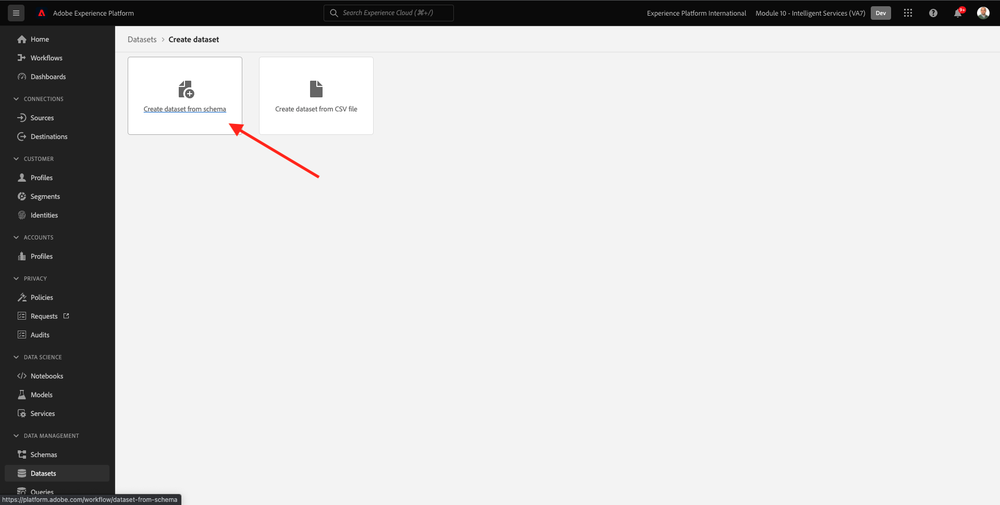

# 5.1 Customer AI - Preparazione dei dati (acquisizione)

Affinché i servizi intelligenti possano scoprire informazioni dai dati degli eventi di marketing, i dati devono essere arricchiti e mantenuti in una struttura standard in modo semantico. Per ottenere questo risultato, Intelligent Services sfrutta gli schemi Experience Data Model (XDM) di Adobe.
In particolare, tutti i set di dati utilizzati in Intelligent Services devono essere conformi alla **Evento esperienza consumatore** Schema XDM.

## 5.1.1 Creare uno schema

In questo esercizio, creerai uno schema che contiene **Mixin evento esperienza consumatore**, richiesto dalla **Customer AI** Servizio intelligente

Accedi a Adobe Experience Platform andando a questo URL: [https://experience.adobe.com/platform](https://experience.adobe.com/platform).

Dopo aver effettuato l&#39;accesso, si aprirà la homepage di Adobe Experience Platform.

Prima di continuare, devi selezionare un **sandbox**. La sandbox da selezionare è denominata ``--module10sandbox--``. Per eseguire questa operazione, fai clic sul testo **[!UICONTROL Produzione Prod]** nella linea blu sopra lo schermo. Dopo aver selezionato la sandbox appropriata, visualizzerai la modifica dello schermo e ora ti trovi nella sandbox dedicata.

Dal menu a sinistra, fai clic su **Schemi** e vai a **Sfoglia**. Fai clic su **Crea schema**.

Nella finestra a comparsa, seleziona **ExperienceEvent XDM**.

Vedrete questo.

Cerca e seleziona quanto segue **Mixins** per aggiungere a questo schema:

- Evento esperienza consumatore

   

- Dettagli ID utente finale

   

Fai clic su **Aggiungi gruppi di campi**.

Vedrete questo. Selezionare il mixin **Dettagli ID utente finale**.

Passa al campo . **endUserIDs._experience.emailid.id**.

Nel menu a destra del campo **endUserIDs._experience.emailid.id**, scorri verso il basso e seleziona la casella di controllo **Identità**, seleziona la casella di controllo **Identità principale** e seleziona la **Spazio dei nomi identità** di **E-mail**.

Passa al campo . **endUserIDs._experience.mcid.id**. Seleziona la casella di controllo per **Identità** e seleziona la **Spazio dei nomi identità** di **ECID**. Fai clic su **Applica**.

Assegna un nome allo schema.

Come nome del nostro schema, utilizzerai questo:

- `--demoProfileLdap-- - Demo System - Customer Experience Event`

Ad esempio, per ldap **vangeluw**, deve essere il nome dello schema:

- **vangeluw - Demo System - Customer Experience Event**

Dovrebbe darvi qualcosa del genere. Fai clic sul pulsante **+ Aggiungi** pulsante per aggiungere nuovo **Mixins**.

Seleziona il nome dello schema. A questo punto, abilita lo schema per **Profilo**, facendo clic sul pulsante **Profilo** alternare.

Vedrete questo. Fai clic su **Abilita**.

Dovrebbe avere questo ora. Fai clic su **Salva** per salvare lo schema.

## 5.1.2 Creare un set di dati

Dal menu a sinistra, fai clic su **Set di dati** e vai a **Sfoglia**. Fai clic su **Creare un set di dati**.

Fai clic su **Creare un set di dati dallo schema**.

Nella schermata successiva, seleziona il set di dati creato nell’esercizio precedente, denominato **[!UICONTROL ldap - Demo System - Evento esperienza cliente]**. Fai clic su **Avanti**.

Come nome per il set di dati, utilizza `--demoProfileLdap-- - Demo System - Customer Experience Event Dataset`. Fai clic su **Fine**.

Il set di dati viene ora creato. Abilita la **Profilo** alternare.

Fai clic su **Abilita**.

Ora dovresti avere questo:

Ora puoi iniziare a acquisire i dati dell’evento esperienza del consumatore e a utilizzare il servizio Customer AI.

## 5.1.3 Scaricare i dati del test di Experience Event

Una volta che **Schema** e **Set di dati** Sono configurati, ora sei pronto per acquisire i dati di Experience Event. Poiché Customer AI richiede dati attraverso **almeno 2 quarti**, dovrai inserire dati preparati esternamente.

I dati preparati per gli eventi di esperienza devono essere conformi ai requisiti e allo schema del [Mixin XDM evento esperienza consumatore](https://github.com/adobe/xdm/blob/797cf4930d5a80799a095256302675b1362c9a15/docs/reference/context/experienceevent-consumer.schema.md).

Scarica il file contenente i dati di esempio da questa posizione: [https://dashboard.adobedemo.com/data](https://dashboard.adobedemo.com/data). Fai clic sul pulsante **Scarica** pulsante .

Ora hai scaricato un file denominato **retail-v1-dec2020-xl.json.zip**. Posizionare il file sul desktop del computer e decomprimerlo, dopodiché verrà visualizzato un file denominato **retail-v1.json**. Avrai bisogno di questo file nel prossimo esercizio.

## 5.1.4 Dati del test dell’esperienza di acquisizione

In Adobe Experience Platform, vai a **Set di dati** e apri il set di dati, denominato **[!UICONTROL ldap - Sistema di demo - Dataset dell’evento di esperienza del cliente]**.

Nel set di dati, fai clic su **Scegliere i file** per aggiungere dati.

Nella finestra a comparsa, seleziona il file **retail-v1.json** e fai clic su **Apri**.

Verranno quindi visualizzati i dati importati e verrà creato un nuovo batch nel **Caricamento** stato. Non allontanarti da questa pagina fino a quando il file non viene caricato.

Una volta caricato il file, lo stato del batch cambia da **Caricamento** a **Elaborazione**.

L’assimilazione ed elaborazione dei dati potrebbe richiedere 10-20 minuti.

Una volta completata l’acquisizione dei dati, lo stato del batch cambia in **Completato**.

Passaggio successivo: [5.2 Customer AI - Creare una nuova istanza (Configura)](./ex2.md)

[Torna al modulo 5](./intelligent-services.md)

[Torna a tutti i moduli](./../../overview.md)
