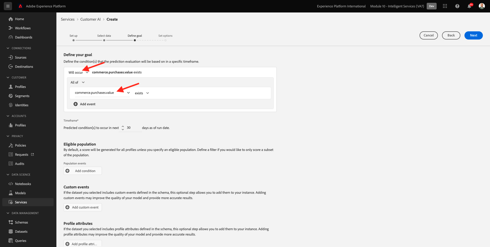

# 5.2 Customer AI - Creare una nuova istanza (Configura)

Customer AI funziona analizzando i dati esistenti dell’evento esperienza del consumatore per prevedere i punteggi di propensione di abbandono o conversione. La creazione di una nuova istanza di Customer AI consente agli addetti al marketing di definire obiettivi e misure.

## 5.2.1 Configurare una nuova istanza di Customer AI

In Adobe Experience Platform, fai clic su **Servizi** nel menu a sinistra. La **Servizi** viene visualizzato il browser e visualizza tutti i servizi disponibili a tua disposizione. Nella scheda di Customer AI, fai clic su **Apri**.

Fai clic su **Crea istanza**.

Vedrete questo.

Immetti i dettagli richiesti per l’istanza Customer AI:

- Nome: use `--demoProfileLdap-- Product Purchase Propensity`
- Descrizione: utilizzare: **Prevedere la probabilità che i clienti acquistino un prodotto**
- Tipo di tendenza: select **Conversione**

Fai clic su **Avanti**.

Vedrete questo. Seleziona il set di dati creato nell’esercizio precedente, denominato `--demoProfileLdap - Demo System - Customer Experience Event Dataset`. Fai clic su **Avanti**.

Seleziona **Si verificherà** e definire il campo **commerce.purchased.value** come variabile target.

Fai clic su **Avanti**.

Imposta la pianificazione da eseguire **Settimanale** e impostare l&#39;ora il più vicino possibile all&#39;ora corrente. Assicurati che l&#39;interruttore **Abilitare i punteggi per profilo** è abilitato.

Fai clic su **Fine**.

Vedrete questa finestra a comparsa. Fai clic su **OK**.

Dopo aver configurato l’istanza, puoi visualizzarla nell’elenco delle istanze di Customer AI e visualizzare in anteprima il riepilogo dei dettagli di configurazione ed esecuzione facendo clic sulla riga dell’istanza di Customer AI. Il pannello di riepilogo visualizza anche i dettagli dell’errore in caso di errori riscontrati.

>[!NOTE]
>
>Puoi modificare qualsiasi definizione o attributo purché lo stato dell’istanza di Customer AI sia **In attesa di formazione** o **Errore**

Passaggio successivo: [5.3 Customer AI - Dashboard di valutazione e segmentazione (Predict &amp; Take Action)](./ex3.md)

[Torna al modulo 5](./intelligent-services.md)

[Torna a tutti i moduli](./../../overview.md)
