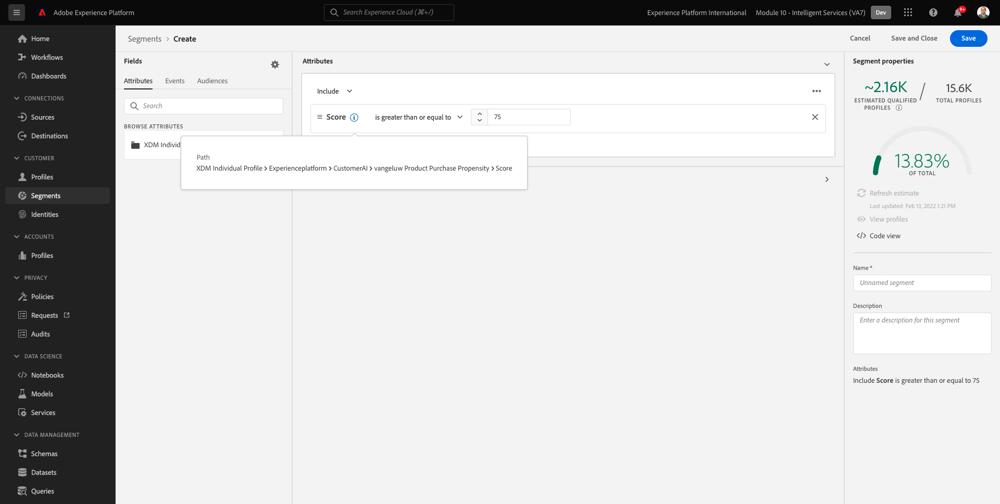

# 5.3 Customer AI - Dashboard di valutazione e segmentazione (Predict &amp; Take Action)

Una volta completata l’esecuzione di un modello, l’istanza di Customer AI ti consente di visualizzare il punteggio di propensione valutato per prevedere un cliente che effettua un acquisto nei successivi 30 giorni.

>[!NOTE]
>
>Solo un&#39;istanza di Customer AI con uno stato **Completato** ti consente di visualizzare in anteprima le informazioni approfondite del servizio.

## 5.3.1 Previsione propensione

Ora esaminiamo la propensione prevista generata dal modello di istanza di Customer AI. Fai clic sul nome dell&#39;istanza per visualizzare il dashboard.

Il dashboard di Customer AI mostra il riepilogo sul punteggio, sulla distribuzione della popolazione e sui fattori influenti che il modello deve valutare.

Passa il cursore sui fattori influenti per visualizzare l&#39;ulteriore disaggregazione della distribuzione dei dati.

## 5.3.2 Azioni aziendali

### 5.3.2.1 Segmentazione dei clienti

Il dashboard di Customer AI consente di definire i segmenti con un solo clic. Fai clic sul pulsante **Crea segmento** sulle schede di propensione.

Vedrai che la definizione di un segmento viene creata automaticamente.

Assegna un nome al segmento seguendo questa convenzione di denominazione: `--demoProfileLdap-- - Customer AI High Propensity`. Fai clic su **Salva**.

Ora puoi utilizzare questo segmento per il targeting utilizzando, ad esempio Real-time CDP, Journey Orchestration e Adobe Target.

### 5.3.2.2 Panoramica del profilo

Poiché il punteggio di propensione di Customer AI diventa parte del Profilo del cliente in tempo reale, puoi visualizzare il punteggio del singolo cliente.

In Adobe Experience Platform, vai a **Profili** nel menu di sinistra e seleziona **Sfoglia**.

Cerca un profilo utilizzando uno qualsiasi degli identificatori, ad esempio **E-MAIL hbirkenshawa@businessweek.com**, disponibili nel file JSON acquisito. Fai clic sul pulsante **ID profilo** per aprire il profilo.

Vedrai questo:

Vai a **Attributi**, che contiene l’output del modello Customer AI.

Scorri verso il basso per visualizzare il Punteggio tendenza calcolato dal modello Customer AI.

Passaggio successivo: [Riepilogo e vantaggi](./summary.md)

[Torna al modulo 5](./intelligent-services.md)

[Torna a tutti i moduli](./../../overview.md)
