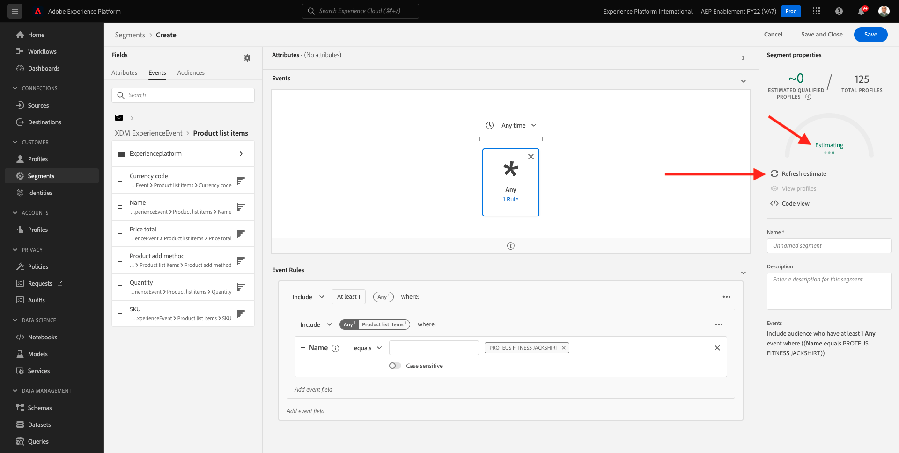
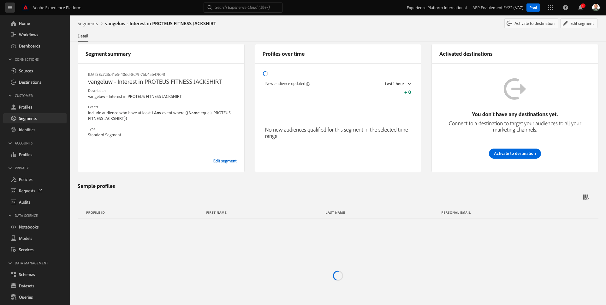

# 6.1 Creare un segmento

In questo esercizio creerai un segmento utilizzando il Generatore di segmenti di Adobe Experience Platform.

## 6.1.1 Contesto

Nel mondo odierno, rispondere al comportamento di un cliente deve essere in tempo reale. Uno dei modi per rispondere al comportamento dei clienti in tempo reale è utilizzare un segmento, a condizione che il segmento si qualifichi in tempo reale. In questo esercizio, devi creare un segmento, tenendo conto delle attività reali sul sito web che abbiamo utilizzato.

## 6.1.2 Identificare il comportamento a cui si desidera reagire

Vai a [https://builder.adobedemo.com/projects](https://builder.adobedemo.com/projects). Dopo aver effettuato l’accesso con il tuo Adobe ID, vedrai questo. Fai clic sul progetto del tuo sito web per aprirlo.

Ora puoi seguire il flusso seguente per accedere al sito web. Fai clic su **Integrazioni**.

Sulla **Integrazioni** pagina , devi selezionare la proprietà Raccolta dati creata nell&#39;esercizio 0.1.

Vedrai il tuo sito web demo aperto. Seleziona l’URL e copialo negli Appunti.

Apri una nuova finestra del browser in incognito.

Incolla l’URL del sito web dimostrativo che hai copiato nel passaggio precedente. Ti verrà quindi chiesto di effettuare l&#39;accesso utilizzando il tuo Adobe ID.

Seleziona il tipo di account e completa il processo di accesso.

Il sito web verrà quindi caricato in una finestra del browser in incognito. Per ogni dimostrazione, è necessario utilizzare una nuova finestra del browser in incognito per caricare l’URL del sito web demo.

In questo esempio, desideri rispondere a un cliente specifico che visualizza un prodotto specifico.
Da **Luma** homepage, vai a **Uomini**, quindi fai clic sul prodotto **JACKSHIRT DI FITNESS PROTEO**.

Quindi quando qualcuno visita la pagina del prodotto per **JACKSHIRT DI FITNESS PROTEO**, vuoi essere in grado di agire. La prima cosa da fare per intervenire è definire un segmento.

## 6.1.3 Creare il segmento

Vai a [Adobe Experience Platform](https://experience.adobe.com/platform). Dopo aver effettuato l&#39;accesso, si aprirà la homepage di Adobe Experience Platform.

Prima di continuare, devi selezionare un **sandbox**. La sandbox da selezionare è denominata ``--aepSandboxId--``. Per eseguire questa operazione, fai clic sul testo **[!UICONTROL Produzione Prod]** nella linea blu sopra lo schermo. Dopo aver selezionato il [!UICONTROL sandbox], vedrai la modifica dello schermo e ora sei nel tuo dedicato [!UICONTROL sandbox].

Nel menu a sinistra, vai a **Segmenti** e poi vai a **Sfoglia** dove puoi visualizzare una panoramica di tutti i segmenti esistenti. Fai clic sul pulsante **Crea segmento** per iniziare a creare un nuovo segmento.

Come indicato sopra, devi creare un segmento tra tutti i clienti che hanno visualizzato il prodotto **JACKSHIRT DI FITNESS PROTEO**.

Per creare questo segmento, devi aggiungere un evento . Per trovare tutti gli eventi, fai clic sul pulsante **Eventi** nella **Segmenti** barra dei menu.

Ora, vedrai il livello superiore **ExperienceEvent XDM** nodo.

Per trovare i clienti che hanno visitato il **JACKSHIRT DI FITNESS PROTEO** prodotto, fai clic su **ExperienceEvent XDM**.

Scorri verso il basso fino a **Elementi elenco prodotti** e fai clic su di esso.

Seleziona **Nome** e trascina e rilascia la **Nome** oggetto da sinistra **Elementi elenco prodotti** nell’area di lavoro del generatore di segmenti **Eventi** sezione .

Il parametro di confronto deve essere **è** e nel campo di immissione immettere `PROTEUS FITNESS JACKSHIRT`.

Le **Regole evento** dovrebbe ora essere così. Ogni volta che aggiungi un elemento al generatore di segmenti, puoi fare clic sul pulsante **Aggiorna stima** per ottenere una nuova stima della popolazione nel segmento.

Infine, diamo un nome al segmento e salvalo.

Come convenzione di denominazione, utilizza:

- `--demoProfileLdap-- - Interest in PROTEUS FITNESS JACKSHIRT`

Il nome del segmento deve essere simile al seguente:
`vangeluw - Interest in PROTEUS FITNESS JACKSHIRT`

Fai clic su **Salva e chiudi** per salvare il segmento.

Ora vieni riportato alla pagina di panoramica del segmento.

Passaggio successivo: [6.2 Controllare come configurare la destinazione DV360 utilizzando le destinazioni](./ex2.md)

[Torna al modulo 11](./real-time-cdp-build-a-segment-take-action.md)

[Torna a tutti i moduli](../../overview.md)
