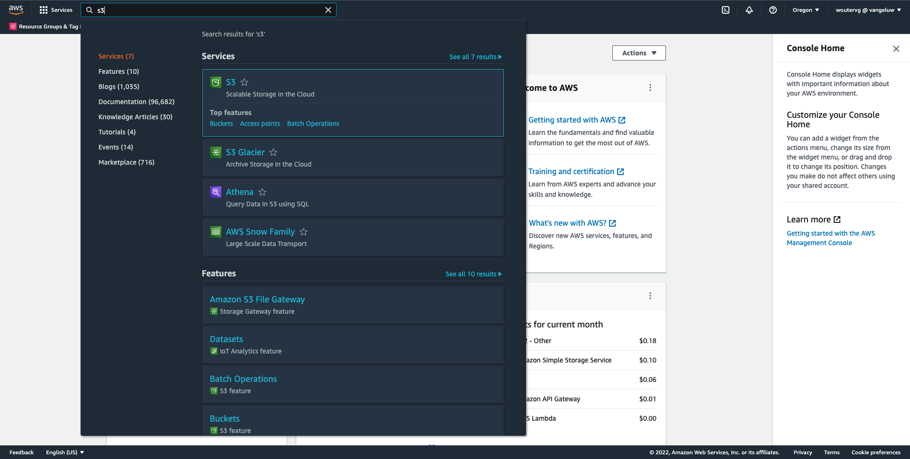
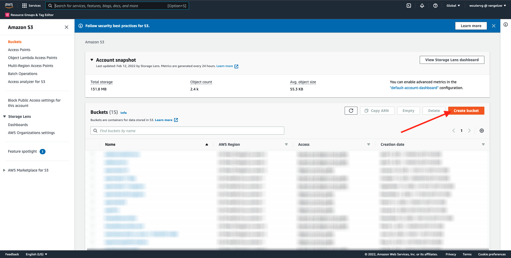
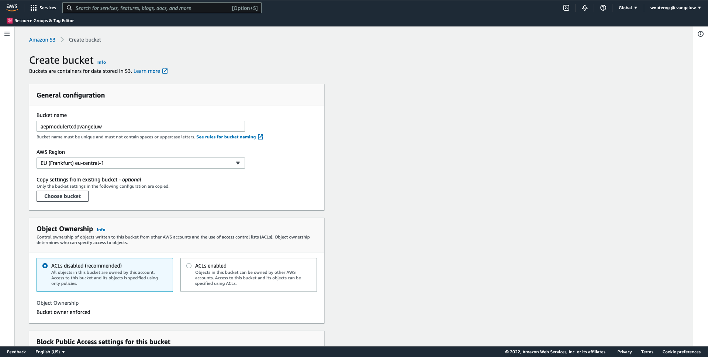
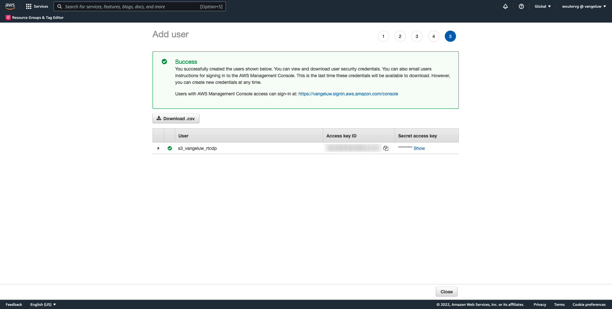
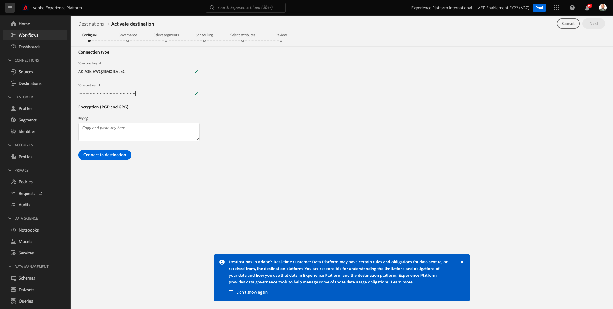

# 6.4 Intervenire: invia il segmento a una destinazione S3

Adobe Experience Platform può anche condividere i tipi di pubblico per e-mail Marketing Destinations come Salesforce Marketing Cloud, Oracle Eloqua, Oracle Responsys e Adobe Campaign.

Puoi utilizzare FTP o SFTP come parte delle destinazioni dedicate per ciascuna di queste destinazioni di e-mail marketing, oppure puoi utilizzare AWS S3 per scambiare elenchi di clienti tra Adobe Experience Platform e queste destinazioni di e-mail marketing.

In questo modulo, configurerai tale destinazione utilizzando un bucket AWS S3.

## 6.4.1 Crea il tuo bucket S3

Vai a [https://console.aws.amazon.com](https://console.aws.amazon.com) e accedi con l’account Amazon creato in precedenza.

Dopo l&#39;accesso, verrai reindirizzato al **Console di gestione AWS**.

In **Trova servizi** menu, cerca **s3**. Fai clic sul primo risultato della ricerca: **S3 - Storage scalabile nel cloud**.

Vedrai il **Amazon S3** homepage. Fai clic su **Crea bucket**.

In **Crea bucket** è necessario configurare due elementi:

- Nome: utilizza il nome `aepmodulertcdp--demoProfileLdap--`. Ad esempio, in questo esercizio il nome del bucket è **aepmodulertcdpvangeluw**
- Regione: utilizza la regione **UE (Francoforte) eu-central-1**

Lascia invariate tutte le altre impostazioni predefinite. Scorri verso il basso e fai clic su **Crea bucket**.

Vedrai quindi il tuo bucket creato e verrà reindirizzato alla home page di Amazon S3.

## 6.4.2 Imposta le autorizzazioni per accedere al tuo bucket S3

Il passaggio successivo consiste nel configurare l’accesso al bucket S3.

Per farlo, vai a [https://console.aws.amazon.com/iam/home](https://console.aws.amazon.com/iam/home).

L’accesso alle risorse AWS è controllato da Amazon Identity and Access Management (IAM).

Ora visualizzerai questa pagina.

Nel menu a sinistra, fai clic su **Utenti**. Vedrai il **Utenti** schermo. Fai clic su **Aggiungi utenti**.

Quindi, configura l&#39;utente:

- Nome utente: use `s3_--demoProfileLdap--_rtcdp` come nome, quindi in questo esempio il nome è `s3_vangeluw_rtcdp`.
- Tipo di accesso AWS: select **Chiave di accesso - Accesso programmatico**.

Fai clic su **Avanti: Autorizzazioni**.

Verrà visualizzata la schermata delle autorizzazioni. Fai clic su **Allegare direttamente le politiche esistenti**.

Inserisci il termine di ricerca **s3** per visualizzare tutti i criteri S3 correlati. Selezionare il criterio **AmazonS3FullAccess**. Fai clic su **Avanti: Tag**.

Sulla **Tag** non è necessario configurare nulla. Fai clic su **Avanti: Revisione**.

Rivedi la tua configurazione. Fai clic su **Crea utente**.

L&#39;utente viene creato e vengono visualizzate le credenziali per accedere all&#39;ambiente S3. Questa è l&#39;unica volta che vedrete le vostre credenziali, quindi vi prego di annotarle.

Fai clic su **Mostra** per visualizzare la chiave di accesso segreta:

>[!IMPORTANT]
>
>Memorizzare le credenziali in un file di testo nel computer.
>
> - ID chiave di accesso: ...
> - Chiave di accesso segreta: ...
>
> Una volta fatto clic **Chiudi** non vedrai mai più le tue credenziali!

Fai clic su **Chiudi**.

Ora hai creato correttamente un bucket AWS S3 e hai creato un utente con le autorizzazioni per accedere a questo bucket.

## 6.4.3 Configurare la destinazione in Adobe Experience Platform

Vai a [Adobe Experience Platform](https://experience.adobe.com/platform). Dopo aver effettuato l&#39;accesso, si aprirà la homepage di Adobe Experience Platform.

Prima di continuare, devi selezionare un **sandbox**. La sandbox da selezionare è denominata ``--aepSandboxId--``. Per eseguire questa operazione, fai clic sul testo **[!UICONTROL Produzione Prod]** nella linea blu sopra lo schermo. Dopo aver selezionato il [!UICONTROL sandbox], vedrai la modifica dello schermo e ora sei nel tuo dedicato [!UICONTROL sandbox].

Nel menu a sinistra, vai a **Destinazioni**, quindi vai a **Catalogo**. Vedrai il **Catalogo delle destinazioni**.

Fai clic su **Archiviazione cloud**, quindi fai clic su **Configurazione** pulsante (o attivato) **Attiva segmenti**, a seconda dell&#39;ambiente) **Amazon S3** il Card.

A seconda dell’ambiente, potrebbe essere necessario fare clic su **+ Configura nuova destinazione** per iniziare a creare la destinazione.

Seleziona **Nuovo account** come Tipo di conto. Utilizza le credenziali S3 che ti sono state fornite nel passaggio precedente:

| ID chiave di accesso | Chiave di accesso segreto |
|:-----------------------:| :-----------------------:|
| AKIA.... | Cm5Ln.... |

Fai clic su **Connetti alla destinazione**.

Viene quindi visualizzata una conferma visiva della connessione della destinazione.

È necessario specificare un nome e una cartella in modo che Adobe Experience Platform possa connettersi al bucket S3.

Come convenzione di denominazione, utilizza quanto segue:

| ID chiave di accesso | Chiave di accesso segreto |
|:-----------------------:| :-----------------------:|
| Nome | `AWS - S3 - --demoProfileLdap--` |
| Descrizione | `AWS - S3 - --demoProfileLdap--` |
| Nome blocco | `aepmodulertcdp--demoProfileLdap--` |
| Percorso cartella | / |

Fai clic su **Avanti**.

È ora possibile allegare facoltativamente un criterio di governance dei dati alla nuova destinazione. Fai clic su **Avanti**.

Nell’elenco dei segmenti, cerca il segmento creato nell’esercizio 1 e selezionalo. Fai clic su **Avanti**.

Vedrete questo. Se lo desideri, puoi modificare la pianificazione facendo clic sul pulsante **matita** icona. **Crea pianificazione**.

Definisci il tuo programma di scelta. Seleziona **Esportare file incrementali** e impostare la frequenza su **Orario** ogni **3 ore**. Fai clic su **Crea**.

Poi avrai questo. Fai clic su **Avanti**.

Ora puoi selezionare gli attributi per l’esportazione in AWS S3. Fai clic su **Aggiungi nuovo campo** e garantire il campo `--aepTenantId--.identification.core.ecid` viene aggiunto e contrassegnato come **Chiave di deduplicazione**.

Facoltativamente, puoi aggiungere tutti gli altri campi necessari.

Dopo aver aggiunto tutti i campi, fai clic su **Successivo**.

Rivedi la tua configurazione. Fai clic su **Fine** per completare la configurazione.

Tornerai quindi alla schermata Attivazione destinazione e vedrai il segmento aggiunto a questa destinazione.

Per aggiungere altre esportazioni di segmenti, puoi fare clic su **Attiva segmenti** per riavviare il processo e aggiungere altri segmenti.

Passaggio successivo: [6.5 Intervenire: inviare il segmento ad Adobe Target](./ex5.md)

[Torna al modulo 6](./real-time-cdp-build-a-segment-take-action.md)

[Torna a tutti i moduli](../../overview.md)
