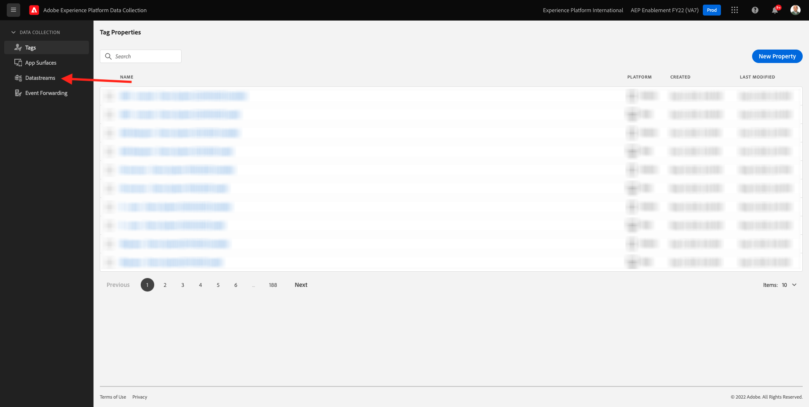
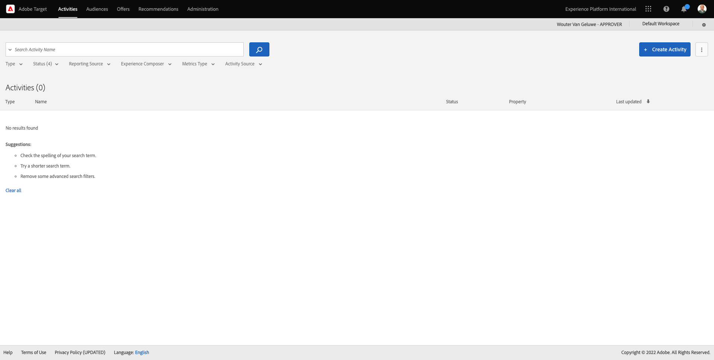
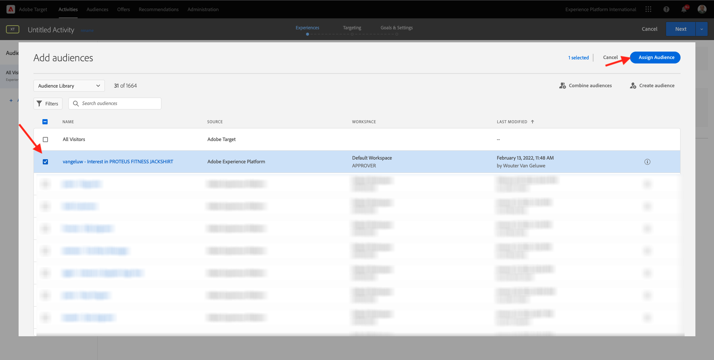

# 6.5 Intervenire: inviare il segmento ad Adobe Target

Vai a [Adobe Experience Platform](https://experience.adobe.com/platform). Dopo aver effettuato l&#39;accesso, si aprirà la homepage di Adobe Experience Platform.


Prima di continuare, devi selezionare un **sandbox**. La sandbox da selezionare è denominata ``--aepSandboxId--``. Per eseguire questa operazione, fai clic sul testo **[!UICONTROL Produzione Prod]** nella linea blu sopra lo schermo. Dopo aver selezionato il [!UICONTROL sandbox], vedrai la modifica dello schermo e ora sei nel tuo dedicato [!UICONTROL sandbox].


## 6.5.1 Verifica il tuo Datastream

La destinazione Adobe Target in Real-Time CDP è connessa al datastream utilizzato per acquisire dati nella rete Edge di Adobe. Se desideri impostare la destinazione Adobe Target, verifica innanzitutto se il datastream è già abilitato per Adobe Target. Il tuo datastram è stato configurato in [Esercizio 0.2 Crea il tuo Datastream](./../module0/ex2.md) ed è stato denominato `--demoProfileLdap-- - Demo System Datastream`.

Vai a [https://experience.adobe.com/#/data-collection/](https://experience.adobe.com/#/data-collection/), quindi fai clic su **Datastreams** o **Datastreams (Beta)**.



Nell’angolo in alto a destra dello schermo, seleziona il nome della sandbox, che deve essere `--aepSandboxId--`.


In Datastreams, cerca il tuo datastream denominato `--demoProfileLdap-- - Demo System Datastream`. Fai clic sul tuo datastream per aprirlo.


Verrà visualizzato questo, fai clic su **...** accanto a **Adobe Experience Platform** quindi fai clic su **Modifica**.


Seleziona le caselle di controllo per entrambi **Segmentazione Edge** e **Destinazioni personalizzazione**. Fai clic su **Salva**.


Quindi, fai clic su **+ Aggiungi servizio**.


Selezionare il servizio **Adobe Target**. Fai clic su **Salva**.


Il datastream è ora configurato per Adobe Target.


## 6.5.2 Configurare la destinazione Adobe Target

Adobe Target è disponibile come destinazione da Real-Time CDP. Per configurare l’integrazione di Adobe Target, passa a **Destinazioni**, a **Catalogo**.


Fai clic su **Personalizzazione** in **Categorie** menu. Vedrai il **Adobe Target** scheda di destinazione. Fai clic su **Attiva segmenti** o **Configurazione** a seconda dell&#39;ambiente).


A seconda dell’ambiente, potrebbe essere necessario fare clic su **+ Configura nuova destinazione** per iniziare a creare la destinazione.


Vedrete questo.


In **Configurare una nuova destinazione** è necessario configurare due elementi:

- Nome: utilizza il nome `--demoProfileLdap-- - Adobe Target (Web)`, che dovrebbe essere simile al seguente: **vangeluw - Adobe Target (Web)**.
- ID Datastream: devi selezionare il datastream configurato in [Esercizio 0.2 Crea il tuo Datastream](./../module0/ex2.md). Il nome del datastream deve essere: `--demoProfileLdap-- - Demo System Datastream`.

Fai clic su **Avanti**.


Nella schermata successiva, è possibile selezionare facoltativamente un criterio di governance. Non è necessario selezionarne uno, in questo caso non è necessario selezionarne uno, quindi fai clic su **Crea**.


La destinazione viene ora creata e verrà visualizzata nell’elenco. Seleziona la destinazione e fai clic su **Successivo** per iniziare a inviare segmenti alla destinazione.


Nell’elenco dei segmenti disponibili, seleziona il segmento creato in [Esercizio 6.1 Creare un segmento](./ex1.md), denominato `--demoProfileLdap-- - Interest in PROTEUS FITNESS JACKSHIRT`. Quindi, fai clic su **Successivo**.


Nella pagina successiva, fai clic su **Successivo**.


Fai clic su **Fine**.


Il segmento viene ora attivato in Adobe Target.


>[!IMPORTANT]
>
>Una volta creata la destinazione Adobe Target in Real-Time CDP, potrebbe essere necessaria fino a un&#39;ora per rendere live la destinazione. Questo è un tempo di attesa una tantum, a causa della configurazione della configurazione del backend. Una volta completata la configurazione iniziale di attesa e back-end di 1 ora, i nuovi segmenti edge aggiunti alla destinazione Adobe Target saranno disponibili per il targeting in tempo reale.

## 6.5.3 Configurare l’attività basata su moduli di Adobe Target

Ora che il segmento Real-Time CDP è configurato per l’invio ad Adobe Target, puoi configurare l’attività Targeting esperienza in Adobe Target. In questo esercizio configurerai un’attività basata su moduli.

Vai alla home page di Adobe Experience Cloud andando a [https://experiencecloud.adobe.com/](https://experiencecloud.adobe.com/). Fai clic su **Target** per aprirlo.


Sulla **Adobe Target** nella home page verranno visualizzate tutte le attività esistenti.



Fai clic su **+ Crea attività** per creare una nuova attività.


Seleziona **Targeting esperienza**.


Seleziona **Modulo** e seleziona **Nessuna limitazione di proprietà**. Fai clic su **Avanti**.


Ora sei nel Compositore attività basato su moduli.


Per il campo **POSIZIONE 1**, seleziona **target-global-mbox**.


Il pubblico predefinito è attualmente **Tutti i visitatori**. Fai clic sul pulsante **3 punti** accanto a **Tutti i visitatori** e fai clic su **Cambia pubblico**.


Ora visualizzi l’elenco dei tipi di pubblico disponibili e il segmento Adobe Experience Platform creato in precedenza e inviato ad Adobe Target fa parte di questo elenco. Seleziona il segmento creato in precedenza in Adobe Experience Platform. Fai clic su **Assegna pubblico**.



Il segmento Adobe Experience Platform fa ora parte di questa attività di targeting delle esperienze.


Ora cambiamo l&#39;immagine dell&#39;eroe sulla homepage del sito web. Fai clic per aprire l’elenco a discesa accanto a **Contenuto predefinito** e fai clic su **Crea offerta HTML**.


Incolla il seguente codice. Quindi, fai clic su **Successivo**.

```javascript
<script>document.querySelector("#home > div > div > div > div > div.banner_img.d-none.d-lg-block > img").src="https://parsefiles.back4app.com/hgJBdVOS2eff03JCn6qXXOxT5jJFzialLAHJixD9/ff92fdc3885972c0090ad5419e0ef4d4_Luma - Product - Proteus - Hero Banner.png"; document.querySelector(".banner_text > *").remove()</script>
```


Verrà quindi visualizzata la nuova esperienza con la nuova immagine, per il pubblico selezionato.


Fai clic sul titolo dell’attività nell’angolo in alto a sinistra per rinominarla.


Per il nome, utilizzare:

- `--demoProfileLdap-- - RTCDP - XT (Form)`


Fai clic su **Avanti**.


Sulla **Obiettivi e impostazioni** - pagina, vai a **Metriche dell&#39;obiettivo**.


Imposta l&#39;obiettivo principale su **Coinvolgimento** - **Time On Site**.


Fai clic su **Salva e chiudi**.


Ora sei sul **Panoramica dell’attività** pagina. È comunque necessario attivare l&#39;attività.


Fai clic sul campo **Inattivo** e seleziona **Attiva**.


Otterrai quindi una conferma visiva del fatto che l’attività è ora in diretta.


L’attività è ora live e può essere testata sul sito web demo.

>[!IMPORTANT]
>
>Una volta creata la destinazione Adobe Target in Real-Time CDP, potrebbe essere necessaria fino a un&#39;ora per rendere live la destinazione. Questo è un tempo di attesa una tantum, a causa della configurazione della configurazione del backend. Una volta completata la configurazione iniziale di attesa e back-end di 1 ora, i nuovi segmenti edge aggiunti alla destinazione Adobe Target saranno disponibili per il targeting in tempo reale.

Se ora torni al tuo sito web dimostrativo e visiti la pagina del prodotto per PROTEUS FITNESS JACKSHIRT, ti qualificherai istantaneamente per il segmento creato e vedrai l&#39;attività Adobe Target essere visualizzata sulla home page in tempo reale.


Passaggio successivo: [6.6 Tipi di pubblico esterni](./ex6.md)

[Torna al modulo 6](./real-time-cdp-build-a-segment-take-action.md)

[Torna a tutti i moduli](../../overview.md)
