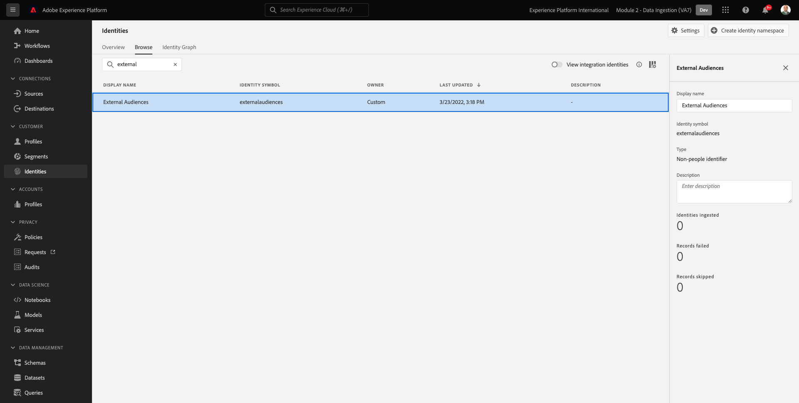
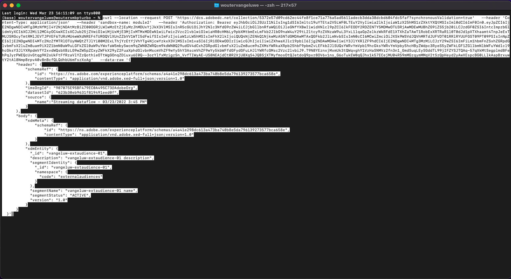
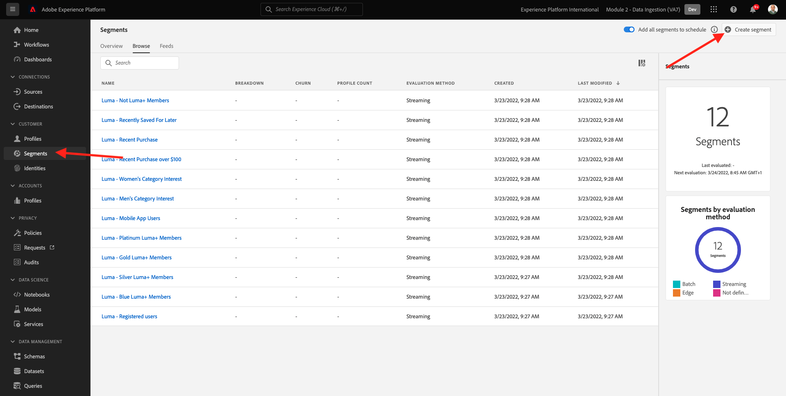

# 6.6 Tipi di pubblico esterni

In molti casi, la tua azienda potrebbe voler utilizzare segmenti esistenti da altre applicazioni per arricchire il profilo del cliente in Adobe Experience Platform.
Questi tipi di pubblico esterni possono essere stati definiti in base a un modello di scienza dei dati o utilizzando piattaforme di dati esterne.

La funzione tipi di pubblico esterni di Adobe Experience Platform consente di concentrarsi sull’acquisizione dei tipi di pubblico esterni e sulla loro attivazione senza necessità di ridefinire in dettaglio in Adobe Experience Platform la definizione del segmento corrispondente.

Il processo globale si articola in tre fasi principali:

- Importa i metadati del pubblico esterno: questo passaggio ha lo scopo di acquisire in Adobe Experience Platform i metadati del pubblico esterno, ad esempio il nome del pubblico.
- Assegna l’iscrizione esterna al profilo del cliente: questo passaggio ha lo scopo di arricchire il profilo cliente con l’attributo di appartenenza al segmento esterno.
- Crea i segmenti in Adobe Experience Platform: questo passaggio ha lo scopo di creare segmenti fruibili in base all’appartenenza a tipi di pubblico esterni.

## 6.6.1 Metadati

Vai a [Adobe Experience Platform](https://experience.adobe.com/platform). Dopo aver effettuato l&#39;accesso, si aprirà la homepage di Adobe Experience Platform.


>[!IMPORTANT]
>
>La sandbox da utilizzare per questo esercizio è ``--module2sandbox--``!

Prima di continuare, devi selezionare un **sandbox**. La sandbox da selezionare è denominata ``--module2sandbox--``. Per eseguire questa operazione, fai clic sul testo **[!UICONTROL Produzione Prod]** nella linea blu sopra lo schermo. Dopo aver selezionato il [!UICONTROL sandbox], vedrai la modifica dello schermo e ora sei nel tuo dedicato [!UICONTROL sandbox].


Mentre i dati del segmento definiscono la condizione per cui un profilo deve far parte di un segmento, i metadati del segmento sono informazioni sul segmento come il nome, la descrizione e lo stato del segmento. Poiché i metadati dei tipi di pubblico esterni verranno memorizzati in Adobe Experience Platform, è necessario utilizzare uno spazio dei nomi di identità per acquisire i metadati in Adobe Experience Platform.

## 6.6.1.1 Namespace Identity for External Audiences

È già stato creato uno spazio dei nomi di identità per l’utilizzo con **Tipi di pubblico esterni**.
Per visualizzare l&#39;identità già creata, vai a **Identità** e cerca **Esterno**. Fai clic sull&#39;elemento &quot;Tipi di pubblico esterni&quot;.

Nota:

- Simbolo di identità **tipi di pubblico esterni** nei passaggi successivi verrà utilizzato per fare riferimento all’identità del pubblico esterno.
- La **Identificatore non personale** Il tipo viene utilizzato per questo namespace Identity, in quanto questo namespace non è inteso per identificare i profili cliente ma i segmenti.



## 6.6.1.2 Creare lo schema metadati del pubblico esterno

I metadati dei tipi di pubblico esterni si basano sui **Schema di definizione del segmento**. Puoi trovare ulteriori dettagli nella sezione [Archivio XDM Github](https://github.com/adobe/xdm/blob/master/docs/reference/classes/segmentdefinition.schema.md).

Nel menu a sinistra, passare a Schemi. Fai clic su **+ Crea schema** quindi fai clic su **Sfoglia**.


Per assegnare una classe, cerca **definizione del segmento**. Seleziona la **Definizione del segmento** Classe e fai clic su **Assegna classe**.


Vedrete questo. Fai clic su **Annulla**.


Vedrete questo. Selezionare il campo **_id**. Nel menu a destra, scorri verso il basso e abilita **Identità** e **Identità principale** caselle di controllo. Seleziona la **Tipi di pubblico esterni** spazio dei nomi identità. Fai clic su **Applica**.


Quindi, seleziona il nome dello schema **Schema senza titolo**. Cambia il nome in `--demoProfileLdap-- - External Audiences Metadata`.


Abilita la **Profilo** attiva e conferma. Infine, fai clic su **Salva**.


## 6.6.1.3 Creare un set di dati metadati per tipi di pubblico esterni

In **Schemi**, vai a **Sfoglia**. Cerca e fai clic su `--demoProfileLdap-- - External Audiences Metadata` schema creato nel passaggio precedente. Quindi, fai clic su **Crea set di dati da schema**.


Per il campo **Nome**, inserisci `--demoProfileLdap-- - External Audience Metadata`. Fai clic su **Creare un set di dati**.


Vedrete questo. Non dimenticare di abilitare il **Profilo** alternare!


## 6.6.1.4 Creare una connessione sorgente API HTTP

Successivamente, devi configurare il connettore di origine dell’API HTTP che utilizzerai per acquisire i metadati nel set di dati.

Vai a **Origini**. Nel campo di ricerca, immetti **HTTP**. Fai clic su **Aggiungi dati**.


Immetti le seguenti informazioni:

- **Tipo di conto**: select **Nuovo account**
- **Nome account**: enter `--demoProfileLdap-- - External Audience Metadata`
- Spunta la casella di controllo **Casella compatibile XDM**

Quindi, fai clic su **Connetti alla sorgente**.


Vedrete questo. Fai clic su **Avanti**.


Seleziona **Set di dati esistente** e nel menu a discesa , cerca e seleziona il set di dati `--demoProfileLdap-- - External Audience Metadata`.

Verifica la **Dettagli del flusso di dati** quindi fai clic su **Successivo**.


Vedrete questo.

La **Mappatura** il passaggio della procedura guidata è vuoto in quanto acquisirai un payload compatibile XDM nel connettore di origine dell’API HTTP, pertanto non è necessaria alcuna mappatura. Fai clic su **Avanti**.


In **Revisione** è possibile esaminare facoltativamente la connessione e i dettagli di mappatura. Fai clic su **Fine**.


Vedrete questo.


## 6.6.1.5 Acquisizione di metadati di tipi di pubblico esterni

Nella scheda della panoramica del connettore di origine, fai clic su **...** quindi fai clic su **Copia payload dello schema**.


Apri l&#39;applicazione Editor di testo sul computer e incolla il payload appena copiato, che è simile a questo. Successivamente, devi aggiornare il **xdmEntity** in questo payload.


L&#39;oggetto **xdmEntity** deve essere sostituito dal codice seguente. Copia il codice seguente e incollalo nel file di testo sostituendo il **xdmEntity** nell&#39;editor di testo.

```
"xdmEntity": {
    "_id": "--demoProfileLdap---extaudience-01",
    "description": "--demoProfileLdap---extaudience-01 description",
    "segmentIdentity": {
      "_id": "--demoProfileLdap---extaudience-01",
      "namespace": {
        "code": "externalaudiences"
      }
    },
    "segmentName": "--demoProfileLdap---extaudience-01 name",
    "segmentStatus": "ACTIVE",
    "version": "1.0"
  }
```

Dovresti quindi vedere questo:


Apri un nuovo **Terminale** finestra. Copiare tutto il testo nell&#39;Editor di testo e incollarlo nella finestra del terminale.



Successivo, hit **Invio**.

Nella finestra Terminal viene visualizzata una conferma dell’inserimento dei dati:


Aggiorna la schermata del connettore di origine dell’API HTTP e vedrai che i dati sono in fase di elaborazione:


## 6.6.1.6 Convalidare l’acquisizione dei metadati di tipi di pubblico esterni

Al termine dell’elaborazione, puoi verificare la disponibilità dei dati nel set di dati utilizzando Query Service.

Nel menu a destra, vai a **Set di dati** e seleziona la `--demoProfileLdap-- - External Audience Metadata` set di dati creato in precedenza.


Nel menu di destra, vai a Query e fai clic su **Crea query**.


Immetti il seguente codice e quindi premi **MAIUSC + INVIO**:

```
select * from --demoProfileLdap--_external_audience_metadata
```

Nei risultati della query vedrai i metadati del pubblico esterno che hai acquisito.


## 6.6.2 Iscrizione al segmento

Con i metadati del pubblico esterno disponibili è ora possibile acquisire l’appartenenza al segmento per un profilo cliente specifico.

Ora devi preparare un set di dati di profilo arricchito rispetto allo schema di appartenenza al segmento. Puoi trovare ulteriori dettagli nella sezione [Archivio XDM Github](https://github.com/adobe/xdm/blob/master/docs/reference/datatypes/segmentmembership.schema.md).

## 6.6.2.1 Creare lo schema di appartenenza a tipi di pubblico esterni

Nel menu a destra, vai a **Schemi**. Fai clic su **Crea schema** quindi fai clic su **Profilo individuale XDM**.


In **Aggiungi gruppi di campi** popup, cerca **Core profilo**. Seleziona la **Core del profilo v2** gruppo di campi.


Nella sezione **Aggiungi gruppi di campi** popup, cerca **Iscrizione al segmento**. Seleziona la **Dettagli di appartenenza al segmento** gruppo di campi. Quindi, fai clic su **Aggiungi gruppi di campi**.


Vedrete questo. Passa al campo . `--aepTenantId--.identification.core`. Fai clic sul pulsante **crmId** campo . Nel menu di destra, scorri verso il basso e controlla il **Identità** e **Identità principale** caselle di controllo. Per **Namespace Identity** select **Sistema demo - CRMID**.

Fai clic su **Applica**.


Quindi, seleziona il nome dello schema **Schema senza titolo**. Nel campo del nome visualizzato, immetti `--demoProfileLdap-- - External Audiences Membership`.


Quindi, abilita **Profilo** attiva e conferma. Fai clic su **Salva**.


## 6.6.2.2 Creare un set di dati per l’appartenenza a tipi di pubblico esterni

In **Schemi**, vai a **Sfoglia**. Cerca e fai clic su `--demoProfileLdap-- - External Audiences Membership` schema creato nel passaggio precedente. Quindi, fai clic su **Crea set di dati da schema**.


Per il campo **Nome**, inserisci `--demoProfileLdap-- - External Audiences Membership`. Fai clic su **Creare un set di dati**.


Vedrete questo. Non dimenticare di abilitare il **Profilo** alternare!


## 6.6.2.3 Creare una connessione sorgente API HTTP


Successivamente, devi configurare il connettore di origine dell’API HTTP che utilizzerai per acquisire i metadati nel set di dati.

Vai a **Origini**. Nel campo di ricerca, immetti **HTTP**. Fai clic su **Aggiungi dati**.


Immetti le seguenti informazioni:

- **Tipo di conto**: select **Nuovo account**
- **Nome account**: enter `--demoProfileLdap-- - External Audience Membership`
- Spunta la casella di controllo **Casella compatibile XDM**

Quindi, fai clic su **Connetti alla sorgente**.


Vedrete questo. Fai clic su **Avanti**.


Seleziona **Set di dati esistente** e nel menu a discesa , cerca e seleziona il set di dati `--demoProfileLdap-- - External Audiences Membership`.

Verifica la **Dettagli del flusso di dati** quindi fai clic su **Successivo**.


Vedrete questo.

La **Mappatura** il passaggio della procedura guidata è vuoto in quanto acquisirai un payload compatibile XDM nel connettore di origine dell’API HTTP, pertanto non è necessaria alcuna mappatura. Fai clic su **Avanti**.


In **Revisione** è possibile esaminare facoltativamente la connessione e i dettagli di mappatura. Fai clic su **Fine**.


Vedrete questo.


## 6.6.2.4 Acquisizione di dati di appartenenza a tipi di pubblico esterni

Nella scheda della panoramica del connettore di origine, fai clic su **...** quindi fai clic su **Copia payload dello schema**.


Apri l&#39;applicazione Editor di testo sul computer e incolla il payload appena copiato, che è simile a questo. Successivamente, devi aggiornare il **xdmEntity** in questo payload.


L&#39;oggetto **xdmEntity** deve essere sostituito dal codice seguente. Copia il codice seguente e incollalo nel file di testo sostituendo il **xdmEntity** nell&#39;editor di testo.

```
  "xdmEntity": {
    "_id": "--demoProfileLdap---profile-test-01",
    "_experienceplatform": {
      "identification": {
        "core": {
          "crmId": "--demoProfileLdap---profile-test-01"
        }
      }
    },
    "personID": "--demoProfileLdap---profile-test-01",
    "segmentMembership": {
      "externalaudiences": {
        "--demoProfileLdap---extaudience-01": {
          "status": "realized",
          "lastQualificationTime": "2022-03-05T00:00:00Z"
        }
      }
    }
  }
```

Dovresti quindi vedere questo:


Apri un nuovo **Terminale** finestra. Copiare tutto il testo nell&#39;Editor di testo e incollarlo nella finestra del terminale.


Successivo, hit **Invio**.

Nella finestra Terminal viene visualizzata una conferma dell’inserimento dei dati:


Aggiorna la schermata del connettore di origine dell’API HTTP : dopo un paio di minuti vedrai che i dati sono in fase di elaborazione:


## 6.6.2.5 Convalidare l’acquisizione di appartenenza a tipi di pubblico esterni

Al termine dell’elaborazione, puoi verificare la disponibilità dei dati nel set di dati utilizzando Query Service.

Nel menu a destra, vai a **Set di dati** e seleziona la `--demoProfileLdap-- - External Audiences Membership ` set di dati creato in precedenza.


Nel menu di destra, vai a Query e fai clic su **Crea query**.


Immetti il seguente codice e quindi premi **MAIUSC + INVIO**:

```
select * from --demoProfileLdap--_external_audiences_membership
```

Nei risultati della query vedrai i metadati del pubblico esterno che hai acquisito.


## 6.6.3 Creare un segmento

Ora puoi intervenire sui tipi di pubblico esterni.
In Adobe Experience Platform l’azione viene intrapresa tramite la creazione di segmenti, la compilazione dei rispettivi tipi di pubblico e la condivisione di tali tipi di pubblico nelle destinazioni.
Ora creerai un segmento utilizzando il pubblico esterno appena creato.

Nel menu a sinistra, vai a **Segmenti** e fai clic su **Creare un segmento**.



Vai a **Tipi di pubblico**. Vedrete questo. Fai clic su **Tipi di pubblico esterni**.


Seleziona il pubblico esterno creato in precedenza, denominato `--demoProfileLdap---extaudience-01`. Trascina e rilascia il pubblico sull’area di lavoro.


Assegna un nome al segmento, utilizza `--demoProfileLdap-- - extaudience-01`. Fai clic su **Salva e chiudi**.


Vedrete questo. Noterai inoltre che il profilo per il quale hai acquisito l’appartenenza al segmento viene ora visualizzato nell’elenco di **Profili di esempio**.


Il segmento è pronto e può essere inviato a una destinazione per l’attivazione.

## 6.6.4 Visualizzare il tuo profilo cliente

Ora puoi anche visualizzare la qualifica del segmento sul tuo profilo cliente. Vai a **Profili**, utilizza lo spazio dei nomi identità **Sistema demo - CRMID** e fornire l&#39;identità `--demoProfileLdap---profile-test-01`, che hai utilizzato come parte dell’esercizio 6.6.2.4 e fai clic su **Visualizza**. Fai clic su **ID profilo** per aprire il profilo.


Vai a **Iscrizione al segmento**, in cui verrà visualizzato il pubblico esterno.


Passaggio successivo: [6.7 SDK per destinazioni](./ex7.md)

[Torna al modulo 6](./real-time-cdp-build-a-segment-take-action.md)

[Torna a tutti i moduli](../../overview.md)
