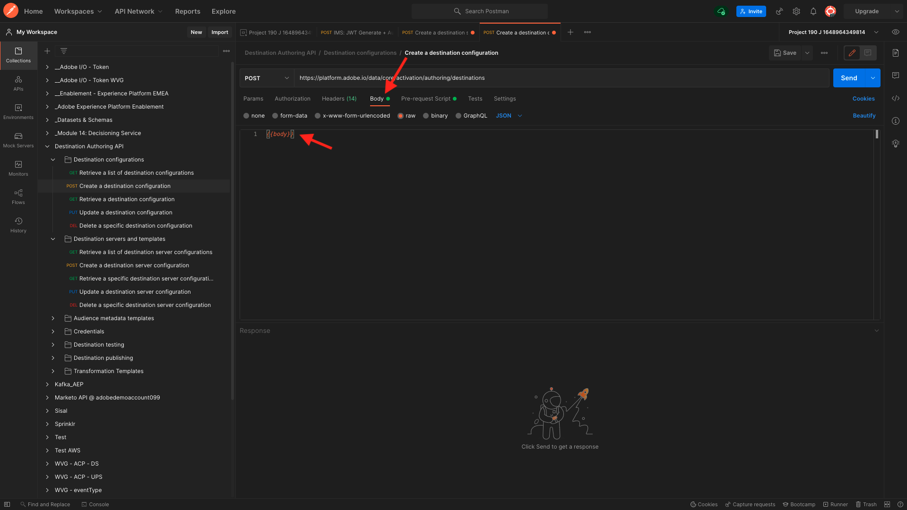
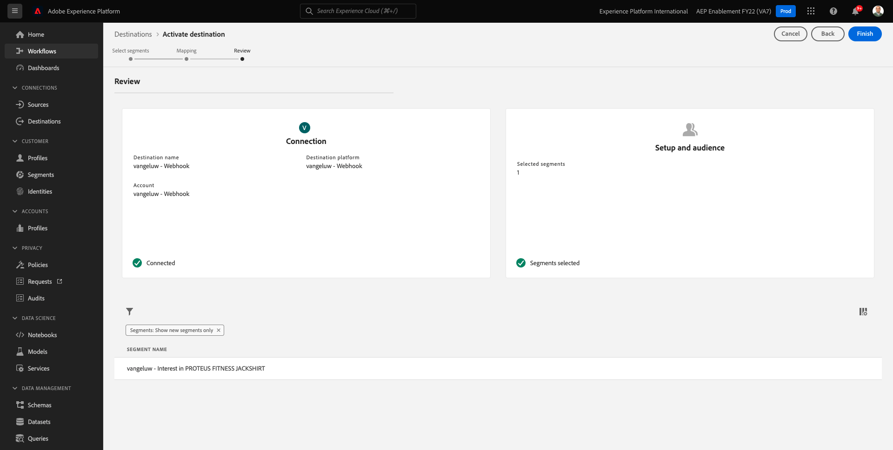

# 6.7 SDK per destinazioni

## 6.7.1 Configurare il progetto Adobe I/O

>[!IMPORTANT]
>
>Se hai creato il progetto di Adobe I/O dopo dicembre 2021, puoi riutilizzarlo, saltare questo esercizio e passare immediatamente all’esercizio 6.7.2.
>
>Se hai creato il progetto di Adobe I/O prima di dicembre 2021, crea un nuovo progetto per assicurarti che sia compatibile con l’API di authoring delle destinazioni.

In questo esercizio utilizzerai Adobe I/O abbastanza intensamente per eseguire query sulle API di Platform. Segui i passaggi seguenti per configurare l’Adobe I/O.

Vai a [https://developer.adobe.com/console/home](https://developer.adobe.com/console/home)


Assicurati di selezionare l’istanza Adobe Experience Platform corretta nell’angolo in alto a destra dello schermo. L&#39;istanza è `--envName--`.


Fai clic su **Crea nuovo progetto**.

 o


Seleziona **+ Aggiungi al progetto** e seleziona **API**.


Vedrai questo:


Fai clic sul pulsante **Adobe Experience Platform** icona.


Fai clic su **API Experience Platform**.


Fai clic su **Avanti**.


Ora puoi scegliere di generare la coppia di chiavi di sicurezza in Adobe I/O o di caricarne una esistente.

Scegli **Opzione 1 - Generare una coppia di chiavi**.


Fai clic su **Genera coppia di chiavi**.


Vedrete un rotatore per circa 30 secondi.


Questo verrà visualizzato e la tua coppia di chiavi generata verrà scaricata come file zip: **config.zip**.

Decomprimi il file **config.zip** sul desktop, vedrai che contiene 2 file:


- **certificate_pub.crt** è il certificato di chiave pubblica. Dal punto di vista della sicurezza, si tratta del certificato che viene utilizzato liberamente per configurare integrazioni con applicazioni online.
- **private.key** è la tua chiave privata. Questo non dovrebbe mai, mai essere condiviso con nessuno. La chiave privata è ciò che utilizzi per autenticare l’implementazione API e dovrebbe essere un segreto. Se condividi la tua chiave privata con chiunque, puoi accedere alla tua implementazione e abusare dell’API per acquisire dati dannosi in Platform ed estrarre tutti i dati che si trovano in Platform.


Assicurati di salvare il **config.zip** in una posizione sicura, poiché avrai bisogno di questo per i passaggi successivi e per l’accesso futuro alle API di Adobe I/O e Adobe Experience Platform.

Fai clic su **Avanti**.


Ora devi selezionare la **Profili di prodotto** per la tua integrazione.

Seleziona i profili di prodotto richiesti.

**FYI**: nell’istanza Adobe Experience Platform, i profili di prodotto avranno un nome diverso. Devi selezionare almeno un profilo di prodotto con i diritti di accesso appropriati, configurati in Adobe Admin Console.


Fai clic su **Salva API configurata**.


Vedrete un rotore per un paio di secondi.


E poi, vedrete la vostra integrazione.


Fai clic sul pulsante **Scarica per Postman** quindi fai clic su **Account di servizio (JWT)** per scaricare un ambiente Postman (attendere il download dell’ambiente, l’operazione potrebbe richiedere un paio di secondi).


Scorri verso il basso fino a visualizzare **Account di servizio (JWT)**, dove puoi trovare tutti i dettagli di integrazione utilizzati per configurare l’integrazione con Adobe Experience Platform.


Il progetto IO ha attualmente un nome generico. Devi dare un nome descrittivo alla tua integrazione. Fai clic su **Progetto 1** (o nome simile) come indicato


Fai clic su **Modifica progetto**.


Immetti un nome e una descrizione per l’integrazione. Come convenzione di denominazione, utilizzeremo `AEP API --demoProfileLdap--`. Sostituisci ldap con il tuo ldap.
Ad esempio, se il tuo ldap è vangeluw, il nome e la descrizione della tua integrazione diventano AEP API vangeluw.

Invio `AEP API --demoProfileLdap--` come **Titolo del progetto**. Fai clic su **Salva**.


L’integrazione dell’Adobe I/O è stata completata.


## 6.7.2 Autenticazione Postman ad Adobe I/O

Vai a [https://www.getpostman.com/](https://www.getpostman.com/).

Fai clic su **Introduzione**.


Successivamente, scarica e installa Postman.


Dopo l&#39;installazione di Postman, avvia l&#39;applicazione.

In Postman sono disponibili 2 concetti: Ambienti e raccolte.

- L&#39;ambiente contiene tutte le variabili ambientali che sono più o meno coerenti. Nell’ambiente, troverai elementi come IMSOrg del nostro ambiente Platform, insieme a credenziali di sicurezza come la tua Chiave privata e altri. Il file dell&#39;ambiente è quello scaricato durante la configurazione dell&#39;Adobe I/O nell&#39;esercizio precedente, con questo nome: **service.postman_environment.json**.

- La raccolta contiene una serie di richieste API che puoi utilizzare. Useremo 2 raccolte
   - 1 Raccolta per l&#39;autenticazione all&#39;Adobe I/0
   - 1 Raccolta per gli esercizi in questo modulo
   - 1 raccolta per gli esercizi nel modulo Real-Time CDP, per l’authoring delle destinazioni

Scarica il file [postman.zip](../../assets/postman/postman_profile.zip) sul desktop locale.

In questo **postman.zip** file, troverai i seguenti file:

- `_Adobe I-O - Token.postman_collection.json`
- `_Adobe Experience Platform Enablement.postman_collection.json`
- `Destination_Authoring_API.json`

Decomprimi il file **postman.zip** archivia e archivia questi 3 file in una cartella sul desktop, insieme all&#39;ambiente Postman scaricato da Adobe I/O. Devi avere questi 4 file in quella cartella:


Torna a Postman. Fai clic su **Importa**.


Fai clic su **Carica file**.


Passa alla cartella sul desktop in cui sono stati estratti i 4 file scaricati. Seleziona questi 4 file contemporaneamente e fai clic su **Apri**.


Dopo aver fatto clic su **Apri**, Postman ti mostrerà una panoramica dell’ambiente e delle raccolte che stai per importare. Fai clic su **Importa**.


Ora disponi di tutto il necessario in Postman per iniziare a interagire con Adobe Experience Platform tramite le API.

La prima cosa da fare è assicurarti di essere autenticato correttamente. Per essere autenticato, devi richiedere un token di accesso.

Assicurati di aver selezionato l’ambiente corretto prima di eseguire qualsiasi richiesta. Per controllare l’ambiente attualmente selezionato, verifica l’elenco a discesa Ambiente nell’angolo in alto a destra.

L’ambiente selezionato deve avere un nome simile a questo:


Fai clic sul pulsante **occhio** e quindi fai clic su **Modifica** per aggiornare la chiave privata nel file di ambiente.


Vedrete questo. Tutti i campi sono precompilati, ad eccezione del campo . **PRIVATE_KEY**.


La chiave privata è stata generata al momento della creazione del progetto Adobe I/O. È stato scaricato come file zip, denominato **config.zip**. Estrai il file zip sul desktop.


Apri la cartella **config** e aprire il file **private.key** con l’editor di testo desiderato.


Vedrete qualcosa che assomiglia a questo, copiare tutto il testo negli Appunti.


Torna a Postman e incolla la chiave privata nei campi accanto alla variabile **PRIVATE_KEY**, per entrambe le colonne **VALORE INIZIALE** e **VALORE CORRENTE**. Fai clic su **Salva**.


L’ambiente e le raccolte Postman sono ora configurati e funzionano. Ora puoi eseguire l’autenticazione da Postman ad Adobe I/O.

A questo scopo, devi caricare una libreria esterna che si occuperà della crittografia e decrittografia della comunicazione. Per caricare questa libreria, devi eseguire la richiesta con il nome **INIT: Carica libreria Crypto per RS256**. Seleziona questa richiesta nel **_Adobe I/O - Raccolta token** e lo vedrete al centro dello schermo.


Fai clic sul blu **Invia** pulsante . Dopo un paio di secondi, dovrebbe essere visualizzata una risposta nel **Corpo** sezione Postman:


Una volta caricata la libreria di crittografia, possiamo eseguire l&#39;autenticazione in Adobe I/O.

In **\_Adobe I/O - Raccolta token**, seleziona la richiesta con il nome **IMS: Genera JWT + Auth**. Di nuovo, vedrai i dettagli della richiesta visualizzati al centro dello schermo.


Fai clic sul blu **Invia** pulsante . Dopo un paio di secondi, dovrebbe essere visualizzata una risposta nel **Corpo** sezione Postman:


Se la configurazione ha avuto successo, dovresti vedere una risposta simile che contiene le seguenti informazioni:

| Chiave | Valore |
|:-------------:| :---------------:| 
| token_type | **portatore** |
| access_token | **eyJ4NXUiJpbXNfbmEx...QT7mqZkumN1tdsPEioOEl4087Dg** |
| expires_in | **8639973** |

L&#39;Adobe I/O ti ha dato un **portatore**-token, con un valore specifico (questo access_token molto lungo) e una finestra di scadenza.

Il token ricevuto è valido per 24 ore. Ciò significa che dopo 24 ore, se desideri utilizzare Postman per l’autenticazione per Adobe I/O, dovrai generare un nuovo token eseguendo nuovamente questa richiesta.

## 6.7.3 Definire endpoint e formato

Per questo esercizio, devi configurare un endpoint in modo che quando un segmento si qualifica, l’evento di qualificazione possa essere inviato in streaming a tale endpoint. In questo esercizio, utilizzerai un endpoint di esempio utilizzando [https://webhook.site/](https://webhook.site/). Vai a [https://webhook.site/](https://webhook.site/), dove vedrai qualcosa di simile a questo. Fai clic su **Copia negli Appunti** per copiare l’url. Dovrai specificare questo url nell’esercizio successivo. L&#39;URL in questo esempio è `https://webhook.site/e0eb530c-15b4-4a29-8b50-e40877d5490a`.


Per quanto riguarda il formato, utilizzeremo un modello standard che eseguirà lo streaming delle qualifiche o delle qualifiche dei segmenti insieme a metadati come gli identificatori dei clienti. I modelli possono essere personalizzati per soddisfare le aspettative di endpoint specifici, ma in questo esercizio riutilizzeremo un modello standard, che si tradurrà in un payload come questo che verrà inviato in streaming all’endpoint.

```json
{
  "profiles": [
    {
      "identities": [
        {
          "type": "ecid",
          "id": "64626768309422151580190219823409897678"
        }
      ],
      "AdobeExperiencePlatformSegments": {
        "add": [
          "f58c723c-f1e5-40dd-8c79-7bb4ab47f041"
        ],
        "remove": []
      }
    }
  ]
}
```

## 6.7.4 Creare una configurazione di server e modelli

Il primo passo per creare la tua Destinazione in Adobe Experience Platform è quello di creare una configurazione server e modello.

Per farlo, vai a **API di authoring delle destinazioni**, a **Server e modelli di destinazione** e fai clic su per aprire la richiesta **POST - Creare una configurazione del server di destinazione**. Vedrete questo. Sotto **Intestazioni**, devi aggiornare manualmente il valore della chiave **x-sandbox-name** e impostarlo su `--aepSandboxId--`. Selezionare il valore **{{SANDBOX_NAME}}**.


Sostituisci con `--aepSandboxId--`.


Quindi, vai a **Corpo**. selezionare il segnaposto **{{body}}**.


È ora necessario sostituire il segnaposto **{{body}}** dal codice seguente:

```json
{
    "name": "Custom HTTP Destination",
    "destinationServerType": "URL_BASED",
    "urlBasedDestination": {
        "url": {
            "templatingStrategy": "PEBBLE_V1",
            "value": "yourURL"
        }
    },
    "httpTemplate": {
        "httpMethod": "POST",
        "requestBody": {
            "templatingStrategy": "PEBBLE_V1",
            "value": "{\n    \"profiles\": [\n    \n        {\n            \"identities\": [\n            \n            \n                \n                {\n                    \"type\": \"{{ namespace }}\",\n                    \"id\": \"{{ identity.id }}\"\n                },\n                ,\n            \n            ],\n            \"AdobeExperiencePlatformSegments\": {\n                \"add\": [\n                \n                    \"{{ segment.key }}\",\n                \n                ],\n                \"remove\": [\n                {#- Alternative syntax for filtering segments by status: -#}\n                \n                    \"{{ segment.key }}\",\n                \n                ]\n            }\n        },\n    \n    ]\n}"
        },
        "contentType": "application/json"
    }
}
```

Dopo aver incollato il codice di cui sopra, devi aggiornare manualmente il campo **urlBasedDestination.url.value** e devi impostarlo sull’url del webhook creato nel passaggio precedente, che è stato `https://webhook.site/e0eb530c-15b4-4a29-8b50-e40877d5490a` in questo esempio.


Dopo l’aggiornamento del campo **urlBasedDefinition.url.value** dovrebbe assomigliare a questo. Fai clic su **Invia**.


Dopo aver fatto clic su **Invia**, verrà creato il modello server e, come parte della risposta, verrà visualizzato un campo denominato **instanceId**. Annotatela, come ne avrete bisogno nel prossimo passaggio. In questo esempio, la **instanceId** è
`eb0f436f-dcf5-4993-a82d-0fcc09a6b36c`.


## 6.7.5 Creare la configurazione di destinazione

In Postman, sotto **API di authoring delle destinazioni**, vai a **Configurazioni di destinazione** e fai clic su per aprire la richiesta **POST - Creare una configurazione di destinazione**. Vedrete questo. Sotto **Intestazioni**, devi aggiornare manualmente il valore della chiave **x-sandbox-name** e impostarlo su `--aepSandboxId--`. Selezionare il valore **{{SANDBOX_NAME}}**.


Sostituisci con `--aepSandboxId--`.


Quindi, vai a **Corpo**. selezionare il segnaposto **{{body}}**.



È ora necessario sostituire il segnaposto **{{body}}** dal codice seguente:

```json
{
    "name": "--demoProfileLdap-- - Webhook",
    "description": "Exports segment qualifications and identities to a custom webhook via Destination SDK.",
    "status": "TEST",
    "customerAuthenticationConfigurations": [
        {
            "authType": "BEARER"
        }
    ],
    "customerDataFields": [
        {
            "name": "endpointsInstance",
            "type": "string",
            "title": "Select Endpoint",
            "description": "We could manage several instances across the globe for REST endpoints that our customers are provisioned for. Select your endpoint in the dropdown list.",
            "isRequired": true,
            "enum": [
                "US",
                "EU",
                "APAC",
                "NZ"
            ]
        }
    ],
    "uiAttributes": {
        "documentationLink": "https://experienceleague.adobe.com/docs/experience-platform/destinations/home.html?lang=en",
        "category": "streaming",
        "connectionType": "Server-to-server",
        "frequency": "Streaming"
    },
    "identityNamespaces": {
        "ecid": {
            "acceptsAttributes": true,
            "acceptsCustomNamespaces": false
        }
    },
    "segmentMappingConfig": {
        "mapExperiencePlatformSegmentName": true,
        "mapExperiencePlatformSegmentId": true,
        "mapUserInput": false
    },
    "aggregation": {
        "aggregationType": "BEST_EFFORT",
        "bestEffortAggregation": {
            "maxUsersPerRequest": "1000",
            "splitUserById": false
        }
    },
    "schemaConfig": {
        "profileRequired": false,
        "segmentRequired": true,
        "identityRequired": true
    },
    "destinationDelivery": [
        {
            "authenticationRule": "NONE",
            "destinationServerId": "yourTemplateInstanceID"
        }
    ]
}
```


Dopo aver incollato il codice di cui sopra, devi aggiornare manualmente il campo **destinationDelivery. destinationServerId** e devi impostarlo su **instanceId** del modello del server di destinazione creato nel passaggio precedente, che è stato `eb0f436f-dcf5-4993-a82d-0fcc09a6b36c` in questo esempio. Avanti, fai clic su **Invia**.


Verrà visualizzata la risposta.


La destinazione viene ora creata in Adobe Experience Platform. Andiamo lì a controllarlo.

Vai a [Adobe Experience Platform](https://experience.adobe.com/platform). Dopo aver effettuato l&#39;accesso, si aprirà la homepage di Adobe Experience Platform.


Prima di continuare, devi selezionare un **sandbox**. La sandbox da selezionare è denominata ``--aepSandboxId--``. Per eseguire questa operazione, fai clic sul testo **[!UICONTROL Produzione Prod]** nella linea blu sopra lo schermo. Dopo aver selezionato il [!UICONTROL sandbox], vedrai la modifica dello schermo e ora sei nel tuo dedicato [!UICONTROL sandbox].


Nel menu a sinistra, vai a **Destinazioni**, fai clic su **Catalogo** e scorri verso il basso fino alla categoria **Streaming**. Vedrete la vostra destinazione disponibile lì ora.


## 6.7.6 Collegare il segmento alla destinazione

In **Destinazioni** > **Catalogo**, fai clic su **Configurazione** sulla destinazione per iniziare ad aggiungere segmenti alla nuova destinazione.


Inserisci un token portatore fittizio, come **1234**. Fai clic su **Connetti alla destinazione**.


Vedrete questo. Come nome per la destinazione, utilizza `--demoProfileLdap-- - Webhook`. Selezionare un punto finale scelto, in questo esempio **UE**. Fai clic su **Avanti**.


Facoltativamente, puoi selezionare un criterio di governance dei dati. Fai clic su **Avanti**.


Seleziona il segmento creato in precedenza, denominato `--demoProfileLdap-- - Interest in PROTEUS FITNESS JACKSHIRT`. Fai clic su **Avanti**.


Vedrete questo. Assicurati di mappare il **CAMPO SORGENTE** `--aepTenantId--.identification.core.ecid` al campo `Identity: ecid`. Fai clic su **Avanti**.


Fai clic su **Fine**.



La destinazione è ora live, le nuove qualifiche dei segmenti verranno trasmesse al webhook personalizzato.


## 6.7.7 Verifica l’attivazione dei segmenti

Vai a [https://builder.adobedemo.com/projects](https://builder.adobedemo.com/projects). Dopo aver effettuato l’accesso con il tuo Adobe ID, vedrai questo. Fai clic sul progetto del tuo sito web per aprirlo.


Ora puoi seguire il flusso seguente per accedere al sito web. Fai clic su **Integrazioni**.


Sulla **Integrazioni** pagina , devi selezionare la proprietà Raccolta dati creata nell&#39;esercizio 0.1.


Vedrai il tuo sito web demo aperto. Seleziona l’URL e copialo negli Appunti.


Apri una nuova finestra del browser in incognito.


Incolla l’URL del sito web dimostrativo che hai copiato nel passaggio precedente. Ti verrà quindi chiesto di effettuare l&#39;accesso utilizzando il tuo Adobe ID.


Seleziona il tipo di account e completa il processo di accesso.


Il sito web verrà quindi caricato in una finestra del browser in incognito. Per ogni dimostrazione, è necessario utilizzare una nuova finestra del browser in incognito per caricare l’URL del sito web demo.


Da **Luma** homepage, vai a **Uomini**, quindi fai clic sul prodotto **JACKSHIRT DI FITNESS PROTEO**.


Hai visitato la pagina del prodotto per **JACKSHIRT DI FITNESS PROTEO**, il che significa che ora ti qualificherai per il segmento creato in precedenza in questo esercizio.


Quando apri il Visualizzatore profili e vai a **Segmenti**, vedrai il segmento idoneo.


Ora torna al tuo webhook aperto su [https://webhook.site/](https://webhook.site/), dove dovresti trovare una nuova richiesta in arrivo, che proviene da Adobe Experience Platform e contiene l’evento di qualificazione dei segmenti.


Passaggio successivo: [Riepilogo e vantaggi](./summary.md)

[Torna al modulo 6](./real-time-cdp-build-a-segment-take-action.md)

[Torna a tutti i moduli](../../overview.md)
